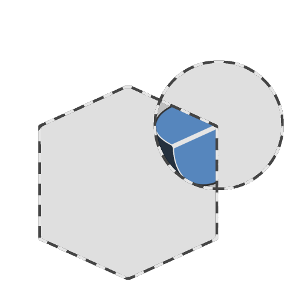

# Intersezione

<table>
<tr style="border: 0;">
<td width="33.33%" style="border: 0;" valign="top">

<b>In:</b> Funzione SDF > Operatore

</td>
<td width="100.00%" style="border: 0;" valign="top">

## Descrizione

Restituisce il volume comune a due forme SDF, ovvero il volume creato quando si sovrappongono due forme.

</td>
</tr>
</table>

>[!INFO]
> 
> Per ulteriori informazioni sui concetti e i flussi di lavoro relativi alla Funzione SDF, consulta la pagina dedicata: [Utilizzo della Funzione SDF](../../working-with-sdf-functions.md)

## Input

|  |  |
| :--- | :--- |
| <b>SDF 1</b> *Virgola mobile* | La prima forma SDF. |
| <b>SDF 2</b> *Virgola mobile* | La seconda forma SDF. |
