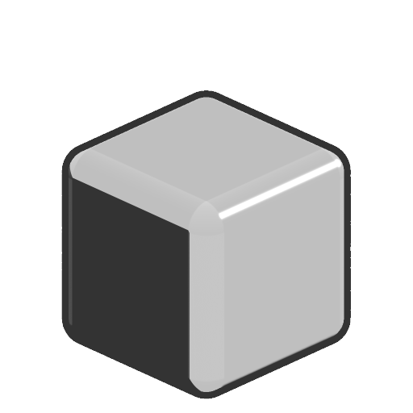

# Arrotondamento

<table>
<tr style="border: 0;">
<td width="33.33%" style="border: 0;" valign="top">

<b>In:</b> Funzione SDF > Operatore

</td>
<td width="100.00%" style="border: 0;" valign="top">

## Descrizione

Espande una forma SDF, gonfiandola e levigandone i bordi netti.

</td>
</tr>
</table>

>[!INFO]
> 
> Per ulteriori informazioni sui concetti e i flussi di lavoro relativi alla Funzione SDF, consulta la pagina dedicata: [Utilizzo della Funzione SDF](../../working-with-sdf-functions.md)

## Input

|  |  |
| :--- | :--- |
| <b>SDF</b> *Mobile* | Forma SDF di input. |
| <b>Raggio</b> *Mobile* | Raggio degli archi arrotondati applicati ai bordi della forma.  <i>Nota:</i> i bordi rigidi possono apparire nel punto in cui i raggi di arrotondamento si intersecano.  <i>Impostazione predefinita: 0.05</i> |
