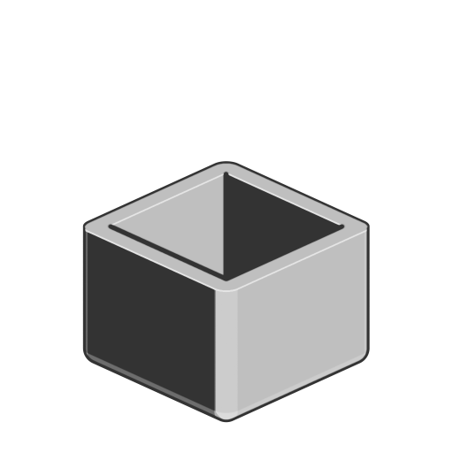

# Guscio

<table>
<tr style="border: 0;">
<td width="33.33%" style="border: 0;" valign="top">

<b>In:</b> Funzione SDF > Operatore

</td>
<td width="100.00%" style="border: 0;" valign="top">

## Descrizione

Crea una forma SDF vuota, con un thickness regolabile per l&#39;involucro risultante.

</td>
</tr>
</table>

>[!INFO]
> 
> Per ulteriori informazioni sui concetti e i flussi di lavoro relativi alla Funzione SDF, consulta la pagina dedicata: [Utilizzo della Funzione SDF](../../working-with-sdf-functions.md)

## Input

|  |  |
| :--- | :--- |
| <b>SDF</b> *Mobile* | Forma SDF di input. |
| <b>Thickness</b> *Mobile* | Il thickness del guscio, applicato sia verso l&#39;interno che verso l&#39;esterno. La shell viene arrotondata quando il thickness viene aumentato.  <i>Impostazione predefinita: 0.02</i> |
