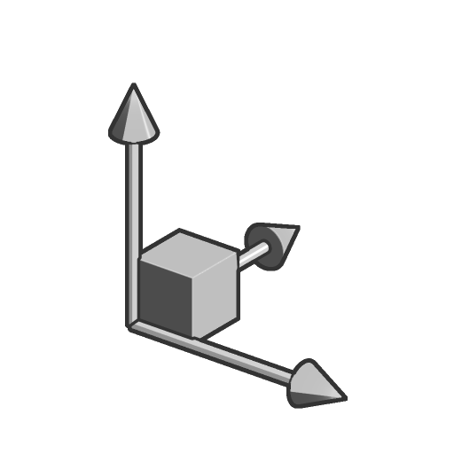

# Scala

<table>
<tr style="border: 0;">
<td width="33.33%" style="border: 0;" valign="top">

<b>In:</b> Funzione SDF > Trasforma

</td>
<td width="100.00%" style="border: 0;" valign="top">

## Descrizione

Ridimensionare in modo uniforme una forma SDF.

</td>
</tr>
</table>

>[!INFO]
> 
> Per ulteriori informazioni sui concetti e i flussi di lavoro relativi alla Funzione SDF, consulta la pagina dedicata: [Utilizzo della Funzione SDF](../../working-with-sdf-functions.md)

## Input

|  |  |
| :--- | :--- |
| <b>SDF</b> *Mobile* | Forma SDF di input. |
| <b>Scala</b> *Mobile* | Fattore di scala uniforme.  <i>Impostazione predefinita: 1</i> |
| <b>Posizione dei punti cardini</b> *Float3* | Posizione dello spazio globale del fulcro locale della forma SDF, in cui (0, 0, 0) posiziona il fulcro al centro della forma SDF.  Definisce l&#39;origine del ridimensionamento.  <i>Impostazione predefinita: (0, 0, 0)</i> |
| <b>P</b> *Float3* | La posizione trasformata dello spazio mondiale. Utilizza questo input per applicare trasformazioni aggiuntive utilizzando i nodi <b>Offset P</b> e <b>Rotazione P</b>.  <i>Impostazione predefinita: la posizione dello spazio globale non trasformata.</i> |
