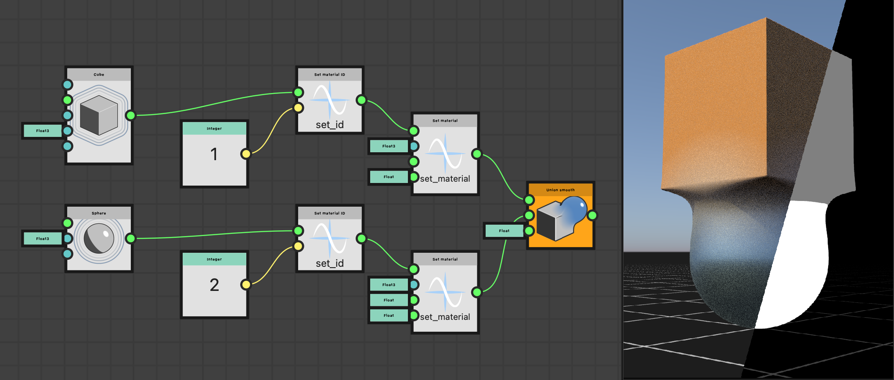

# Utilizzo della Funzione SDF

Nella versione 16.0.0, Substance 3D Designer ha introdotto un potente set di nodi per l&#39;authoring della Funzione SDF, che può essere utilizzato per creare e manipolare forme 3D procedurali.

Le funzioni SDF sono grafici a funzioni Substance che combinano i nodi SDF disponibili nel set di strumenti e vengono applicati a parametri dedicati nei nodi che supportano le Funzioni SDF.

Come punto di partenza, tieni presente che il flusso di lavoro di base ha il seguente aspetto:

1. Create una Funzione SDF in un nodo [visualizzatore 3D](../../../../compositing-graphs/nodes-reference-for-com/node-library/filters/effects/3d-viewer/3d-viewer.md) per visualizzare il risultato.
2. Copiatelo nel grafico della funzione finale (o [createne un&#39;istanza](../../../../glossary/glossary.md#instance-node)) nel parametro Funzione SDF di un nodo che supporta le Funzioni SDF, ad esempio [Splatter forma v2](../../../../compositing-graphs/nodes-reference-for-com/node-library/texture-generators/patterns/shape-splatter-v2/shape-splatter-v2.md).

## Che cos&#39;è una Funzione SDF?

<table style="border: none">
    <tr style="border: 0">
        <td style="border: 0; vertical-align: top">
            
Proprio come le funzioni matematiche possono essere tracciate in 2D come curve, possono essere tracciate in 3D come superfici.

Un campo distanza con segno è una funzione matematica che definisce una superficie in uno spazio 3D calcolando la distanza tra un punto qualsiasi dello spazio e il punto più vicino della superficie.

Scomponiamo il nome "campo a distanza firmato" per comprenderlo meglio:<ul><li><b>Firmato</b> indica che la funzione restituisce un valore positivo se il punto si trova all'esterno/davanti alla superficie, un valore negativo se il punto si trova all'interno/dietro la superficie e zero se il punto si trova esattamente sulla superficie.</li><li><b>Distanza</b> si riferisce al fatto che la funzione calcola la distanza da qualsiasi punto nello spazio al punto *più vicino* sulla superficie.</li><li><b>Campo</b> indica che la funzione descrive un campo di valori, in quanto ogni punto nello spazio ha un valore corrispondente che rappresenta la sua distanza dalla superficie più vicina.</li></ul>

        </td>
        <td style="border: 0; width: 33%; vertical-align: top">
            
        </td>
    </tr>
</table>

Queste funzioni hanno molte applicazioni nella computergrafica, come superfici di disegno, colata di ombre, mascheratura del contorno, rilevamento delle collisioni e altro ancora.

In Substance 3D Designer, la Funzione SDF viene utilizzata per creare e manipolare forme 3D in modo procedurale.

### La produzione e l’uso previsto di una Funzione SDF

Funzione SDF nodi genera un singolo valore float: la distanza con segno dalla superficie più vicina.

Ma c&#39;è di più: internamente ottengono e impostano i valori delle variabili che i nodi host hanno bisogno di definire e/o sapere per manipolare e disegnare le forme risultanti.

Ciò significa che questi nodi devono essere utilizzati nel contesto dei nodi che *supportano Funzioni SDF* perché conoscono queste variabili e le integrano in modo nativo.

I nodi includono [Shape splatter v2](../../../../compositing-graphs/nodes-reference-for-com/node-library/texture-generators/patterns/shape-splatter-v2/shape-splatter-v2.md) e [3D viewer](../../../../compositing-graphs/nodes-reference-for-com/node-library/filters/effects/3d-viewer/3d-viewer.md).

### Grafico della funzione Substance

I nodi funzione SDF sono destinati a essere utilizzati in grafici a funzione Substance dedicati e sono pertanto disponibili solo in quel tipo di grafico.
I parametri dei nodi che devono essere espressi come funzione utilizzano il pulsante &quot;Modifica funzione&quot;.

Cosa devi sapere sui grafici delle funzioni Substance:
* Analogamente ai grafici a Substance, i connettori dei nodi sono *specializzati*, ovvero possono essere connessi solo ad altri connettori di *colore corrispondente* [che rappresentano il loro tipo](../../function-nodes-overview/function-nodes-overview.md#color-coding).
* I nodi non dispongono di parametri, ma solo di input. (Con alcune eccezioni specifiche)
* Il grafico ha un singolo nodo di output. Fare clic con il pulsante destro del mouse su un nodo e selezionare `Set as output` per designarlo come nodo di output.
* Analogamente ai grafici a Substance, esistono anche nodi *atomici*, ovvero i blocchi predefiniti di base, e nodi *a istanza* che rappresentano altri grafici a funzione Substance.
* Esistono operatori separati (algebrici, logici e di confronto) che consentono di eseguire operazioni sui valori del grafico, tuttavia i nodi SDF dispongono di [operatori propri](#operators)

+++ Esempio di un grafico a funzioni che definisce una Funzione SDF

+++

## Guida introduttiva

Per creare la Funzione SDF, dobbiamo prima visualizzarla in modo da capire l&#39;effetto dei nodi e dei parametri che stiamo regolando.

Il nodo [visualizzatore 3D](../../../../compositing-graphs/nodes-reference-for-com/node-library/filters/effects/3d-viewer/3d-viewer.md) dispone di una modalità dedicata per la visualizzazione delle forme create utilizzando la Funzione SDF: impostare il parametro <b>Scene type</b> del nodo su `SDF function` e fare clic sul pulsante **Modifica funzione** per aprire il grafico delle funzioni che ospiterà la Funzione SDF stessa.

Il nodo offre funzionalità dedicate per visualizzare gli aspetti della Funzione SDF che ci consentiranno di costruirli in modo più intuitivo ed efficiente, come un fotogramma di selezione e isolinee.

Il nodo [Sole fisico/cielo](../../../../compositing-graphs/nodes-reference-for-com/node-library/3d-view-library/hdri-tools/physical-sun-sky/physical-sun-sky.md) può essere utilizzato per impostare rapidamente l&#39;illuminazione ambiente nel visualizzatore 3D.

>[!TIP]
> 
> <table style="border: none"><tr style="border: none"><td style="border: none; vertical-align: top">
Tutti i nodi Funzione SDF e i relativi connettori di input hanno descrizioni che consentono di conoscere meglio il loro scopo e come utilizzarli.

Assicurati di controllarli!
</td><td style="border: none; width: 33%; vertical-align: top"></td></tr></table>

### Impostazione dei valori dei nodi

Come per tutti i nodi nei grafici delle funzioni Substance, i nodi Funzione SDF non dispongono di parametri, ma solo di connettori di input utilizzati come parametri.

Per impostare il valore di tali input, è possibile utilizzare [nodi costanti](../../atomic-function-nodes/constant-nodes/constant-nodes.md) quali **Virgola mobile**, **Virgola mobile 3** e **Intero3**.\
È possibile creare questi nodi nel modo consueto tramite il menu nodo oppure trascinare una nuova connessione dai connettori per trarre vantaggio da un elenco filtrato di nodi di tipi corrispondenti.

La maggior parte dei connettori di input dei nodi Funzione SDF ha un valore predefinito, indicato nella relativa descrizione comandi.

>[!TIP]
> 
> <table style="border: none"><tr style="border: none"><td style="border: none; vertical-align: top">
Se non è necessario mantenere sempre visibili alcuni valori, ancorare i nodi utilizzando la chiave <code>D</code> per risparmiare spazio e annullare il grafico.

È inoltre possibile utilizzare i commenti per tenere traccia dei valori.
</td><td style="border: none; width: 67%; vertical-align: top"></td></tr></table>

### Il fotogramma di selezione

<table style="border: none">
    <tr style="border: none">
        <td style="border: none; vertical-align: top">
            
Il fotogramma di selezione è un riquadro nello spazio 3D che definisce i <i>limiti</i> in cui la Funzione SDF viene valutata e disegnata nel nodo <a href="../../../../compositing-graphs/nodes-reference-for-com/node-library/texture-generators/patterns/shape-splatter-v2/shape-splatter-v2.md">splatter forma v2</a>.

Se il fotogramma di selezione è troppo piccolo, è possibile che alcune parti della forma vengano tagliate. Se è troppo grande, potrebbe portare a calcoli non necessari e a tempi di elaborazione più lunghi.

Il parametro <b>fotogramma di delimitazione</b> consente di abilitare la visualizzazione del fotogramma di delimitazione. È quindi possibile modificare le dimensioni del fotogramma di delimitazione modificando i valori del parametro <b>Dimensioni fotogramma di delimitazione</b>.

Utilizza il parametro <b>Colora fuori dal fotogramma</b> per visualizzare le aree esterne al fotogramma di delimitazione in rosso brillante in modo da poter regolare il fotogramma di conseguenza.

        </td>
        <td style="border: none; width: 33%; vertical-align: top">
            
        </td>
    </tr>
</table>

### Isoline

<table style="border: none">
    <tr style="border: none">
        <td style="border: none; vertical-align: top">
            
Poiché Trasforma le forme implica in realtà *Trasforma lo spazio* in cui vengono disegnate, il risultato dei nodi utilizzati dopo alcune trasformazioni può essere sorprendente. In questi casi, è utile visualizzare lo spazio stesso e questo può essere fatto <i>visualizzando il campo distanza</i> della forma.

A tale scopo, il nodo del visualizzatore 3D utilizza <i>isolinee</i>, ovvero linee di contorno ripetute che rappresentano una determinata distanza dalla superficie della forma. Il parametro <b>SDF isolines</b> abilita la visualizzazione. Le isolinee vengono disegnate su un piano orizzontale posizionato nel height specificato dal parametro <b>posizione isolinee SDF</b>.

Vedere come le isolinee vengono deformate dalle trasformazioni applicate alla forma può aiutare a capire come viene Trasforma la forma stessa e a regolare di conseguenza i parametri dei nodi.

        </td>
        <td style="border: none; width: 33%; vertical-align: top">
            
        </td>
    </tr>
</table>

## Funzione SDF categorie nodi

I nodi funzioni SDF sono categorizzati nella Libreria in base alla loro funzione e scopo.

Potete creare tutte le viste della libreria necessarie per organizzare l’area di lavoro in modo tale che il set di strumenti Funzione SDF sia disposto per categoria, mantenendo tutti gli elementi a portata di mano. Passare alla visualizzazione **Windows > Nuova libreria** per aggiungere visualizzazioni separate e indipendenti della libreria.

+++ Esempio di area di lavoro

+++

### Primitivi

Gli elementi di base delle Funzioni SDF, che consentono di creare forme di base come sfere, scatole, cilindri e altro ancora.

+++ Nodi

[Cono chiuso](./sdf-functions-primitives/3d-sdf-capped-cone/3d-sdf-capped-cone.md)\
[Cono chiuso (2 punti)](././sdf-functions-primitives/3d-sdf-capped-cone-2-points/3d-sdf-capped-cone-2-points.md)\
[Toro con limite](./sdf-functions-primitives/3d-sdf-capped-torus/3d-sdf-capped-torus.md)\
[Capsula](./sdf-functions-primitives/3d-sdf-capsule/3d-sdf-capsule.md)\
[Cono](./sdf-functions-primitives/3d-sdf-cone/3d-sdf-cone.md)\
[Cubo](./sdf-functions-primitives/3d-sdf-cube/3d-sdf-cube.md)\
[Cilindro](./sdf-functions-primitives/3d-sdf-cylinder/3d-sdf-cylinder.md)\
[Cilindro (2 punti)](./sdf-functions-primitives/3d-sdf-cylinder-2-points/3d-sdf-cylinder-2-points.md)\
[Ellipsoid](./sdf-functions-primitives/3d-sdf-ellipsoid/3d-sdf-ellipsoid.md)\
[Cilindro allungato](./sdf-functions-primitives/3d-sdf-elongated-cylinder/3d-sdf-elongated-cylinder.md)\
[Piano terreno](./sdf-functions-primitives/3d-sdf-ground-plane/3d-sdf-ground-plane.md)\
[Elica](./sdf-functions-primitives/3d-sdf-helix/3d-sdf-helix.md)\
[Prisma esagonale](./sdf-functions-primitives/3d-sdf-hexagonal-prism/3d-sdf-hexagonal-prism.md)\
[Piano infinito](./sdf-functions-primitives/3d-sdf-infinite-plane/3d-sdf-infinite-plane.md)\
[Piano](./sdf-functions-primitives/3d-sdf-plane/3d-sdf-plane.md)\
[Piramide](./sdf-functions-primitives/3d-sdf-pyramid/3d-sdf-pyramid.md)\
[Piramide quadrata](./sdf-functions-primitives/3d-sdf-pyramid-square/3d-sdf-pyramid-square.md)\
[Rock](./sdf-functions-primitives/3d-sdf-rock/3d-sdf-rock.md)\
[Sfera](./sdf-functions-primitives/3d-sdf-sphere/3d-sdf-sphere.md)\
[Toro](./sdf-functions-primitives/3d-sdf-torus/3d-sdf-torus.md)

+++

### Operatori

Questi nodi consentono di combinare e modificare le forme create con forme di base. Esse comprendono:
* **Operatori booleani diretti** come [Unione](sdf-functions-operators/3d-sdf-op-union/3d-sdf-op-union.md), [Intersezione](sdf-functions-operators/3d-sdf-op-intersection/3d-sdf-op-intersection.md) e [Sottrazione](sdf-functions-operators/3d-sdf-op-subtraction/3d-sdf-op-subtraction.md) che consentono di combinare le forme in vari modi.
* **Deformazione di operatori booleani** come [Arrotondamento](sdf-functions-operators/3d-sdf-op-rounding/3d-sdf-op-rounding.md) e [Morphing](sdf-functions-operators/3d-sdf-op-morph/3d-sdf-op-morph.md) che consentono di combinare forme con un effetto di fusione.
* **Altri operatori** specializzati, ad esempio [Shell](sdf-functions-operators/3d-sdf-op-shell/3d-sdf-op-shell.md) e [Simmetria](sdf-functions-operators/3d-sdf-op-symmetry/3d-sdf-op-symmetry.md), che consentono di modificare e/o duplicare una forma.

+++ Nodi

[Intersezione](./sdf-functions-operators/3d-sdf-op-intersection/3d-sdf-op-intersection.md)\
[Intersezione liscia](./sdf-functions-operators/3d-sdf-op-intersection-smooth/3d-sdf-op-intersection-smooth.md)\
[Superficie di intersezione](./sdf-functions-operators/3d-sdf-op-intersection-surface/3d-sdf-op-intersection-surface.md)\
[Morphing](./sdf-functions-operators/3d-sdf-op-morph/3d-sdf-op-morph.md)\
[Ripeti mirror](./sdf-functions-operators/3d-sdf-op-repeat-mirror/3d-sdf-op-repeat-mirror.md)\
[Arrotondamento](./sdf-functions-operators/3d-sdf-op-rounding/3d-sdf-op-rounding.md)\
[Shell](./sdf-functions-operators/3d-sdf-op-shell/3d-sdf-op-shell.md)\
[Sottrazione](./sdf-functions-operators/3d-sdf-op-subtraction/3d-sdf-op-subtraction.md)\
[Sottrazione uniforme](./sdf-functions-operators/3d-sdf-op-subtraction-smooth/3d-sdf-op-subtraction-smooth.md)\
[Simmetria](./sdf-functions-operators/3d-sdf-op-symmetry/3d-sdf-op-symmetry.md)\
[Unione](./sdf-functions-operators/3d-sdf-op-union/3d-sdf-op-union.md)\
[Smusso unione](./sdf-functions-operators/3d-sdf-op-union-chamfer/3d-sdf-op-union-chamfer.md)\
[Unione uniforme](./sdf-functions-operators/3d-sdf-op-union-smooth/3d-sdf-op-union-smooth.md)

+++

### Trasformazioni

Le forme possono essere trasformate in vari modi, ad esempio [tradotto](sdf-functions-transforms/3d-sdf-transform-offset/3d-sdf-transform-offset.md), [ruotato](sdf-functions-transforms/3d-sdf-transform-rotate/3d-sdf-transform-rotate.md), [ridimensionato](sdf-functions-transforms/3d-sdf-transform-scale/3d-sdf-transform-scale.md), [ritorto](sdf-functions-transforms/3d-sdf-transform-twist/3d-sdf-transform-twist.md) e altro ancora.
Questi nodi consentono di eseguire queste trasformazioni *trasformando lo spazio stesso* in cui sono definite le superfici.

Tale spazio è denominato `P`. Passare alla sezione successiva per ulteriori informazioni sul significato e sul funzionamento della trasformazione dello spazio.

+++ Nodi

[Piegatura](./sdf-functions-transforms/3d-sdf-transform-bend/3d-sdf-transform-bend.md)\
[Allungato](./sdf-functions-transforms/3d-sdf-transform-elongate/3d-sdf-transform-elongate.md)\
[Rifletti](./sdf-functions-transforms/3d-sdf-transform-flip/3d-sdf-transform-flip.md)\
[Scostamento](./sdf-functions-transforms/3d-sdf-transform-offset/3d-sdf-transform-offset.md)\
[Offset P](./sdf-functions-transforms/3d-sdf-transform-offset-p/3d-sdf-transform-offset-p.md)\
[Ruota](./sdf-functions-transforms/3d-sdf-transform-rotate/3d-sdf-transform-rotate.md)\
[Ruota P](./sdf-functions-transforms/3d-sdf-transform-rotate-p/3d-sdf-transform-rotate-p.md)\
[Scala](./sdf-functions-transforms/3d-sdf-transform-scale/3d-sdf-transform-scale.md)\
[Torsione](./sdf-functions-transforms/3d-sdf-transform-twist/3d-sdf-transform-twist.md)

+++

### Materiale

La gestione dei materiali di base è disponibile per le forme create utilizzando le Funzioni SDF.

Potete definire gli attributi di base dei materiali: colore, rugosità e metallizzazione, da utilizzare per la visualizzazione diretta nel nodo del visualizzatore 3D o come base per il lavoro sui materiali nei nodi splatter forma v2.\
Potete anche assegnare ID materiale a parti diverse di una forma per separarle.

Ulteriori informazioni sulle applicazioni di questi nodi [di seguito](#material-id).

+++ Nodi

* [Imposta ID materiale](./sdf-functions-material/set-id/set-id.md)
* [Imposta materiale](./sdf-functions-material/set-material/set-material.md)
* [Imposta colore](./sdf-functions-material/set-color/set-color.md)
* [Imposta metallizzazione](./sdf-functions-material/set-metalness/set-metalness.md)
* [Imposta ruvidezza](./sdf-functions-material/set-roughness/set-roughness.md)

+++

## L&#39;input &#39;P&#39;

Quando si applica una trasformazione a una forma, ad esempio uno scostamento o una rotazione, si Trasforma effettivamente lo spazio in cui è definita la forma.

Se vogliamo che una trasformazione si propaghi ad altre forme — per esempio, se vogliamo ruotare più forme allo stesso modo — dobbiamo assicurarci che utilizzino tutte lo stesso spazio Trasforma.

Uno spazio Trasforma viene condiviso tra nodi utilizzando il relativo input `P` dedicato, disponibile nella maggior parte dei nodi SDF.\
La &#39;P&#39; sta per spazio mondo **P** posizione: un vettore 3D che rappresenta le coordinate di un punto nello spazio mondo.

I nodi [Offset P](sdf-functions-transforms/3d-sdf-transform-offset-p/3d-sdf-transform-offset-p.md) e [Rotazione P](sdf-functions-transforms/3d-sdf-transform-rotate-p/3d-sdf-transform-rotate-p.md) Trasforma lo spazio e consentono di propagare la trasformazione a tutti i nodi che devono ereditarla.\
Ad esempio, diverse forme possono essere ruotate insieme collegando il relativo input `P` allo stesso nodo Rotazione P.

Questo non è solo una questione di convenienza, si sta assicurando che i nodi SDF funzionino con le stesse posizioni nello spazio.

Di seguito è riportato un esempio:

Una sfera viene ripetuta per visualizzare lo spazio come griglia 3D. Viene ripetuto *ripetendo lo spazio*.\
Senza un `P` condiviso, il cilindro piegato utilizza lo spazio ripetuto utilizzato dalla sfera.\
Con un `P` condiviso, le forme possono essere definite correttamente in uno spazio ruotato condiviso.

## Utilizzo delle Funzioni SDF nei nodi &#39;Shape splatter v2&#39;

Dopo aver completato una Funzione SDF nel contesto del nodo del visualizzatore 3D, è possibile copiare l&#39;intera funzione e incollarla nel nodo [splatter forma v2](../../../../compositing-graphs/nodes-reference-for-com/node-library/texture-generators/patterns/shape-splatter-v2/shape-splatter-v2.md) per utilizzarla come generatore di forme per tale nodo.

Imposta il parametro **Tipo di forma** su `SDF function`, quindi seleziona il parametro **Funzione SDF pattern** e fai clic sul pulsante **Modifica funzione** per aprire il grafico delle funzioni del parametro.
Potete quindi incollare la funzione copiata dal nodo del visualizzatore 3D nel grafico. (Non dimenticare di impostare nuovamente il nodo di output del grafico delle funzioni!)

Assicuratevi di regolare il parametro **Dimensione fotogramma di delimitazione SDF** in modo che corrisponda al [fotogramma di delimitazione](#the-bounding-frame) che stavate utilizzando nel nodo del visualizzatore 3D e assicuratevi che la forma sia disegnata correttamente.

\
*Splatter forma v2 con **Tipo di forma**&#x200B;impostato su `SDF function`. Nota: le **dimensioni del fotogramma di delimitazione SDF**&#x200B;sono state regolate in modo da adattarsi alla forma.*

>[!TIP]
> 
> Per riutilizzare facilmente una Funzione SDF, copiatela in un nuovo grafico della funzione Substance e utilizzate tale grafico come **nodo istanza** sia nel visualizzatore 3D che nei nodi Shape splatter v2.
> 
> Ciò offre diversi vantaggi:
> * Qualsiasi aggiornamento apportato alla funzione verrà riflesso in entrambi i nodi senza dover copiare e incollare nuovamente la funzione. Questo è un grande miglioramento della qualità della vita per le forme complesse.
> * Il grafico può avere un nome descrittivo che sarà visibile nei nodi delle istanze, il che renderà molto più gestibile l&#39;utilizzo della propria libreria di forme SDF e renderà i grafici più leggibili.
> * È possibile creare input per il grafico delle funzioni utilizzabili con i nodi [Get](../../atomic-function-nodes/get-nodes/get-nodes.md). Questi input verranno esposti come connettori di input nel nodo dell&#39;istanza e consentiranno di effettuare facilmente variazioni delle forme.

### ID materiale

A una forma SDF può essere assegnato un ID materiale, ovvero un valore intero che può essere utilizzato per differenziare parti della forma e assegnare loro materiali diversi nei nodi [visualizzatore 3D](../../../../compositing-graphs/nodes-reference-for-com/node-library/filters/effects/3d-viewer/3d-viewer.md) e [splatter forma v2](../../../../compositing-graphs/nodes-reference-for-com/node-library/texture-generators/patterns/shape-splatter-v2/shape-splatter-v2.md).

Si noti che le superfici con ID materiale diversi vengono divise con uno spigolo netto su forme fuse, come illustrato nell&#39;esempio seguente.

Utilizzare il nodo [Imposta ID materiale](./sdf-functions-material/set-id/set-id.md) dopo la parte di una forma a cui si desidera applicare un tag con un ID materiale specifico e utilizzare un nodo costante [Intero](../../atomic-function-nodes/constant-nodes/constant-nodes.md) per impostare il valore ID materiale desiderato.\
Nel nodo del visualizzatore 3D, imposta il parametro **Output** su `Material ID` per visualizzare gli ID materiale delle forme.

\
*A destra, l&#39;output di due nodi del visualizzatore 3D viene composto in modo da mostrare la forma (a sinistra) e i relativi ID materiale (a destra) per illustrare come, nelle forme fuse, i materiali vengono interpolati mentre gli ID materiale vengono divisi.*

Gli ID materiale possono essere sfruttati dai nodi complementari Shape splatter v2:
* I nodi [Shape splatter v2 mapper](../../../../compositing-graphs/nodes-reference-for-com/node-library/texture-generators/patterns/shape-splatter-v2-mapper-color/shape-splatter-v2-mapper-color.md) possono utilizzare questi ID di materiale per assegnare pattern diversi.
* [Lo splatter di forma v2 per mascherare](../../../../compositing-graphs/nodes-reference-for-com/node-library/texture-generators/patterns/shape-splatter-v2-to-mask/shape-splatter-v2-to-mask.md) può mascherare parte delle forme in base al relativo ID materiale.

<table style="border: none; margin-top: 32px">
    <tr style="border: 0">
        <td style="border: 0; width: 33%">
            <i>ID materiale utilizzati per la mappatura dei colori nello splatter Shape v2 mapper color</i>
        </td>
        <td style="border: 0; width: 33%">
            <i>ID materiale utilizzati per la mappatura triplanare nel colore dello splatter Shape v2 mapper</i>
        </td>
        <td style="border: 0; width: 33%">
             <i>ID materiale utilizzati per la mascheratura nello splatter di forma v2 per mascherare</i>
        </td>
    </tr>
</table>

### Colore, rugosità e metallizzazione

I nodi [Imposta colore](./sdf-functions-material/set-color/set-color.md), [Imposta rugosità](./sdf-functions-material/set-roughness/set-roughness.md) e [Imposta metallizzazione](./sdf-functions-material/set-metalness/set-metalness.md) consentono di definire questi attributi di materiale per le forme nella Funzione SDF.

Quindi, quando si utilizza tale Funzione SDF come tipo di forma nel nodo [Splatter forma v2](../../../../compositing-graphs/nodes-reference-for-com/node-library/texture-generators/patterns/shape-splatter-v2/shape-splatter-v2.md), questi attributi di materiale saranno disponibili come mappe negli output **SDF color**, **rugosità SDF** e **SDF metalness** del nodo. Queste mappe possono servire come base per lavori di materiale più complessi utilizzando altri nodi.

Tieni presente che, diversamente dagli ID materiale, i valori sono *interpolati* tra forme miscelate come una sfumatura, come illustrato negli esempi seguenti.

<table style="border: none; margin-top: 32px">
    <tr style="border: 0">
        <td style="border: 0; width: 33%">
            <i>Output colore SDF</i>
        </td>
        <td style="border: 0; width: 33%">
             <i>Output rugosità SDF</i>
        </td>
        <td style="border: 0; width: 33%">
            <i>Output metallizzazione SDF</i>
        </td>
    </tr>
</table>

### Campione materiale

<table style="border: none">
    <tr style="border: none">
        <td style="border: none; vertical-align: top">
            
I <b>bulloni arrugginiti</b> <a href="../../../../compositing-graphs/creating-compositing-gra/material-samples/material-samples.md">campioni di materiale</a> sono disponibili per passare alle Funzioni SDF applicate nel contesto del nodo splatter Shape v2.

Il grafico è organizzato e annotato per guidarvi attraverso la struttura, le impostazioni dei nodi e le impostazioni delle Funzioni SDF.

È anche <i>completamente modificabile</i>, quindi può essere utilizzato come sandbox per avere una visione più pratica dello splatter di forma v2 e dei set di strumenti Funzione SDF. Puoi creare tutti i grafici campione che desideri, quindi non esitare a giocare!

        </td>
        <td style="border: none; width: 20%; vertical-align: top; text-align: right">
            
        </td>
    </tr>
</table>
