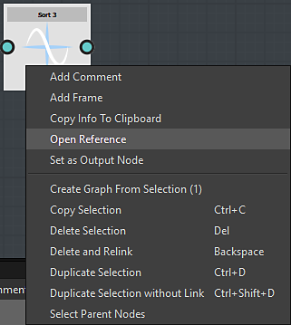

# Somiglianze con un grafico a Substance

A prima vista, il grafico della funzione Substance è molto simile a quello della Substance e il flusso di lavoro è quasi lo stesso.

## La navigazione è simile

Nel grafico della funzione Substance, è possibile creare e organizzare i nodi nello stesso modo in cui si creano in un grafico a Substance.

è possibile accedere ai nodi nello stesso modo:

* Dalla libreria
* premendo barra spaziatrice o tasto Tab
* facendo clic con il pulsante destro del mouse e utilizzando il menu Aggiungi nodo

### Flusso di lavoro simile

Come nel grafico delle Substance, costruirete la vostra funzione concatenando serie di nodi, ciascuno dei quali usando il risultato generato da quello(i) precedente(i).

L&#39;output definirà il valore di un parametro o l&#39;output del nodo di elaboratore pixel.

## Differenze con un grafico a Substance

<table>
<tr style="border: 0;">
<td width="100.00%" style="border: 0;" valign="top">

### I nodi

I nodi disponibili nel grafico della funzione Substance sono completamente diversi da quelli che si incontrerebbero in un grafico della Substance.

</td>
<td width="25.00%" style="border: 0;" valign="top">

</td>
</tr>
</table>

<table>
<tr style="border: 0;">
<td style="border: 0;" valign="top">

### L&#39;output

Contrariamente ai grafici a Substance, una funzione può avere un solo output.

Un altro punto da notare è che non esiste un nodo di output specifico in cui collegare il risultato finale. È invece possibile contrassegnare direttamente come output il nodo che genera il risultato previsto:

</td>
<td style="border: 0;" valign="top">

</td>
</tr>
</table>

#### Come definire il nodo di output?

Per definire l&#39;output, fare clic con il pulsante destro del mouse sul nodo che genera l&#39;output previsto e scegliere *Imposta come nodo di output:*

>[!WARNING]
>
> <b>Verificare il tipo di risultato generato</b>
> 
> Se si nota che *Imposta come nodo di output* è disattivato, significa che il valore generato dal nodo è diverso dal valore previsto dal parametro o dal processore pixel.

<table>
<tr style="border: 0;">
<td style="border: 0;" valign="top">

Per quanto riguarda i grafici a Substance, potete importare funzioni create in un altro grafico. Per aprire il grafico di riferimento, fare clic con il pulsante destro del mouse su di esso e scegliere &quot;Apri riferimento&quot;:

</td>
<td style="border: 0;" valign="top">

</td>
</tr>
</table>

Se disponi di un file sbs contenente più funzioni, puoi trascinarlo direttamente in un grafico a funzioni Substance e scegliere la funzione che desideri importare nell’elenco visualizzato:

