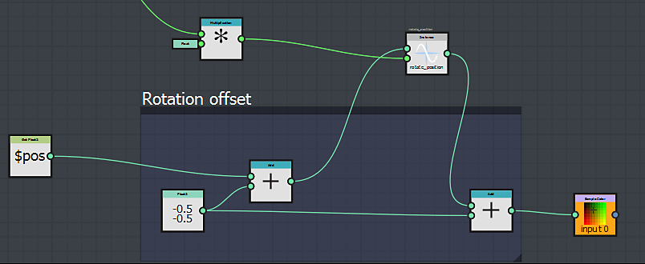

# Che cos&#39;è una funzione?

Funzioni in Substance 3D Designer consente all&#39;utente di generare risultati utilizzando la logica che altrimenti si troverebbe in un linguaggio di programmazione.

Ma invece di usare le linee di codici, le funzioni in Designer mantengono lo stesso approccio nodale. A prima vista, un grafico a funzioni sembra molto simile a un grafico regolare.

È possibile incontrare funzioni in 2 casi principali:

* per controllare il risultato di un parametro
* se modificate un elaboratore pixel

## Controllare il risultato di un parametro

In Substance 3D Designer, qualsiasi parametro può essere controllato da una funzione.

Potete quindi immaginare regole e dipendenze tra le parti del grafico, per ottenere risultati unici.

Ad esempio, potete decidere che l’opacità di un nodo di blend sia pari alla metà dell’intensità di un nodo di alterazione:

In effetti, è possibile che l&#39;utente abbia già creato funzioni senza esserne a conoscenza:

se è stato esposto un parametro, è stata creata automaticamente una funzione e una variabile: la funzione contiene un nodo float get che rileva il valore della variabile appena creata:

