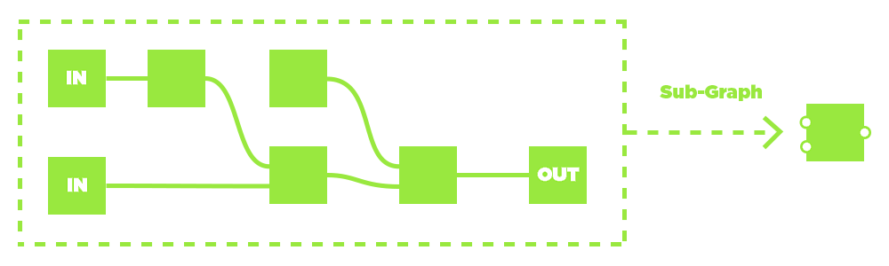
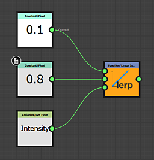

# Panoramica del flusso di lavoro

Substance 3D Designer è un editor basato su nodi. Ciò significa che quasi ogni tipo di progetto o risorsa comporterà l&#39;inserimento di nodi (blocchi predefiniti) e la loro connessione per creare una catena di operazioni (un grafico).Questa pagina spiega il concetto di flussi di lavoro basati su nodi e fornisce un riepilogo dei 3 tipi principali di grafici che è possibile creare in Designer.

## Sommario

[Flusso di lavoro basato su nodi](#node-workflow)

[Flusso di lavoro dell’istanza del grafico](#instance-workflow)

[Parametri personalizzati](#custom-parameters)

[Tipi di grafici](#graph-types)

## Flusso di lavoro basato su nodi

L’utilizzo di Designer è diverso da quello di altri software di editing di immagini 2D, come Photoshop. Invece di eseguire un&#39;azione manualmente (ad esempio, regolando la saturazione selezionando un&#39;opzione di menu e modificando un cursore), <b>crei i passaggi logici</b> della modifica o della creazione dell&#39;immagine. Questo avviene creando una rete di piccoli blocchi costitutivi chiamati &quot;nodi&quot;. I dati delle immagini vengono spostati da <b> a sinistra a destra</b> attraverso i blocchi predefiniti, collegati da collegamenti che determinano il percorso delle informazioni. Ogni nodo, se connesso, contribuirà ai risultati finali.

Il vantaggio principale è che il flusso di lavoro diventa <b>non lineare</b>. A differenza delle azioni eseguite manualmente che vengono inserite in una pila della cronologia, potete sempre scambiare o modificare un nodo in qualsiasi momento. Se decidete che la vostra primissima regolazione Contrasto, che influisce sul risultato dell&#39;immagine fino alla fine, è stata eccessiva, potete comunque tornare indietro e regolarla o addirittura ritagliarla completamente, senza perdere tutto il lavoro che avete eseguito successivamente.

## Flusso di lavoro dell’istanza del grafico

L’istanza di Grafica è un processo chiave in Designer. Consente di creare nodi personalizzati assumendo qualsiasi dimensione o tipo di grafico e creando un nuovo blocco predefinito per i nodi. Questi tipi di nodi sono chiamati &quot;Istanze del grafico&quot;. Ciò consente di essere molto più efficienti, risparmiare tempo e condividere il lavoro con altri utenti. Avete sviluppato una grande tecnica per l&#39;usura dei bordi, per esempio? Crea un’istanza di Graph e riutilizzala, condividila con la community o il tuo team.

Per ulteriori informazioni sulle istanze del grafico in [Substance grafici](../../compositing-graphs/substance-compositing-graphs.md), nella documentazione è disponibile una [sezione dedicata](../../compositing-graphs/creating-compositing-gra/graph-instances-sub-gra/graph-instances-sub-graphs.md) su di esse.

## Parametri personalizzati

Qualsiasi nodo nella catena di operazioni avrà una qualche forma di controllo: pulsanti, cursori, impostazioni da modificare, che influenzano il risultato finale. Se create un sotto-grafico o volete esportare il vostro file Substance in un’altra applicazione, potete creare il vostro &quot;pannello di controllo&quot; per i vostri file, consentendo a chiunque utilizzi il grafico di modificarlo e modificarlo con un pannello di controllo completamente unico, esponendo infinite possibilità. [Informazioni generali sui parametri personalizzati](../../compositing-graphs/compositing-graph-key-con/substance-compositing-graph-key-concepts.md) o ulteriori informazioni in profondità e [iniziare a esporre i parametri](../../compositing-graphs/manage-parameters/exposing-a-parameter/exposing-a-parameter.md).

## Tipi di grafici

Di seguito sono riportati un riepilogo dei tre tipi di grafici che è possibile modificare in Substance 3D Designer e un collegamento alla sezione pertinente della documentazione.

<table>
<tr style="border: 0;">
<td width="16.67%" style="border: 0;" valign="top">

[{width="120px"}](https://substance3d.adobe.com/)

</td>
<td width="100.00%" style="border: 0;" valign="top">

### Grafici Substance

[I grafici Substance](https://substance3d.adobe.com/) sono il tipo principale di grafico creato in Substance 3D Designer. Il loro scopo è <b>generare ed elaborare dati di immagini 2D</b> che non siano vincolati a una risoluzione, un colore o una forma impostata. Sono intesi come strumenti di elaborazione e generazione delle immagini estremamente versatili, non solo come risultati statici preimpostati.

I risultati possono presentarsi sotto forma di semplici pattern in bianco e nero, di filtri che vengono eseguiti solo su altre immagini e non generano contenuti di per sé, o anche di materiale di procedurali a pieno titolo con più canali.

I grafici a Substance sono[il tipo di grafico più supportato](../../getting-started/overview/overview.md) e possono essere esportati e utilizzati in numerosi flussi di lavoro diversi.

</td>
</tr>
</table>

#### Esempi

Di seguito sono riportati alcuni esempi tipici di casi di utilizzo comuni.

+++Forma semplice
{width="512px"}

Una semplice forma maschera per una decalcomania viene creata generando[un testo](../../compositing-graphs/nodes-reference-for-com/atomic-nodes/text/text.md) e una [forma disco](../../compositing-graphs/nodes-reference-for-com/node-library/texture-generators/patterns/shape/shape.md), [estraendo il bordo](../../compositing-graphs/nodes-reference-for-com/node-library/filters/effects/edge-detect/edge-detect.md) dal disco e infine [unendoli](../../compositing-graphs/nodes-reference-for-com/atomic-nodes/blend/blend.md) prima di impostarli come [output](../../compositing-graphs/nodes-reference-for-com/atomic-nodes/output/output.md) finale.

Il testo con il numero o il thickness del bordo può essere esposto esternamente per rendere questo grafico più dinamico.

+++

+++Filtro di regolazione
{width="512px"}

Un grafico di filtro prende una mappa normale come [input](../../compositing-graphs/nodes-reference-for-com/atomic-nodes/input/input.md)(con un&#39;anteprima personalizzata), [la converte in curvatura](../../compositing-graphs/nodes-reference-for-com/node-library/filters/effects/curvature-smooth/curvature-smooth.md) e quindi [regola il contrasto](../../compositing-graphs/nodes-reference-for-com/node-library/filters/adjustments/histogram-scan/histogram-scan.md) per creare una maschera di bordi convessi come [output](../../compositing-graphs/nodes-reference-for-com/atomic-nodes/output/output.md) finale.

I valori di contrasto impostati nell’istogramma possono essere esposti, rendendo questo un filtro semplice ma utile in combinazione con lo slot di input dinamico.

+++

+++Materiale completo
{width="512px"}

Un grafico più complicato[fonde due Materiali di base](../../compositing-graphs/nodes-reference-for-com/node-library/material-filters/blending-material/material-blend/material-blend.md). Un [Materiale di base](../../compositing-graphs/nodes-reference-for-com/node-library/material-filters/pbr-utilities/base-material/base-material.md) è semplice, l&#39;altro utilizza alcuni input personalizzati per aggiungere interesse. Viene utilizzata una maschera per determinare quale dei due materiali viene visualizzato in una posizione prima di essere impostato come [output](../../compositing-graphs/nodes-reference-for-com/atomic-nodes/output/output.md) finale.

In questo esempio vengono utilizzate [modalità di creazione del collegamento](../../interface/the-graph-view/link-creation-modes/link-creation-modes.md) per semplificare l&#39;utilizzo di più collegamenti.

+++

<table>
<tr style="border: 0;">
<td width="16.67%" style="border: 0;" valign="top">

[{width="120px"}](https://substance3d.adobe.com/)

</td>
<td width="100.00%" style="border: 0;" valign="top">

### Substance grafici delle funzioni

Le funzioni <b>elaborano valori singoli</b> (interi, a virgola mobile, vettoriali) anziché dati immagine (interi set di pixel). Le funzioni sono anche elementi grafici con reti di nodi, ma i [nodi utilizzati](../../function-graphs/nodes-reference-for-fun/function-nodes-overview/function-nodes-overview.md)e l&#39;interfaccia sono diversi dai [normali grafici a Substance](../../compositing-graphs/substance-compositing-graphs.md). Il flusso di lavoro è completamente basato su <b>operazioni matematiche</b> e non mostra miniature di anteprima delle immagini, il che lo rende un <b>modo di lavorare molto più avanzato</b> con Substance 3D Designer.

Le funzioni possono essere utilizzate in molti contesti diversi, principalmente per modificare il comportamento di [un parametro esposto](../../compositing-graphs/manage-parameters/exposing-a-parameter/exposing-a-parameter.md), per creare il comportamento di [Elaboratori pixel](../../compositing-graphs/nodes-reference-for-com/atomic-nodes/pixel-processor/pixel-processor.md) o [FX-Maps](../../compositing-graphs/nodes-reference-for-com/atomic-nodes/fx-map/fx-map.md) e per utilizzare [valori](../../compositing-graphs/values-compositing-graphs/values-in-substance-compositing-graphs.md) in un grafico a Substance.

</td>
</tr>
</table>

#### Esempi

Di seguito sono riportati alcuni esempi da casi d&#39;uso comuni per i grafici delle funzioni Substance.

+++Funzione semplice
{width="256px"}

Funzione semplice nel contesto di un parametro esposto. Ottiene un valore float di input chiamato &quot;Intensità&quot; che è determinato per andare da 0 a 1 (un intervallo facile da capire) e rimappa a un intervallo impostato di 0,1 - 0,8. Ciò significa che se l’utente imposta Intensità su 0, verrà utilizzato internamente 0,1, se l’interfaccia utente è impostata su 1, verrà utilizzato 0,8 e qualsiasi valore intermedio verrà interpolato linearmente. Questo tipo di funzione è in genere utilizzato quando si [espongono parametri](../../compositing-graphs/manage-parameters/exposing-a-parameter/exposing-a-parameter.md), ma si utilizzano funzioni personalizzate.

Questa funzione potrebbe anche essere scritta come *lerp(0.1, 0.8, Intensità)* in uno pseudocodice simile a HLSL o GLSL.

+++

+++Funzione avanzata
{width="512px"}

Questa funzione avanzata mostra il funzionamento interno di un [Elaboratore pixel](../../compositing-graphs/nodes-reference-for-com/atomic-nodes/pixel-processor/pixel-processor.md) destinato a regolare la tonalità di un input della mappa colore in base all&#39;intensità di un secondo input della maschera in scala di grigio.

Campiona entrambi gli input con la variabile di Alpha &quot;$pos&quot;, quindi rimuove l’input, converte il valore del colore in HSL e modifica il componente Tonalità moltiplicandolo per il valore della scala di grigi campionata. Successivamente riassembla il vettore, converte nuovamente l&#39;HSL in RGB e aggiunge nuovamente l&#39;Alpha per l&#39;output finale.

nello pseudo-codice questa sarebbe una funzione molto più complicata che non si adatta a una singola riga.

+++

### Grafici MDL

Questa pagina presenta i grafici MDL in Substance 3D Designer, che consentono di creare materiali MDL e visualizzare in anteprima il loro comportamento in tempo reale.
