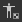
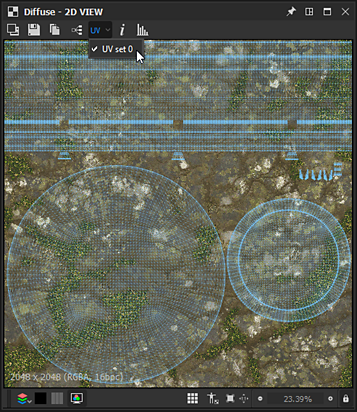

# Vista 2D

In queste pagine sono descritte l&#39;interfaccia utente e le funzionalità del pannello **Visualizzazione 2D** di Substance 3D Designer.

## Panoramica

[Visualizzazione 2D](https://substance3d.adobe.com/) è uno dei pannelli principali dell&#39;interfaccia utente di Designer. I suoi scopi principali sono i seguenti:

* visualizzazione dell&#39;output di *valore* o *immagine* da un *nodo* specificato o tramite un *connettore nodo* specificato
* visualizzazione di [bitmap](../../resources/bitmap-resource/bitmap-resource.md) e [grafica vettoriale](../../resources/vector-graphics-svg-res/vector-graphics-svg-resource.md) [risorse](../../resources/resources.md)
* visualizzazione di *informazioni aggiuntive* sul contenuto attualmente in uso, ad esempio i canali di colore o i valori esatti del colore
* controllo dei parametri&#39; *gizmos*

Quando si modifica un&#39;immagine o un valore visualizzato, la vista 2D *viene aggiornata automaticamente* per rimanere sincronizzata con lo stato corrente dei dati.\
*Più* pannelli Visualizzazione 2D possono essere attivi in qualsiasi momento e ogni pannello può visualizzare immagini o valori diversi. È possibile controllare quando utilizzare un nuovo pannello utilizzando la funzionalità  <b>Pin</b> del pannello dell&#39;interfaccia utente.

### Visualizzazione del contenuto nella vista 2D

>[!WARNING]
>
> Tutte le citazioni di azioni eseguite sui *nodi* in questa sezione si applicano solo ai [grafici Substance](../../compositing-graphs/substance-compositing-graphs.md).

Il modo più semplice per visualizzare qualsiasi immagine nel vista 2D è fare doppio clic su *LMB*...

* ...su una risorsa [Bitmap](../../resources/bitmap-resource/bitmap-resource.md) o [grafica vettoriale](../../resources/vector-graphics-svg-res/vector-graphics-svg-resource.md) in [Esplora risorse](../../interface/the-explorer-window/the-explorer-window.md)
* ...su un nodo o un connettore di nodo nella [Visualizzazione grafico](../../interface/the-graph-view/the-graph-view.md)

Le immagini possono anche essere *trascinate e rilasciate* direttamente nella finestra della vista tenendo premuto *LMB* su una [risorsa](../../resources/resources.md) nel pannello [Esplora risorse](../../interface/the-explorer-window/the-explorer-window.md) o *RMB* su un nodo nella vista Grafico.

Nella vista Grafico, puoi inviare un&#39;immagine al vista 2D utilizzando l&#39;opzione di menu contestuale <b>Visualizza output in vista 2D</b>, a cui si accede facendo clic su *RMB*...

* ...su un *nodo* per visualizzare *l&#39;output di tale nodo*. Se il nodo dispone di più output, selezionare l&#39;output desiderato nel sottomenu
* ...su *spazio vuoto* nella visualizzazione Grafico per visualizzare *l&#39;output di quel grafico*. Se il grafico ha più di un output, selezionate l’output desiderato nel sottomenu

Quando si carica un grafico, il relativo *primo output* viene visualizzato automaticamente nella vista 2D per impostazione predefinita. Puoi disabilitare questo comportamento nelle [Preferenze](../../interface/preferences-window/preferences-window.md). Passate a <b>Modifica > Preferenze > Grafico > Substance grafico composizione</b> e *deselezionate* l&#39;output <b>Visualizza nella vista 2D quando aprite un&#39;opzione grafico</b>.

## Riquadro di visualizzazione

Il viewport è l&#39;*area di visualizzazione* della <b>visualizzazione 2D</b> e consente di *spostarsi* nell&#39;immagine visualizzata utilizzando il mouse e le scelte rapide da tastiera seguenti:

<table>
<tr style="border: 0;">
<td style="border: 0;" valign="top">

* <b>Panning:</b> Ctrl+RMB/MMB
* <b>Zoom:</b> strumento Alt+RMB/MouseWheel/Scala di visualizzazione:\
  
* <b>Adatta alla finestra della vista:</b> F / pulsante &#39;Adatta alla vista&#39; 
* <b>Regola su scala 1:1:</b> Z / pulsante &#39;Adatta alla scala&#39; 

</td>
<td style="border: 0;" valign="top">

</td>
</tr>
</table>

Utilizzo di un trackpad (solo macOS)

* <b>Panning: </b>Scorrimento con due dita
* <b>Zoom:</b> pizzicare con due dita/scorrere con due dita mentre si tiene premuto Cmd

>[!IMPORTANT]
>
> Azioni non disponibili
> 
> È *impossibile* eseguire il panning dell&#39;immagine se le dimensioni di visualizzazione correnti dell&#39;immagine sono *inferiori alle dimensioni della finestra della vista*.
> 
> È *impossibile* ingrandire o ridurre l&#39;immagine se il contenuto visualizzato *non esiste più*, ad esempio se è stato eliminato il nodo di riferimento o la risorsa di un&#39;immagine.

>[!NOTE]
>
> Direzione zoom
> 
> Ciascuno dei metodi di zoom viene invertito:
> 
> * La rotellina del mouse *avvicina* l&#39;immagine
> * Alt+RMB e trascinamento verso l&#39;alto *allontana* l&#39;immagine
> 
> La direzione dello zoom può essere invertita nelle [Preferenze](../../interface/preferences-window/preferences-window.md).

Le immagini native *risoluzione*, *formato colore* e *profondità di bit* sono visualizzate nell&#39;area inferiore sinistra della finestra della vista.

Oltre alla navigazione, la finestra della vista offre le seguenti funzionalità:

* Visualizzazione affiancata: *ripete l&#39;immagine* nella finestra della vista in un motivo affiancato. Questa opzione è utile per verificare come verrà ripetuto un pattern o una texture. È abilitata utilizzando il pulsante **Barra spaziatrice** o  **Visualizzazione affiancata**
* Visualizzazione dimensioni fisiche: visualizza l&#39;immagine con un *rapporto* corrispondente alla proprietà [Dimensioni fisiche](../../compositing-graphs/graph-parameters/graph-parameters.md) del grafico. L&#39;immagine è abilitata utilizzando il pulsante  **Rapporto Dimensioni fisiche**
* Mantieni dimensioni visualizzazione: questa opzione *blocca la scala di visualizzazione* in modo che rimanga coerente nelle diverse immagini. È *abilitato per impostazione predefinita* e può essere disabilitato utilizzando il pulsante  **Mantieni dimensioni visualizzazione**

## Barra degli strumenti principale

La barra degli strumenti principale del pannello <b>Vista 2D</b> consente di fare di più con le immagini visualizzate e offre le seguenti funzionalità:

+++Immagine di sfondo
{width="360px"}

Puoi *sovrapporre un&#39;immagine diversa* sopra a quella attualmente visualizzata. Premi il pulsante  <b>Immagine di sfondo</b> e ti verrà chiesto di selezionare un file di immagine da utilizzare come sovrapposizione.

Una volta selezionato il file, viene visualizzata una nuova barra degli strumenti con i seguenti controlli per la sovrapposizione dell’immagine:

Chiusura di <b>:</b> *chiudete* la barra degli strumenti dei controlli in sovrapposizione e *disattivate* la sovrapposizione dell&#39;immagine di sfondo.

<b> Caricare l&#39;immagine:</b> selezionare *un altro file di immagine* da utilizzare come sovrapposizione.

<b> Immagine di origine:</b> imposta l&#39;opacità dell&#39;immagine sovrapposta su *0%*.

<b> Immagine di sfondo:</b> imposta l&#39;opacità dell&#39;immagine di sovrapposizione su *100%*.

<b> Reimpostazione:</b> imposta l&#39;opacità dell&#39;immagine di sovrapposizione su *50%*.

Un cursore consente di *controllare manualmente* l’opacità dell’immagine sovrapposta.

+++

+++Esporta immagine
{width="360px"}

L&#39;immagine attualmente visualizzata può essere *esportata in un file di immagine*. Premi il pulsante  <b>Salva immagine...</b> e ti verrà chiesto di selezionare un *percorso*, un *nome* e un *formato file* per il file esportato.

L&#39;immagine verrà esportata come *risoluzione nativa* - visualizzata nell&#39;area inferiore sinistra della finestra della vista - il *formato profondità di bit* e il *formato colore* dipenderanno *dal formato immagine* selezionato. Ad esempio, le immagini con precisione a 32 bit in virgola mobile possono essere esportate solo nel loro intervallo di dati completo con formati di immagine che supportano questa precisione, come TIFF, EXR e HDR. Se il formato dell’immagine non supporta i dati, è probabile che nell’immagine esportata si verifichino bloccaggi e/o striature di colore.\
In generale, occorre considerare la precisione e le caratteristiche offerte dai formati di immagine che si intende utilizzare: supporto a virgola mobile, profili ICC, ecc.

Se <b>OCIO</b> o <b>Adobe</b> [è attualmente in uso la modalità di gestione colore](../../color-management/color-management.md) ed è disponibile un&#39;opzione aggiuntiva per selezionare *lo spazio colore* dell&#39;immagine esportata.

+++

+++Copia negli Appunti
{width="360px"}

L&#39;immagine attualmente visualizzata può essere *copiata negli Appunti*. Premi il pulsante  <b>Copia immagine negli Appunti</b> per incollare l&#39;immagine in qualsiasi software di terze parti, ad esempio Adobe Photoshop.

L&#39;immagine verrà copiata come immagine di precisione a *8 bit* alla *risoluzione nativa*, visualizzata nell&#39;area inferiore sinistra della finestra della vista.

+++

+++Cambia output grafico
{width="360px"}

Se l&#39;immagine attualmente visualizzata è un *output grafico*, potete *passare rapidamente a qualsiasi altro* output grafico utilizzando il pulsante  <b>Seleziona output</b>.

Questa funzionalità *non* è disponibile per altri nodi, inclusi i nodi con più di un output.

+++

+++Sovrapposizione UV
{width="357px"}

Se l&#39;opzione <b>Visualizza UV in vista 2D</b> è abilitata nel menu <b>Scena</b> del dock [vista 3D](../../interface/3d-view/3d-view.md), la funzione di sovrapposizione UV è disponibile nella vista 2D.

Puoi abilitarla utilizzando il pulsante <b>UV</b>. 

In questo modo gli UV della trama [attualmente selezionata nella vista 3D](../../interface/3d-view/3d-view.md) vengono visualizzati come wireframe colorato.

Se nel file mesh sono disponibili informazioni sul colore del materiale, il colore del materiale viene utilizzato come colore della sovrapposizione UV.

Se la trama ha <b>più set UV</b>, è possibile selezionare gli UV desiderati nell&#39;elenco a discesa che può essere aperto facendo clic sulla freccia accanto all&#39;etichetta &#39;UV&#39; nel pulsante.

+++

+++Informazioni immagine
{width="360px"}

Potete visualizzare *i valori esatti dei pixel* *e le coordinate* in un&#39;immagine con il pannello <b>Informazioni</b>, abilitato mediante il pulsante  <b>Informazioni immagine</b>. Questo è molto utile, ad esempio, quando si ispezionano immagini HDR o quando si è certi che il passaggio tra i pixel segua la progressione desiderata.

I colori sono rappresentati dai valori <b>RGBA</b> e <b>HSV</b> e vengono visualizzati in base alla *precisione* dell&#39;immagine, come indicato di seguito:

* <b>8 bit</b>: 0-255 numero intero / 0,0-1,0 virgola mobile

* <b>16 bit</b>: 0-65532 numero intero / 0,0-1,0 virgola mobile

* <b>16F</b> (virgola mobile a 16 bit): valore a virgola mobile non elaborato

* <b>32F</b> (virgola mobile a 32 bit): valore a virgola mobile non elaborato

Le coordinate dei pixel sono rappresentate dai valori <b>X</b> e <b>Y</b>.

+++

+++Istogramma
{width="360px"}

Potete visualizzare l&#39;*istogramma* dell&#39;immagine con il pannello <b>Istogramma</b>, abilitato mediante il pulsante  <b>Visualizza istogramma</b>.

Sono disponibili le seguenti *modalità istogramma*:

* <b>Luminanza</b>

* <b>Rosso</b>

* <b>Verde</b>

* <b>Blu</b>

* <b>RGB</b>

* <b>Alpha</b>

Le seguenti informazioni sono elencate sotto le modalità:

* <b>Pixel</b>: numero di pixel nell&#39;immagine

* <b>Intervallo</b>: l&#39;intero intervallo di valori disponibile

* <b>Intervallo utilizzato</b>: l&#39;intervallo di valori compreso tra il pixel con il valore più basso e quello più alto

Potete inoltre fare clic su **LMB** nell&#39;istogramma oppure *tenere premuto* **LMB** e *trascinare* nell&#39;istogramma per *selezionare una parte specifica* dei dati. Per questa selezione vengono quindi visualizzate le seguenti informazioni:

* **Pixel selezionati**: il numero di pixel con i valori selezionati

* **Intervallo selezionato**: l&#39;intervallo di valori della parte selezionata

* **Numero massimo di pixel selezionati**: numero massimo di pixel inclusi nella porzione selezionata

La selezione può essere *cancellata* facendo clic su **RMB** nell&#39;istogramma.

La modalità di rappresentazione di alcuni dei valori precedenti dipende dalla precisione selezionata nella sezione inferiore del pannello, come indicato di seguito:

* **8 bit**: 0-255 intero

* **16 bit**: 0-65532 intero

* **32 bit**: valore a virgola mobile non elaborato

Alcune parti dell’istogramma possono includere valori di numero di pixel molto bassi e quindi essere difficili da leggere. In questo caso, potete attivare la modalità **radice quadrata** utilizzando il pulsante **Sqrt**, che utilizza la *radice quadrata dei valori effettivi* per disegnare l&#39;istogramma.

+++

## Visualizza barra degli strumenti

La barra degli strumenti **Visualizzazione**, disponibile per impostazione predefinita nella *parte inferiore* del pannello **Visualizzazione 2D**, consente di controllare la modalità di visualizzazione dell&#39;immagine nella finestra della vista.

La sezione *all&#39;estrema sinistra* include i controlli per *colore* e *trasparenza*, mentre la sezione *all&#39;estrema destra* include i controlli *viewport* descritti nella sezione Viewport di questa pagina.

>[!NOTE]
>
> La barra degli strumenti può essere *riposizionata* attorno al pannello **Vista 2D** utilizzando l&#39;*impugnatura* più a sinistra rappresentata da tre linee parallele.

{width="360px"}

### Canali di colore

È possibile visualizzare un singolo canale dell&#39;immagine utilizzando il pulsante  <b>Canali di colore</b>. Viene aperta una casella combinata in cui è possibile selezionare i canali <b>Rosso</b>, <b>Verde</b>, <b>Blu</b> e <b>Alpha</b> da visualizzare. L&#39;aspetto normale dell&#39;immagine con tutti i canali viene ripristinato selezionando l&#39;opzione <b>RGB</b>.

Le seguenti *scelte rapide da tastiera* possono essere utilizzate per passare rapidamente a diversi canali di colore:

* RGB: <b>C</b>
* Rosso: <b>R</b>
* Verde: <b>G</b>
* Blu: <b>B</b>
* Alpha: <b>A</b>

L&#39;*icona* del pulsante <b>Canali di colore</b> *cambia* a seconda dei canali attualmente visualizzati.

>[!NOTE]
>
> Le scelte rapide da tastiera possono essere utilizzate solo se il pannello Vista 2D è attivo. Puoi fare clic su questo pannello almeno una volta per assicurarti che sia così.
> 
> Poiché il pannello deve essere messo a fuoco, queste scelte rapide *non interferiscono* con nessuna *scelta rapida personalizzata* che potresti aver impostato per la creazione di nodi nel grafico. Ulteriori informazioni su questa funzione [qui](../../interface/preferences-window/preferences-window.md).

{width="360px"}

### Attiva/Disattiva trasparenza

È possibile attivare e disattivare la visualizzazione della trasparenza utilizzando il pulsante / <b>Mostra scacchiera</b>. Quando questa opzione è attivata, la trasparenza viene visualizzata utilizzando un pattern a scacchiera.

Esistono due modi principali per interpretare la trasparenza, che possono essere selezionati utilizzando il pulsante / <b>Modalità trasparenza</b>:

<b> semplice:</b> le informazioni sulla trasparenza vengono memorizzate solo nel canale alfa e non influiscono su altri aspetti dell&#39;immagine

<b> Premoltiplicato:</b> le informazioni sulla trasparenza vengono memorizzate nel canale alfa e influiscono anche sui canali RGB, poiché vengono effettivamente moltiplicate per il canale alfa

Per visualizzare *colori corretti*, è necessario selezionare la modalità di trasparenza appropriata nel pannello <b>vista 2D</b> in modo che corrisponda al metodo di trasparenza applicato al momento della *creazione* dell&#39;immagine.

{width="360px"}

### Spazio cromatico

Per una rappresentazione del colore il più accurata possibile, le immagini vengono visualizzate per impostazione predefinita in uno *spazio colore* corrispondente a quello utilizzato dal *monitor*.

I controlli disponibili e l&#39;effetto del pulsante / <b>Spazio colore</b> dipenderanno dalla [Modalità di gestione colore](../../color-management/color-management.md) impostata nelle [Impostazioni progetto](../../interface/preferences-window/project-settings/project-settings.md). Ulteriori informazioni su questi controlli sono disponibili nella sezione Gestione colore di questa pagina.

<table>
<tr style="border: 0;">
<td style="border: 0;" valign="top">

## Strumenti di pittura Bitmap

Gli <b>strumenti di pittura bitmap</b> sono disponibili per [risorse bitmap](../../resources/bitmap-resource/bitmap-resource.md) che soddisfano i seguenti criteri:

* La bitmap utilizza la precisione di *8 bit*
* La risorsa bitmap è *importata* nel pacchetto. Le immagini collegate sono *non* supportate

>[!NOTE]
>
> Le *nuove* risorse bitmap create in Substance 3D Designer *corrisponderanno automaticamente* a questi criteri.

</td>
<td style="border: 0;" valign="top">

</td>
</tr>
</table>

>[!TIP]
>
> Per ulteriori informazioni, consultate la pagina [Strumenti di pittura bitmap](../../resources/bitmap-resource/bitmap-painting-tools/bitmap-painting-tools.md) della documentazione.

<table>
<tr style="border: 0;">
<td style="border: 0;" valign="top">

## Editor di grafica vettoriale

L&#39;<b>editor di grafica vettoriale</b> è disponibile per le *risorse importate* [risorse SVG](../../resources/vector-graphics-svg-res/vector-graphics-svg-resource.md). Le risorse collegate sono *non* supportate.

>[!NOTE]
>
> Le *nuove* risorse SVG create in Substance 3D Designer *corrisponderanno automaticamente* a questo criterio.

</td>
<td style="border: 0;" valign="top">

</td>
</tr>
</table>

>[!TIP]
>
> Ulteriori informazioni sono disponibili nella pagina [Strumenti di modifica vettoriale](../../resources/vector-graphics-svg-res/vector-editing-tools/vector-editing-tools.md) (obsoleto) della documentazione.

{width="360px"}

## Gestione del colore

La <b>vista 2D</b> offre semplici controlli per la *gestione del colore* che consentono di scegliere quale *spazio colore di visualizzazione* utilizzare per la visualizzazione dell&#39;immagine.

Questi controlli verranno adattati alla [modalità di gestione colore](../../color-management/color-management.md) corrente impostata nelle [impostazioni del progetto](../../interface/preferences-window/project-settings/project-settings.md), come indicato di seguito:

* <b>Precedente:</b> è possibile visualizzare l&#39;immagine negli spazi colore sRGB  o sRGB  lineare;
* <b>ACE Adobe:</b> è possibile  *abilitare* la gestione del colore e impostare lo spazio cromatico più appropriato per il *monitor corrente* rilevato dal motore ACE di Adobe oppure  *disabilitare* la gestione del colore e visualizzare l&#39;immagine utilizzando i valori di colore Raw;
* <b>OCIO:</b> è possibile  *abilitare* la gestione del colore e impostare quella più appropriata per il *monitor corrente* rilevato dal motore OCIO, utilizzare la casella combinata e selezionare uno degli *spazi colore di visualizzazione* disponibili nel [file di configurazione OCIO](../../color-management/color-management.md) attualmente in uso oppure  *disabilitare* la gestione del colore e visualizzare l&#39;immagine utilizzando i valori di colore Raw.

>[!WARNING]
>
> Tieni presente che questi controlli influiscono *solo* sullo *spazio colore di visualizzazione*. È inoltre necessario tenere conto dello *spazio colore originale* delle immagini e dello *spazio colore di lavoro* per garantire una visualizzazione accurata dei colori nella **vista 2D**.

>[!TIP]
>
> Per ulteriori informazioni su questa funzione e sulla sua implementazione in Designer, consultate la sezione [Gestione del colore](../../color-management/color-management.md) di questa documentazione.
