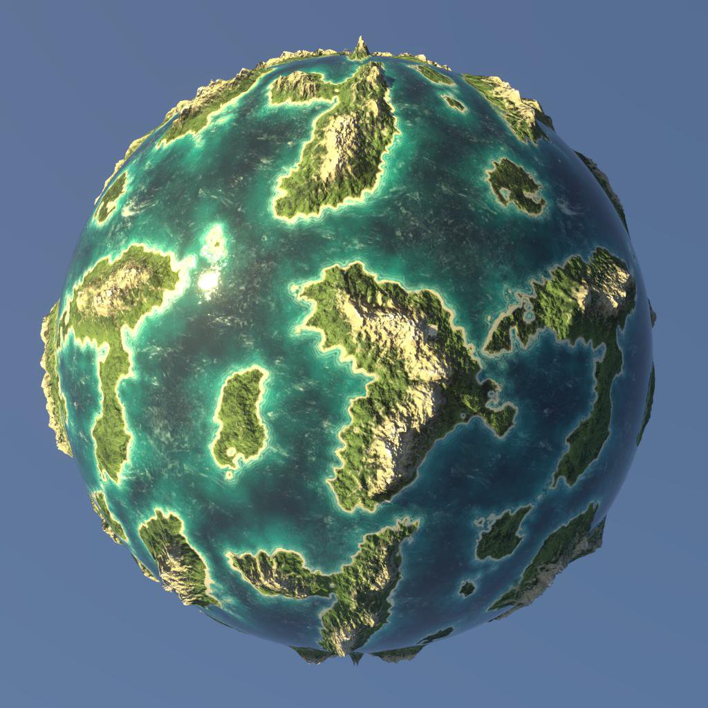

# Renderer 3D

Il vista 3D offre quattro moduli di rendering:

* Due versioni del modulo di rendering 3D interno di Adobe: Rasterizzatore per la visualizzazione in tempo reale con supporto per le ombre e Pathtracer GPU per il rendering accurato di ombre, riflessi, proprietà di materiali complessi e altro ancora.
* Due moduli di rendering di terze parti obsoleti: OpenGL e Iray di NVIDIA.

>[!NOTE]
>
> Mantenete aggiornati i driver grafici.
> 
> I nuovi moduli di rendering 3D vengono aggiornati regolarmente e per alcuni di questi aggiornamenti sono necessari driver GPU recenti. Aggiorna i driver GPU del sistema alla versione più recente per ottenere la migliore affidabilità e il miglior supporto delle funzionalità di rendering.
> 
> I driver sono disponibili qui: [NVIDIA](https://www.nvidia.com/Download/index.aspx?lang=en-us) [AMD](https://www.amd.com/en/support) [Intel](https://downloadcenter.intel.com/product/80939/Graphics-Drivers)

+++ Confronto tra rasterizzatore e tracciatore GPU

<table>
  <tr>
    <td>
      
       <i>Rasterizzatore</i>
    </td>
    <td>
      
       <i>Pathtracer GPU</i>
    </td>
  </tr>
</table>

+++

Il modulo di rendering 3D di Adobe è stato creato appositamente per supportare le tecnologie più recenti, come il linguaggio di ombreggiatura [MaterialX](https://materialx.org/) e la descrizione della scena [USD](https://openusd.org/release/index.html), ed è in grado di offrire una completa coerenza visiva in tutto l’ecosistema Substance 3D.

Grazie alla sua dipendenza dall&#39;USD, può sfruttare il plug-in [USDFileFormat](https://github.com/adobe/USD-Fileformat-plugins) di Adobe per importare molti formati di scene 3D, come FBX e GLTF, ed eseguire il rendering di queste scene completamente, inclusi materiali, texture, fotocamere e luci.

+++ Importazione scene: rasterizzatore e OpenGL

<table>
  <tr>
    <td>
      
       <i>Rasterizzatore</i>
    </td>
    <td>
      
       <i>OpenGL</i>
    </td>
  </tr>
</table>

+++

>[!TIP]
>
> È possibile selezionare il modulo di rendering utilizzato per impostazione predefinita all&#39;avvio di una nuova visualizzazione 3D nella sezione [&quot;Visualizzazione 3D&quot; delle impostazioni del progetto](../../../interface/preferences-window/project-settings/project-settings.md).

## Rasterizzatore

+++ Parametri

|                                                                 |                                                                                                                                                                                                                                                                             |
|-----------------------------------------------------------------|-----------------------------------------------------------------------------------------------------------------------------------------------------------------------------------------------------------------------------------------------------------------------------|
| **Esempi** Mobile | Specifica il numero di campioni di pixel da calcolare prima che l&#39;immagine venga considerata convergente. |
| **Opacità occlusione ambiente** Mobile | Specifica il valore dell’opacità di occlusione ambientale. |
| **Attiva spostamento** booleano | Specifica se abilitare lo spostamento. |
| **Soglia di Spostamento** Mobile | Imposta una soglia per abilitare o disabilitare la tassellatura GPU. |
| **Abilita eliminazione backface** booleano | Un valore vero consentirà di eliminare le trame triangolari che hanno delle normali orientate in direzione opposta rispetto alla fotocamera. Un valore falso disattiverà l’eliminazione del backface. |
| **Modalità diagnostica** Numero intero | Determina la modalità diagnostica da renderizzare. |
| **Modalità ombreggiatura rasterizzatore** Numero intero | Specifica la tecnica da utilizzare per il rendering delle ombre:<ul data-preserve-html="true"> <li data-preserve-html="true"><i>Nessuna ombra:</i> Nessuna ombra verrà visualizzata.</li> <li data-preserve-html="true"><i>Voxel ha marciato:</i> ha marciato i raggi delle ombre in una scena voxelizzata.</li> </ul> |
| **Conteggio campioni ombreggiatura rasterizzatore** Numero intero | Specifica quanti raggi di ombra vengono tracciati per pixel. |
| **Opacità ombra rasterizzatore** mobile | Consente di specificare l’opacità delle ombre, da 0,0 (nessuna ombra) a 1,0 (ombre complete). |
| **Trasparenza indipendente dall&#39;ordine rasterizzatore abilitata** booleano | Non tiene conto dell&#39;ordine delle superfici trasparenti durante il rendering. In questo modo si sacrifica una certa precisione per un rendering più veloce delle superfici trasparenti. |
| **Abilita booleano SSS** rasterizzatore | Attiva/disattiva l’effetto di dispersione del sottosuolo. |
| **Conteggio campioni SSS rasterizzatore** Numero intero | Specifica quanti campioni vengono prelevati per pixel per eseguire il rendering della dispersione sottosuperficie. |
| **Attiva anti-alias accumulo rasterizzatore** booleano | Attiva/disattiva l’anti-alias di accumulo, che migliora lo smoothness o i bordi dell’immagine renderizzata variando i rendering e calcolando cumulativamente il colore medio locale di ciascun pixel. Cioè, accumula valori da cui calcolare una media. |
| **Risoluzione della griglia di voxel rasterizzatore** Numero intero | Determina la risoluzione della griglia di voxel utilizzata per il marciamento del voxel con la rasterizzazione.   Valori più elevati producono ombre più precise a scapito delle prestazioni. |
| **Numero di campioni di runtime IBL rasterizzatore** Intero | Specifica quanti campioni vengono utilizzati per calcolare i riflessi di specular dall&#39;IBL quando la tecnica è impostata su `runtimeSampled`. |

+++

+++ Piano terreno

|                               |                                                                                                                                                              |
|-------------------------------|--------------------------------------------------------------------------------------------------------------------------------------------------------------|
| **Elemento Boolean abilitato** | Attiva/disattiva il piano terreno nella scena renderizzata. |
| Versione di Virgola mobile per **Height** | Controlla lo scostamento height del piano di massa.   Se viene creato, ci si aspetta che nel valore venga eseguita i baking la distorsione appropriata, in base alla scala della scena. |
| Virgola mobile con **intensità ombra** | Quando le ombre sono attivate, controlla l’opacità delle ombre proiettate sul piano terreno, da 0,0 (nessuna ombra) a 1,0 (ombra intera). |

+++

{zoomable="yes"}

## Path tracer GPU

+++ Parametri

|                                                     |                                                                                                                                                                                                                                                                                                                                                                                                                                                                                                                                                                                                                                                                                                                               |
|-----------------------------------------------------|-------------------------------------------------------------------------------------------------------------------------------------------------------------------------------------------------------------------------------------------------------------------------------------------------------------------------------------------------------------------------------------------------------------------------------------------------------------------------------------------------------------------------------------------------------------------------------------------------------------------------------------------------------------------------------------------------------------------------------|
| Virgola mobile **Esempi** | Specifica il numero di campioni di pixel da calcolare prima che l&#39;immagine venga considerata convergente. |
| **Attiva spostamento** booleano | Specifica se abilitare lo spostamento. |
| Virgola mobile **soglia Spostamento** | Imposta una soglia per abilitare o disabilitare la tassellatura GPU. |
| **Abilita eliminazione backface** booleano | Un valore vero consentirà di eliminare le trame triangolari che hanno delle normali orientate in direzione opposta rispetto alla fotocamera. Un valore falso disattiverà l’eliminazione del backface. |
| **Tipo di ciclo pixel** Intero | Specifica la tecnica da utilizzare per ridurre la risoluzione di calcolo per il rendering interattivo:<ul data-preserve-html="true"> <li data-preserve-html="true"><i>Nessun ciclo:</i> disabilita il ciclo dei pixel e calcola ogni campione di pixel completo.</li> <li data-preserve-html="true"><i>Ottimale dispositivo:</i> seleziona la risoluzione ottimale del ciclo dei pixel in base al dispositivo utilizzato per il rendering.</li> <li data-preserve-html="true"><i>4x4:</i> Campiona 1/16 dei pixel per passaggio del ciclo.</li> <li data-preserve-html="true"><i>8x8:</i> Campiona 1/64 del passaggio pixel per ciclo.</li><li data-preserve-html="true"><i>Disturbo blu:</i> campiona adattivamente un numero di pixel e li suddivide per raggiungere una frequenza di fotogrammi oggettiva.</li> </ul> |
| **Modalità diagnostica** Numero intero | Determina la modalità diagnostica da renderizzare. |
| **Visualizza sfondo tramite trasmissione** Booleano | Un valore true consente di visualizzare l&#39;immagine di sfondo attraverso oggetti trasmissivi o rifrangenti.   Se è false, gli oggetti trasmissivi mostreranno l’immagine rifratta dell’ambiente della scena. |

+++

+++ Piano terreno

|                                    |                                                                                                                                                                  |
|------------------------------------|------------------------------------------------------------------------------------------------------------------------------------------------------------------|
| **Elemento Boolean abilitato** | Attiva/disattiva il piano terreno nella scena renderizzata. |
| Versione di Virgola mobile per **Height** | Controlla lo scostamento height del piano di massa.   Se viene creato, ci si aspetta che nel valore venga eseguita i baking la distorsione appropriata, in base alla scala della scena. |
| Virgola mobile con **intensità ombra** | Quando le ombre sono attivate, controlla l’opacità delle ombre proiettate sul piano terreno, da 0,0 (nessuna ombra) a 1,0 (ombra intera). |
| **Attiva luci locali** Booleano | Controlla se l’illuminazione diretta dalle luci locali contribuisce a catturare le ombre. |
| **Attiva riflessi** booleano | Controlla la visibilità di tutte le riflessioni sul piano di massa. |
| Virgola mobile **Opacità riflessi** | Quando le riflessioni sono attivate, controlla l’opacità delle riflessioni compresa tra 0,0 (nessuna riflessione) e 1,0 (riflessione completa). |
| Virgola mobile **Riflessi** | Quando le riflessioni sono attivate, controlla la rugosità del materiale del piano di massa che contribuisce alle riflessioni, da 0,0 (completamente lucido) a 1,0 (completamente irregolare). |

+++

{zoomable="yes"}

## OpenGL

Il modulo di rendering OpenGL offre un rendering rapido in tempo reale, con alcuni shader disponibili per impostazione predefinita a seconda del caso di utilizzo: consulta l’elenco seguente.

+++ OpenPBR

Un modello di materiale con un supporto crescente supportato dai principali attori del settore, tra cui l&#39;Adobe, e con la più ampia serie di funzionalità.

Per la visualizzazione del height sono disponibili due tecniche:

<b>Occlusione parallasse</b> - Falsa lo spostamento del height senza modificare la geometria tramite la deformazione e l&#39;occlusione UV localizzata.

<b>Tassellatura + Spostamento</b>: suddivide la geometria e sposta i vertici lungo le normali.

Ulteriori informazioni sull&#39;OpenPBR in Designer [qui](../material-properties/material-properties.md#openpbr).

+++

+++ Materiale standard Adobe

Lo shader standardizzato di Adobe. Assicura un look corretto tra tutte le applicazioni Substance 3D di Adobe e supporta un’ampia gamma di funzioni.

Per la visualizzazione del height sono disponibili due tecniche:

<b>Occlusione parallasse</b> - Falsa lo spostamento del height senza modificare la geometria tramite la deformazione e l&#39;occlusione UV localizzata.

<b>Tassellatura + Spostamento</b>: suddivide la geometria e sposta i vertici lungo le normali.

L&#39;Adobe Standard Material è documentato in dettaglio in [questa sezione](https://experienceleague.adobe.com/en/docs/substance-3d/general-knowledge/asm/adobe-standard-material) della documentazione.

+++

+++ AxF SVBRDF

Uno shader dedicato alla visualizzazione di materiali estratti da [file AxF](../../../resources/axf-appearance-exchange/axf-appearance-exchange-format.md) e che utilizza la rappresentazione <b>SVBRDF</b>.

Per la visualizzazione del height sono disponibili due tecniche:

<b>Occlusione parallasse</b> - Falsa lo spostamento del height senza modificare la geometria tramite la deformazione e l&#39;occlusione UV localizzata.

<b>Tassellatura + Spostamento</b>: suddivide la geometria e sposta i vertici lungo le normali.

Questo shader è attualmente un *lavoro in corso* e fornisce una panoramica delle caratteristiche dei materiali, ma non deve essere utilizzato per regolazioni di precisione e alcune funzionalità non sono ancora supportate.

+++

+++ Blinn

&quot;Vecchia generazione&quot;, shader non PBR corretto. Usa i canali Diffusa, Specular e Lucentezza accanto ai canali standard come Opacità, Height e Normale.

Per la visualizzazione del height sono disponibili due tecniche:

<b>Occlusione parallasse</b> - Falsa lo spostamento del height senza modificare la geometria tramite la deformazione e l&#39;occlusione UV localizzata.

<b>Tassellatura + Spostamento</b>: suddivide la geometria e sposta i vertici lungo le normali.

+++

+++ Lambert

Molto semplice shader di illuminazione lambert, supporta solo canale Diffusa. Utilizza il vecchio sistema di luci puntiformi, non supporta l’illuminazione dell’immagine HDR.

+++

+++ Informazioni trama

Debug dello shader non illuminato per visualizzare i seguenti dati della geometria:

* Normale

* Tangente

* Binormale

* UV

* Porzione UV

* Colore vertice

* Posizione (spazio mondo)

La visualizzazione è bloccata a [0, 1]. Non è quindi possibile acquisire una lettura diretta sullo schermo di valori che non rientrano in tale intervallo.

+++

+++ Rugosità metallica

Materiale PBR standard per il modello di Rugosità metallica. Usa canali Colore di base, Metallico e Rugosità.

Per la visualizzazione del height sono disponibili due tecniche:

<b>Occlusione parallasse</b> - Falsa lo spostamento del height senza modificare la geometria tramite la deformazione e l&#39;occlusione UV localizzata.

<b>Tassellatura + Spostamento</b>: suddivide la geometria e sposta i vertici lungo le normali.

+++

+++ Rugosità metallica - Rivestita

Materiale PBR rivestito per il modello di Rugosità metallica. Usa canali di Colore di base, metallici e di rugosità, oltre a canali aggiuntivi &quot;Pelo&quot;.

Per la visualizzazione del height sono disponibili due tecniche:

<b>Occlusione parallasse</b> - Falsa lo spostamento del height senza modificare la geometria tramite la deformazione e l&#39;occlusione UV localizzata.

<b>Tassellatura + Spostamento</b>: suddivide la geometria e sposta i vertici lungo le normali.

+++

+++ RUGOSITÀ METALLICA - SSS

Materiale PBR a dispersione sottosuperficie per il modello di Rugosità metallica. Usa canali di Colore di base, metallici e di rugosità, nonché canali di dispersione aggiuntivi.

Per la visualizzazione del height sono disponibili due tecniche:

<b>Occlusione parallasse</b> - Falsa lo spostamento del height senza modificare la geometria tramite la deformazione e l&#39;occlusione UV localizzata.

<b>Tassellatura + Spostamento</b>: suddivide la geometria e sposta i vertici lungo le normali.

+++

+++ Lucidità Specular

Materiale PBR standard per il modello di lucidità degli Specular. Usa canali diffusi, Specular e lucidi.

Per la visualizzazione del height sono disponibili due tecniche:

<b>Occlusione parallasse</b> - Falsa lo spostamento del height senza modificare la geometria tramite la deformazione e l&#39;occlusione UV localizzata.

<b>Tassellatura + Spostamento</b>: suddivide la geometria e sposta i vertici lungo le normali.

+++

+++ Non illuminato

Lo shader di debug non è illuminato per visualizzare le mappe texture senza alcuna illuminazione. Utilizza solo un canale di colore.

+++

Designer offre inoltre la possibilità di configurare shader personalizzati per il modulo di rendering OpenGL [utilizzando file GLSLFX](../../../interface/3d-view/glslfx-shaders/glslfx-shaders.md).

>[!IMPORTANT]
> 
> Questo modulo di rendering è **deprecato**: non riceverà nuove funzioni e verrà ritirato in una versione futura di Designer.

{zoomable="yes"}
