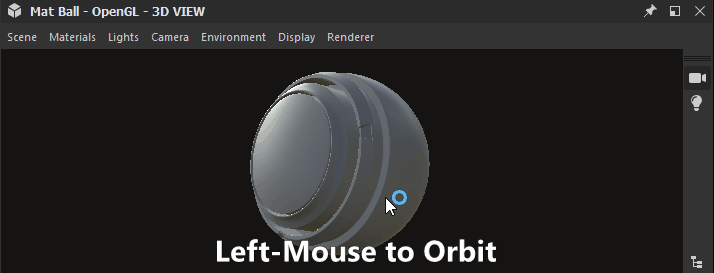
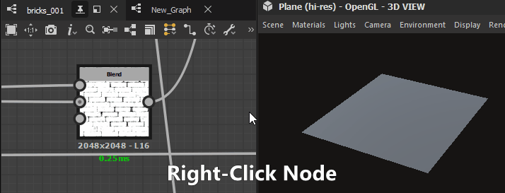
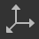
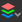

# Visualizzazione 3D

Il vista 3D consente di visualizzare e comprendere i materiali con trame personalizzate e materiali PBR renderizzati. Analogamente a tutte le finestre di Substance 3D Designer, funziona insieme ad altre finestre tramite le opzioni del menu di scelta rapida e le operazioni di trascinamento.

La vista 3D fornisce anche due metodi principali per il rendering dei materiali nelle scene 3D:
* Visualizzazione rapida in tempo reale con i moduli di rendering **Rasterizer** e **OpenGL**
* Rendering con ray tracing di alta qualità con renderer **Pathtracer GPU**

Ulteriori informazioni qui: [moduli di rendering 3D](3d-renderers/3d-renderers.md)

+++ Ancoraggio vista 3D

+++

## Interazioni finestra di visualizzazione

In breve, la sezione seguente spiega come eseguire le azioni più comuni insieme a una gif animata per illustrare il processo.

### Navigazione

La vista 3D e l&#39;ambiente possono essere gestiti in tre modi:

* <b>Orbita:</b> LMB+trascinamento
* <b>Panning</b>: MMB+Drag/Ctrl+RMB+Drag
* <b>Zoom</b>: scorrere utilizzando la rotellina del mouse/RMB+trascinamento
* <b>Ruotare l&#39;ambiente:</b> ⇧+RMB+Drag
* <b>Focus su una trama selezionata:</b> F (si concentra sull&#39;intera scena se non è presente alcuna selezione)
* <b>Luce punto orbita 1:</b> Ctrl+⇧+LMB+Drag
* <b>Spostare la luce puntiforme 1 più vicino/lontano dall&#39;origine:</b> Ctrl+⇧+RMB+Drag
* <b>Ripristina posizione in orbita fotocamera:</b> R
* <b>Ripristina posizione e proprietà dell&#39;orbita della fotocamera:</b> ⇧+R

Utilizzo di un trackpad (solo macOS)

* <b>Orbita:</b> scorrimento con due dita
* <b>Panning:</b> ⇧+scorrimento con due dita
* <b>Zoom: </b>pizzicore con due dita / ⌘+scorrimento con due dita
* <b>Ruotare l&#39;ambiente:</b> ⇧+scorrimento con due dita

>[!NOTE]
>
> Direzione zoom
> 
> Ciascuno dei metodi di zoom viene invertito:
> 
> * La rotellina del mouse verso l&#39;alto *avvicina* la scena
> * RMB e trascinamento verso l&#39;alto *allontana* la scena
> 
> La direzione dello zoom può essere invertita nelle [Preferenze](../../interface/preferences-window/preferences-window.md).

### Selezionare e attivare

Potete interagire con le trame direttamente nella finestra della vista:

<b>Per selezionare una trama, tenete premuto ⇧ e fate clic su LMB su di essa.</b> Le trame selezionate hanno un contorno blu.

<b>Premete F per concentrarvi su una trama selezionata</b>. Mettendo a fuoco una trama, la videocamera si sposta per incorniciarla e girare in orbita attorno ad essa.

<b>Fare clic su RMB mentre è selezionata una trama</b> per accedere alle sue [azioni materiali](#material-actions) in un menu di scelta rapida.

<b>Premere Esc per deselezionare.</b> Non è necessario che il cursore si trovi sulla trama.

{zoomable="yes"}

*Selezionare, attivare, deselezionare*

{zoomable="yes"}

*Seleziona, menu di scelta rapida*

>[!NOTE]
>
> Queste azioni non sono disponibili per il modulo di rendering [OpenGL](../../interface/3d-view/3d-renderers/3d-renderers.md) obsoleto.

### Modifica dell&#39;illuminazione ambiente (IBL)

Per impostazione predefinita, Designer funziona con l’illuminazione basata su immagini (IBL). Per eseguire il rendering dell’illuminazione ambientale viene utilizzata una bitmap a intervallo dinamico elevato.

Potete ruotare l’ambiente attorno all’oggetto 3D oppure caricare ambienti con luci HDR predefiniti o personalizzati. Si prega di notare che le immagini dell&#39;HDR dovrebbero utilizzare una proiezione equirettangolare e avere una precisione di virgola mobile a 32 bit.

⇧+RMB+Trascina <b>ruota l&#39;ambiente</b> nella vista 3D.

Per impostare una rotazione precisa, utilizzare <b>Ambiente > Modifica</b> nella barra degli strumenti superiore del vista 3D e modificare il cursore <b>Angolo di rotazione</b> nella finestra delle proprietà.

Per utilizzare un ambiente chiaro HDR predefinito, fate clic sulla sezione <b> ambienti HDRI</b> della <b>categoria </b>nella [libreria](../../interface/the-library/the-library.md), quindi trascinate le icone nella vista 3D.

Per utilizzare un ambiente HDR leggero personalizzato, importare un&#39;immagine HDR trascinando e rilasciando il file in un pacchetto nella finestra Esplora risorse (<b>Collegare</b> il file quando richiesto). Trascinate quindi la risorsa e scegliete come destinazione <b>Latitude/Longitude Panorama</b>.

### Luci puntiformi

Vai a <b>Luci > Modifica proprietà</b> per attivare/disattivare le luci di punto nella scena.

È possibile spostare Point Light 1 nell&#39;origine della scena tenendo premuto LMB o RMB e trascinando nella finestra della vista in modalità Illuminazione. 

In modalità Videocamera  , è inoltre possibile passare temporaneamente alla modalità Illuminazione tenendo premuti i tasti Ctrl+⇧ insieme ai pulsanti del mouse.

## Visualizzare i dati in vista 3D

### Grafici Substance

Potete visualizzare interi materiali come materiale completo nel vista 3D. Questo è il modo più comune di lavorare e corrisponderà gli [attributi di utilizzo sui nodi di output](../../compositing-graphs/nodes-reference-for-com/atomic-nodes/output/output.md) agli slot di texture pertinenti del materiale della vista 3D. Ciò significa che gli output devono essere impostati correttamente (l’utilizzo di Modelli garantisce che sia così) e che il materiale selezionato/la finestra di shader supporta

Per visualizzare tutti gli output di un grafico, fate clic su *RMB* un&#39;area vuota nella [vista Grafico](../../interface/the-graph-view/the-graph-view.md) e scegliete l&#39;opzione **Visualizza output in vista 3D** nel menu di scelta rapida.

Potete anche visualizzare gli output di un grafico senza doverlo aprire, facendo clic su RMB su una risorsa grafico nel dock [Esplora risorse](../the-explorer-window/the-explorer-window.md) e scegliendo l&#39;opzione **Visualizza output in vista 3D** nel menu di scelta rapida.

In alternativa al menu di scelta rapida del grafico, potete ottenere lo stesso risultato trascinando il grafico dall&#39;ancoraggio [Esplora risorse](../the-explorer-window/the-explorer-window.md) al vista 3D.

Quando *caricate un grafico*, per impostazione predefinita gli output vengono applicati automaticamente nel vista 3D. Puoi disabilitare questo comportamento nelle [Preferenze](../../interface/preferences-window/preferences-window.md). Vai a **Modifica > Preferenze > Grafico > Comune** e deseleziona l&#39;opzione **Visualizza output nella vista 3D quando apri un grafico**.

>[!NOTE]
>
> **Più Slot Di Materiale**
> 
> Se utilizzate mesh personalizzate con più di un materiale, vi verrà chiesto di scegliere a quale slot di materiale assegnare il materiale. Con uno dei metodi precedenti, fare clic su uno slot per confermare la scelta. Per ulteriori informazioni sui Materiali e sulla loro assegnazione, leggete la sezione dettagliata riportata di seguito.

### Output singolo nodo/grafico

Puoi visualizzare un solo output in qualsiasi canale di materiale disponibile nella [vista 3D](https://substance3d.adobe.com/). Questa opzione è meno comune, ma è utile per visualizzare in anteprima i test rapidi o i singoli nodi senza output.

È possibile visualizzare qualsiasi nodo, non solo i nodi di output, facendo clic con il pulsante destro del mouse su di esso nella [visualizzazione Grafico](../../interface/the-graph-view/the-graph-view.md) e scegliendo <b>Visualizzazione in visualizzazione 3D</b>. Verrà visualizzato un elenco con i canali disponibili a cui assegnare il nodo. Fai clic su qualsiasi per confermare.

Puoi anche usare *RMB* per trascinare e rilasciare qualsiasi nodo dalla vista Grafico alla vista 3D. Verrà visualizzato un elenco con i canali disponibili a cui assegnare il nodo. Fai clic su qualsiasi per confermare.

Potete visualizzare qualsiasi singolo output del grafico espandendo la risorsa del grafico nel dock di [Esplora risorse](../the-explorer-window/the-explorer-window.md) e utilizzando *LMB* per trascinare l’output nella vista 3D. Verrà visualizzato un elenco con i canali disponibili a cui assegnare il nodo. Fai clic su qualsiasi per confermare.

## Visualizza scene 3D (personalizzate)

Designer offre una dozzina di trame predefinite. Queste trame hanno coordinate UV uniformi e utilizzabili e servono la maggior parte degli scenari per le texture in porzioni. È anche possibile importare e visualizzare le proprie trame 3D.\
Scegliete una delle trame predefinite dal menu a discesa <b>Scena</b> nella barra superiore.

Per le scene 3D personalizzate, consulta la sezione [Utilizzo delle scene 3D](../../working-with-3d-scenes/working-with-3d-scenes.md).

## Modificare le proprietà dello shader

In Designer sono disponibili alcuni [shader](../../glossary/glossary.md) diversi per impostazione predefinita e ogni shader ha opzioni che vanno oltre i semplici canali delle texture. Possono essere configurati singolarmente.

Tieni presente che gli ombreggiatori differiscono tra i [moduli di rendering 3D](../../interface/3d-view/3d-renderers/3d-renderers.md) di Designer e che al passaggio di un modulo di rendering verranno mantenute solo le impostazioni contrassegnate con un&#39;etichetta &quot;Comune&quot;.

Per modificare lo shader corrente, passa a <b> Menu &#39;</b>Materiali&#39;, quindi aprite il sottomenu del materiale da modificare.

Ad esempio, per regolare la proprietà &quot;Scala di Height&quot; del materiale &quot;Predefinito&quot; nella scena &quot;Piano (alta risoluzione)&quot;, accedete a &quot;Materiali > Predefinito > Modifica proprietà&quot;. Individua quindi la proprietà &#39;Scala Height&#39; nel Dock proprietà.

Gli ombreggiatori possono essere ripristinati mediante le azioni &quot;Ripristina materiale&quot; o &quot;Ripristina stato scena&quot; nel sottomenu. Se stavi visualizzando gli output del grafico Substance nella vista 3D, dovrai riapplicarli.

>[!NOTE]
>
> Informazioni sulla tassellatura
> 
> La proprietà &quot;Fattore di tassellatura&quot; varia a seconda del modulo di rendering 3D selezionato:
> 
> * <b>Rasterizzatore/Pathtracer GPU:</b> situato nelle impostazioni del modulo di rendering (Rendering > Impostazioni di modifica), influisce sull&#39;*intera scena*.
> * <b>OpenGL:</b> situato nelle proprietà del materiale, influisce sul materiale.

## Esporta scena

Informazioni sull&#39;esportazione di scene 3D in [questa pagina](../../working-with-3d-scenes/exporting-scenes/exporting-scenes.md).

### Esportare trame tassellate (solo per il modulo di rendering OpenGL)

Potete esportare la trama dalla <b>vista 3D</b> in un file nei formati <b>OBJ</b>, <b>FBX</b> o <b>PLY</b>. Se lo spostamento *tassellatura* è abilitato, la suddivisione della geometria viene inserita nella trama esportata.

Tuttavia, le normali dei vertici della trama originale potrebbero non corrispondere alla nuova forma spostata, il che significa che la trama spostata potrebbe non essere renderizzata correttamente. Puoi gestire questa operazione in due modi:

* Utilizza la trama *mappa normale* che fornirà le normali corrette
* *Calcolare nuovamente le normali della trama* durante l&#39;esportazione utilizzando la mappa normale della trama, il che significa che tali normali vengono inseriti nella trama esportata e che la mappa normale non è più necessaria

Per esportare la trama della vista 3D, accedete a <b>Scena > Esporta trama tassellata...</b>, impostate la vostra scelta riguardo al ricalcolo delle normali, quindi selezionate una posizione, un nome e un formato di file per la trama esportata.

>[!NOTE]
>
> Questa funzionalità *non è disponibile* in **macOS**.

>[!IMPORTANT]
>
> Alcune avvertenze
> 
> Se la trama originale ha più materiali e/o set UV, questi verranno *uniti in uno*.
> 
> La durata del processo di esportazione e la dimensione del file risultante dipendono dal numero di triangoli della trama e dal *fattore di tassellatura*. Valori elevati del fattore di tassellatura possono causare instabilità a seconda del pool di memoria integrato della GPU.
> 
> Ciò detto, il conteggio dei vertici della trama tassellata deve essere compreso nello *stesso intervallo* del conteggio dei pixel della mappa *height*.
> 
> Una trama più densa di quella della mappa del height può creare una trama leggermente più fluida quando si utilizza la tassellatura <b>Phong</b>. Tuttavia, è necessario cercare di esportare in modo affidabile la trama con i dettagli della mappa del height richiesti, quindi perfezionare la trama esportata in altri software, se necessario.

>[!WARNING]
>
> **TDR (solo Windows)**
> 
> Per questa funzione è necessario che <b>Rilevamento e ripristino del timeout</b> corrisponda ai valori consigliati nella [pagina](https://experienceleague.adobe.com/en/docs/substance-3d-painter/using/technical-support/technical-issues/gpu-issues/gpu-drivers-crash-with-long-computations-tdr-crash) della documentazione, come indicato nei [Requisiti tecnici](../../getting-started/system-requirements/system-requirements.md) di Designer.

## Barra dei menu

La barra dei menu fornisce 7 menu con opzioni relative alla vista 3D. di seguito è riportata una panoramica di tutte le opzioni disponibili.

+++Scena
Il menu <b>Scena</b> riguarda la geometria (risorsa 3D) visualizzata e gli stati della vista 3D. Risorsa 3D: condividi solo la trama, gli stati della scena sono luci, videocamera e impostazioni correlate e possono anche contenere la trama.

<b>Modifica: </b>Carica le opzioni della scena nel pannello [Proprietà](../../interface/properties/properties.md). Consente di attivare/disattivare la visibilità della trama 3D.

<b>Primitive standard:</b> mostra una delle seguenti semplici trame 3D nella vista 3D.

* Cubo

* Cilindro

* Scatola vuota

* Casella interna

* Piano

* Piano (alta risoluzione)

* Sfera

<b>Primitive estese:</b> mostra una delle seguenti trame 3D nella vista 3D.

* Tessuto

* Pomello &quot;Mat&quot;

* Cubo arrotondato

* Cilindro arrotondato

* Piastrelle sfera 2

* Toroide

<b>Visualizza UV nella vista 2D:</b> consente la visualizzazione degli UV per la trama attualmente selezionata come sovrapposizione nella [vista 2D](../2d-view/2d-view.md).

<b>Crea risorsa 3D dalla scena corrente...:</b> Crea una nuova [risorsa scena 3D](../../resources/3d-scene-resource/3d-scene-resource.md) in un pacchetto esterno alla scena corrente.

<b>Carica file di stato...: </b>Carica un [file di stato scena](../../working-with-3d-scenes/working-with-3d-scenes.md) salvato esternamente (\*.sbsscn). Non sostituisce la trama 3D, carica solo le impostazioni per il modulo di rendering 3D, la videocamera e le luci.

<b>Carica file di stato con trama...:</b> Carica un [file di stato scena](../../working-with-3d-scenes/working-with-3d-scenes.md) salvato esternamente (\*.sbsscn). Carica le impostazioni per il modulo di rendering 3D, la videocamera, le luci e la scena 3D di riferimento. .

<b>Salva file di stato...: </b>Salva lo stato corrente della vista 3D in un [file di stato della scena](../../working-with-3d-scenes/working-with-3d-scenes.md) (\*.sbsscn).

<b>Salva stato corrente come predefinito: </b>Imposta lo stato corrente della vista 3D come [file di stato della scena](../../working-with-3d-scenes/working-with-3d-scenes.md) da utilizzare per impostazione predefinita durante la creazione di nuove viste 3D. Questo file viene caricato ogni volta che la vista 3D viene ripristinata o inizializzata e può essere impostato nelle [impostazioni del progetto](../../interface/preferences-window/project-settings/project-settings.md).

<b>Esporta scena:</b> *(Solo per i renderer con rasterizzatore e Pathtracer GPU)* Esporta la scena corrente come [scena appiattita](../../working-with-3d-scenes/exporting-scenes/exporting-scenes.md), in cui viene scritta solo la scena del risultato e vengono persi eventuali riferimenti alla scena originale. Il contenuto della scena esportata dipende dalle funzioni supportate dal formato di esportazione selezionato.\
Formati disponibili: STL, FBX, GLB, GLTF, PLY, USDC, USD, USDA, USDZ, OBJ.

<b>Esporta scena con livelli:</b> *(solo per rendering di rasterizzatori/Pathtracer GPU)*Esporta la scena corrente come [scena con livelli](../../working-with-3d-scenes/exporting-scenes/exporting-scenes.md), in cui tutte le modifiche alla scena originale vengono salvate in file separati in un flusso di lavoro non distruttivo. Questa opzione è disponibile solo per i formati di file USD.\
I formati disponibili sono: USDC, USD, USDA.

<b>Esporta geometria tassellata:</b> *(solo per il modulo di rendering OpenGL)* Esporta la scena corrente con tassellatura come geometria non elaborata, consultate la sezione Esporta scena.

<b>Ripristina scena: </b>Ripristina la visualizzazione 3D predefinita.

Alcuni aggiornamenti software possono modificare il modo in cui i file dello stato Scena vengono salvati/caricati.

Se la scena non è *ripristinata correttamente* dal file, si consiglia di impostare manualmente lo stato desiderato della scena e di *riesportare* il file di stato della scena.

+++

+++Materiali
Il menu <b>Materiali</b> cambia in base alla trama 3D caricata e al renderer utilizzato.

Il menu Materiali presenta un elenco di tutti i materiali assegnati a una trama nella scena. Ogni materiale elencato nel menu &quot;Materiali&quot; ha un sottomenu di azioni materiale:

<b>Modifica</b> - Modificare le impostazioni del materiale corrente nella finestra Proprietà.

<b>Elenco shader</b> - Tutti i [shader](../../glossary/glossary.md) disponibili per il [modulo di rendering 3D](../../interface/3d-view/3d-renderers/3d-renderers.md) corrente.

<b>Carica definizione...: </b>(solo rendering OpenGL) Consente di caricare il tuo [shader GLSLFX personalizzato.](../../interface/3d-view/glslfx-shaders/glslfx-shaders.md) Lo shader viene aggiunto all’elenco precedente.

<b>Reimposta parametri comuni:</b> Reimposta tutti i parametri comuni tra gli shader. Ad esempio, quando si passa dal modulo di rendering Rasterizer/Pathtracer GPU al modulo di rendering OpenGL e viceversa, vengono riportati diversi valori dei parametri nel [Materiale standard Adobe](https://experienceleague.adobe.com/en/docs/substance-3d/general-knowledge/asm/adobe-standard-material).

<b>Rinomina:</b> Modificare l&#39;etichetta per questo materiale.

<b>Reimposta materiale:</b> reimposta tutti i parametri dello shader sui valori predefiniti. Se le texture sono collegate a uno dei campionatori dello shader, vengono scollegate.

<b>Ripristina lo stato della scena per il materiale: </b>*(solo per i moduli di rendering Rasterizzatore e Pathtracer GPU)* Ripristina tutte le proprietà di [materiali sostituiti](../../working-with-3d-scenes/overriding-scene-mat/overriding-scene-materials.md) ai valori originali della scena, incluse le eventuali texture originali.

<b>Aggiungi: </b>Aggiunge un nuovo materiale all&#39;elenco. Non viene utilizzato per impostazione predefinita e potrebbe essere [connesso a un materiale della scena](../../working-with-3d-scenes/overriding-scene-mat/overriding-scene-materials.md) utilizzando il [browser della scena](../../interface/3d-view/scene-browser/scene-browser.md).

+++

+++Luci
Il menu <b>Luci</b> riguarda solo le luci ambiente e le luci puntiformi meno recenti. Queste luci non sono conformi allo standard PBR e non offrono gli stessi risultati di alta qualità del rendering basato su immagini HDR.

<b>Modifica:</b> modifica le singole impostazioni per la luce ambiente e le due luci puntiformi.

<b>Reimposta luci:</b> ripristina le proprietà della luce allo stato predefinito.

+++

+++Videocamera
Il menu <b>Fotocamera</b> consente di modificare le impostazioni della videocamera, passare agli angoli predefiniti e caricare gli angoli della videocamera memorizzati in un file con trama 3D personalizzato.

<b>Modifica proprietà:</b> apre le impostazioni predefinite della videocamera nel Dock proprietà.

<b>Stato attivo: </b>(F) Attiva la videocamera predefinita sulla trama attualmente selezionata. Ad esempio, inquadra la trama e allinea il perno della fotocamera ad essa. Se non è presente alcuna selezione attiva, viene utilizzato il rettangolo di selezione globale della scena.

<b>Fotocamere di scena:</b> se le scene includono una o più fotocamere, vengono elencate qui e le relative impostazioni vengono utilizzate come predefiniti da applicare alla videocamera predefinita della scena.

<b>Punti di vista:</b> Punto di vista preconfigurato per la fotocamera predefinita. che influiscono solo sulla trasformazione della videocamera (posizione e rotazione).

* Predefinito: ripresa con grandangolo dalla parte anteriore sinistra degli oggetti.

* Posteriore

* In basso

* Anteriore

* Sinistra

* Destra

* In alto

<b>Salva rendering...:</b> (Alt+S) Salva l&#39;immagine di cui è stato eseguito il rendering su disco alla risoluzione specificata nelle proprietà del modulo di rendering oppure nelle proprietà predefinite della fotocamera se è stata impostata una risoluzione di esclusione.

<b>Copia rendering negli Appunti:</b> (Alt+C) Copia l&#39;immagine di cui è stato eseguito il rendering negli Appunti, per incollarla in un editor di immagini esterno.

<b>Reimposta posizione:</b> (R) Reimposta la posizione della fotocamera.

<b>Reimposta selezione:</b> (Maiusc+R) reimposta la posizione e le proprietà della videocamera.

+++

+++Ambiente
Il menu <b>Ambiente</b> consente di modificare le impostazioni relative all&#39;ambiente HDRI utilizzato per illuminare i materiali PBR corretti.

<b>Modifica proprietà:</b> consente di accedere alle impostazioni dell&#39;ambiente HDR, utilizzate per l&#39;illuminazione in PBR. In particolare, potete attivare e disattivare la visibilità, modificare l’esposizione con un’anteprima e impostare la rotazione con un cursore preciso.

<b>Reimposta ambiente:</b> reimposta tutte le proprietà dell&#39;ambiente sul valore predefinito.

+++

+++Visualizza
Il menu di visualizzazione consente di attivare/disattivare le modalità di visualizzazione, i supporti e le informazioni per la scena sottoposta a rendering:

<b>Asse:</b> Attiva/disattiva la visualizzazione dell&#39;asse 3D nella finestra della vista.

<b>Griglia:</b> attiva/disattiva la visualizzazione del World Frid.

<b>Risoluzione:</b> Attiva/disattiva la visualizzazione di un piccolo contatore di risoluzione.

<b>Statistiche scena:</b> Attiva/disattiva la visualizzazione delle statistiche scena, ad esempio il conteggio di politoni, materiali, trame statiche e così via.

<b>Tempo di rendering:</b> tempo necessario per calcolare un campione per l&#39;intera immagine.

<b>Campioni:</b> la quantità di campioni di pixel calcolati per l&#39;antialiasing di accumulo (rasterizzatore) o il tracciamento del percorso (tracciatore del percorso GPU).

<b>Eliminazione sfondo:</b> disattivando questa opzione è possibile visualizzare una trama da *entrambi i lati*. L’opzione funziona in combinazione con Wireframi

<b>Rettangolo di selezione:</b> attiva/disattiva la visualizzazione del rettangolo di selezione della trama.

<b>Wireframe:</b> attiva/disattiva la visualizzazione del wireframe mesh.

<b>Luce:</b> attiva la visualizzazione delle linee di supporto per le luci di posizione.

<b>Spazio tangente vertice:</b> visualizza i vettori tangente, binormale e normale per tutti i vertici come gizmo colorati

Alcune di queste opzioni sono disponibili come interruttori dei pulsanti nella barra degli strumenti Scena.

+++

+++Modulo di rendering
Il menu <b>Modulo di rendering</b> consente di passare da un modulo di rendering 3D all&#39;altro e di accedere alle proprietà del modulo di rendering 3D corrente tramite l&#39;azione <b>Modifica proprietà</b>.

I moduli di rendering disponibili e le relative impostazioni sono documentati in [questa pagina dedicata](../../interface/3d-view/3d-renderers/3d-renderers.md).

+++

## Barra degli strumenti Scena

La barra degli strumenti **Scena**, che per impostazione predefinita si trova sul bordo sinistro della vista 3D, offre controlli per la visualizzazione e l&#39;interazione con la scena.

Consente inoltre di accedere alla [finestra a comparsa Spostamento](displacement/displacement.md) e al dock [per browser scene](scene-browser/scene-browser.md).

>[!NOTE]
>
> La barra degli strumenti può essere *riposizionata* attorno all&#39;ancoraggio **Vista 3D** utilizzando l&#39;*impugnatura* più a sinistra rappresentata da tre linee parallele.

### Opzioni di visualizzazione

#### In alto

 

 <b>Browser scene</b>

Visualizza una gerarchia di tutti gli elementi in una scena 3D.

>[!INFO]
>
>Il browser Scene e le sue funzionalità sono ampiamente trattati nella [pagina dedicata](../../interface/3d-view/scene-browser/scene-browser.md).

 <b>Seleziona</b>

Consente la selezione diretta delle trame nella scena.

<code>LMB</code> Selezionate una trama nella scena.

Seleziona le singole trame della scena. Le trame selezionate hanno un contorno blu nella finestra della vista e sono evidenziate nel [Visualizzatore scene](../../interface/3d-view/scene-browser/scene-browser.md).

Per le trame selezionate è disponibile un menu di scelta rapida che può essere visualizzato facendo clic su <code>RMB</code>.

Le trame possono essere selezionate anche in modalità Videocamera o Luce, premendo <code>Maiusc+LMB</code>.

 

 <b>Fotocamera</b>

Consente il controllo diretto della videocamera nella scena.

<code>LMB</code> Mettere in orbita la fotocamera attorno alla destinazione. <code>RMB</code> Avvicinate o allontanate la fotocamera dalla destinazione.

 

 <b>Mostra ambiente</b>

Questo pulsante consente di attivare/disattivare la visualizzazione dell&#39;ambiente della scena. La stessa impostazione si trova nel Dock Proprietà dopo aver scelto <b>Ambiente > Modifica</b> nella barra dei menu del vista 3D.

 

 <b>Chiaro</b>

Consente il controllo diretto della Luce punto 1 nella scena.

<code>LMB</code> Mettere in orbita la fotocamera intorno all&#39;origine della scena. <code>RMB</code> Avvicinate o allontanate la luce dall’origine della scena.

 

 <b>Impostazioni modulo di rendering</b>

Visualizza le impostazioni del modulo di rendering corrente nel dock [Proprietà](../properties/properties.md).

 

 <b>Abilita Tracciatore</b>

Attiva/disattiva la selezione del modulo di rendering [Pathtracer GPU](3d-renderers/3d-renderers.md#gpu-pathtracer).

 

 <b>Abilita ombre</b>

Attiva/disattiva il rendering delle ombre in tempo reale nel modulo di rendering [Rasterizzatore](3d-renderers/3d-renderers.md#rasterizer).

 

 <b>Abilita piano terreno</b>

Attiva/disattiva il rendering del piano terreno nei moduli di rendering [Rasterizzatore](3d-renderers/3d-renderers.md#rasterizer) e [Pathtracer GPU](3d-renderers/3d-renderers.md#gpu-pathtracer).

 

 <b>Spostamento</b>

Visualizza la finestra a comparsa [Spostamento](displacement/displacement.md).

 

#### In basso

 

 <b>Griglia</b>

Attiva/disattiva la visualizzazione della griglia del mondo.

 

 <b>Statistiche scena</b>

Attiva/disattiva la visualizzazione delle statistiche di scena, ad esempio il conteggio dei poligoni e dei materiali, il conteggio delle trame statiche e così via.

 

 <b>Asse</b>

Attiva/disattiva la visualizzazione dell&#39;asse 3D nella finestra della vista.

 

#### Solo rendering OpenGL

 

 <b>Eliminazione sfondo</b>

La disattivazione di questa opzione consente di visualizzare una faccia con trama da *entrambi i lati*. L’opzione funziona in combinazione con Wireframi.

 

 <b>Rettangolo di selezione</b>

Attiva/disattiva la visualizzazione del rettangolo di selezione della trama.

 

 <b>Spazio tangente vertice</b>

Visualizza i vettori tangente, binnormale e normale per tutti i vertici come gizmo colorati.

 

 <b>Wireframe</b>

Attiva/disattiva la visualizzazione della trama come wireframe.

## Visualizza barra degli strumenti

La barra degli strumenti <b>Visualizzazione</b>, disponibile per impostazione predefinita nella *parte inferiore* del pannello <b>Visualizzazione 3D</b>, consente di controllare la modalità di visualizzazione dell&#39;immagine di rendering nella finestra della vista.

>[!NOTE]
>
> La barra degli strumenti può essere *riposizionata* attorno all&#39;ancoraggio **Vista 3D** utilizzando l&#39;*impugnatura* più a sinistra rappresentata da tre linee parallele.

### AOV di rendering 3D

<table style="margin-top: 32px; margin-bottom: 32px">
    <tr style="border: 0; vertical-align: top">
        <td style="border: 0">
            
È possibile visualizzare <a href="../../glossary/glossary.md#aov">AOV</a> diversi utilizzando il pulsante  <b>AOV di rendering 3D</b>.

            
I file AOV consentono di ispezionare separatamente le informazioni sulla trama e sul materiale per il lavoro mirato e il debug.

            
Alcuni valori AOV includono <i>valori HDR</i> che sono bloccati a 1 (bianco puro) o 0 (nero puro) nella finestra della vista. Per ispezionare l'intero intervallo di valori, è possibile esportare un rendering 3D dell'AOV in un formato di file di immagine che supporti i valori HDR, ad esempio <code>.exr</code>. Utilizzare l'opzione di menu <code>Camera > Save render...</code> per esportare l'AOV corrente.

            
<i>Nota:</i> gli AOV sono disponibili solo quando si utilizzano il rasterizzatore e i <a href="./3d-renderers/3d-renderers.md">moduli di rendering 3D</a> del Pathtracer GPU.

        </td>
        <td style="width: 33%; border: 0">
            
        </td>
    </tr>
</table>

### Canali di colore

È possibile visualizzare un singolo canale dell&#39;immagine utilizzando il pulsante  <b>Canali di colore</b>. Viene aperta una casella combinata che consente di selezionare i canali <b>Rosso</b>, <b>Verde</b> e <b>Blu</b> da visualizzare. L&#39;aspetto normale dell&#39;immagine con tutti i canali viene ripristinato selezionando l&#39;opzione <b>RGB</b>.

L&#39;*icona* del pulsante <b>Canali di colore</b> *cambia* a seconda dei canali attualmente visualizzati.

### Spazio cromatico

Per una rappresentazione del colore il più accurata possibile, le immagini vengono visualizzate per impostazione predefinita in uno *spazio colore* corrispondente a quello utilizzato dal *monitor*.

I controlli disponibili dipenderanno dalla modalità di gestione del colore impostata nelle [impostazioni del progetto](../../interface/preferences-window/project-settings/project-settings.md). Ulteriori informazioni su questi controlli sono disponibili nella sezione [Gestione colore](../../color-management/color-management.md) di questa pagina.
