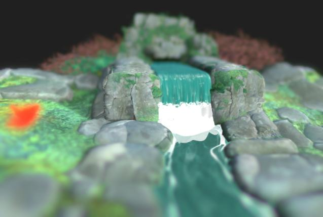

# Effetti post

{zoomable="yes"}

Nelle proprietà della videocamera, potete attivare gli effetti di postproduzione per migliorare i rendering o controllare proprietà specifiche del materiale.

Questi effetti sono sviluppati internamente e sono disponibili solo per il rasterizzatore e i [moduli di rendering](../../../../interface/3d-view/3d-renderers/3d-renderers.md) di Pathtracer GPU.

Qualsiasi effetto post attivato al momento del salvataggio di [risorse scena 3D](../../../../resources/3d-scene-resource/3d-scene-resource.md) o [file di stato scena](../../../../working-with-3d-scenes/working-with-3d-scenes.md) verrà salvato come parte dello stato della scena.

<table>
<tr style="border: 0;">
<td style="border: 0;" valign="top">

## Mappatura toni

</td>
<td style="border: 0;" valign="top">

### Bloom

</td>
<td style="border: 0;" valign="top">

### Profondità di campo

</td>
<td style="border: 0;" valign="top">

</td>
</tr>
</table>

## Mappatura toni

Modifica i colori del rendering in base ad algoritmi e/o tabelle di ricerca (LUT) specifici.

Ciò consente di migliorare la coerenza dei colori tra le applicazioni. Ad esempio, la mappatura toni AgX è disponibile anche in Blender.

+++Reinhard

<table>
  <tr>
    <td>
      
       <i>Prima</i>
    </td>
    <td>
      
       <i>Dopo</i>
    </td>
  </tr>
</table>

+++

+++Atan

<table>
  <tr>
    <td>
      
       <i>Prima</i>
    </td>
    <td>
      
       <i>Dopo</i>
    </td>
  </tr>
</table>

+++

+++Exp

<table>
  <tr>
    <td>
      
       <i>Prima</i>
    </td>
    <td>
      
       <i>Dopo</i>
    </td>
  </tr>
</table>

+++

+++Registro

<table>
  <tr>
    <td>
      
       <i>Prima</i>
    </td>
    <td>
      
       <i>Dopo</i>
    </td>
  </tr>
</table>

+++

+++Aces

<table>
  <tr>
    <td>
      
       <i>Prima</i>
    </td>
    <td>
      
       <i>Dopo</i>
    </td>
  </tr>
</table>

+++

+++Hejl

<table>
  <tr>
    <td>
      
       <i>Prima</i>
    </td>
    <td>
      
       <i>Dopo</i>
    </td>
  </tr>
</table>

+++

+++Neutro

<table>
  <tr>
    <td>
      
       <i>Prima</i>
    </td>
    <td>
      
       <i>Dopo</i>
    </td>
  </tr>
</table>

+++

+++Agx

<table>
  <tr>
    <td>
      
       <i>Prima</i>
    </td>
    <td>
      
       <i>Dopo</i>
    </td>
  </tr>
</table>

+++

+++Pbr neutro

<table>
  <tr>
    <td>
      
       <i>Prima</i>
    </td>
    <td>
      
       <i>Dopo</i>
    </td>
  </tr>
</table>

+++

## Bloom

Simula l’effetto in-camera di smarginature di luce che si diffondono verso l’esterno da aree molto luminose ad aree che ricevono meno luce.

L&#39;effetto è influenzato dall&#39;illuminazione della scena, dall&#39;esposizione della fotocamera e dai materiali di emissione.

+++Soglia
Valore di luminanza al di sopra del quale deve essere visibile la fioritura.

*A sinistra: 1.0 / A destra: 4.0*

<table>
  <tr>
    <td>
      
       <i>Prima</i>
    </td>
    <td>
      
       <i>Dopo</i>
    </td>
  </tr>
</table>

+++

+++Angolo totale
La rampa di attenuazione della fioritura, in cui un valore più basso determina un raggio di fioritura più breve.

*A sinistra: 1.0 / A destra: 0.6*

<table>
  <tr>
    <td>
      
       <i>Prima</i>
    </td>
    <td>
      
       <i>Dopo</i>
    </td>
  </tr>
</table>

+++

+++Livello
Intensità della fioritura. Un valore più elevato produce smarginature di luce più luminose e pronunciate.

*Sinistra: 8.0 / Destra: 2.0*

<table>
  <tr>
    <td>
      
       <i>Prima</i>
    </td>
    <td>
      
       <i>Dopo</i>
    </td>
  </tr>
</table>

+++

+++Spostamento colore
Sposta la tonalità delle aree interessate dalla fioritura verso i colori più caldi.

*A sinistra: 0,0 / A destra: 0,8*

<table>
  <tr>
    <td>
      
       <i>Prima</i>
    </td>
    <td>
      
       <i>Dopo</i>
    </td>
  </tr>
</table>

+++

## Profondità di campo

Simula il fenomeno ottico causato dall&#39;uso di ottiche in cui gli oggetti più vicini e più lontani rispetto alla distanza focale risultano sfocati.

L’effetto è influenzato dai parametri &quot;F-Stop&quot; e &quot;Distanza focale&quot; della fotocamera.

>[!TIP]
>
> Per regolare rapidamente la messa a fuoco della fotocamera, posizionate il cursore sulla posizione di una scena che desiderate mettere a fuoco e premete Ctrl+LMB (Windows) o Cmd+LMB (macOS) per impostare automaticamente la distanza di messa a fuoco su tale posizione.

+++Raggio massimo
Raggio massimo dell’effetto di sfocatura.

*A sinistra: 32.0 / A destra: 4.0*

<table>
  <tr>
    <td>
      
       <i>Prima</i>
    </td>
    <td>
      
       <i>Dopo</i>
    </td>
  </tr>
</table>

+++

+++Intensità composita
Entità dell’effetto di sfocatura dalla distanza focale verso l’esterno.

*A sinistra: 0,2 / A destra: 0,05*

<table>
  <tr>
    <td>
      
       <i>Prima</i>
    </td>
    <td>
      
       <i>Dopo</i>
    </td>
  </tr>
</table>

+++

+++Aberrazione longitudinale
Intensità dell’aberrazione che si verifica lontano dalla distanza focale.

Aberration simula come diverse lunghezze d&#39;onda della luce abbiano lunghezze focali leggermente diverse, facendo sì che i colori sembrino essere sfalsati e abbiano sottili differenze nella messa a fuoco.

*A sinistra: 0,0 / A destra: 1,0*

<table>
  <tr>
    <td>
      
       <i>Prima</i>
    </td>
    <td>
      
       <i>Dopo</i>
    </td>
  </tr>
</table>

+++

+++Aberrazione acromatica
Specifica se l’aberrazione deve essere acromatica, ovvero se alcuni o tutti i colori hanno la stessa lunghezza focale.

In questo modo, l’effetto di sfocatura appare distribuito in modo più uniforme.

*Sinistra: True / Destra: False*

<table>
  <tr>
    <td>
      
       <i>Prima</i>
    </td>
    <td>
      
       <i>Dopo</i>
    </td>
  </tr>
</table>

+++

+++Cat&#39;s eye
Consente di attivare l’effetto occhio gatto nella scena, che simula il modo in cui la luce che entra da un angolo obliquo non entra in un disco, ma in un ovale irregolare, causando distorsioni.

Questo effetto è più pronunciato con aperture più alte, cioè con valori di F-Stop più bassi.

*Sinistra: True / Destra: False*

<table>
  <tr>
    <td>
      
       <i>Prima</i>
    </td>
    <td>
      
       <i>Dopo</i>
    </td>
  </tr>
</table>

+++
