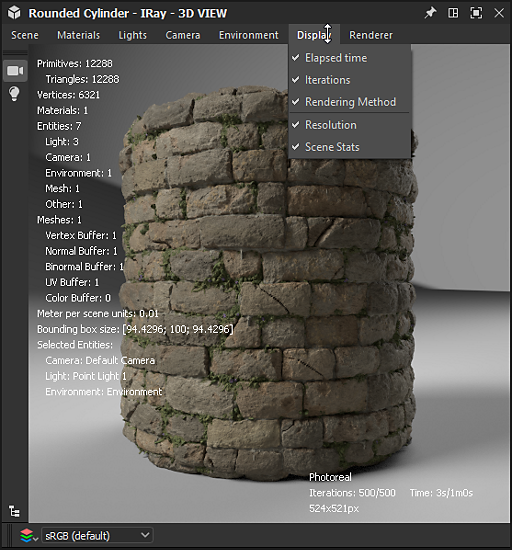
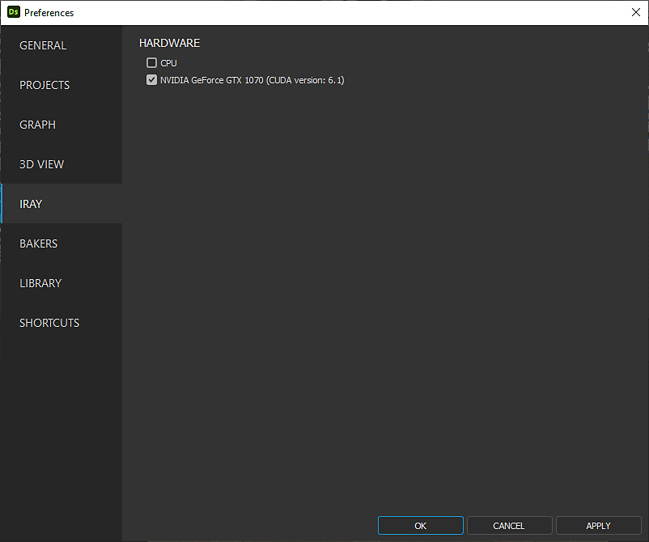

# Iray

Questa pagina presenta il modulo di rendering Iray disponibile nel pannello di visualizzazione 3D di [Substance 3D Designer](https://www.adobe.com/it/products/substance3d-designer.html), che offre la traccia dei percorsi interattiva per il rendering fotorealistico con accelerazione CPU e/o GPU (solo GPU Nvidia).

>[!WARNING]
> 
> Il modulo di rendering Iray e tutte le relative funzioni sono stati rimossi da Designer nella versione 16.0.0.
> 
> Ulteriori informazioni qui: [MDL graph e fine del ciclo di vita di Iray](../../../technical-issues/mdl-graph-iray-eol/mdl-graph-iray-eol.md)

<table>
<tr style="border: 0;">
<td style="border: 0;" valign="top">

## Panoramica

<b>Iray</b> è una tecnologia di rendering altamente *interattiva* e intuitiva basata fisicamente che genera *immagini fotorealistiche* simulando il comportamento fisico della luce e dei materiali. Ulteriori informazioni sulla pagina Web [Nvidia Iray](https://www.nvidia.com/en-us/design-visualization/iray/).

</td>
<td style="border: 0;" valign="top">

</td>
</tr>

<tr style="border: 0;">
<td style="border: 0;" valign="top">

Poiché la vista 3D utilizza il *modulo di rendering progressivo* di Iray, un’immagine viene prodotta non appena viene eseguito almeno un campione su ciascun pixel. L&#39;immagine viene *aggiornata automaticamente* durante l&#39;esecuzione delle iterazioni di campionamento, con un risultato iniziale di immagine di prova che diventa *più pulita per ogni iterazione*.

Il modulo di rendering è disponibile nel pannello [Vista 3D](../../../interface/3d-view/3d-view.md): aprite il menu <b>Modulo di rendering</b> e selezionate l’opzione <b>Iray</b> per cambiare il modulo di rendering utilizzato nel pannello di visualizzazione 3D in Iray.\
Passare al modulo di rendering Iray *modifica le opzioni disponibili* in alcuni menu della vista 3D. Queste modifiche sono spiegate nella sezione <b>Vista 3D</b> seguente.

Per impostazione predefinita, il rendering progressivo viene avviato non appena è selezionato il modulo di rendering di raggi. Il processo di rendering verrà eseguito fino a quando non verrà soddisfatta *una* delle seguenti condizioni:

* *numero massimo di campioni* eseguiti
* È stato raggiunto il *limite di tempo di rendering*

Per ulteriori informazioni sull&#39;ottimizzazione di queste condizioni, consultate la sezione <b>Modulo di rendering</b> di questa pagina.

</td>
<td style="border: 0;" valign="top">

*Materiale: [Muro medievale del castello](https://oggyart.artstation.com/projects/Xnzx0a)* *di [Mark Foreman](https://www.artstation.com/oggyart)* *disponibile nelle [risorse Substance 3D](https://substance3d.adobe.com/assets)* *libreria*

</td>
</tr>
</table>

>[!WARNING]
>
> È possibile eseguire solo *una* istanza di rendering Iray in qualsiasi momento.\
> Ciò significa che quando un pannello di visualizzazione 3D utilizza questo modulo di rendering, il menu **Modulo di rendering** è *disabilitato* in altri pannelli di visualizzazione 3D e questi sono impostati per impostazione predefinita sul modulo di rendering **OpenGL**.

## Opzioni della vista 3D

### Scena

Selezionate l&#39;opzione <b>Modifica</b> nel menu <b>Scena</b> per trovare le proprietà della scena specifiche per Iray nel pannello <b>Proprietà</b>.

* <b>Abilitato:</b> se impostato su *False*, l&#39;oggetto viene nascosto e *non contribuisce più* alla scena

Visualizza componente

* <b>È visibile</b>: se impostato su *Falso*, l&#39;oggetto è nascosto ma *contribuisce ancora* alla scena, ad esempio riflettendo la luce, assorbendo la luce e proiettando le ombre

Componente di visualizzazione della trama

* Suddivisione
  * <b>Metodo</b>: il metodo utilizzato per suddividere proceduralmente la trama in una geometria più fine
    * *Nessuno*: nessuna suddivisione applicata
    * *Parametrico*: suddivide la trama in `4^x` triangoli dove `x` è il valore specificato da questo parametro
    * *Lunghezza*: suddivide la trama finché tutti i bordi non hanno una lunghezza (nello spazio dell&#39;oggetto) inferiore al valore specificato dal parametro Lunghezza minima
  * <b>Lunghezza minima</b>: suddivide la trama finché tutti i bordi non hanno una lunghezza inferiore a questo valore specificato nello spazio dell&#39;oggetto (si applica solo al metodo *Lunghezza*)
  * <b>Numero</b>: numero di iterazioni di suddivisione da applicare alla trama (si applica solo al metodo *parametrico*)

>[!WARNING]
>
> Suddividendo la trama *si aumenta in modo esponenziale il tempo di elaborazione* prima e durante il rendering. Ti consigliamo di essere *conservatore* con i valori immessi.\
> Fare attenzione a utilizzare valori *alti* **numeri** per il metodo Parametric e valori *bassi* **lunghezza minima** per il metodo Length.

### Materiali

Poiché Iray si basa sul [modello di ombreggiatura MDL](https://www.nvidia.com/en-us/design-visualization/technologies/material-definition-language/) sviluppato da NVIDIA, i materiali disponibili per i materiali delle scene vengono sostituiti con la libreria MDL caricata da Designer. Questa libreria viene creata utilizzando le seguenti origini:

* I file MDL inclusi nell&#39;installazione di Designer
* I file MDL trovati nelle [directory elencate dall&#39;utente](../../../interface/preferences-window/project-settings/project-settings.md) nei [file di progetto](../../../pipeline-and-project-con/project-configuration-fil/project-configuration-files-sbsprj.md) caricati
* Libreria [NVIDIA vMaterials](https://developer.nvidia.com/vmaterials), se installata

>[!NOTE]
>
> Per un&#39;analisi più approfondita del modello di ombreggiatura MDL, vedere [Manuale MDL](http://mdlhandbook.com/), scritto e gestito da NVIDIA.

<table>
<tr style="border: 0;">
<td style="border: 0;" valign="top">

L&#39;elenco cumulativo dei materiali MDL caricati è disponibile nel menu <b>Materiali</b>, in uno dei sottomenu dei materiali elencati, come mostrato nell&#39;immagine a destra.

Inoltre, se un [grafico MDL](../../../mdl-graphs/creating-an-mdl-graph/creating-an-mdl-graph.md) è caricato in Designer, può essere applicato a qualsiasi materiale nella scena. A questo punto, viene aggiunto all&#39;elenco dei materiali MDL disponibili.

Altre opzioni importanti in questo menu sono:

* Selezionate l&#39;opzione <b>Modifica</b> per accedere ai *input esposti* di MDL nel pannello <b>Proprietà</b> e ritoccare il materiale in base alle esigenze
* L&#39;opzione <b>Carica...</b> consente di *caricare manualmente qualsiasi file MDL* da aggiungere all&#39;elenco cumulativo e applicare nella scena
* L&#39;opzione <b>Esporta predefinito...</b> apre la finestra di dialogo <b>Esporta predefinito materiale MDL</b>, che consente di esportare un file MDL predefinito utilizzando le impostazioni correnti applicate nella vista 3D

</td>
<td style="border: 0;" valign="top">

</td>
</tr>
</table>

>[!NOTE]
>
> Quando si carica un **grafico MDL**, il modulo di rendering per la visualizzazione 3D viene *automaticamente impostato su **Iray*** per caricarlo e applicarlo.

### Videocamera

La differenza principale tra OpenGL e Iray in merito alle impostazioni della fotocamera è il modo in cui viene gestita la *profondità di campo*. In effetti, essendo Iray un modulo di rendering fisicamente preciso, la profondità del campo si presenta &quot;naturalmente&quot; a seconda dell’*apertura* della fotocamera.

Nelle proprietà della videocamera, quando è selezionato il modulo di rendering dell’immagine, sono disponibili i seguenti due parametri:

* <b>Distanza focale</b>: la distanza dalla fotocamera del punto focale, ovvero il punto in cui l&#39;immagine è più nitida
* <b>Diametro apertura</b>: valore che determina l&#39;apertura della fotocamera. Più basso è il valore, più nitidi saranno gli elementi dell’immagine prima e dopo il punto focale: in termini più semplici, questo valore controlla l’intensità dell’effetto profondità di campo.

### Ambiente

Apri il menu <b>Ambiente</b> e seleziona l&#39;opzione <b>Modifica</b> per visualizzare le proprietà dell&#39;ambiente nel pannello <b>Proprietà</b>.

Sono disponibili le seguenti proprietà:

Cupola

* <b>Tipo cupola</b>: imposta gli oggetti che racchiudono la scena su cui viene proiettata la texture dell’ambiente
  * *Sfera infinita*: ambiente sferico infinito
  * *Terra*: ambiente sferico infinito, ma con un piano terreno strutturato
  * *Sfera*: cupola a forma di sfera di dimensioni finite con raggio personalizzato
  * *Sfera con terreno*: cupola a forma di sfera di dimensioni finite con raggio personalizzato in cui la parte inferiore dell&#39;ambiente è proiettata sul piano che divide le parti superiore e inferiore della sfera
  * *Scatola con terreno*: dome a forma di scatola di dimensioni finite di larghezza, height e lunghezza personalizzati in cui la parte inferiore dell&#39;ambiente è proiettata sul piano che divide le parti superiore e inferiore della scatola
* <b>Angolo di rotazione</b>: controlla l&#39;angolo di rotazione della cupola attorno all&#39;*asse Y*
* <b>Raggio</b>: il raggio della sfera (si applica solo alla *sfera* e alla *sfera con tipi di cupola a terra*)
* <b>Larghezza</b>: la larghezza della scatola (si applica solo alla *scatola con cupola a terra*)
* <b>Height</b>: il height della scatola (si applica solo alla *scatola con cupola a terra*)
* <b>Lunghezza</b>: la lunghezza della scatola (si applica solo alla *scatola con cupola a terra*)
* <b>Visualizza</b>: abilita una sovrapposizione di falsi colori della geometria dell&#39;ambiente di dimensioni finite. Questa opzione può essere utilizzata per allineare la geometria con la proiezione della mappa dell&#39;ambiente acquisita (si applica solo alla *sfera*, alla *sfera con terreno* e alla *scatola con terreno* tipi di cupola)

>[!NOTE]
>
> Per le cupole di dimensioni finite, tutta la geometria della scena deve essere *racchiusa entro* la cupola.

Terreno cupola\
I seguenti parametri si applicano ai tipi di cupola *Ground*, *Sphere with ground* e *Box with ground*:

* **Terra**: abilita il piano terreno
* **Posizione**: la posizione dell&#39;origine della cupola finita (si applica anche al tipo di cupola *Sfera*)
* **Riflettività**: opacità e tinta del riflesso di terra, dove il nero indica che il riflesso non è visibile
* **Lucentezza**: la lucentezza della riflessione del terreno
* **Intensità ombra**: opacità della dominante di ombra sul terreno
* **Scala texture**: controlla le dimensioni della proiezione della texture dell&#39;ambiente sul terreno (si applica anche al tipo di cupola *Sfera*)

Di seguito è illustrato l’impatto di alcune di queste impostazioni:

+++Ambiente di visualizzazione

<table>
  <tr>
    <td>
      
       <i>Prima</i>
    </td>
    <td>
      
       <i>Dopo</i>
    </td>
  </tr>
</table>

+++

+++Abilita piano terreno

<table>
  <tr>
    <td>
      
       <i>Prima</i>
    </td>
    <td>
      
       <i>Dopo</i>
    </td>
  </tr>
</table>

+++

+++Ruota l&#39;ambiente

+++

+++Regola piano terreno

+++

+++Regola sfera infinita
")

+++

+++Regola casella di selezione
")

+++

### Visualizza

Queste opzioni visualizzano una *sovrapposizione di testo* sopra l’immagine sottoposta a rendering con informazioni utili sul rendering.

* <b>Tempo trascorso</b>: la durata del rendering in secondi. Questo timer e il processo di rendering si arrestano entrambi quando viene soddisfatta una delle condizioni finali
* <b>Iterazioni</b>: numero di iterazioni di campionamento eseguite. Questo contatore e il processo di rendering si arrestano entrambi quando viene soddisfatta una delle condizioni finali
* <b>Metodo di rendering</b>: il percorso di rendering utilizzato. Per la maggior parte degli scopi su una macchina locale, viene utilizzato Photoreal
* <b>Risoluzione</b>: risoluzione effettiva del rendering. Se l’opzione Usa risoluzione finestra nelle proprietà della fotocamera è impostata su False, il rapporto dell’immagine viene regolato automaticamente in modo che corrisponda al rapporto di risoluzione.
* <b>Statistiche scena</b>: elenco di statistiche relative alla scena sottoposta a rendering, che include il conteggio dei triangoli e dei materiali tra gli altri dati.

{width="512px"}

### Modulo di rendering

Apri il menu <b>Modulo di rendering</b> e seleziona l’opzione <b>Modifica</b> per visualizzare le proprietà del modulo di rendering nel pannello <b>Proprietà</b>.

Rendering progressivo

* <b>Numero minimo di campioni</b>: numero minimo di campioni per pixel da calcolare prima di considerare i criteri per interrompere il rendering progressivo
* <b>Numero massimo di campioni</b>: se è stato eseguito il rendering di questo numero di campioni per pixel, interrompi automaticamente il rendering progressivo
* <b>Tempo massimo (secondi)</b>: tempo in secondi dopo il quale il rendering progressivo deve terminare automaticamente
* <b>Campionatore caustico abilitato</b>: aumenta il campionatore predefinito con un campionatore caustico dedicato. Le aree caustiche sono il risultato del passaggio della luce attraverso un oggetto non opaco, pertanto sono necessarie solo se viene applicato un materiale [MDL](../../../mdl-graphs/creating-an-mdl-graph/creating-an-mdl-graph.md) che supporta la trasparenza a qualsiasi oggetto nella scena
* <b>Filtro Firefly abilitato</b>: abilita il filtro lucciola, che utilizza un algoritmo predefinito per rimuovere le lucciole nell&#39;immagine calcolata durante l&#39;avanzamento del rendering. I Firefly sono artefatti visivi in cui *pixel isolati* in un&#39;immagine sono *notevolmente più luminosi* rispetto ai vicini e sono il risultato di campioni di raggi insufficienti per determinare con precisione la distribuzione della luce
* Denoiser di post\
  Il modulo di rendering Iray utilizza l’algoritmo [denoiser](https://developer.nvidia.com/optix-denoiser) con accelerazione NVIDIA Optix AI per la denoizzazione iterativa di alta qualità dell’immagine durante il rendering.

  * <b>Abilitato</b>: consente l&#39;attivazione di un *algoritmo di denoising* predefinito in corrispondenza di un&#39;iterazione di rendering impostata e l&#39;attivazione fino alla *fine* del rendering
  * <b>Avvia iterazione</b>: se il denoiser è abilitato, questa opzione imposta l&#39;iterazione in corrispondenza della quale inizia il processo di denoising. Questo può impedire che l&#39;overhead delle prestazioni del denoiser influisca sull&#39;interattività, ad esempio, quando si sposta la videocamera. Inoltre, le prime iterazioni spesso non sono adatte come input per il denoiser a causa della convergenza insufficiente, che porta a risultati insoddisfacenti.

L’impatto di alcune di queste impostazioni è dimostrato dai confronti tra le immagini qui di seguito:

+++Campionatore caustico

<table>
  <tr>
    <td>
      
       <i>Prima</i>
    </td>
    <td>
      
       <i>Dopo</i>
    </td>
  </tr>
</table>

+++

+++Filtro Firefly

<table>
  <tr>
    <td>
      
       <i>Prima</i>
    </td>
    <td>
      
       <i>Dopo</i>
    </td>
  </tr>
</table>

+++

+++Post-denoiser

<table>
  <tr>
    <td>
      
       <i>Prima</i>
    </td>
    <td>
      
       <i>Dopo</i>
    </td>
  </tr>
</table>

+++

*Materiale: vetro spesso MDL* *disponibile nelle definizioni di base MDL* *di NVIDIA*

## Accelerazione hardware

Il modulo di rendering Iray offre l’accelerazione hardware esclusivamente su GPU NVIDIA, con i seguenti vantaggi:

* Aumento significativo della velocità di rendering
* [Denoising accelerato dall&#39;IA Optix](https://developer.nvidia.com/optix-denoiser) (vedere &quot;Post-denoiser&quot; nella sezione <b>Modulo di rendering</b> di questa pagina)

È possibile selezionare l&#39;hardware che deve essere utilizzato da Iray per il rendering nella sezione <b>vista 3D</b> della finestra [Preferenze](../../../interface/preferences-window/preferences-window.md), come mostrato nell&#39;immagine a destra.

Quando viene rilevata una GPU supportata, questa viene elencata in questa sezione ed è *selezionata automaticamente* per impostazione predefinita e la CPU non è selezionata. Qualsiasi modifica manuale sostituisce questo comportamento automatico in modo che le modifiche personalizzate vengano salvate per le sessioni future.

>[!NOTE]
>
> Se viene rilevata ed elencata una GPU supportata, si consiglia vivamente di *lasciare la CPU non selezionata* poiché l&#39;utilizzo della CPU per il rendering di raggi X ha un *impatto significativo* sulle prestazioni complessive e sulla reattività dell&#39;applicazione.

>[!WARNING]
>
> L’accelerazione hardware GPU utilizza la tecnologia [NVIDIA CUDA](https://developer.nvidia.com/cuda-zone). Assicuratevi che il driver di grafica *sia aggiornato* per la migliore compatibilità e affidabilità. Trova il driver più recente per la tua GPU NVIDIA [qui](https://www.nvidia.com/Download/index.aspx?lang=en-us).\
> Per le configurazioni con più GPU, si consiglia di *disattivare SLI* e selezionare una sola GPU per una migliore affidabilità.

