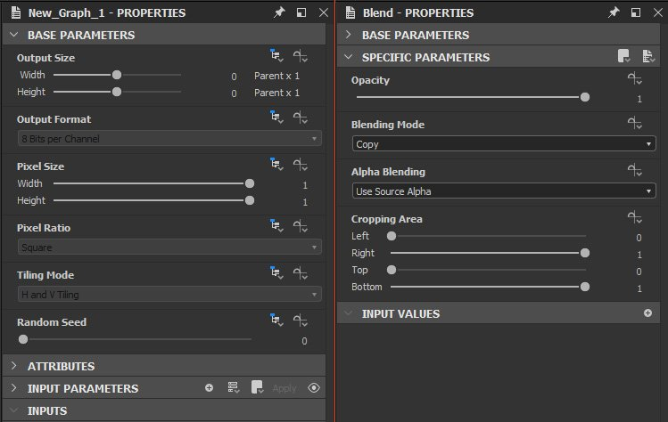

# Spazio di lavoro

L&#39;area di lavoro è suddivisa in aree separate denominate <b>ancoraggi</b>, che possono essere [ridimensionate, spostate e disancorate](../interface/customizing-your-wor/customizing-your-workspace.md) della finestra principale di Designer in un ancoraggio mobile.

Ecco il layout di ancoraggio predefinito di Designer:

<table>
<tr style="border: 0;">
<td style="border: 0;" valign="top">

Menu principale e barra degli strumenti di <b>1</b>

Esplora risorse <b>2</b>

Visualizzazione grafico <b>3</b>

</td>
<td style="border: 0;" valign="top">

Proprietà <b>4</b>

<b>5</b> vista 2D

</td>
<td style="border: 0;" valign="top">

<b>6</b> vista 3D

Libreria <b>7</b>

</td>
</tr>
</table>

>[!NOTE]
>
> Ridimensionamento interfaccia
> 
> Designer acquisisce la scala specifica degli elementi dell&#39;interfaccia utente *dal sistema operativo*. Pertanto, qualsiasi regolazione del ridimensionamento dell&#39;interfaccia utente deve essere effettuata nelle impostazioni di visualizzazione del sistema operativo.
> 
> Per garantire che le impostazioni di visualizzazione vengano applicate correttamente in Designer, *esci* dalla sessione utente del sistema operativo ed effettua nuovamente l&#39;accesso dopo aver modificato queste impostazioni.

<table>
<tr style="border: 0;">
<td style="border: 0;" valign="top">

## Menu principale e barra degli strumenti

La barra degli strumenti principale consente di accedere a menu aggiuntivi, come la [finestra Preferenze](../interface/preferences-window/preferences-window.md), e dispone di alcuni pulsanti per creare rapidamente un nuovo grafico e pacchetto Substance.

</td>
<td style="border: 0;" valign="top">

</td>
</tr>
</table>

* <b>File: </b>Consente di creare nuovi pacchetti e risorse, nonché di salvare e chiudere i pacchetti su cui si sta attualmente lavorando. Le funzioni di questo menu sono disponibili anche come pulsanti rapidi su questa barra degli strumenti.
* <b>Modifica: </b>fornisce le funzioni Annulla e Ripeti (disponibili come pulsanti rapidi di seguito), nonché l&#39;accesso alle [Preferenze](../interface/preferences-window/preferences-window.md) per la personalizzazione nella profondità.
* <b>Strumenti:</b> controlla la Substance Engine e consente di accedere a Gestione plug-in.
* <b>Windows:</b> consente di nascondere o visualizzare le finestre (alcune sono nascoste per impostazione predefinita) e di ripristinare il layout predefinito.
* <b>Guida: </b>Fornisce l&#39;accesso a informazioni aggiuntive e risorse online, ad esempio Accademia Substance o questo sito Web della documentazione.

## Explorer

[La finestra Esplora risorse](the-explorer-window/the-explorer-window.md) è il modo principale di interagire con qualsiasi tipo di file e risorsa. Offre più opzioni rispetto al menu File nella barra degli strumenti principale.

## Vista Grafico

[L&#39;ancoraggio della vista Grafico](../interface/the-graph-view/the-graph-view.md) è la finestra più importante di Substance 3D Designer. Visualizza le reti nodali di qualsiasi tipo di grafico disponibile in Designer ([Grafici a Substance](../compositing-graphs/substance-compositing-graphs.md), [Grafici a funzione Substance](../function-graphs/function-graphs.md), [Grafici FX-Map](../function-graphs/fxmaps/fxmaps.md)) e consente di crearli e modificarli.

## Proprietà

[Ancoraggio proprietà](properties/properties.md) è la finestra più tecnica. È sempre sensibile al contesto e presenterà cursori, menu a discesa e altri elementi che modificano il comportamento di una risorsa o di un nodo selezionato.

## Vista 2D

[Il vista 2D](../interface/2d-view/2d-view.md) è lo strumento di anteprima più semplice. Funziona a stretto contatto con il grafico: facendo doppio clic su qualsiasi nodo nella vista Grafico, il risultato visivo verrà visualizzato nel vista 2D.

## Vista 3D

[Il vista 3D](../interface/3d-view/3d-view.md) è la finestra di anteprima più interattiva e avanzata. A differenza del vista 2D, utilizza una serie di mappe di output diverse per eseguire il rendering di un materiale completo. Ciò significa che sono rappresentati tutti i canali, ad esempio Colore di base, Normale e Rugosità.

## Libreria

[Il dock della libreria](../interface/the-library/the-library.md) consente di accedere a tutti i contenuti inclusi nella libreria di Designer per impostazione predefinita, nonché ai [contenuti personalizzati](../interface/the-library/managing-custom-content/managing-custom-content-and-filters.md).

