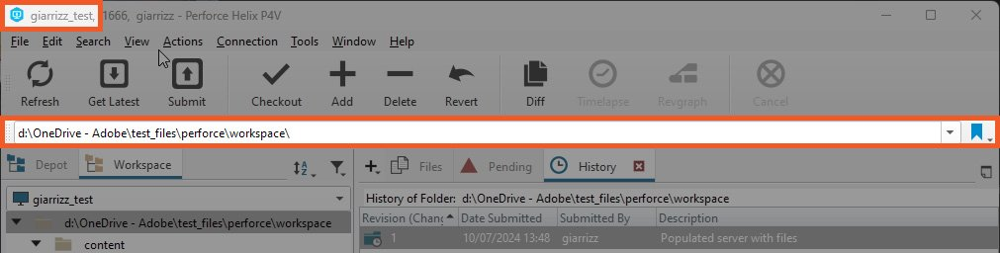
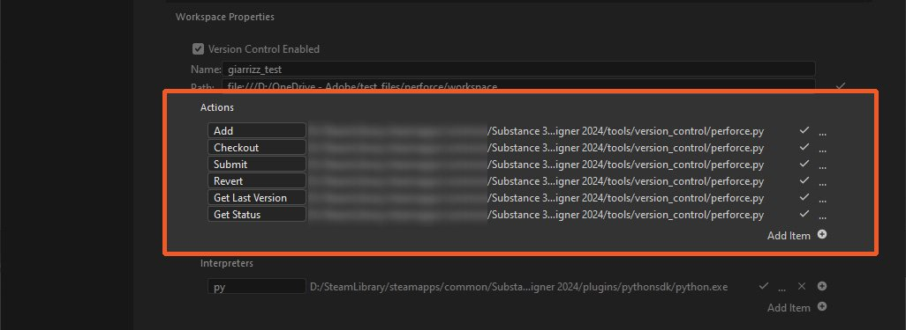
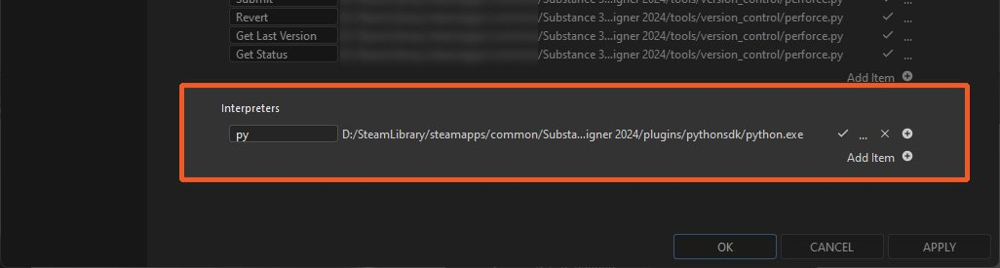
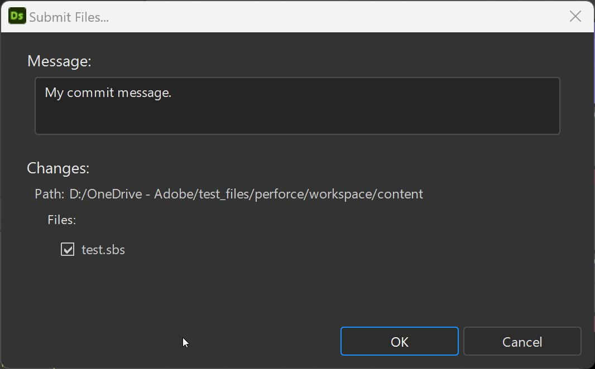

# Controllo versione

>[!IMPORTANT]
>
> La versione di Substance 3D Designer <b>14.0.0</b> aggiorna il supporto Perforce a <b>Python 3</b>.
> 
> Assicurati che gli altri script e l’ambiente di controllo delle versioni siano regolati di conseguenza.

Designer offre un&#39;integrazione Python del sistema di controllo delle versioni [Perforce](https://www.perforce.com/) (P4).

L&#39;integrazione aggiunge un sottomenu &#39;Controllo versione&#39; personalizzato al menu contestuale dei pacchetti in [Esplora risorse](../../../interface/the-explorer-window/the-explorer-window.md), nonché icone personalizzate che corrispondono allo stato di un pacchetto in P4.

## Preparazione P4

In [P4V](https://www.perforce.com/products/helix-core-apps/helix-visual-client-p4v) prendere nota del nome e del percorso dell&#39;area di lavoro, come illustrato di seguito:

{zoomable="yes"}

In qualsiasi editor di testo o IDE, apri questo script disponibile nell&#39;installazione di Designer: &#39;*tools/version\_control/perforce.py*&#39;.

Alla riga 19, modificare il percorso del file eseguibile <b>&#39;p4&#39;</b> nel sistema.\
Nell&#39;esempio seguente, questo percorso è &#39;*c:/Program Files/Perforce/p4.exe*&#39;.

```
## Editable variables

cPerforceP4AbsPath = os.path.abspath("c:/Program Files/Perforce/p4.exe")

cVerbose = False
```


## Configurazione in Designer

Il controllo versione è configurato nelle [impostazioni del progetto](../../../interface/preferences-window/project-settings/project-settings.md), disponibili nelle [preferenze](../../../interface/preferences-window/preferences-window.md) di Designer.

Scheda {zoomable="yes"}

1. Vai a &quot;Modifica > Preferenze&quot;
1. Vai a &quot;Progetti&quot;, seleziona il [file di progetto](../../../pipeline-and-project-con/project-configuration-fil/project-configuration-files-sbsprj.md) di destinazione e vai alla scheda &quot;Controllo versione&quot;
1. Selezionare &#39;Controllo versione abilitato&#39;
1. Compila queste informazioni nella sezione &quot;Area di lavoro&quot;:

   * <b>Nome:</b> Immettere il &#39;Nome area di lavoro&#39; recuperato in precedenza da P4V
   * <b>Percorso:</b> immettere il &#39;Percorso area di lavoro&#39; recuperato in precedenza da P4V

Installazione di {zoomable="yes"}

### Impostazione delle azioni

Le azioni saranno disponibili nel menu di scelta rapida di un pacchetto in Esplora risorse. Sono disponibili azioni predefinite che corrispondono alla maggior parte dei concetti dello strumento Controllo versione:

* Tutte le etichette delle azioni possono essere modificate in base alle esigenze.
* Per essere valide, tutte le azioni richiedono uno script.

Può usare:

* uno script *per* azione
* uno script per *tutte* le azioni

Uno script iniziale per tutte le azioni è disponibile nell&#39;installazione di Designer: &#39;*tools/version\_control/perforce.py*&#39;.

>[!IMPORTANT]
>
> Per essere disponibile, il pacchetto deve essere salvato nel &#39;Percorso area di lavoro&#39; (ad esempio, in &#39;*f:/Dev/perforce*&#39;)

1. Nel gruppo <b>Azioni</b>, fare clic sul pulsante &#39;...&#39; dell&#39;azione <b>Aggiungi</b>
1. Selezionare lo script seguente nell&#39;installazione di Designer: &#39;*tools/version\_control/perforce.py*&#39;
1. Lo script deve essere impostato automaticamente per tutte le altre azioni.

Installazione di {zoomable="yes"}

### Impostazione delle azioni personalizzate

Poiché tutti gli strumenti per il controllo delle versioni sono diversi e includono numerose funzionalità, è possibile aggiungere azioni personalizzate.

1. Fai clic su &quot;Aggiungi elemento&quot;.
1. Compila l’etichetta della nuova azione e impostane il percorso di script.

### Impostazione dell&#39;interprete script

1. Nella sezione Interpreti fare clic su Aggiungi elemento
1. Impostare l&#39;estensione o il suffisso di un file script e il percorso dell&#39;eseguibile interprete
1. Modifica lo script perforce.py per aggiornare la posizione del file binario &#39;p4&#39;

Installazione di {zoomable="yes"}

## Come utilizzare il controllo delle versioni

1. Crea un nuovo pacchetto
1. Salva il pacchetto nella directory &quot;Percorso area di lavoro&quot;.
1. Fai clic su RMB sul pacchetto: ora hai accesso al sottomenu &quot;Controllo versione&quot;
1. Sono disponibili diverse azioni, a seconda dello stato del file di pacchetto nell’area di lavoro:

   * <b>Aggiungi:</b> Contrassegna i file come &#39;ToAdd&#39;
   * <b>Invia:</b> Invia i pacchetti selezionati. Questa azione visualizza una finestra di dialogo che consente di specificare un messaggio di modifica (vedere di seguito)
   * <b>Ripristina:</b> Ripristina le modifiche. Questa azione visualizza una finestra di dialogo per la selezione dei file da ripristinare (vedi di seguito)
   * <b>Estrazione:</b> Estrarre il file dal deposito
   * <b>Ottieni ultima versione:</b> Recupera la versione più recente dal deposito
   * <b>Stato aggiornamento:</b> Aggiornare lo stato del file del pacchetto

   <table>
   <tr style="border: 0;">
   <td style="border: 0;" valign="top">

   Finestra di dialogo &quot;Invia&quot; di {zoomable="yes"}

   </td>
   <td style="border: 0;" valign="top">

   Finestra di dialogo {zoomable="yes"}

   </td>
   </tr>
   </table>

>[!NOTE]
>
> Tutte le azioni supportano la selezione multipla
> 
> Per P4 e altri strumenti di controllo delle versioni che utilizzano autorizzazioni di sola lettura per limitare le modifiche, l&#39;utente dovrà prima estrarre il pacchetto prima di modificarlo.
> 
> I file dei pacchetti di sola lettura non possono essere modificati in SD.

Il pacchetto avrà le seguenti icone, a seconda del suo stato:

<table>
<tr style="border: 0;">
<td style="border: 0;" valign="top">


Aggiornato

</td>
<td style="border: 0;" valign="top">


Estratto

</td>
<td style="border: 0;" valign="top">


Contrassegnato per l&#39;aggiunta

</td>
<td style="border: 0;" valign="top">


Non in deposito

</td>
</tr>
</table>

Si noti che un pacchetto non aggiornato è contrassegnato con un segno di avvertenza.

## Script di azioni

Il comando eseguito da ciascuna azione viene creato correttamente:

my\_script <b>*WorkspaceName WorkspacePath NomeAzione[ActionArgs]*</b>

<b>Nome area di lavoro:</b> il nome dell&#39;area di lavoro

<b>PercorsoArea di lavoro:</b> il percorso della directory principale dell&#39;area di lavoro

<b>ActionName:</b> il nome dell&#39;azione:

* *aggiungi:* per l&#39;azione &quot;Aggiungi&quot;
* *estrazione:* per l&#39;azione &quot;Estrazione&quot;
* *invia:* per l&#39;azione &quot;Invia&quot;
* *ripristina:* per l&#39;azione &quot;Ripristina&quot;
* *get\_last\_version:* per l&#39;azione &quot;Scarica ultima versione&quot;
* *get\_status:* per l&#39;azione &quot;Ottieni stato&quot;

L&#39;etichetta è impostata nelle impostazioni del progetto, con il carattere &#39; &#39; sostituito da &#39;\_&#39;, ad esempio: &quot;Azione personale&quot; => &quot;Azione personale&quot;.

<b>Argomenti ActionArgs:</b> argomenti dell&#39;azione:

* *-desc*: stringa di descrizione utilizzata dall&#39;azione &#39;Invia&#39;
* *-file:* Un elenco di file
* *-files\_list:* Un file di testo contenente un elenco di file per riga

<b>get\_status</b>: restituisce un valore a seconda dello stato del file specificato:

* 0: stato non definito
* 1: non nel deposito
* 2: versione precedente (non aggiornata)
* 3: versione più recente (aggiornata)
* 4: estratto
* 5: contrassegnato per l&#39;aggiunta
* altre azioni:
  * 0: operazione riuscita
  * altro: error
