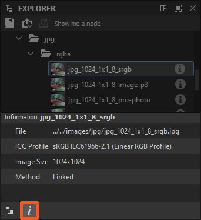

# Explorer

Questa pagina descrive il dock di Esplora risorse in [Substance 3D Designer](https://www.adobe.com/it/products/substance3d-designer.html). Questo dock consente di gestire i pacchetti e le relative risorse.

<table>
<tr style="border: 0;">
<td style="border: 0;" valign="top">

## Panoramica

I file e le risorse attualmente aperti in Substance 3D Designer vengono gestiti dal dock di Esplora risorse. Viene visualizzato un elenco di tutti i pacchetti attualmente aperti, con ogni pacchetto espanso come gerarchia per mostrare [risorse](../../resources/resources.md)al suo interno.

In Esplora risorse puoi avviare e terminare i progetti, poiché consente di creare, salvare ed esportare qualsiasi tipo di risorsa.

</td>
<td style="border: 0;" valign="top">

</td>
</tr>
</table>

Puoi eseguire alcune azioni importanti tramite il dock di Esplora risorse:

* Creare nuovi pacchetti e grafici
* Caricare i pacchetti esistenti
* Salvare e chiudere i pacchetti caricati
* [Importare e collegare le risorse](../../resources/importing-linking-and-new/importing-linking-and-new-resources.md)
* [Esportare i risultati del grafico nelle texture](../../compositing-graphs/exporting-bitmaps/exporting-bitmaps.md)
* [Publish di un pacchetto a una risorsa Substance 3D (SBSAR)](../../compositing-graphs/publishing-asset-files/publishing-substance-3d-asset-files-sbsar.md)
* [Inviare pacchetti ad altre applicazioni Substance 3D](send-to-interoperability/send-to-interoperability.md)
* [Bake map da una trama](../../bakers/bakers.md)

## Barra degli strumenti superiore

Questa barra degli strumenti consente di eseguire rapidamente le funzioni relative al flusso di lavoro generale. Tutti i pulsanti sono *sensibili al contesto*, il che significa che si attivano e cambiano il comportamento in base alla selezione corrente in Esplora risorse.

 <b>Salva</b> pacchetto selezionato.

 <b>Publish o [invia](../../interface/the-explorer-window/send-to-interoperability/send-to-interoperability.md)</b> elementi selezionati:

* [Publish di qualsiasi pacchetto selezionato in una risorsa Substance 3D (SBSAR)](../../compositing-graphs/publishing-asset-files/publishing-substance-3d-asset-files-sbsar.md);
* Invia il pacchetto selezionato a [Substance 3D Sampler](https://www.adobe.com/it/products/substance3d-sampler.html), [Substance 3D Painter](https://www.adobe.com/it/products/substance3d-painter.html) o [Substance 3D Stager](https://www.adobe.com/it/products/substance3d-stager.html).

 <b>Publish o invia come precedente:</b> Publish o invia gli elementi selezionati con le stesse impostazioni di prima. Questa opzione è disponibile solo in un pacchetto che è già stato pubblicato *almeno una volta* nella sessione *corrente*.

 <b>Rimuovere i nodi inutilizzati</b> nei grafici selezionati. Lo strumento segue queste regole:

* Lo strumento è disponibile solo se gli elementi selezionati sono dello *stesso tipo*: solo grafici, cartelle o pacchetti;
* Quando la selezione include cartelle o pacchetti, lo strumento pulisce tutti i grafici in esse *in modo ricorsivo*;
* Se uno dei grafici di destinazione è un [grafico a Substance](../../compositing-graphs/substance-compositing-graphs.md), è disponibile una seconda opzione che consente di pulire tutte le funzioni dei parametri sui nodi di tale grafico.

Ulteriori informazioni sullo strumento sono disponibili nella sezione &#39;Rimuovi nodi inutilizzati&#39; della pagina [Visualizzazione grafico](../../interface/the-graph-view/the-graph-view.md).

<table>
<tr style="border: 0;">
<td style="border: 0;" valign="top">

*Publish/Invia*

</td>
<td style="border: 0;" valign="top">

*Rimuovi nodi inutilizzati*

</td>
</tr>
</table>

## Menu contestuali

La maggior parte delle interazioni con Esplora risorse avviene tramite menu contestuali, visualizzati facendo clic su RMB su un elemento nella struttura dell&#39;Esplora risorse.

Le opzioni disponibili variano a seconda degli elementi selezionati e su cui si fa clic:

+++Spazio vuoto

Lo spazio vuoto è disponibile solo al di sotto di qualsiasi pacchetto attualmente aperto. Il clic accanto agli elementi esistenti non è considerato spazio vuoto.

<b>Nuovo pacchetto</b>: crea un nuovo pacchetto vuoto;

<b>Apri pacchetto</b>: apre una finestra di dialogo per aprire un file SBS.

+++

+++Pacchetto

<b>Le nuove </b>consentono di creare nuovi grafici ([Substance grafico](../../compositing-graphs/substance-compositing-graphs.md), [bitmap](../../resources/bitmap-resource/bitmap-resource.md) e [grafica vettoriale](../../resources/vector-graphics-svg-res/vector-graphics-svg-resource.md) risorse, nonché *cartelle* per l&#39;ordinamento del contenuto

<b>Importa</b> e <b>Collega </b>ti consentono di inserire [risorse](../../resources/importing-linking-and-new/importing-linking-and-new-resources.md)

<b>Ricarica</b>, <b>Salva, Salva con nome</b> e<b> Salva una copia come</b> consente di salvare su disco o richiamare dal disco una versione salvata precedentemente del pacchetto.

<b>Il file .sbsar di Publish</b> e<b> il file .sbsar di ripubblicazione</b> ti consente di [pubblicare](../../compositing-graphs/publishing-asset-files/publishing-substance-3d-asset-files-sbsar.md) il tuo grafico Substance non compilato e non ottimizzato, in un file SBSAR efficiente e portatile per noi in altre applicazioni e integrazioni Substance. Publish come precedente ripete l’azione precedente di Publish con le stesse opzioni, ignorando la finestra di dialogo delle opzioni per un’iterazione più veloce. La barra degli strumenti contiene pulsanti con la stessa funzionalità.

<b>L&#39;esportazione con dipendenze</b> è diversa dal salvataggio e dalla pubblicazione. Prende i tuoi file SBS, raccoglie tutte le risorse e le dipendenze di riferimento e crea un pacchetto autonomo. La finestra di dialogo consente di scegliere quali librerie raccogliere e se il file deve essere un archivio compresso (7-zip). Questa è una buona scelta per condividere un file SBS con qualcun altro, senza preoccuparsi di dipendenze mancanti.

<b>Invia a...</b> apre un sottomenu che consente di [inviare](send-to-interoperability/send-to-interoperability.md) direttamente il pacchetto a [Substance 3D Sampler](https://www.adobe.com/it/products/substance3d-sampler.html), [Substance 3D Painter](https://www.adobe.com/it/products/substance3d-painter.html), [Substance 3D Stager](https://www.adobe.com/it/products/substance3d-stager.html) o [Substance Player](https://helpx.adobe.com/substance-3d-player/home.html).

<b>Copia</b> copia il pacchetto selezionato.

<b>Incolla</b> incolla gli elementi grafici copiati e/o le risorse *nel pacchetto selezionato*.

<b>Chiudi pacchetti</b> chiude tutti i pacchetti selezionati

<b>Calcola output</b> forza Designer a calcolare tutti gli output di tutti i grafici nel pacchetto.

<b>Mostra in Esplora risorse...</b> apre la posizione del pacchetto nella finestra Esplora file del sistema operativo

<b>Gestione dipendenze</b> apre la finestra Gestione dipendenze per il pacchetto selezionato.

<b>Apri dipendenze</b> apre tutte le dipendenze in Esplora risorse (*[Substance solo grafici](../../compositing-graphs/substance-compositing-graphs.md)*).

+++

+++Grafico Substance

<b>Apri:</b> (A capo) Apre questo grafico in [visualizzazione grafico](../../interface/the-graph-view/the-graph-view.md).

<b>Copia:</b> *(Ctrl-C)* Copia il grafico corrente negli Appunti.

<b>Rimuovi:</b> (Elimina) Elimina il grafico da questo pacchetto.

<b>Rinomina:</b> (F2) Rinomina questo grafico.

<b>Visualizza output in visualizzazione 3D:</b> Invia gli output di questo grafico a [visualizzazione 3D](../../interface/3d-view/3d-view.md) per visualizzarli come materiale.

<b>Calcola output:</b> Calcola gli output di questo grafico e li mantiene in memoria.

<b>Esporta output...:</b> Apre la finestra di dialogo per [l&#39;esportazione in bitmap.](../../compositing-graphs/exporting-bitmaps/exporting-bitmaps.md)

+++

+++Risorsa scena 3D

<b>Apri:</b> (a capo) utilizza questa trama 3D in[vista 3D](../../interface/3d-view/3d-view.md), sostituendo il cubo o il piano standard.

<b>Copia:</b> (CTRL-C) Copia la risorsa negli Appunti.

<b>Incolla:</b> (Ctrl-V) Incolla la risorsa dagli Appunti.

<b>Rimuovi:</b> (CANC) Elimina la risorsa dal pacchetto.

<b>Rinomina:</b> (F2) Rinomina la risorsa.

<b>Ricarica:</b> Forza il ricaricamento della trama dal disco.

<b>Mostra in Esplora risorse:</b> Aprire una finestra dell&#39;elenco dei file di sistema nel percorso della risorsa sul disco.

<b>Riposiziona:</b> Modificare la risorsa in modo che sia collegata a un altro file.

<b>Informazioni sul modello di cottura...:</b> Apre la [finestra di dialogo Cottura al forno.](../../bakers/bakers.md)

+++

+++Cartella

<b>Novità:</b> consente di creare nella cartella nuovi grafici ([Substance grafico](../../compositing-graphs/substance-compositing-graphs.md), [Substance grafico funzione](../../function-graphs/function-graphs.md), [bitmap](../../resources/bitmap-resource/bitmap-resource.md) e [grafica vettoriale](../../resources/vector-graphics-svg-res/vector-graphics-svg-resource.md) risorse, nonché *cartelle* per ordinare il contenuto.

<b>Importa</b> e <b>Collegamento: </b>Consenti di inserire [risorse](../../resources/importing-linking-and-new/importing-linking-and-new-resources.md) e di inserirle nella cartella.

<b>Copia:</b> (CTRL-C) Copia negli Appunti la cartella e tutto il suo contenuto.

<b>Incolla:</b> (Ctrl-V) Incolla la cartella e tutto il suo contenuto dagli Appunti.

<b>Rinomina:</b> (F2) Rinomina questa cartella.

<b>Rimuovi:</b> *(Del)* Elimina la cartella e tutto il suo contenuto dal relativo pacchetto.

<b>Calcola output:</b> Calcola gli output di tutti i grafici inclusi nella cartella e li mantiene in memoria.

+++

## Barra degli strumenti inferiore

La barra degli strumenti nella parte inferiore dell&#39;ancoraggio di Esplora risorse fornisce informazioni su un pacchetto o una risorsa del pacchetto:

<b> dipendenze:</b> Quando si seleziona un pacchetto, le relative dipendenze vengono elencate in un pannello dedicato.

<b> Informazioni:</b> Fornisce i metadati relativi al pacchetto o alla risorsa attualmente selezionata:

* Pacchetto: il percorso completo del file del pacchetto
* [Risorsa bitmap](../../resources/bitmap-resource/bitmap-resource.md): il percorso completo del file della risorsa, il relativo [profilo ICC](../../color-management/color-management.md), le dimensioni dell&#39;immagine e il [metodo di importazione](../../resources/importing-linking-and-new/importing-linking-and-new-resources.md) (ovvero *collegato* o *importato*)

<table>
<tr style="border: 0;">
<td style="border: 0;" valign="top">

*Dipendenze*

</td>
<td style="border: 0;" valign="top">

*Informazioni*

</td>
</tr>
</table>
