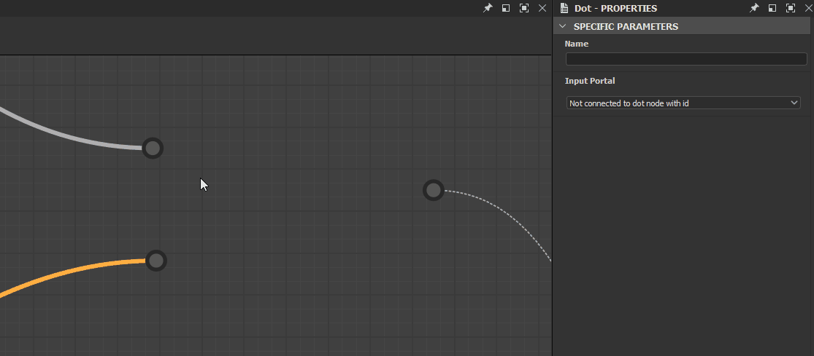

# Nodo punto (anche portale)

<table>
<tr style="border: 0;">
<td width="25.00%" style="border: 0;" valign="top">

</td>
<td width="100.00%" style="border: 0;" valign="top">

Il nodo <b>Punto</b> è un helper che consente di semplificare e ottimizzare i grafici reindirizzando e raggruppando le connessioni. È particolarmente utile per i grafici con molte connessioni lunghe che operano su altre connessioni o nodi.

Una coppia di nodi punto può essere utilizzata come <b>portali</b> per nascondere una connessione che si estende su lunghe distanze o in luoghi in cui l&#39;instradamento della connessione risulterebbe complesso.

</td>
</tr>
</table>

## Creazione di nodi punto

I nodi punto possono essere aggiunti in qualsiasi tipo di grafico, in uno dei seguenti modi:

+++Inserisci sul collegamento
Tieni premuto il tasto <b>Alt</b> mentre posizioni il puntatore del mouse su una connessione per visualizzare l&#39;anteprima del nodo Punto, quindi fai clic su LMB per aggiungere un nodo Punto alla connessione in quella posizione.

{width="512px"}

+++

+++Connettore nodo
Premi il tasto <b>Alt</b> mentre trascini una nuova connessione da un connettore nodo per inserire un nodo Punto in quella posizione.

Puoi continuare a trascinare la nuova connessione e ripetere l&#39;operazione per instradarla come preferisci.

+++

+++Menu Nodo
Premi <b>Barra spaziatrice</b> per visualizzare il menu <b>Nodo</b>, quindi seleziona l&#39;elemento &#39;Punto&#39; o digita &#39;punto&#39; nel campo di ricerca per far apparire l&#39;elemento e trovarlo più rapidamente.

+++

>[!TIP]
>
> Quando viene creato un nodo Punto, la relativa proprietà &#39;Nome&#39; diventa automaticamente attiva in modo da poter modificare immediatamente il nome del nodo.

<table>
<tr style="border: 0;">
<td style="border: 0;" valign="top">

## Unione dei collegamenti

Premete ALT e spostate un nodo Punto sui collegamenti per unire più connessioni tra nodi.

</td>
<td style="border: 0;" valign="top">

{width="512px"}

</td>
</tr>
</table>

## Portali

<table>
<tr style="border: 0;">
<td width="16.67%" style="border: 0;" valign="top">

</td>
<td width="100.00%" style="border: 0;" valign="top">

I nodi punto possono essere utilizzati come <b>portali</b> per inviare dati su lunghe distanze nel grafico senza avere un lungo e ingombrante collegamento che ne compromette la leggibilità. In questo modo si nasconde il collegamento tra i nodi punto.

</td>
</tr>
</table>

### Creazione di portali

Viene creato automaticamente un portale tra due nodi punto, un trasmettitore e un ricevitore, quando viene denominato il nodo punto del trasmettitore. Per assegnare un nome a un nodo Punto, è necessario impostare un identificatore univoco nella relativa proprietà <b>Nome</b>.

Quando in un grafico sono presenti uno o più nodi punto denominati, qualsiasi nodo punto può essere collegato ad esso come ricevitore mediante:

* creazione di un collegamento tra l&#39;input del ricevitore e l&#39;output di un trasmettitore;
* Selezione del nome del trasmettitore nella proprietà <b>Portale di input</b> del ricevitore.

La duplicazione o la copia dei ricevitori mantiene la loro connessione al trasmettitore come portale.

### Identificazione dei portali

I nodi punto utilizzati come portali dispongono di un&#39;icona di segnale wireless posizionata accanto al connettore utilizzato come portale.

Quando si seleziona un nodo Punto utilizzato come portale, le connessioni nascoste ad altri portali vengono visualizzate come linea tratteggiata.

### Eliminazione di portali

Un portale viene eliminato quando il <b>Nome</b> del trasmettitore viene cancellato o quando la connessione nascosta viene eliminata da:

* selezione di un portale, quindi selezione della connessione nascosta ed eliminazione;
* Selezionare il ricevitore e premere il pulsante <b>X</b> accanto al menu a discesa <b>Portale di input</b> nelle proprietà.

>[!IMPORTANT]
>
> L&#39;utilizzo di nodi punto come portali non è supportato nei [grafici FX-Map](../../../../function-graphs/fxmaps/fxmaps.md).

Guarda questa esercitazione sui nodi Punto come portali:
