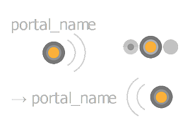

# Cornice

<table>
<tr style="border: 0;">
<td width="25.00%" style="border: 0;" valign="top">


</td>
<td width="100.00%" style="border: 0;" valign="top">

Una cornice facilita la leggibilità e il layout dei grafici, raggruppando visivamente gli oggetti in quel grafico e consentendo di spostare facilmente tutti questi oggetti insieme.

Ad esempio, è possibile assegnare un nome e colorare le cornici in modo che la struttura del grafico emerga chiaramente quando si traccia una panoramica, il che è di grande aiuto con l’aumentare della complessità di un grafico.

Possono anche essere annotati e quindi fungere da strumento di documentazione per spiegare perché alcuni nodi sono stati impostati in un modo specifico.

</td>
</tr>
</table>

## Aspetto

A seconda della posizione del cursore del mouse o se fa parte di una selezione, un fotogramma si presenta con stili visivi diversi per consentirvi di sapere se e come interagire con esso.

+++Predefinito
Per impostazione predefinita, la cornice è un rettangolo con angoli arrotondati riempiti con il colore selezionato nella proprietà <b>Colore cornice</b>. Una tonalità più scura del colore viene applicata al contorno della cornice.

Il set di titoli nella proprietà <b>Titolo</b> è visualizzato in grigio nell&#39;angolo superiore sinistro della cornice.

")


+++

+++Passaggio con il mouse sull’intestazione
Quando si passa il cursore del mouse sulla parte superiore della cornice, viene visualizzata una barra di intestazione.

Per spostare la cornice, trascinate la barra di intestazione o il titolo.

")


+++

+++Selezionato
Quando questa opzione è selezionata, il titolo e il contorno della cornice vengono evidenziati in bianco. Il contorno diventa più spesso.

")


+++

## Creazione di cornici

Le cornici possono essere aggiunte con qualsiasi tipo di grafico, in uno dei seguenti modi:

+++Menu Nodo
Premi <b>Barra spaziatrice</b> nella vista Grafico per aprire il <b>menu Nodo</b> e seleziona la voce &quot;Cornice&quot; nell&#39;elenco.

Digita &quot;frame&quot; nel campo di ricerca per posizionare la superficie dell&#39;elemento e trovarlo più rapidamente.

+++

+++Scelta rapida
Se una scelta rapida da tastiera è mappata all&#39;elemento &#39;Frame&#39; nelle [Preferenze](../../../../interface/preferences-window/preferences-window.md), premi la scelta rapida quando la visualizzazione Grafico è attiva.

+++

+++Menu contestuale
Nella vista Grafico, premi <b>RMB</b> su qualsiasi oggetto o in uno spazio vuoto e seleziona l&#39;opzione <b>Aggiungi cornice</b>.

+++

+++Barra degli strumenti Grafico
Nella barra degli strumenti Visualizzazione grafico fare clic sul pulsante &#39;Cornice&#39; nella <b>Palette dei nodi</b>.

+++

+++Libreria
Nella libreria, seleziona la categoria <b>Elementi del grafico</b>, quindi trascina l’elemento &quot;Cornice&quot; nella vista Grafico.

+++

### Selezioni di frame

Se una selezione è attiva in un grafico quando viene creata una cornice, questa verrà regolata automaticamente in modo da includere completamente gli oggetti selezionati.

Tenendo presente questo aspetto, la creazione di fotogrammi mediante una scelta rapida da tastiera rende ancora più veloce l’inquadratura del contenuto in un grafico.

{width="480px"}

>[!TIP]
>
> Quando viene creato un fotogramma, la sua proprietà &quot;Titolo&quot; diventa automaticamente attiva in modo da poter modificare immediatamente il titolo del fotogramma.

## Manipolazione dei fotogrammi

<table>
<tr style="border: 0;">
<td style="border: 0;" valign="top">

È possibile <b>applicare il panning</b> ai fotogrammi trascinandone la barra del titolo o dell&#39;intestazione e <b>ridimensionarli</b> trascinandone i bordi o gli angoli.

L&#39;illustrazione evidenzia le zone di interazione per il panning (blu) e il ridimensionamento (giallo).

</td>
<td style="border: 0;" valign="top">


</td>
</tr>
</table>

<table>
<tr style="border: 0;">
<td style="border: 0;" valign="top">

### Aggancio alla griglia

Per impostazione predefinita, una cornice si aggancia alla griglia media quando viene spostata o ridimensionata.

Tieni premuto il tasto <b>Ctrl</b> (Windows) / <b>Cmd</b> (macOS) per spostare l&#39;aggancio alla griglia piccola per regolazioni più precise.

</td>
<td style="border: 0;" valign="top">


</td>
</tr>
</table>

## Proprietà

Quando è selezionato un frame, nell&#39;ancoraggio [Proprietà](../../../../interface/properties/properties.md) sono disponibili le seguenti proprietà:

+++Titolo
Il <b>Titolo</b> si trova in alto a sinistra nella cornice. È possibile attivare o disattivare la visibilità del titolo utilizzando la proprietà <b>Titolo visibile</b>.

Le dimensioni del titolo possono essere bloccate con una dimensione minima dello schermo in modo che rimanga leggibile quando si esegue lo zoom out del grafico. A tale scopo, selezionare l&#39;opzione &#39;Titoli cornice&#39; nell&#39;elenco a discesa <b>Informazioni</b> della barra degli strumenti [Visualizzazione grafico](../../../../interface/the-graph-view/the-graph-view.md).

{width="640px"}


+++

+++Descrizione
La <b>Descrizione</b> è una parte di testo aggiuntiva facoltativa che può essere utilizzata per annotare il contenuto della cornice.

Il testo può essere formattato utilizzando i tag HTML. Per attivare e disattivare questa formattazione, fare clic sul pulsante  <b>markup HTML</b>.

Ulteriori informazioni sono disponibili nella sezione Descrizione riportata di seguito.

{width="640px"}


+++

+++Colore
Il <b>colore fotogramma</b> viene utilizzato per riempire la cornice nella vista Grafico. Usa il selettore colore per selezionare un colore.

Il canale alfa del colore controlla l&#39;*opacità* del fotogramma, dove il valore 0 indica che il fotogramma è completamente trasparente.

{width="640px"}


+++

## Descrizione

Una cornice può essere annotata con un testo che verrà inserito all’interno della cornice. Il testo viene allineato a sinistra e inizia nell’angolo in alto a sinistra della cornice. Per modificare il testo, utilizzare la proprietà [Descrizione](#properties) della cornice.

<table>
<tr style="border: 0;">
<td style="border: 0;" valign="top">

### Standard

Il <b>Titolo</b> viene visualizzato in grassetto nella parte superiore sinistra della cornice. La visibilità del titolo può essere attivata o disattivata.

Le sue dimensioni possono essere bloccate con una dimensione minima dello schermo in modo che rimanga leggibile quando si esegue lo zoom out del grafico. A tale scopo, selezionare l&#39;opzione &#39;Titoli cornice&#39; nell&#39;elenco a discesa <b>Informazioni</b> della barra degli strumenti [Visualizzazione grafico](../../../../interface/the-graph-view/the-graph-view.md).

</td>
<td style="border: 0;" valign="top">

"){zoomable="yes"}

</td>
</tr>
</table>

<table>
<tr style="border: 0;">
<td style="border: 0;" valign="top">

### Formattazione HTML

È possibile formattare il testo utilizzando i tag HTML nella proprietà <b>Descrizione</b> della cornice. La formattazione deve essere abilitata utilizzando il pulsante  <b>markup HTML</b> nella stessa proprietà.

</td>
<td style="border: 0;" valign="top">

"){zoomable="yes"}

</td>
</tr>
</table>

È possibile copiare e incollare questo esempio nella proprietà Description del frame per testare questa funzionalità:

```
<h2>HTML formatting</h2>

<p>This is a description formatted using <b>HTML markup</b>.</p>

<p>Formattig text makes it more <i>pleasant</i>, <font color="#CC8822">impactful</font> and <code>clearly structured</code> for users.</p>

<p>  Images are also supported! <sup>How nice!</sup></p>
```


Di seguito è riportato un elenco di tag utili per la formattazione del testo:

+++Tag di formattazione dei HTML

|  |  |
| --- | --- |
| Grassetto | &lt;b>...&lt;/b> |
| Corsivo | &lt;i>...&lt;/i> |
| Colore | &lt;font color=&quot;#4A567C&quot;>...&lt;/font> |
| Paragrafo | &lt;p>...&lt;/p> |
| Interruzione di riga | &lt;br> |
| Intestazioni | &lt;h1>...&lt;/h1>, &lt;h2>...&lt;/h2>, ecc. |
| Immagine | &lt;img src=&quot;{path\_to\_image}&quot;> |
| Apice | &lt;sub>...&lt;/sub> |
| Elenco non ordinato (punti elenco) | &lt;ul> &lt;li>...&lt;/li> &lt;li>...&lt;/li> &lt;/ul> |
| Elenco ordinato (numeri) | &lt;ol> &lt;li>...&lt;/li> &lt;li>...&lt;/li> &lt;/ol> |
| Codice | &lt;code>...&lt;/code> |


+++

## Regole di inclusione

Un oggetto si considera incluso in una cornice se soddisfa la relativa regola di inclusione. Queste regole variano a seconda dell&#39;oggetto e del caso speciale. Sono elencati di seguito.

Il simbolo giallo in ogni illustrazione rappresenta il punto o l&#39;area che deve rientrare interamente nei limiti di una cornice affinché un oggetto venga incluso nella cornice.

+++Nodi
<b>punto centrale</b> utilizzato.

I distintivi, i connettori e le informazioni visualizzati sotto il nodo vengono tutti ignorati.

I nodi possono essere di height diversi, a seconda del numero di connettori di ingresso o di uscita.

Quando i connettori vengono visualizzati o nascosti, aggiunti o rimossi, il height del nodo viene regolato dal relativo *centro*.

Pertanto, la posizione del punto centrale di un nodo non deve cambiare finché non viene *spostata intenzionalmente*.


Viene utilizzato il punto di ingresso <b>c</b><b>enter</b> del nodo *host*.

Il nodo host è il nodo in cui è ancorato un nodo.

Se più nodi sono ancorati in una catena, il nodo host dell&#39;ultimo nodo ancorato viene utilizzato per l&#39;intera catena.

I distintivi, i connettori e le informazioni visualizzati sotto il nodo vengono tutti ignorati.


+++

+++Nodi punto
Viene utilizzato il <b>punto centrale</b> del punto.

I connettori, le icone dei portali e i nomi vengono ignorati.




+++

+++Commenti
Viene utilizzato il <b>punto centrale</b> del *rettangolo di selezione* del commento (contorno giallo).

I commenti associati non seguono le regole di inclusione per i commenti.

Viene invece utilizzato il <b>punto centrale</b> del nodo *padre*.

I distintivi, i connettori e le informazioni visualizzati sotto il nodo vengono tutti ignorati.


+++

+++Puntine
Viene utilizzata la <b>punta</b> dell&#39;icona del pin.


+++

+++Cornici
Viene utilizzato il <b>rettangolo di selezione</b> della cornice nidificata.

Ciò significa che un fotogramma nidificato deve trovarsi interamente all&#39;interno dei limiti di un altro fotogramma per essere incluso in quest&#39;ultimo.

Il titolo viene ignorato.


+++

## Adatta dimensione a contenuto


Man mano che apportate le regolazioni nel grafico, una cornice potrebbe non essere più adattata correttamente al suo contenuto. In questo caso, è possibile regolare automaticamente la posizione e le dimensioni della cornice in modo che si adatti all&#39;estensione del suo contenuto, con una spaziatura di una cella della griglia media.

A tale scopo, fare clic su <b>MB</b> sulla barra del titolo o dell&#39;intestazione della cornice - vedere [Aspetto](#appearance) - e selezionare l&#39;opzione <b>Adatta dimensioni a contenuto</b> nel menu di scelta rapida.

>[!NOTE]
>
> L&#39;opzione è disponibile se almeno *un* oggetto grafico soddisfa le [regole di inclusione](../../../../interface/the-graph-view/graph-items/frame/frame.md) della cornice.

<table>
<tr style="border: 0;">
<td style="border: 0;" valign="top">

### Adattamento del testo della descrizione

Se la cornice ha una descrizione, questa viene regolata in modo da utilizzare eventuale spazio vuoto accanto alla descrizione, se possibile.

Se nessun oggetto incluso può rientrare nello spazio, il height della cornice viene regolato ulteriormente per adattarsi alla descrizione.

</td>
<td style="border: 0;" valign="top">

")

</td>
</tr>
</table>

+++Esempio
"){width="640px"}


+++

## Espandi automaticamente


Man mano che il grafico cresce, potrebbe essere necessario riorganizzare il contenuto delle cornici. I nodi potrebbero spostarsi per fare spazio ad aggiunte o potrebbe essere necessario spaziare di più i contenuti per promuovere la leggibilità.

Per facilitare queste regolazioni, è possibile espandere automaticamente una cornice quando si spostano [oggetti inclusi](#inclusion-rules): tenete premuto <b>Maiusc</b> in qualsiasi punto mentre spostate un oggetto in modo che i bordi della cornice vengano regolati automaticamente per mantenere l&#39;oggetto entro i limiti.

Questo vale anche per le selezioni che possono includere più oggetti. In tal caso, il frame host di ciascun oggetto verrà regolato contemporaneamente.

Se un oggetto non è completamente racchiuso nei limiti della cornice, ma soddisfa comunque la [regola di inclusione](#inclusion-rules), la cornice viene regolata in modo da racchiuderla completamente con un&#39;ulteriore spaziatura interna di una cella della griglia media non appena viene premuto il tasto <b>Maiusc</b>.

>[!NOTE]
>
> Anche se il tasto <b>Maiusc</b> può essere premuto o rilasciato in qualsiasi momento durante lo spostamento per attivare o annullare la regolazione automatica del fotogramma, *deve* essere premuto al completamento dello spostamento per applicare in modo efficace la regolazione.

+++Esempio
"){width="640px"}


+++
