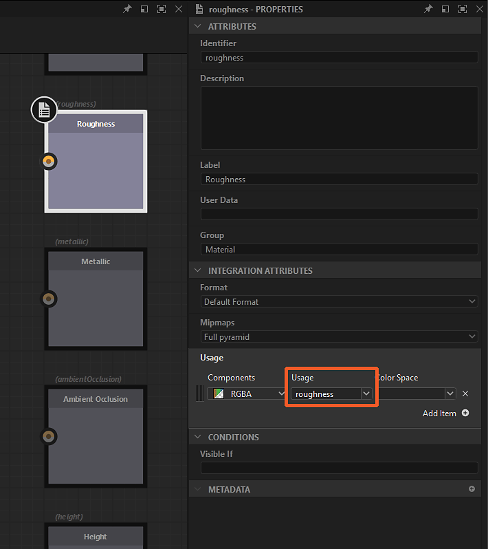

# Modalità di creazione del collegamento

In [Substance grafici](../../../compositing-graphs/substance-compositing-graphs.md), è possibile connettere i nodi utilizzando una delle tre <b>modalità di creazione dei collegamenti</b>:

<table>
<tr style="border: 0;">
<td style="border: 0;" valign="top">

{zoomable="yes"}

*Fare clic per ingrandire*

<b> Standard</b> (1)

Nessuna condizione applicata.

</td>
<td style="border: 0;" valign="top">

{zoomable="yes"}

*Fare clic per ingrandire*

 <b>Materiale</b> (2)

Input e output vengono confrontati in base al loro utilizzo.

Se solo uno dei due presenta un utilizzo, la connessione viene eseguita come in modalità Standard.

</td>
<td style="border: 0;" valign="top">

{zoomable="yes"}

*Fare clic per ingrandire*

 <b>Materiale compatto</b> (3)

Come Materiale.

Input e output appartenenti allo stesso *gruppo* sono compressi.

</td>
</tr>
</table>

È possibile passare da una modalità all&#39;altra in qualsiasi momento nella barra degli strumenti del grafico facendo clic sul pulsante  <b>Modalità creazione collegamento</b> o utilizzando le scelte rapide da tastiera elencate sopra.

Nelle modalità <b>Materiale</b> e <b>Materiale compatto</b>, le connessioni tra input e output con *utilizzi non corrispondenti* non sono consentite.

## Le modalità

|  | 

 Standard | 

 Compatta | 

 Materiale compatto |
| --- | --- | --- | --- |
| <b>Input</b> | Tutti gli input sono visibili | Tutti gli input sono visibili | Solo 1 ingresso per gruppo |
| <b>Output</b> | Tutti gli output sono visibili | Tutti gli output sono visibili | Solo 1 output per gruppo |
| <b>Collegamenti</b> | Tutti i collegamenti sono visibili | Tutti i collegamenti sono visibili | Solo 1 collegamento per gruppo (verde) |
| <b>Connessioni</b> | Collegamento dei collegamenti uno alla volta | Puoi collegare i collegamenti tra loro come gruppo di materiali con più collegamenti in base agli usi corrispondenti.   Quando un utilizzo è presente su un&#39;estremità, la connessione è di tipo Standard. | I collegamenti vengono collegati insieme come gruppo di materiali a collegamento singolo. |

## Assegnazione di gruppi

<table>
<tr style="border: 0;">
<td width="100.00%" style="border: 0;" valign="top">

Per utilizzare le modalità <b>Materiale</b> e <b>Materiale compatto</b>, dovete assegnare dei gruppi ai nodi <b>Input</b> e <b>Output</b> del grafico.

È possibile assegnare un gruppo nei parametri <b>Attributi</b> del nodo, compilando il nome del gruppo nella proprietà <b>Gruppo</b>. Un gruppo può essere qualsiasi valore di stringa e i collegamenti verranno raggruppati se condividono lo *stesso*, con distinzione tra maiuscole e minuscole.

Gli input e gli output raggruppati di un grafico vengono identificati visivamente da *racchiusi in una capsula scura* nelle istanze del nodo che fanno riferimento a quel grafico.

</td>
<td width="25.00%" style="border: 0;" valign="top">

{zoomable="yes"}

</td>
</tr>
</table>

<table>
<tr style="border: 0;">
<td width="25.00%" style="border: 0;" valign="top">

</td>
<td width="100.00%" style="border: 0;" valign="top">

{zoomable="yes"}

*Fare clic per ingrandire*

</td>
<td width="25.00%" style="border: 0;" valign="top">

</td>
</tr>
</table>

## Corrispondenza del collegamento con l&#39;utilizzo

Una volta raggruppati i collegamenti, i singoli input devono corrispondere agli output. Questa operazione viene eseguita tramite l&#39;attributo <b>Utilizzo</b> dei nodi <b>Input</b> e <b>Output</b>. Se l&#39;utilizzo tra input e output *corrisponde*, verrà creato un collegamento. Se non viene trovato un utilizzo corrispondente, non viene creato alcun collegamento.

<table>
<tr style="border: 0;">
<td width="25.00%" style="border: 0;" valign="top">

</td>
<td width="100.00%" style="border: 0;" valign="top">

{zoomable="yes"}

*Fare clic per ingrandire*

</td>
<td width="25.00%" style="border: 0;" valign="top">

</td>
</tr>
</table>
