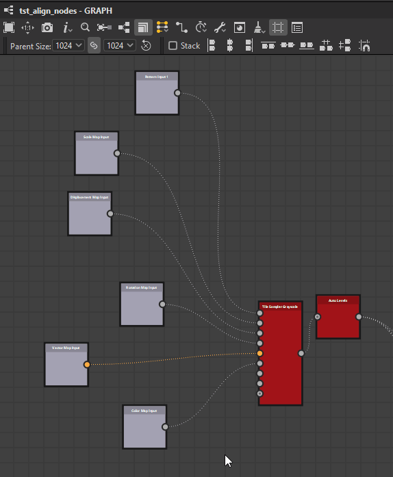

# Strumenti di allineamento dei nodi

{zoomable="yes"}

Gli strumenti di allineamento dei nodi consentono di disporre i nodi nei grafici per migliorarne la leggibilità e l’esperienza di creazione. Offrono azioni per allineare i nodi, distribuirli uniformemente e agganciarli alla griglia.

Agiscono solo sui <b>nodi attualmente selezionati</b>.

>[!NOTE]
>
> Scelte rapide da tastiera
> 
> Alcune azioni dispongono di scelte rapide da tastiera per un accesso rapido: H, V e S. Vengono visualizzate tra parentesi nell&#39;elenco di azioni seguente.
> 
> Si noti che queste scelte rapide da tastiera sostituiranno qualsiasi [scelta rapida da tastiera assegnata ai nodi](../../../interface/preferences-window/preferences-window.md).

## Allineamenti

I nodi possono essere allineati orizzontalmente e verticalmente, con tre modalità per ogni asse:

### Allineamenti orizzontali

<b> a sinistra:</b> Allineare il lato sinistro dei nodi selezionati al lato sinistro del nodo più a sinistra.

<b> Centro (H):</b> Allineare il centro orizzontale dei nodi selezionati al centro orizzontale del rettangolo di selezione che li racchiude.

<b> Destra:</b> Allineare il lato destro dei nodi selezionati al lato destro del nodo più a destra.

<table>
<tr style="border: 0;">
<td style="border: 0;" valign="top">

{zoomable="yes"}

*Sinistra*

</td>
<td style="border: 0;" valign="top">

{zoomable="yes"}

*Centro*

</td>
<td style="border: 0;" valign="top">

{zoomable="yes"}

*Destra*

</td>
</tr>
</table>

### Allineamenti verticali

<b> In alto:</b> Allineare il lato superiore dei nodi selezionati al lato superiore del nodo superiore.

<b> Centro (V):</b> Allineare il centro verticale dei nodi selezionati al centro verticale del rettangolo di selezione che li racchiude.

<b> In basso:</b> Allineare il lato inferiore dei nodi selezionati al lato inferiore del nodo inferiore.

<table>
<tr style="border: 0;">
<td style="border: 0;" valign="top">

{zoomable="yes"}

*Primi*

</td>
<td style="border: 0;" valign="top">

{zoomable="yes"}

*Centro*

</td>
<td style="border: 0;" valign="top">

{zoomable="yes"}

*Inferiore*

</td>
</tr>
</table>

### Impilamento

L&#39;<b>opzione  dello stack </b> consente di <b>evitare sovrapposizioni</b> durante l&#39;utilizzo degli allineamenti. È attivata per impostazione predefinita.

Quando questa opzione è attivata, i nodi verranno spostati il più possibile nella posizione di riferimento fino a quando non entreranno in conflitto con un altro nodo nella selezione. In questo modo, vengono impilati nell&#39;asse selezionato con un margine di una cella della griglia media tra ogni nodo.

{zoomable="yes"}

## Distribuzioni

I nodi possono essere distribuiti uniformemente tra i nodi a ogni estremità della selezione corrente sull&#39;asse desiderato.

<b> orizzontalmente:</b> nodi sono distribuiti uniformemente tra i nodi più a sinistra e più a destra della selezione.

<b> in verticale:</b> nodi vengono distribuiti uniformemente tra i nodi più in alto e quelli più in basso nella selezione.

Le distribuzioni mirano a <b>spaziatura uniforme</b> tra i nodi, indipendentemente dalle loro dimensioni.

Quando più nodi hanno i loro centri perfettamente allineati sull&#39;asse selezionato, restano e vengono <b>trattati come uno</b> nella distribuzione. Il *più grande* dei nodi allineati viene utilizzato per calcolare la spaziatura uniforme.

Quando la dimensione totale dei nodi selezionati è maggiore dello spazio disponibile sull&#39;asse selezionato, è possibile che si verifichi una sovrapposizione.

<table>
<tr style="border: 0;">
<td width="58.33%" style="border: 0;" valign="top">

{zoomable="yes"}

*Orizzontalmente*

</td>
<td width="100.00%" style="border: 0;" valign="top">

{zoomable="yes"}

*Verticalmente*

</td>
</tr>
</table>

<table>
<tr style="border: 0;">
<td width="58.33%" style="border: 0;" valign="top">

## Aggancio alla griglia

L&#39;azione <b>Aggancia (S) </b> sposta ciascun nodo selezionato in modo che il relativo angolo superiore sinistro si trovi sul punto più vicino sulla griglia media.

</td>
<td width="100.00%" style="border: 0;" valign="top">

{zoomable="yes"}

</td>
</tr>
</table>
