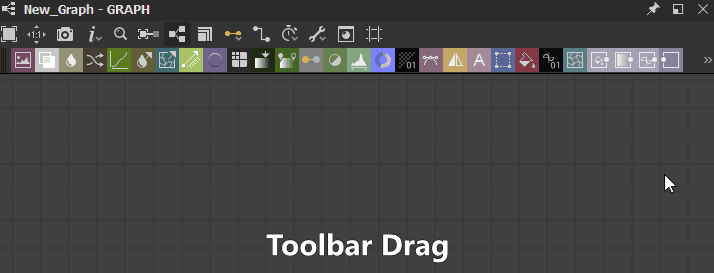
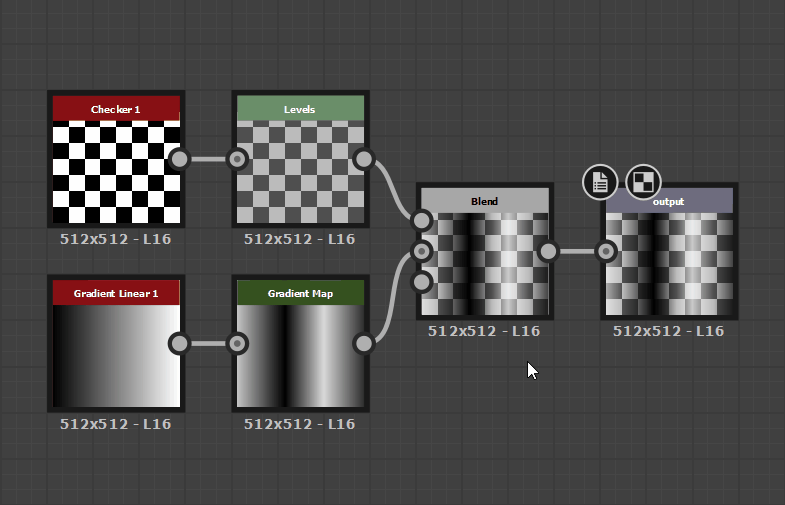
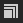

# Vista Grafico

Questa pagina presenta il dock della vista Grafico di Substance 3D Designer.

La vista grafico è la finestra principale di [Substance 3D Designer](https://www.adobe.com/products/substance3d-designer.html), in cui puoi creare e modificare i tuoi grafici. La vista del grafico ha due aree principali: una barra degli strumenti nella parte superiore, che fornisce un accesso rapido a determinate funzioni, e l&#39;area del grafico effettiva in cui vengono posizionati i nodi.

La vista grafico viene utilizzata per tutti i tipi di grafico, ma differisce leggermente tra [grafici a Substance](../../compositing-graphs/substance-compositing-graphs.md), [grafici a funzione](../../function-graphs/function-graphs.md) e [grafici FX-Map](../../function-graphs/fxmaps/fxmaps.md), principalmente nell&#39;area della barra degli strumenti.

## Navigazione nella finestra della vista

Per spostarsi all’interno del grafico è possibile effettuare le seguenti operazioni:

* <b>Panning:</b> MB/Ctrl+RMB
* <b>Zoom:</b> rotellina del mouse / Alt + RMB

Utilizzo di un trackpad (solo macOS)

* <b>Panning: </b>Scorrimento con due dita
* <b>Zoom:</b> pizzicare con due dita/scorrere con due dita mentre si tiene premuto Cmd

>[!NOTE]
>
> Direzione zoom
> 
> Ciascuno dei metodi di zoom viene invertito:
> 
> * La rotellina del mouse verso l&#39;alto *avvicina* la visualizzazione del grafico
> * Alt+RMB e trascina verso l&#39;alto *spinge* la vista del grafico lontano
> 
> La direzione dello zoom può essere invertita nelle [Preferenze](../../interface/preferences-window/preferences-window.md).

<b>focalizza</b> sui nodi selezionati o sull&#39;intero grafico se non è selezionato nulla, con il tasto F.

È possibile eseguire la navigazione anche utilizzando <b>i pin di navigazione </b>e la chiave F2, vedere [elementi del grafico](#graph-items) di seguito[.](../../interface/the-graph-view/graph-items/graph-items.md)

## Spostamento degli oggetti

Fai clic su LMB su un oggetto (ad esempio, un nodo o un elemento del grafico), quindi tieni premuto e trascina il cursore per <b>spostare un nodo</b> attorno al grafico. Se sono selezionati più oggetti, tutti gli oggetti selezionati vengono spostati insieme a quello sotto il cursore.

Se il cursore <b>raggiunge un bordo</b> della visualizzazione Grafico durante lo spostamento degli oggetti, la visualizzazione viene spostata nella direzione del cursore. Il panning è più veloce quando il cursore si allontana dal bordo.\
Questo vale anche per disegnare caselle di selezione attraverso i bordi della vista grafico.

Per impostazione predefinita, durante lo spostamento gli oggetti vengono <b>allineati alla griglia</b>. Tenete premuto Ctrl (Windows) / ⌘ (macOS) mentre spostate gli oggetti per disattivare l&#39;aggancio.

## Elementi grafico

Sono disponibili diversi oggetti di supporto per organizzare e navigare nel grafico, soprattutto quando si sviluppa in una rete complessa di nodi che può essere difficile da leggere:

<b>I nodi punto</b> consentono di reindirizzare e unire le connessioni e possono essere utilizzati come <b>portali</b> per nascondere connessioni lunghe o inefficienti;

<b>Frame</b> consente di raggruppare i nodi con un titolo e un colore visibili;

<b>I commenti</b> consentono di tenere traccia dello scopo di un nodo o di un gruppo di nodi e di creare eventuali altre annotazioni utili.

I <b>pin di navigazione</b> consentono di passare rapidamente ai punti di interesse nel grafico.

>[!NOTE]
>
> Ulteriori informazioni sono disponibili nella sezione [Elementi del grafico](../../interface/the-graph-view/graph-items/graph-items.md) di questa documentazione.

## Menu contestuale Grafico

Quando si fa clic su RMB in uno spazio vuoto del grafico, viene visualizzato un menu di scelta rapida che può includere le seguenti opzioni:

<b>Aggiungi nodo:</b> Aprire il menu Nodo per aggiungere un nodo nel grafico;

<b>Aggiungi commento:</b> Aggiungi un oggetto grafico [Commento](../../interface/the-graph-view/graph-items/graph-items.md) senza elementi padre;

<b>Aggiungi fotogramma:</b> Aggiungere un oggetto grafico [Frame](../../interface/the-graph-view/graph-items/graph-items.md);

<b>Aggiungi pin:</b> Aggiungi un oggetto grafico [Pin](../../interface/the-graph-view/graph-items/graph-items.md);

<b>Aggiungi nodo punto:</b> Aggiungere un nodo [punto](../../interface/the-graph-view/graph-items/graph-items.md);

<b>Visualizzare gli output nella vista 3D:</b> Assegnare tutti gli output del grafico a un materiale nella [vista 3D](../../interface/3d-view/3d-view.md) abbinando gli usi, vedere [Interagire con la vista 3D](#interacting-with-the-3d-view) di seguito;

<b>Reimposta e visualizza gli output nella vista 3D:</b> Reimposta un materiale nella [vista 3D](../../interface/3d-view/3d-view.md) e assegna tutti gli output del grafico a tale materiale corrispondendo agli usi. Consulta [Interazione con la vista 3D](#interacting-with-the-3d-view) di seguito;

<b>Visualizza output nella vista 2D:</b> Visualizza uno degli output del grafico nella [vista 2D](../../interface/2d-view/2d-view.md). Vedere [Interazione con la vista 2D](#interacting-with-the-2d-view) di seguito;

<b>Calcola miniature nodi:</b> Attiva il calcolo del risultato di tutti i nodi nel grafico, che verranno memorizzati nella [cache immagini](../../interface/preferences-window/preferences-window.md), e utilizza il primo output come miniatura.

<b>Cancella miniature nodi:</b> Cancella la [cache immagini](../../interface/preferences-window/preferences-window.md) contenente il risultato di tutti i nodi nel grafico, che a sua volta cancella le miniature del nodo;

<b>Salva pacchetto:</b> Salva il pacchetto che contiene questo grafico;

<b>Incolla:</b> Incolla i nodi attualmente copiati negli Appunti, incluse le relative connessioni upstream, nella posizione del cursore. Se il cursore non si trova nella finestra della vista Grafico, i nodi vengono posizionati al centro della finestra della vista.

<b>Incolla senza collegamento:</b> Incolla i nodi attualmente copiati negli Appunti, escluse le relative connessioni upstream, nella posizione del cursore. Se il cursore non si trova nella finestra della vista Grafico, i nodi vengono posizionati al centro della finestra della vista.

<b>Seleziona tutti:</b> Seleziona tutti i nodi nel grafico;

<b>Pin precedente:</b> Passare al precedente oggetto [Pin](../../interface/the-graph-view/graph-items/graph-items.md) nel grafico;

<b>Pin successivo:</b> spostarsi sul successivo oggetto [Pin](../../interface/the-graph-view/graph-items/graph-items.md) nel grafico;

<b>Copia selezione:</b> Copia negli Appunti i nodi, le connessioni e i valori dei parametri selezionati;

<b>Elimina selezione:</b> Elimina i nodi selezionati;

<b>Eliminare e ricollegare:</b> eliminare i nodi selezionati e sostituirli mediante connessioni dirette dai nodi upstream ai nodi downstream, se possibile;

<b>Selezione duplicata:</b> duplicare i nodi selezionati nello stesso grafico, incluse le relative connessioni upstream, nella posizione del cursore. Se il cursore non si trova nella finestra della vista Grafico, i nodi vengono posizionati al centro della finestra della vista.

<b>Duplica la selezione senza collegamento:</b> duplica i nodi selezionati nello stesso grafico, escludendo le relative connessioni upstream, nella posizione del cursore. Se il cursore non si trova nella finestra della vista Grafico, i nodi vengono posizionati al centro della finestra della vista.

<b>Selezionare i nodi upstream:</b> Selezionare tutti i nodi upstream dei nodi selezionati;

<b>Selezionare i nodi a valle:</b> Selezionare tutti i nodi a valle dei nodi selezionati;

<b>Scambia collegamenti\*:</b> Scambia le connessioni tra la coppia di connettori di input e output selezionata;

<b>Disabilita nodo/selezione:</b> Disabilita i nodi selezionati in modo che non influiscano sul risultato del flusso. Vedere <b>Disabilitazione dei nodi</b> di seguito.

<b>\*:</b> Disponibile solo quando la selezione include due collegamenti o tre nodi in cui due dei nodi sono connessi agli input dello stesso terzo nodo.

## Utilizzo dei nodi

I grafici sono principalmente vasi per nodi che possono assimilare, generare e modificare i dati, quindi produrli come risultato del grafico. L&#39;utilizzo dei nodi comporta i concetti e le azioni seguenti.

### Creazione E GESTIONE DEI NODI

I nodi possono essere inseriti nei grafici in 5 modi, indipendentemente dal tipo di grafico:

* Fare clic o trascinare da un&#39;icona sulla barra degli strumenti del nodo (vedere di seguito). Solo [nodi atomici](../../compositing-graphs/nodes-reference-for-com/atomic-nodes/atomic-nodes.md) possono essere posizionati in questo modo.
* Fare clic con il pulsante destro del mouse su un&#39;area vuota del grafico e scegliere <b>Aggiungi nodo</b>. Solo [nodi atomici](../../compositing-graphs/nodes-reference-for-com/atomic-nodes/atomic-nodes.md) possono essere posizionati in questo modo.
* Trascinate una miniatura dalla vista Libreria alla vista del grafico. Questo metodo funziona per [tutti i tipi di nodi, incluse le istanze dei nodi](../../compositing-graphs/nodes-reference-for-com/node-library/node-library.md).
* Premi <b>Barra spaziatrice</b> per accedere al <b>menu Nodo</b>. Vedi di seguito.
* Utilizzo della scelta rapida da tastiera associata a un nodo. Mapping eseguito nella [finestra Preferenze](../../interface/preferences-window/preferences-window.md).

Se viene inserito un nodo quando viene selezionato un altro nodo, Designer tenterà di connettere automaticamente il nuovo nodo al nodo precedente.\
Questa connessione automatica posiziona sempre il nuovo nodo *dopo* quello precedente nel flusso.

La rimozione dei nodi può essere eseguita in due modi, a seconda di come si desidera che un collegamento perso venga trattato:

* Selezionare un nodo e premere Canc oppure fare clic con il pulsante destro del mouse e scegliere <b>Elimina selezione</b>. In questo modo vengono interrotte tutte le connessioni esistenti, con conseguente potenziale interruzione delle funzionalità.
* Selezionare un nodo e premere Backspace oppure fare clic con il pulsante destro del mouse e scegliere <b>Elimina e ricollega</b>. In questo modo si tenta di mantenere i collegamenti quando possibile, evitando funzionalità interrotte.

<table>
<tr style="border: 0;">
<td width="100.00%" style="border: 0;" valign="top">

### Menu Nodo

Premendo <b>Barra spaziatrice</b> nella visualizzazione Grafico viene visualizzato il menu Nodo.

Questo menu consente di accedere a tutti i nodi della [libreria](../../interface/the-library/the-library.md) tramite un&#39;interfaccia di ricerca e consente di visualizzare i nodi preferiti in cima all&#39;elenco.

È possibile utilizzare i tasti di direzione per esaminare i risultati della ricerca. Gli elenchi *eseguono un ciclo continuo*, in modo che l&#39;utilizzo del tasto freccia &#39;Su&#39; sul primo elemento passi all&#39;ultimo elemento.

La ricerca è *fuzzy*, il che significa che sta perdendo piccole differenze nel termine di ricerca. Ad esempio, &quot;Colore&quot; vs &quot;Colore&quot;, &quot;Normalizza&quot; vs &quot;Normalizza&quot;, ecc.

Se nel grafico è selezionato un *singolo* nodo o il menu Nodo viene generato trascinando un connettore del nodo, i risultati della ricerca vengono automaticamente *filtrati* in base al tipo di output.\
Ad esempio, solo i nodi con un [Input primario](../../compositing-graphs/inheritance-compositing/inheritance-in-substance-compositing-graphs.md) di tipo Scala di grigi vengono elencati per un output di tipo Scala di grigi.

</td>
<td width="33.33%" style="border: 0;" valign="top">

</td>
</tr>
</table>

### SELEZIONE DEI NODI

Potete selezionare uno o più nodi da copiare, eliminare, spostare all’interno del grafico e così via.

Per selezionare un *singolo* nodo, posizionare il cursore sul nodo e fare clic su LMB.

Per selezionare *più* nodi, sono disponibili diversi metodi:

* <b>Uno a uno:</b> tenere premuto Ctrl, quindi fare clic su LMB sui nodi. I nodi non selezionati sono *aggiunti* alla selezione, mentre i nodi selezionati sono *rimossi* dalla selezione;
* <b>Casella di selezione:</b> Fare clic su LMB in uno spazio vuoto del grafico, *tenere premuto, quindi trascinare* il cursore per disegnare una casella di selezione. I nodi *almeno parzialmente inclusi* nella casella vengono selezionati al momento del rilascio di LMB;
* <b>Upstream:</b> Fare clic su RMB su un nodo e selezionare l&#39;opzione <b>Seleziona nodi upstream</b>: il nodo e tutti i nodi che fanno parte dei flussi connessi ai *input* del nodo sono selezionati;
* <b>Downstream:</b> Fare clic su RMB su un nodo e selezionare l&#39;opzione <b>Seleziona nodi downstream</b>: il nodo e tutti i nodi che fanno parte dei flussi connessi agli *output* del nodo sono selezionati.

### Menu contestuale nodo

Quando si fa clic su RMB in un nodo, viene visualizzato un menu contestuale che può includere le seguenti opzioni:

<b>Visualizza output nella vista 2D:</b> Visualizza uno degli output del nodo nella [vista 2D](../../interface/2d-view/2d-view.md). Vedere [Interazione con la vista 2D](#interacting-with-the-2d-view) di seguito;

<b>Visualizzazione nella vista 3D</b>: assegnare tutti gli output del nodo a un materiale nella [vista 3D](../../interface/3d-view/3d-view.md) mediante usi corrispondenti. Vedere [Interazione con la vista 3D](#interacting-with-the-3d-view) di seguito;

<b>Reimposta e visualizza nella vista 3D:</b> Reimposta un materiale nella [vista 3D](../../interface/3d-view/3d-view.md) e assegna tutti gli output del nodo a tale materiale corrispondendo agli usi. Vedere [Interazione con la vista 3D](#interacting-with-the-3d-view) di seguito;

<b>Visualizza output nella vista 3D\*:</b> Assegna un output nodo specifico a un materiale nella [vista 3D](../../interface/3d-view/3d-view.md) mediante utilizzi corrispondenti;

<b>Aggiungi commento:</b> Crea un oggetto grafico [Comment](../../interface/the-graph-view/graph-items/graph-items.md) e lo padre in questo nodo;

<b>Aggiungi cornice:</b> Creare un oggetto grafico [Frame](../../interface/the-graph-view/graph-items/graph-items.md) e adattarlo ai nodi selezionati;

<b>Copia informazioni negli Appunti:</b> Copia l&#39;identificatore univoco (UID) del nodo negli Appunti;

<b>Parametri di esposizione:</b> Visualizzare la finestra di dialogo [Parametri del nodo di esposizione](../../compositing-graphs/manage-parameters/exposing-a-parameter/exposing-a-parameter.md) per questo nodo;

<b>Crea\*:</b> Crea nodi di input e/o output per ogni input e/o output del nodo;

<b>Apri riferimento\*:</b> Caricare il grafico [a cui fa riferimento questo nodo](../../compositing-graphs/creating-compositing-gra/graph-instances-sub-gra/graph-instances-sub-graphs.md) come scheda separata della visualizzazione Grafico;

<b>Apri riferimento nel contesto\*\*:</b> Carica il grafico [a cui fa riferimento questo nodo](../../compositing-graphs/creating-compositing-gra/graph-instances-sub-gra/graph-instances-sub-graphs.md) nel contesto del grafico corrente, come percorso nella scheda Vista grafico esistente.

<b>Crea un grafico dalla selezione:</b> Copia i nodi selezionati in un nuovo grafico;

<b>Copia selezione:</b> Copia negli Appunti i nodi, le connessioni e i valori dei parametri selezionati;

<b>Elimina selezione:</b> Elimina i nodi selezionati;

<b>Eliminare e ricollegare:</b> eliminare i nodi selezionati e sostituirli mediante connessioni dirette dai nodi upstream ai nodi downstream, se possibile;

<b>Duplica selezione:</b> duplica i nodi selezionati nello stesso grafico, incluse le relative connessioni upstream;

<b>Duplica la selezione senza collegamento:</b> duplica i nodi selezionati nello stesso grafico escludendo le relative connessioni upstream;

<b>Selezionare i nodi upstream:</b> Selezionare tutti i nodi upstream dei nodi selezionati;

<b>Selezionare i nodi a valle:</b> Selezionare tutti i nodi a valle dei nodi selezionati;

<b>Scambia collegamenti\*\*\*:</b> Scambia le connessioni tra la coppia di connettori di input e output selezionata;

<b>Disabilitare nodo/selezione:</b> Disabilitare il nodo o i nodi selezionati in modo che non influiscano sul risultato del flusso. Vedere <b>Disabilitazione dei nodi</b> di seguito.

<b>\*</b>: disponibile solo per i nodi [istanza del grafico](../../compositing-graphs/creating-compositing-gra/graph-instances-sub-gra/graph-instances-sub-graphs.md).\
<b>\*\*:</b> Disponibile solo per i nodi [dell&#39;istanza del grafico](../../compositing-graphs/creating-compositing-gra/graph-instances-sub-gra/graph-instances-sub-graphs.md) e se l&#39;opzione <b>Abilita modifica in contesto</b> è selezionata in [Preferenze](../../interface/preferences-window/preferences-window.md).\
<b>\*\*\*:</b> Disponibile solo quando la selezione include due collegamenti o tre nodi in cui due dei nodi sono connessi agli input dello stesso terzo nodo.

>[!IMPORTANT]
>
> Se è stato fatto clic su *RMB* quando il cursore viene posizionato *su un nodo*, molte di queste opzioni di menu contestuali avranno come destinazione *quel* nodo, indipendentemente dal fatto che altri nodi siano attualmente *selezionati* nel grafico.
> 
> Pertanto, per un risultato prevedibile in modo coerente si consiglia di posizionare sempre il cursore sul nodo che fa parte della selezione che si desidera effettivamente mirare con un&#39;azione di menu contestuale.

### Connessione dei nodi

Il *connettore di output* di un nodo A può essere connesso al *connettore di input* di un altro nodo B. In questo modo il nodo B utilizzerà l&#39;output dei dati di A per eseguire i calcoli.

>[!NOTE]
>
> Tutti i connettori di un nodo *non* devono necessariamente essere connessi. Se si lasciano i connettori vuoti, si ottiene quanto segue:
> 
> * per un connettore *input*: il nodo torna a un valore predefinito impostato per tale input;
> * per un connettore *output*: i dati vengono ignorati e scartati durante l&#39;elaborazione del grafico.

Puoi <b>creare</b> un nuovo collegamento facendo clic su LMB su ciascuno di questi connettori, in *qualsiasi ordine*.\
Inoltre, se viene creato un nodo B mentre è selezionato un nodo A, il *primo output* del nodo A verrà automaticamente connesso all&#39;*input primario* del nodo B.

Le seguenti operazioni possono essere eseguite sui collegamenti *esistenti*:

<b>Eliminare:</b> Per eliminare i collegamenti, fare clic su LMB sul collegamento e premere *Elimina*<b>, </b> oppure fare clic su una connessione con collegamenti tenendo premuto il tasto Alt. Se si fa clic su Alt, tutti i collegamenti della connessione vengono eliminati;

<b>Duplica:</b> Per duplicare i collegamenti, tenere premuto Ctrl, fare clic su LMB su un connettore e trascinare il cursore. Fai clic su LMB su un altro connettore per collegare il collegamento;

<b>Sposta:</b> è possibile selezionare e spostare i collegamenti da un connettore a un altro tenendo premuto Maiusc, facendo clic su LMB su un connettore e trascinando il cursore. Fai clic su LMB su un altro connettore per collegare il collegamento.

### Disabilitazione dei nodi

>[!NOTE]
>
> Questo vale solo per [grafici Substance](../../compositing-graphs/substance-compositing-graphs.md).

I nodi possono essere disattivati in modo che non abbiano *alcun effetto* nel grafico, ma non devono essere disconnessi o eliminati.

I nodi disabilitati hanno il seguente comportamento:

* Vengono visualizzati con il badge  <b>Disattivato</b>*,* una *struttura tratteggiata* e un collegamento interno *reindirizzamento* anziché una miniatura;
* I nodi eseguiranno l&#39;output dei dati ricevuti nell&#39;*input principale*;
* I nodi disabilitati possono essere *concatenati* insieme;
* Le proprietà e le connessioni sono *non modificate*;
* Lo stato disabilitato è *salvato* e persiste in tutte le sessioni.
* Durante la pubblicazione in SBSAR, il file risultante tiene *conto* dello stato disabilitato dei nodi, ovvero quello che viene visualizzato è quello che viene ottenuto.

È possibile disattivare un nodo o un gruppo di nodi selezionati utilizzando la sequenza di tasti <b>Maiusc+D</b> oppure facendo clic con il pulsante destro del mouse sul grafico e selezionando l&#39;elemento <b>Disattiva nodo/Disattiva selezione</b> nel menu di scelta rapida.

>[!IMPORTANT]
>
> È possibile disabilitare solo i nodi che soddisfano i seguenti criteri:
> 
> * Il nodo ha almeno *un input*
> * Il nodo ha solo *un output*
> * I *tipi* dell&#39;input principale e dell&#39;output devono *corrispondere*, ovvero da scala di grigi a scala di grigi, da colore a colore
> * Tutti i nodi selezionati devono avere lo *stesso stato*, ovvero tutti devono essere abilitati e per abilitarli vale la stessa regola

{width="512px"}

## Interazione con la vista 2D

>[!NOTE]
>
> Questo vale solo per [grafici Substance](../../compositing-graphs/substance-compositing-graphs.md).

Per visualizzare l&#39;output di un nodo nella [vista 2D](../../interface/2d-view/2d-view.md), fare doppio clic su LMB su un nodo o su RMB sul nodo e selezionare l&#39;opzione [Visualizza output nella vista 2D](#interacting-with-the-2d-view) nel menu di scelta rapida. Se il nodo dispone di più output, selezionare l&#39;output desiderato nel sottomenu.

Potete visualizzare qualsiasi output del grafico nella vista 2D facendo clic su RMB in un&#39;area vuota della [vista Grafico](https://substance3d.adobe.com/) e selezionando l&#39;opzione [Visualizza output nella vista 2D](#interacting-with-the-2d-view) nel menu di scelta rapida. Se il grafico ha più di un output, selezionate l’output desiderato nel sottomenu.

## Interazione con la vista 3D

>[!NOTE]
>
> Questo vale solo per [grafici Substance](../../compositing-graphs/substance-compositing-graphs.md).

Per applicare l&#39;output di un nodo nella [vista 3D](../../interface/3d-view/3d-view.md), fare clic su RMB su un nodo e selezionare l&#39;opzione <b>Visualizza nella vista 3D</b> nel menu di scelta rapida. Se il nodo dispone di più output, selezionare l&#39;output desiderato nel sottomenu. Quindi scegliete un canale di destinazione dello shader attualmente utilizzato nella vista 3D.

(*[Substance grafico](../../compositing-graphs/substance-compositing-graphs.md) solo*) Puoi applicare tutti gli output del grafico nella vista 3D facendo clic su RMB in un&#39;area vuota della vista Grafico e selezionando l&#39;opzione <b>Visualizza output nella vista 3D</b> nel menu di scelta rapida. Assicurati che nel grafico siano presenti uno o più nodi [Output](../../compositing-graphs/nodes-reference-for-com/atomic-nodes/output/output.md) e che sia [configurato correttamente](../../compositing-graphs/nodes-reference-for-com/atomic-nodes/output/output.md).

## Barre degli strumenti

>[!NOTE]
>
> L&#39;elenco completo si applica solo a [grafici Substance](../../compositing-graphs/substance-compositing-graphs.md). Altri tipi di grafici dispongono di un *insieme limitato* di queste opzioni.

### Strumenti Grafico

La barra degli strumenti principale si trova in ogni tipo di grafico e fornisce funzioni generali, nonché interruttori per la visibilità delle altre barre degli strumenti. Sono disponibili le seguenti funzioni:

 <b>Selezione elemento attivo</b> (F)\
Attiva la vista sulla selezione o l’intera scena se la selezione è vuota.

 <b>Ripristina zoom</b> (Z)\
Ripristina lo stato predefinito del livello di zoom corrente e centra la vista al centro del grafico. Può voler dire ingrandire o ridurre la visualizzazione.

 <b>Esporta visualizzazione grafico\
</b>Esporta l&#39;intero grafico con una risoluzione 1:1 come immagine. Utile per condividere uno screenshot dell&#39;intero grafico.

 <b>Informazioni sul nodo\
</b>*- Visualizza nome connettore:* Attiva/disattiva la visualizzazione del nome di ogni singolo connettore su un nodo.\
*- Visualizza i badge del nodo:* Attiva/disattiva i badge del nodo in tutti i nodi.\
*- Visualizza dimensioni nodo:* Attiva/disattiva la visualizzazione della risoluzione del nodo ([Substance grafico](../../compositing-graphs/substance-compositing-graphs.md)).\
*- Intervalli visualizzazione:* Attiva/disattiva la visualizzazione degli intervalli di millisecondi per ogni nodo ([Substance grafico](../../compositing-graphs/substance-compositing-graphs.md)).\
*- Limitare il ridimensionamento del testo quando si esegue lo zoom out:* Mantiene il testo di [elementi del grafico](../../interface/the-graph-view/graph-items/graph-items.md) a dimensioni dello schermo costanti oltre la soglia di zoom, mantenendo il testo chiaramente visibile quando si esegue lo zoom out.

Ricerca nodo <b></b> (CTRL+F)\
Consente a uno strumento di trovare nodi, parametri esposti e altre variabili nel grafico. Ulteriori informazioni nella [pagina dedicata](../../interface/the-graph-view/node-finder/node-finder.md).

 <b>Flusso evidenziazione\
</b>Evidenziare tutti i nodi connessi prima o dopo il nodo attualmente selezionato. Ideale per tracciare un percorso complesso di nodi.

 <b>Palette dei nodi\
</b>Mostra o nasconde la barra degli strumenti del nodo, vedere di seguito.

 <b>Collegamenti rettangolari\
</b>Consente di passare da un nodo all&#39;altro con collegamenti arrotondati o rettangolari. Non disponibile per [FX-Maps.](../../compositing-graphs/nodes-reference-for-com/atomic-nodes/fx-map/fx-map.md)

 <b>Strumenti di allineamento dei nodi\
</b>Consente agli strumenti di disporre i nodi selezionati nel grafico. Ulteriori informazioni nella [pagina dedicata](../../interface/the-graph-view/node-alignment-tools/node-alignment-tools.md).

Solo su [Substance grafici](../../compositing-graphs/substance-compositing-graphs.md):

 <b>Dimensione padre\
</b>Attiva/disattiva la visualizzazione delle impostazioni del controllo Risoluzione principale, vedere di seguito.

 <b>Modalità di creazione del collegamento</b> (1, 2, 3)\
Scegliere tra le modalità di creazione dei collegamenti Standard (1), Materiale (2) e Materiale compatto (3) per collegare i connettori dei nodi singolarmente o in batch. Ulteriori informazioni nella [pagina dedicata](../../interface/the-graph-view/link-creation-modes/link-creation-modes.md).

 <b>Controllo intervalli\
</b>Consente di reimpostare tutti i nodi e tutti gli intervalli.

 <b>Strumenti\
</b>*- Pulizia:* Rimuove tutti i nodi che fanno parte di un flusso non connesso a un nodo [Output](../../compositing-graphs/nodes-reference-for-com/atomic-nodes/output/output.md).\
*- Esporta output:* Apre l&#39;[interfaccia di esportazione bitmap](../../compositing-graphs/exporting-bitmaps/exporting-bitmaps.md).\
*- Esporta nuovamente gli output:* Esegue nuovamente l&#39;operazione di esportazione precedente.\
*- PSD Exporter:* Apre l&#39;interfaccia [PSD Exporter](../../compositing-graphs/exporting-psd-files/exporting-psd-files.md).

 <b>Cache immagini nodo\
</b>Attiva/disattiva la visualizzazione della cache delle immagini del nodo, vedere di seguito.

 Rimozione dei nodi inutilizzati\
</b>Visualizza le opzioni per la rimozione dei nodi inutilizzati nei grafici, vedere di seguito.

### Palette dei nodi

La barra degli strumenti del nodo varia a seconda del tipo di grafico:

 
<b>[Substance grafici](../../compositing-graphs/substance-compositing-graphs.md):</b> vedere [nodi atomici](../../compositing-graphs/nodes-reference-for-com/atomic-nodes/atomic-nodes.md) e [elementi del grafico](../../interface/the-graph-view/graph-items/graph-items.md).

 
<b>[Substance grafici delle funzioni](../../function-graphs/function-graphs.md):</b> vedere [elementi del grafico](../../interface/the-graph-view/graph-items/graph-items.md).

 
<b>[Grafici FX-Map](../../compositing-graphs/nodes-reference-for-com/atomic-nodes/fx-map/fx-map.md):</b> vedi [elementi del grafico.](../../interface/the-graph-view/graph-items/graph-items.md)

### Dimensione principale

Questa barra degli strumenti è disponibile solo in [grafici a Substance](../../compositing-graphs/substance-compositing-graphs.md) e imposta la [dimensione di output](../../compositing-graphs/output-size/output-size.md) del *elemento padre* del grafico, che influisce sulla dimensione di output del grafico se utilizza il *metodo di ereditarietà [relativo al elemento padre*.](../../compositing-graphs/inheritance-compositing/inheritance-in-substance-compositing-graphs.md)

Le dimensioni orizzontali e verticali sono collegate per impostazione predefinita, ma possono essere *scollegate* per le texture non quadrate. I valori possono anche essere ripristinati al valore predefinito di 256 x 256.

### Cache immagini nodo

Questa opzione consente di attivare o disattivare la cache per l&#39;elaborazione dei nodi in [Substance grafici](../../compositing-graphs/substance-compositing-graphs.md).

Quando si calcola un nodo, le immagini di output vengono memorizzate nella memoria, ovvero nella cache, in modo che possano essere *riutilizzate* durante la rielaborazione del grafico se il nodo non è interessato da una modifica. Ciò significa che viene ricalcolata solo la parte del grafico che cambia effettivamente.

Il limite di archiviazione della memoria di questa cache può essere modificato nella sezione <b>Generali</b> delle [Preferenze](../../interface/preferences-window/preferences-window.md), nella sezione <b>Memoria</b>.

L’attivazione di questa opzione comporta un notevole incremento della reattività complessiva dei calcoli grafici, a scapito di un significativo aumento dell’utilizzo della memoria da parte di Designer.

### Rimuovi nodi inutilizzati

Durante l&#39;iterazione nei grafici e la prova, alcuni nodi che non hanno alcun effetto sul risultato finale possono rimanere indietro. Questo aggiunge calcoli ingombranti e dispendiosi, poiché tutti i nodi vengono valutati nelle prime fasi del rendering dei grafici.

Lo strumento  Rimuovi nodi inutilizzati</b> elimina tutti i nodi che fanno parte *non* di un flusso che *termina in un nodo di output*. L&#39;unica eccezione è rappresentata dai nodi *input*, poiché l&#39;eliminazione di questi nodi modificherebbe l&#39;interfaccia dei [nodi di istanza](../../compositing-graphs/creating-compositing-gra/graph-instances-sub-gra/graph-instances-sub-graphs.md) che fanno riferimento a questo grafico.

La prima opzione applica la pulizia esclusivamente al grafico *corrente*.

Se il grafico corrente è un [grafico Substance](../../compositing-graphs/substance-compositing-graphs.md), viene abilitata una seconda opzione che consente di *includere tutte le funzioni dei parametri del nodo* nel processo di pulizia. Ciò significa che se un [grafico della funzione](../../function-graphs/function-graphs.md) che controlla un valore del parametro del nodo ha nodi inutilizzati, anche quel grafico verrà pulito seguendo le stesse regole.

Al termine della pulizia, viene visualizzata una finestra di dialogo di report. Ulteriori dettagli sono disponibili in <b>Console</b>, come registri con tag `GraphCleaner`. Questi registri includeranno il numero di nodi rimossi per grafico e funzioni dei parametri.

La pulizia può essere annullata in tutti i grafici interessati come *singola* azione.
