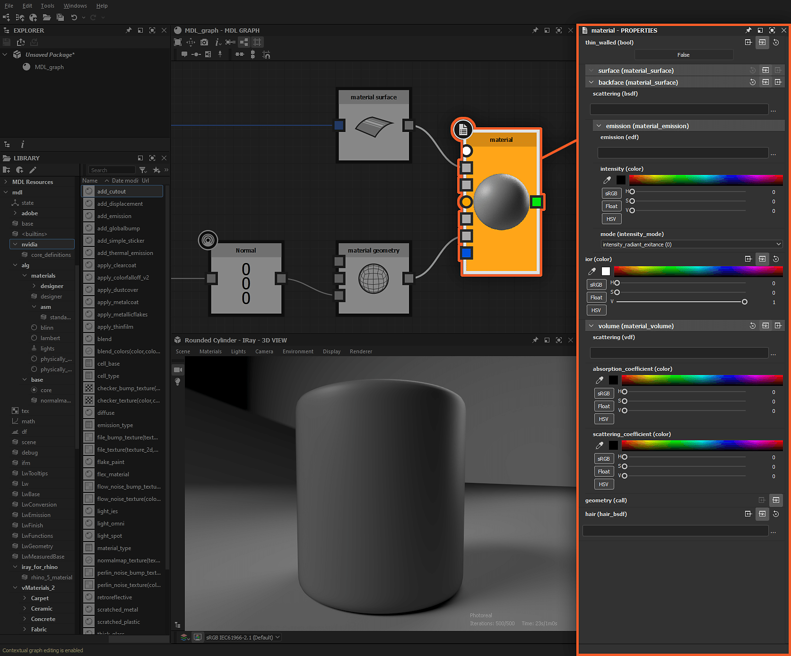

# Concetti principali del grafico MDL

Questa pagina presenta i concetti principali che vanno da *specifici* a [grafici MDL](../../mdl-graphs/mdl-graphs.md) e che dovrebbero essere noti per sfruttare al meglio questo tipo di grafico in Substance 3D Designer.

<table>
<tr style="border: 0;">
<td style="border: 0;" valign="top">

## Iray

I materiali MDL utilizzano una descrizione per soluzioni di rendering basate su dati fisici, supportata dal modulo di rendering [Iray](../../interface/3d-view/iray/iray.md) incorporato in Designer. Pertanto, la visualizzazione del risultato di un grafico MDL *richiede che il modulo di rendering Iray* sia selezionato in una [vista 3D](../../interface/3d-view/3d-view.md) attiva.

</td>
<td style="border: 0;" valign="top">

</td>
</tr>
</table>

Durante la creazione o il caricamento di un grafico MDL, il primo pannello di visualizzazione 3D [sbloccato](../../interface/customizing-your-wor/customizing-your-workspace.md) individuato da Designer passerà *automaticamente* al modulo di rendering [Iray](../../interface/3d-view/iray/iray.md). Se non è disponibile alcuna vista 3D, verrà creato un *nuovo* pannello Vista 3D e verrà attivato il modulo di rendering Iray per ospitare il rendering del materiale MDL in corso di modifica.

Quando il modulo di rendering Iray è selezionato in un pannello di vista 3D, il menu Materiali di tale pannello consente di passare dai materiali MDL disponibili, che includono i materiali caricati nel pannello Esplora risorse ai materiali nella libreria MDL di Designer. Ulteriori informazioni sull&#39;utilizzo dei materiali MDL in Iray sono disponibili nella sezione [Iray](../../interface/3d-view/iray/iray.md) di questa documentazione.

## Nodo principale

Il risultato di un grafico MDL è definito dal nodo <b>Radice</b>. Qualsiasi nodo del grafico può essere impostato come radice purché i relativi dati di output siano di tipo <b>materiale</b>, ovvero una *definizione materiale*. Un grafico MDL può avere *un solo* nodo radice.

In genere, un nodo che può essere impostato come radice può essere *autosufficiente*, poiché contiene già una definizione di materiale che può essere personalizzata passando i dati ai relativi *input*.\
Ad esempio, se desiderate lavorare su un materiale simile al vetro, potete utilizzare una definizione di materiale Vetro come nodo principale come punto di partenza, ma questo è *non obbligatorio*. Molti nodi di materiale sono modellati che possono essere trasformati in qualsiasi materiale complesso utilizzando l&#39;ampio elenco di nodi MDL.

Il nodo principale include una miniatura che visualizza un&#39;anteprima dell&#39;output corrente.

*Nodo principale in un grafico MDL e relative proprietà visualizzate nel [pannello Proprietà](../../interface/properties/properties.md)* *pannello*

## Connettori e tipi

Poiché nei grafici MDL sono presenti molti più tipi di dati rispetto ad altri grafici in Designer, è possibile che si verifichino aspetti univoci dei connettori dei nodi. I concetti importanti da comprendere sono elencati di seguito.

Forma connettore

La *forma del connettore* indica se il tipo di dati è *uniforme* (cerchio) o *variabile* (quadrato).

&quot;Una variabile di tipo uniforme può essere impostata solo su un valore uniforme. Una variabile di tipo variabile può essere impostata su un valore variabile e su un valore uniforme. Il valore risultante nella variabile viene quindi sempre considerato variabile.&quot; (Origine: Sezione 6.3 della [specifica MDL](https://raytracing-docs.nvidia.com/mdl/specification/MDL_spec_1.7.2_17Jan2022.pdf))

Di seguito sono riportati alcuni esempi:

* un campione <b>Texture</b> è *variabile* in quanto i valori sono interessati dal pixel campionato
* un valore <b>Color</b> è *uniforme* in quanto viene passato in modo uguale indipendentemente dal contesto
* un <b>BRDF</b> è *variabile* in quanto i valori sono interessati dall&#39;angolo di incidenza
* un valore <b>Float</b> o <b>Boolean</b> è *uniforme* in quanto viene passato in modo uguale indipendentemente dal contesto

Colore connettore

Il *tipo di dati* proveniente da un connettore di output o previsto da un connettore di input è codificato a colori e visualizzato tra parentesi dopo l&#39;identificatore/etichetta quando si passa il puntatore del mouse sul connettore.

>[!WARNING]
>
> È possibile collegare tra loro solo connettori per *tipi di dati corrispondenti*. L’unico scopo dei codici colore è quello di aumentare la leggibilità riguardo al tipo di dati trasmessi nel grafico e a quali connettori possono essere collegati.

{width="512px"}

*L&#39;aspetto dei connettori varia a seconda del tipo di valore di I/O, visualizzato tra parentesi dopo l&#39;identificatore di I/O*

## Creazione nodo filtrato

Puoi aggiungere qualsiasi nodo disponibile nella categoria <b>mdl</b> della <b>libreria</b> nel grafico *trascinando il nodo* dalla <b>visualizzazione Libreria</b> nella <b>visualizzazione Grafico</b> oppure premendo <b>Barra spaziatrice</b> per aprire il <b>menu Nodo</b> nella visualizzazione Grafico quando *non è selezionato nulla*. In questo caso, viene visualizzato un elenco di nodi *non filtrati*.

Tuttavia, vi sono casi in cui l&#39;elenco dei nodi nel menu Nodo viene filtrato per visualizzare solo i nodi del tipo di dati corrispondente per l&#39;input o l&#39;output di destinazione:

* se è selezionato un *nodo* nella visualizzazione Grafico e viene premuta la <b>barra spaziatrice</b>
* se fai clic su <b>LMB</b>, tieni premuto e *trascina* un collegamento fuori da un *connettore nodo*

È possibile tenere presenti le *regole* applicate per il filtraggio:

* se il menu Nodo viene visualizzato premendo <b>Barra spaziatrice</b> quando è selezionato un nodo *singolo*, l&#39;elenco include nodi in cui il tipo di dati del *primo input* corrisponde al tipo di dati *output* del nodo selezionato
* se il menu Nodo viene visualizzato premendo <b>Barra spaziatrice</b> quando sono selezionati *più* nodi, l&#39;elenco include nodi in cui il tipo di dati del *primo input* corrisponde al tipo di dati *output* del *ultimo nodo selezionato*
* se il menu Nodo viene visualizzato trascinando *un collegamento* da un connettore *output*, l&#39;elenco include nodi in cui il tipo di dati del *primo input* corrisponde al tipo di dati *output* selezionato
* se il menu Nodo viene visualizzato trascinando *un collegamento* da un connettore *input*, l&#39;elenco include nodi in cui il tipo di dati *output* corrisponde al tipo di dati *input selezionato*

*Creazione di nodi filtrati nel grafico MDL, notare le modifiche apportate all&#39;elenco in base al tipo di valore per il connettore*

## Input e texture del grafico

I materiali MDL possono ricevere dati da fonti esterne, ad esempio sotto forma di valori e texture. Questo risultato si ottiene <b>esponendo un nodo</b>, contrariamente al [grafico della Substance](../../compositing-graphs/substance-compositing-graphs.md) in cui esistono nodi di input dedicati per questo scopo.

I dati possono essere passati al nodo esposto a seconda del relativo *tipo*. Ad esempio, i valori Float possono essere passati a un nodo <b>float</b> esposto e una texture può essere passata a un nodo <b>color</b> esposto (in questo caso, i valori RGBA del pixel campionato vengono passati come valore di colore).

*I nodi esposti creano input di grafici che sono sia input di valore raw che campionatori per texture*
