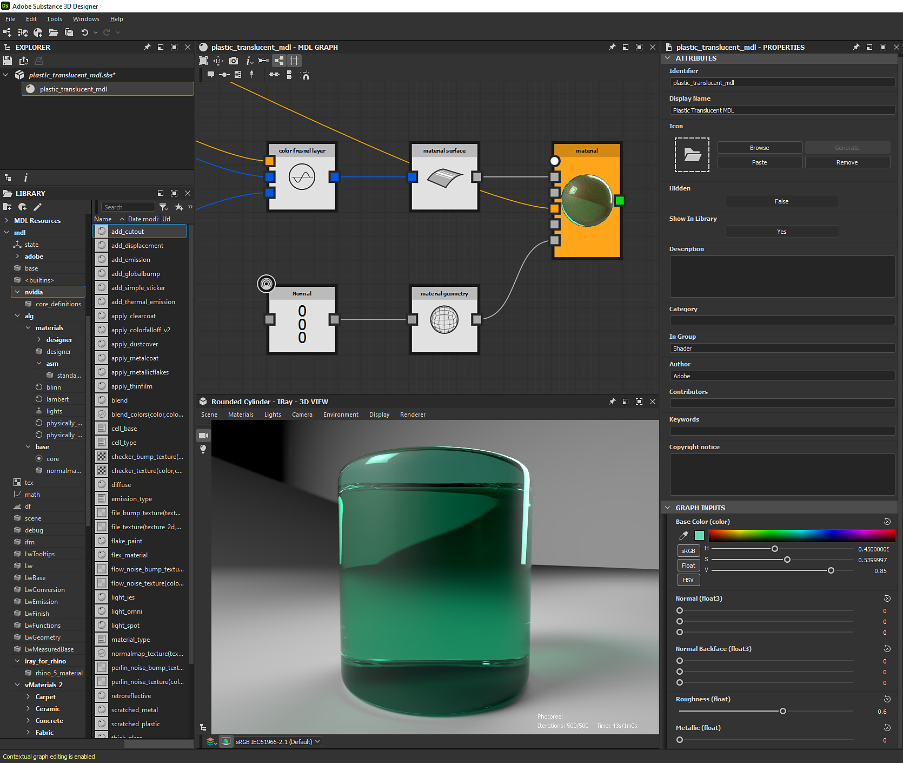

# Grafici MDL

Questa pagina presenta i grafici MDL in Substance 3D Designer, che consentono di creare materiali MDL e visualizzare in anteprima il loro comportamento in tempo reale.

*Malachite con Chrysocolla, materiale MDL di [Mark Foreman](https://www.artstation.com/oggyart)* *disponibile sul nostro [Substance share legacy](https://share-legacy.substance3d.com/libraries/4043)* *piattaforma*

>[!WARNING]
> 
> I grafici MDL e tutte le relative funzionalità sono stati rimossi da Designer nella versione 16.0.0.
> 
> Ulteriori informazioni qui: [MDL graph e fine del ciclo di vita di Iray](../technical-issues/mdl-graph-iray-eol/mdl-graph-iray-eol.md)

+++Sommario

* [Concetti principali del grafico MDL](/help/mdl-graphs/main-mdl-graph-concepts/main-mdl-graph-concepts.md)
* [Creazione di un grafico MDL](/help/mdl-graphs/creating-an-mdl-graph/creating-an-mdl-graph.md)
* [Libreria MDL](/help/mdl-graphs/mdl-library/mdl-library.md)
* [Esposizione dei parametri nei grafici MDL](/help/mdl-graphs/exposing-parameters-mdl/exposing-parameters-in-mdl-graphs.md)
* [Substance grafici e materiali MDL](/help/mdl-graphs/compositing-graphs-and/substance-compositing-graphs-and-mdl-materials.md)
* [Esportazione di contenuto MDL](/help/mdl-graphs/exporting-mdl-content/exporting-mdl-content.md)
* [Avvisi nei grafici MDL](/help/mdl-graphs/warnings-in-mdl-graphs/warnings-in-mdl-graphs.md)
* [Risorse di apprendimento MDL](/help/mdl-graphs/mdl-learning-resources/mdl-learning-resources.md)

+++

## Panoramica

MDL sta per [Materials Definition Language](http://www.nvidia.com/object/material-definition-language.html): &quot;una tecnologia sviluppata da [NVIDIA](https://www.nvidia.com/) per definire materiali basati fisicamente per soluzioni di rendering basate fisicamente&quot;. (Fonte: [Documentazione NVIDIA MDL](https://raytracing-docs.nvidia.com/mdl/index.html))

Utilizzando questo linguaggio, una definizione completa del materiale è portatile e può quindi essere utilizzata tra applicazioni e moduli di rendering per un output coerente. Substance 3D Designer è attualmente l&#39;applicazione *only* che offre funzioni di authoring nodale basate su grafici dei materiali MDL, esponendo le funzioni e i tipi di valore MDL come nodi in un grafico MDL.

Durante la creazione di materiali, puoi utilizzare il modulo di rendering [Iray](../interface/3d-view/iray/iray.md) di NVIDIA, incorporato in Designer e disponibile nel pannello [Vista 3D](../interface/3d-view/3d-view.md), per visualizzare in anteprima il comportamento del materiale *in modo interattivo*.

I grafici MDL sono complementari con i [grafici a Substance](../compositing-graphs/substance-compositing-graphs.md) in quanto quest&#39;ultimi generano *texture* che possono essere *campionati* dal materiale MDL per influenzarne il comportamento e l&#39;aspetto.

Ti consigliamo di scorrere le sezioni di questa documentazione *in ordine* per un percorso di apprendimento guidato, iniziando dalle proprietà di una risorsa grafico MDL, appena sotto.\
Vuoi entrare? Introduzione ai grafici MDL nella sezione Risorse di apprendimento MDL.

>[!NOTE]
>
> Ulteriori informazioni sull&#39;implementazione tecnica del linguaggio di definizione dei materiali sono disponibili nella [documentazione NVIDIA MDL](https://raytracing-docs.nvidia.com/mdl/index.html), che include collegamenti alla specifica MDL e al [manuale MDL](http://mdlhandbook.com/), tutti creati e gestiti da NVIDIA.

*Proprietà del grafico MDL nel pannello Proprietà*

## Proprietà grafico MDL

### Attributi

Questa sezione include informazioni relative al materiale MDL ai fini dell&#39;identificazione, della classificazione e dell&#39;accertamento della paternità.

* <b>Identificatore</b>: il nome della risorsa, che deve essere univoco sotto il relativo elemento padre nel pacchetto
* <b>Nome visualizzato</b>: il nome del materiale MDL visualizzato nell&#39;interfaccia
* <b>Icona</b>: immagine utilizzata come miniatura per questo grafico nella libreria di Designer
* <b>Nascosto\*</b>: se impostato su* Vero*, il materiale MDL non è visibile in una libreria MDL, ma esiste ancora internamente e può essere utilizzato come riferimento
* <b>Mostra nella libreria</b>: se impostato su *Vero*, il grafico MDL viene visualizzato nella libreria di Designer
* <b>Descrizione</b>: descrizione del materiale MDL, che può essere visualizzato nella descrizione dei nodi di istanza che fanno riferimento a questo grafico
* <b>Categoria\*</b>: la categoria a cui appartiene il grafico MDL. Al momento questo non influisce sull&#39;ordinamento del grafico nella [libreria](../interface/the-library/the-library.md) di Designer
* <b>Nel gruppo\*</b>: il gruppo di librerie a cui appartiene il materiale MDL
* <b>Autore\*</b>: autore del materiale MDL
* <b>Collaboratori\*</b>: i collaboratori del materiale MDL diversi dall&#39;autore
* <b>Parole chiave\*</b>: le parole chiave che possono essere utilizzate per trovare il materiale MDL in una ricerca nella libreria
* <b>Avviso di copyright\*</b>: l&#39;avviso di copyright relativo all&#39;autore e all&#39;utilizzo del materiale MDL

Nota: le proprietà contrassegnate da un asterisco (\*) sono annotazioni MDL che devono essere utilizzate dalle integrazioni della libreria MDL e hanno* nessun impatto* in Designer.

### Input del grafico

In questa sezione vengono elencati i parametri interattivi collegati ai parametri esposti del grafico MDL e ne vengono definiti *i valori predefiniti*. Possono essere *modificati* e *riordinati* in qualsiasi momento.

L&#39;interfaccia e il comportamento di questi input sono definiti dal *tipo di valore* e dagli *intervalli* dei parametri esposti a cui sono connessi. Ad esempio:

* Un valore esposto di tipo <b>Float</b> impostato su un intervallo soft di [0.0,4.0] verrà visualizzato come *cursore singolo* compreso tra 0,0 e 4,0
* Un valore esposto di tipo <b>Colore</b> verrà visualizzato come *widget colore*, che include una sfumatura di selezione e una miniatura di colore

Per riordinare gli input del grafico, posiziona il cursore sulla *maniglia scura* a sinistra del parametro, fai clic e *tieni premuto* <b>LMB</b> e trascina il cursore verso l&#39;alto o il basso. Questo ordine personalizzato verrà utilizzato per visualizzare le proprietà del materiale MDL nei seguenti contesti:

* Nodi di istanza che fanno riferimento al grafico MDL per questo materiale
* Proprietà del materiale nella [vista 3D](../interface/3d-view/3d-view.md)
* Integrazioni MDL di terze parti
