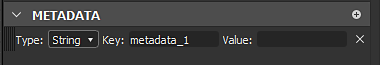

# Metadati pacchetto

I metadati del pacchetto sono un dizionario di valori di testo (stringa) definiti a livello di pacchetto. È incluso nella SBSAR durante la pubblicazione ed è un archivio di uso generale destinato ad essere utilizzato dalla scrittura pitone.

## Visualizzazione e modifica dei metadati tramite l’interfaccia di Designer

Se state sviluppando un plug-in Python, potete modificare manualmente i metadati a scopo di test e debug. Ecco come potete fare:

1. Se fai doppio clic su un pacchetto nell&#39;esploratore, si apre il pannello Proprietà su questo pacchetto.

   
1. Ecco una sezione dedicata, &quot;Metadati&quot;. Nel tuo caso potrebbe essere vuoto, come nell’immagine precedente.

   Potete aggiungere nuovi metadati mediante il pulsante &quot;più&quot;.

   
1. Viene visualizzato un nuovo elemento nella sezione:

   
1. Sono disponibili i campi &quot;Chiave&quot; e &quot;Valore&quot;. Entrambi possono essere impostati su qualsiasi cosa si adatti alle vostre esigenze. Il campo &quot;Chiave&quot; deve avere un valore univoco in tutto l’elenco.

   
1. Potete anche scegliere il &quot;Tipo&quot; dell&#39;elemento. Al momento può essere &quot;String&quot; o &quot;URL&quot;:

   
1. Qui &quot;URL&quot; indica un riferimento a una risorsa inclusa nel pacchetto. A tale scopo, scegli un file sul disco rigido e trascinalo sul pacchetto in Esplora risorse. Può essere una risorsa normale, come un&#39;immagine, o qualsiasi altro file, come un file di testo.

   
1. Il file viene visualizzato come nuova risorsa nel pacchetto.

   Ora torna al pannello Proprietà del pacchetto, crea un nuovo metadati, assegnagli una chiave appropriata e scegli &quot;URL&quot; come tipo. Quindi seleziona &quot;...&quot; nel campo &quot;Valore&quot; e scegliere &quot;Da risorsa&quot;. Infine, scegli il file appena incluso e convalidalo:

   
1. Ora puoi vedere che l&#39;&quot;URL&quot; della risorsa è memorizzato nel campo &quot;Valore&quot;.

   Puoi anche eliminare i metadati utilizzando il pulsante &quot;X&quot; a destra dell’elemento:

   

>[!NOTE]
>
> Lo spostamento o il riordinamento delle voci di metadati è disabilitato: l&#39;ordine non è significativo e non verrà mantenuto durante la pubblicazione del pacchetto.

## Metadati nei file SBSAR pubblicati

In alcuni casi, potrebbe essere necessario recuperare i metadati definiti in un pacchetto nel SBSAR pubblicato corrispondente. Di seguito potete leggere come i metadati vengono trasformati e archiviati nell&#39;archivio e il modo corretto per sfruttarli.

I metadati vengono memorizzati in base al formato JSON in un file denominato /assemblies/content/0000/metadata.json (il percorso è relativo alla cartella principale dell&#39;archivio .sbsar).

I metadati regolari (stringa) vengono memorizzati così come sono, ad esempio &quot;chiave&quot;: &quot;valore stringa&quot;, uno per riga. Anche in questo caso, l&#39;ordine originale delle varie chiavi non viene mantenuto e viene definita l&#39;implementazione. Non fare mai affidamento sull&#39;ordine nel vostro processo, come con i normali pitoni dicts!

Poiché lo scopo dei metadati URL è quello di consentire agli utenti e ai plug-in di includere file esterni nell&#39;archivio .sbsar, questi sono soggetti a una trasformazione specifica: In primo luogo, il file della risorsa che corrisponde all&#39;URL archiviato viene copiato nell&#39;archivio in un percorso definito dall&#39;implementazione (di solito in una sottocartella numerata, che conterrà solo questo file. Lo scopo è evitare conflitti di nomi.) Il file manterrà il nome originale (il nome della risorsa viene ignorato a questo punto). Quindi, invece dell&#39;URL originale in metadata.json, viene scritto il percorso del file copiato nell&#39;archivio relativo a metadata.json.

Se esportiamo il pacchetto di esempio creato nella sezione precedente (dopo aver creato almeno un grafico con alcuni output), otteniamo questo contenuto di archivio:

```
myPackage.sbsar

|-- assemblies

        |-- content

            |-- 0000

                |-- New_Graph.sbsasm

                |-- New_Graph.xml

                |-- metadata.json

                |-- resources

                    |-- 0

                        |-- TEXT.txt
```


E il contenuto metadata.json è:

```
{

    "myResource": "resources/0/TEXT.txt",

    "myText": "This is a text"

}
```


Al momento, non viene fornito alcuno strumento specifico per accedere ai metadati e alle risorse archiviate. Il metodo consigliato consiste nell&#39;aprire l&#39;archivio con il decodificatore LZMA di tua scelta e nell&#39;analizzare il file metadata.json con un normale parser JSON (se le chiavi o le stringhe di valori contengono alcuni caratteri complessi, verranno ignorate nel modo JSON).

>[!NOTE]
>
> Non sono disponibili informazioni sul fatto che ogni metadati fosse una stringa semplice o un URL, quindi devi sapere cosa significa ogni chiave che vuoi leggere.
