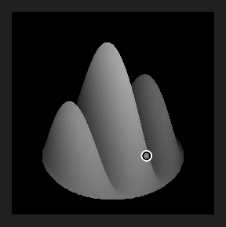

# Versione 2019.1 (9.1)

**Il Substance Designer 2019.1** introduce un nuovo aggiornamento nella Substance Engine per espandere ulteriormente le funzionalità e aggiungere nuovi filtri.

## Caratteristiche principali

### Nuovo nodo processore a valore aggiunto

La Substance Engine è ora nella versione 7 e con essa porta il nuovo concetto di &quot;Valori&quot; all&#39;interno del grafico di composizione. I valori sono numeri e non texture e come tali possono essere utilizzati per eseguire vari calcoli che possono essere condivisi tra nodi tramite i grafici delle funzioni e i grafici di composizione. Il nodo Processore valori può leggere un&#39;immagine di input e calcolare un singolo valore di output.

Il nodo Processore valori non è l&#39;unico nodo in grado di consentire il transito delle informazioni sul grafico. Sono state apportate alcune modifiche e aggiunte:

* I nodi di output possono essere alimentati direttamente con un valore e non necessariamente più con un&#39;immagine.

  
* È stato aggiunto un nuovo **nodo di input** denominato &quot;Valore di input&quot; in modo che il grafico possa eseguire query sui valori.

  
* I nodi dispongono ora di una nuova categoria al di sotto dei parametri denominati &quot;Valori di input&quot; che può essere utilizzata per creare valori di input per il nodo stesso.\
  I valori di input possono quindi essere referenziati all&#39;interno del grafico delle funzioni tramite i nodi &quot;Get&quot;.

  

>[!NOTE]
>
> Come per ogni modifica della Substance Engine principale, la modalità di compatibilità è impostata sulla versione precedente (la nuova versione 6 per impostazione predefinita). Questo significa che i nodi incompatibili avranno un bordo giallo nel grafico. Per disattivare o nascondere il bordo giallo è sufficiente cambiare la versione del motore nelle impostazioni principali alla versione più recente (tramite le impostazioni del progetto):
> 
> 

### Supporto di Optix nei forni

L&#39;ultimo aggiornamento del Substance Designer ha introdotto DXR che consente di eseguire il Raytracing GPU su hardware compatibile RTX compatibile. Ora abbiamo aggiunto il supporto per [Optix](https://developer.nvidia.com/optix) che consente di eseguire raytrace su altre GPU Nvidia anche in Linux. Con Optix è possibile ottenere una cottura al forno almeno **5 volte più veloce** rispetto alla normale traccia di raytracing della CPU.

Ecco l&#39;elenco dei panettieri interessati da questa modifica:

* Occlusione ambientale dalla trama
* Normali incurvate da trama
* Thickness da trama

Se desideri disattivare uno dei due backend, passa alle preferenze principali (**Modifica > Preferenze**) e alle impostazioni dei Baker:

>[!NOTE]
>
> Per accedere alla funzionalità, assicurati di **eseguire l&#39;aggiornamento ai seguenti driver**:
> 
> * GPU Nvidia 10XX e 20XX: **driver 430.39** (compatibili sia con DXR che con Optix)
> * Nvidia 9XX e versioni precedenti: **d** **fiumi 419.67 o 430.39** (i driver 425.31 hanno un problema con Optix)
> 
> L&#39;DXR è disponibile anche su [GPU GeForce GTX 10xx](https://www.nvidia.com/en-us/geforce/news/geforce-gtx-dxr-ray-tracing-available-now/) (con driver aggiornati). L&#39;DXR richiede inoltre che Windows sia aggiornato per funzionare. Per ulteriori informazioni, vedere [questa pagina](../../../best-practices/performance-optimization/performance-optimization-guidelines.md).

### Tempi di caricamento migliorati per le trame OBJ

In questa versione è stato migliorato il lettore di file **obj** per ridurre il tempo di caricamento delle trame 3D. I tempi di caricamento sono stati fino a 3 volte più veloci, specialmente per le trame per le quali non sono stati definiti UV e normali.

Questo miglioramento delle prestazioni influirà sia sui Baker che sul vista 3D.

### Sistema Plug-In Python Migliorato

Con questo aggiornamento abbiamo aggiunto molte nuove funzioni al sistema di scripting:

* **Supporto di Qt**: consente di creare un&#39;interfaccia utente personalizzata che segue lo stesso stile del resto dell&#39;applicazione. L&#39;interfaccia utente personalizzata può anche essere integrata molto più facilmente con questo nuovo sistema. (Tkinter è ora deprecato).
* **Funzioni di richiamata**: è ora possibile registrare le funzioni di richiamata. Al momento comprende solo l’apertura e il salvataggio dei file e la creazione di elementi dell’interfaccia utente. Ulteriori callback verranno aggiunti in futuro.
* **Threading**: i plug-in possono ora creare thread per eseguire l&#39;elaborazione in background o attendere eventi del sistema operativo (ad esempio connessioni di rete).

Per ulteriori informazioni, consulta il changelog dell&#39;API a cui è possibile accedere tramite la voce di menu **Aiuto > Documentazione dell&#39;API Python** all&#39;interno del Substance Designer.

### Nuovo contenuto

Nella libreria predefinita sono inoltre disponibili alcuni nuovi nodi, alcuni dei quali sono ora alimentati con il nuovo nodo di Processore di valori:

* **Flood Fill all&#39;indice**\
  Assegna un indice univoco alle forme da un nodo di Flood Fill.\
  Nell&#39;esempio seguente il nodo di Elaboratore pixel fa corrispondere il valore di input alla forma e genera quindi una maschera.

  
* **Non Uniform Directional Warp**\
  Applica un’Alterazione direzionale in cui l’intensità e l’angolo vengono campionati dagli input dell’immagine.

  
* **Alterazione direzionale multipla**\
  Altera più volte l’immagine di input in varie direzioni.

  
* **Height Extrude**\
  Genera un rendering 3D ortografica del Height specificato. La vista della telecamera può essere controllata con il gizmo posizione.

  
* **Valore minimo/massimo**\
  Restituisce il valore minimo e massimo dei pixel dell&#39;immagine di input.

  

>[!WARNING]
>
> Questa versione non supporta più CentOS 6.x. Per utilizzare la versione più recente del Substance Designer, esegui l&#39;aggiornamento a CentOS 7.x.

## Note sulla versione

### 2019.1.3

*(Rilasciato Il 19 Agosto 2019)*

**Corretto:**

* [Baker] Arresto anomalo in DXR quando le proporzioni dell&#39;output eseguo i baking e della mappa di inclinazione non corrispondono
* [Baker] Il baker &quot;Occlusione ambientale da trama&quot; genera risultati errati con Optix o DXR quando si utilizza una Mappa normale
* [Baker] Il baker &quot;Curvatura&quot; genera risultati errati quando si utilizza l’impostazione &quot;Per vertice&quot;
* [Baker] I messaggi di errore indicano il backend che non è riuscito invece della causa dell&#39;errore
* [Baker] Arresto anomalo durante l&#39;elaborazione di un baker di mappe di dettaglio senza una trama poly elevata
* [Baker] La mappa di inclinazione non sembra influire su tutto l’output con DXR abilitato
* [Content] mg\_leaks: errore di battitura nel nome dei parametri
* [Content] &quot;Shape&quot; restituisce un avviso di cottura
* [Content] I poligoni 1 e 2 non supportano funzioni casuali
* [Content] Il poligono 1 e 2 può avere meno di 3 lati
* [Content] Normale alla sede centrale del Height non funziona correttamente in non quadrato
* [Parametri] Parametri di input interi: l&#39;elenco a discesa non mostra i valori

### 2019.1.2

*(Rilasciato il 2 luglio 2019)*

**Corretto:**

* [vista 3D] L’esportazione vista 3D con la profondità di campo attivata non sembra corretta
* [vista 3D] Il Canale alfa di immagini PSD è errato quando si utilizza il rendering di salvataggio
* [vista 3D] I file PNG e PSD non funzionano quando si utilizza l’opzione Salva rendering con Iray
* [Vista 3D] il formato dds non funziona durante il salvataggio del rendering
* [Grafico] I nodi vengono sfalsati quando si combina destra e sinistra e si fa clic sul trascinamento in modi specifici
* [Grafico] Quando si modificano le istanze di una funzione, il risultato del nodo non viene più aggiornato
* [Grafico] Arresto anomalo durante la visualizzazione del menu Barra spaziatrice
* [Contenuto] Estrusione forma: problema di qualità quando la forma non ha rotazione
* [Contenuto] Ombra esterna forma (e scala di grigi) non produce ombre senza Affiancamento H e V
* [Contenuto] Problema normale di Ritaglio materiale
* [Baker] I predefiniti dei baker JSON non vengono caricati correttamente
* [Baker] Arresto anomalo quando si eseguono i baking trame pesanti utilizzando Optix o DXR (ora potrebbe non riuscire a causa di Vram insufficiente, ma non arresto anomalo)
* [Editor bitmap] Gli strumenti di pittura bitmap spostano i tratti e ridisegnano nel rettangolo di selezione del tratto
* [Editor bitmap] Strumenti di pittura bitmap danneggiati in OSX
* [UI] Il menu di alcuni pulsanti è a malapena raggiungibile
* [UI] Arresto anomalo durante il trascinamento di un’istanza di baker
* [SVG] Gli strumenti di modifica di SVG incorporati non sono affidabili
* [Parameters] Arresto anomalo quando si applica un predefinito con parametri booleani in un&#39;istanza SBSAR
* [Rete] Arresto anomalo talvolta quando si verifica un errore in una connessione crittografata SSL

### 2019.1.1

*(Rilasciato Il 28 Maggio 2019)*

**Aggiunto:**

* [PythonIntegration] Salvare e ripristinare lo stato di Gestione plug-in
* [Preferenze]&#x200B;[Dipendenze] Aggiungi un’opzione per determinare come archiviare il percorso del file delle dipendenze
* [Content] Mappatura Flood Fill: aggiungete un&#39;opzione &quot;Adatta casella forma&quot;

**Corretto:**

* [Content] Mappatura Flood Fill: &quot;Rotazione Scala automatica&quot; fa l&#39;effetto opposto
* [Content] L&#39;input &quot;luminance\_offset\_map&quot; non viene utilizzato da &quot;Flood Fill Mapper Color&quot;
* [Content] Il nodo &#39;Mappatura Flood Fill scala di grigi&#39; genera artefatti di incremento
* [Content] Impossibile pubblicare il Height Extrude
* [Parametri] I predefiniti incorporati in sbsar non vengono caricati in Designer
* [Panettieri] Il nome del panettiere non viene visualizzato correttamente nell&#39;elenco panettieri
* [Vista 3D] &quot;Visualizza output in Vista 3D&quot; non funziona per i valori
* [Cooker] Arresto anomalo durante la correzione di un tipo di parametro errato
* [API] La funzione SDResource.setInputPropertyFromId non funziona sui parametri di input SDSBSCompGraph
* [Updater] alcuni sbs non possono essere aggiornati nel 2019
* [Explorer] Arresto anomalo durante l&#39;importazione di un file .obj specifico
* [PythonIntegration] Backslash non eseguito correttamente in Windows durante l&#39;inizializzazione di PYTHONPATH
* [UI] problema di valore con alcuni cursori nei panifici
* [Linux] Designer non può essere eseguito su CentOS &lt; 7.6

### 2019.1

*(Rilasciato il 9 maggio 2019)*

**Aggiunto:**

* [API] Aggiungi il parametro &#39;updatePackages&#39; al metodo SDPackageMGR.loadUserPackage() per controllare se gli aggiornamenti devono essere applicati o meno durante il caricamento
* [API] Aggiungi la possibilità di disconnettere una connessione SDConnection
* [API] Aggiungi la classe SDSBSARExporter per pubblicare un pacchetto SDP
* [API] Aggiungi la classe SDHistoryUtils per gestire i comandi non eseguibili
* [API] Aggiungere la definizione del nodo di input in scala di grigio nel grafico composizione Substance (sbs::compositing::input\_grayscale)
* [API] Aggiungere la definizione del nodo di input del valore in Substance grafico di composizione (sbs::compositing::input\_value)
* [API] Aggiungere il metodo SDProperty.isFunctionOnly()
* [API] Aggiungi il supporto del parametro di input personalizzato in SDSBSCompNode
* [API] Aggiungi il parametro &#39;reloadIfModified&#39; al metodo SDPackageMGR.loadUserPackage() per controllare se un pacchetto è stato ricaricato se modificato
* [API] Aggiungi metodo SDPackageMgr.getPackages()
* [API] Aggiunta della possibilità di ottenere, aggiungere o rimuovere percorsi radice da SDModuleMgr
* [API] Consente di ottenere il puntatore del buffer dei pixel e l&#39;intonazione di un&#39;estensione SDT
* [API] Consente di recuperare il puntatore di MainWindow.
* [API] Consente di creare menu personalizzati nel menu principale
* [API] Consente di creare DockWidget personalizzati nella finestra principale
* [API] Utilizzare i nomi degli oggetti per trovare i menu nelle barre degli strumenti
* [API] Fornisci il sistema per gestire le notifiche delle applicazioni all’API
* [PythonIntegration] Aggiungi variabile di ambiente predefinita per cercare i plug-in python
* [PythonIntegration] Aggiungi la ricerca di testo e sostituiscilo nell&#39;editor Python
* [PythonIntegration] Instanciare i plug-in Python all&#39;avvio
* [PythonIntegration] Considera variabile di ambiente PYTHONPATH
* [PythonIntegration] Consente la creazione di barre degli strumenti nei widget del grafico
* [PythonIntegration] Supporto dei thread Python
* [PythonIntegration] Aggiungi una gestione dei plug-in (nel menu &#39;Strumenti&#39;)
* [Content] Rotazione vettoriale normale: aggiungete un input immagine opzionale per guidare l&#39;angolo
* [Content] Nuovo filtro Min/Max
* [Content] Nuovo filtro &quot;Flood Fill per indicizzazione&quot;
* [Content] Nuovo filtro &quot;Mappatura Flood Fill&quot;
* [Content] Nuovo filtro Atlas splitter
* [Content] Migliora il filtro Tri Planar
* [Content] Nuovo filtro Non Uniform Directional Warp
* [Content] New Multi Directional Warp (Contenuto)
* [Content] Nuovo filtro Height Extrude
* [Engine] Fxmap: nuovo pattern &quot;Gradazione con offset&quot;
* [Engine] Supporto per l&#39;elaborazione uniforme dei valori (nuovo nodo Processore valori)
* [3D View]&#x200B;[Bakers] Miglioramento delle prestazioni del caricatore OBJ
* [Vista 3D] Aumentare le distanze piane della clip della videocamera
* [Preferenze] Aggiungere impostazioni per i panettieri
* [Grafico] Annullare la convalida più rapidamente evitando i confronti tra stringhe
* [MDL] Supporto di array MDL
* [UI] Miglioramenti dell’interfaccia utente per la selezione del motore
* [IRay] Aggiornamento a IRay SDK 2018.1.4
* [Gestione dipendenze] Utilizzare &quot;ultimo percorso&quot; quando si riposiziona una risorsa
* [Cucinare] Aggiungi il supporto delle etichette booleane nella barra degli strumenti
* Integrazione Di Qt 5.12.2

**Corretto:**

* [Grafico] Le connessioni sono interrotte quando si modifica il nome dell&#39;input
* [Grafico] Troppe invalidazioni vengono attivate quando si modificano i parametri
* [Grafico] L’azione &quot;Copia negli Appunti&quot; non funziona se si fa clic con il pulsante destro del mouse su un badge
* [Grafico] Lo spostamento di un fotogramma utilizzando Alt non è memorizzato nel file .sbs
* [MDL] Il profilo colore non viene aggiornato automaticamente nell&#39;editor MDL
* [MDL] arresto anomalo durante l’esportazione di un modulo che contiene una configurazione specifica
* [MDL] Impossibile esportare un grafico MDL contenente un LightProfile o una risorsa MBSDF
* [UI] Le scelte rapide non vengono più visualizzate nei menu di scelta rapida
* [UI] La finestra mobile diventa ancorabile dopo il riavvio
* [Scripting] L’opzione Annulla non funziona nell’editor Python
* L’opzione [Scripting] &quot;Sì a tutti&quot; nel menu Salva non funziona
* L&#39;elenco a discesa [Parametri] non viene visualizzato correttamente dopo la copia
* [Esplora risorse] Per impostazione predefinita, quando si riposizionano le risorse viene aperto l&#39;ultimo percorso riposizionato
* [Libreria] Il contenuto della libreria viene sempre ricostruito quando si passa da una versione all&#39;altra
* [Library] Le bitmap importate vengono invalidate al salvataggio
* [IRay] Lo spazio tangente non è calcolato correttamente / mappatura normale non corretta
* [Funzione] Arresto anomalo o errore durante la creazione di un nuovo grafico da una selezione
* [API] valore predefinito delle proprietà non definito
