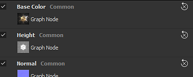
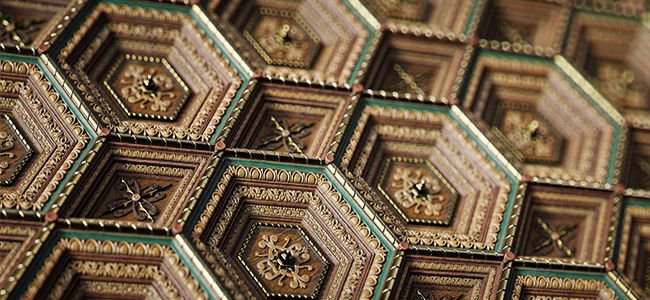
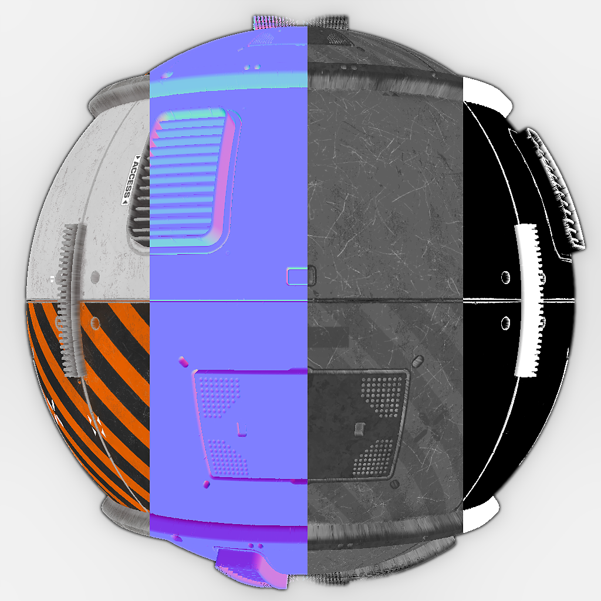

# Versione 2020.1 (10.1)

**Substance Designer 2020.1** include un nuovo editor di scelte rapide da tastiera, un plug-in MaterialX e numerosi nuovi miglioramenti per la gestione del colore, con funzionalità di Adobe Color Engine e nuove funzionalità di baker.

Data di pubblicazione: *10 aprile 2020*

>[!NOTE]
>
> A partire da questa versione, il numero di versione dell’applicazione cambierà formato. Quello che avrebbe dovuto essere **2020.1** ora diventa **10.1.0**.

## Caratteristiche principali

### Nuovo editor di Scelte rapide da tastiera per la creazione di nodi

In questa versione introduciamo un nuovo editor di scelte rapide da tastiera che consente di definire scelte rapide da tastiera per velocizzare la creazione di nodi nelle diverse modalità del grafico.

Il nuovo editor di scelte rapide da tastiera è accessibile nelle preferenze principali tramite **Modifica > Preferenze > Scelte rapide**. Per impostazione predefinita, ogni campo scelta rapida da tastiera è vuoto.

* **Scelte rapide per ogni tipo di grafico**\
  È possibile definire una scelta rapida da tastiera per ogni tipo di grafico disponibile in Substance Designer, dal grafico di composizione regolare a quello più avanzato come funzioni e MDL.

  
* **Assegnare scelte rapide sia per i nodi atomici che per i filtri personalizzati**\
  Per impostazione predefinita, l’interfaccia mostra i nodi atomici per ogni tipo di grafico. L’utilizzo del campo di ricerca consente di perfezionare l’elenco, ma anche di rendere accessibili i filtri e i nodi libreria personalizzati:

  
* **Creazione di una nuova scelta rapida da tastiera**\
  Per creare una nuova scelta rapida da tastiera per un nodo specifico, è sufficiente fare clic nel campo di testo accanto al nome e digitare i tasti richiesti sulla tastiera. Per cancellare una scelta rapida da tastiera, usa il pulsante x.

  
* **Gestione dei conflitti delle scelte rapide**\
  Per ulteriori informazioni su un conflitto, utilizzate la descrizione comandi sull’icona di avviso. Indica se una chiave è in conflitto con una chiave esistente o se è già utilizzata dall&#39;applicazione per un altro scopo.

  

  
* **Cerca scelte rapide**\
  Nel caso in cui siano presenti troppe scelte rapide da tenere traccia o se un nodo non è visibile per impostazione predefinita, utilizza il sistema di ricerca per isolarle:

  

### Nuovo plug-in MaterialX (Beta)

Durante SIGGRAPH 2019 abbiamo mostrato un plug-in MaterialX per Substance Designer. [MaterialX](http://www.materialx.org/) è un formato sviluppato da [Industrial Light &amp; Magic (ILM)](https://www.ilm.com/) che consente agli artisti di creare materiali che possono quindi essere utilizzati in un&#39;ampia varietà di piattaforme e in molti usi (ad esempio film, programmi TV, giochi, esperienze VR e produzione). Questo nuovo plug-in, ora disponibile in versione beta, consente di creare materiali MaterialX da utilizzare in altre applicazioni DCC compatibili. Date un&#39;occhiata al nostro recente [articolo su MaterialX](https://magazine.substance3d.com/research-a-portable-shader-graph/) per saperne di più sul processo e gli obiettivi di questo nuovo plug-in.

Questo nuovo plug-in consente di:

* Sviluppate ombreggiature di procedurali e texture in parallelo.
* Crea ombreggiature avanzate per la Substance Painter con funzioni come mappe di dettaglio e maschere di procedurali modificabili in fase di runtime.
* Corrispondenza delle funzionalità di shader da un motore di gioco o da una pipeline VFX nella finestra della vista Substance Designer e Substance Painter.

Per ottenere il plug-in, passa a [Substance share](https://share.substance3d.com/libraries/6111) per scaricarlo.

### Nuova integrazione degli Adobi Color Engine (ACE)

Oltre all&#39;OpenColorIO è ora possibile utilizzare l&#39;Adobe Color Engine (ACE) per supportare i profili ICC per la gestione del colore. Ciò significa che ora è possibile importare ed esportare immagini calibrate in modo che corrispondano ad altri software come Photoshop e Illustrator.

* **Abilitazione dell&#39;Adobe Color Engine**\
  Usate le impostazioni del progetto per definire il sistema di gestione del colore da usare:

  
* **Modifica del profilo dello schermo**\
  Quando visualizzate l’anteprima delle immagini tramite la vista 2D o 3D, usate il menu a discesa per specificare il profilo da usare:

  
* **ACE per la gestione dei colori precedente**\
  Il Trasforma di output con mappatura tonale ACE è ora disponibile con la modalità di gestione colore legacy.

### Baker migliorati

Abbiamo rifinito alcuni dei nostri panettieri con due cambiamenti principali:

* **Campionamento migliorato**\
  L&#39;Occlusione ambiente, il Thickness e il fornaio curvato ora utilizzano un nuovo metodo di campionamento che migliora notevolmente la qualità dei risultati del forno. Produce un disturbo più accattivante e risultati più stabili, senza la necessità di aumentare il numero di campioni. L’immagine seguente mostra il precedente metodo di campionamento in alto e il nuovo metodo in basso con da sinistra a destra 4, 8 e 16 campioni (tutti i rendering sono stati eseguiti con l’antialiasing impostato su subsampling 4x4).

  {width="600px"}
* **Nuova impostazione di normalizzazione**\
  I forni Thickness e Heightmap hanno un nuovo parametro di normalizzazione che consente di applicare i valori raw alla texture invece dei valori bloccati nell’intervallo 0-1. Questo è utile, ad esempio, con una mappa del height per conoscere le distanze prime tra una trama a basso e ad alto poli. Il valore del divisore corrisponderà esattamente all’intensità di spostamento da impostare sulla trama low-poly in modo che corrisponda alla silhouette della trama high-poly. Per interpretare correttamente la mappa del height, abbiamo anche esposto un nuovo parametro &quot;Scalar Zero Value&quot; per definire il valore del pixel corrispondente a 0. Inoltre, il fattore manuale consente di correggere potenziali problemi di giuntura sulle trame UDIM causati da una normalizzazione UV-Tile.

  

### Vista 3D migliorata

La vista 3D ha ricevuto vari miglioramenti della qualità della vita che dovrebbero rendere il lavoro quotidiano più piacevole:

* **Sincronizzazione dei parametri tra i moduli di rendering**\
  I parametri dello shader sono ora sincronizzati tra OpenGl e Iray, il che semplifica notevolmente il passaggio da uno all’altro.
* **Visualizza l&#39;anteprima dell&#39;input della texture e aggiungi il parametro disable**\
  I parametri di input dello shader ora visualizzano un&#39;anteprima del loro input: può essere un parametro di colore uniforme, un nodo grafico o una bitmap. È inoltre possibile deselezionare un parametro per disattivarlo temporaneamente.

  

  
* **Anteprima mappa ambiente nelle impostazioni**\
  Quando si passa a **Vista 3D > Ambiente > Modifica**, ora è disponibile un&#39;anteprima della mappa ambiente utilizzata per illuminare la scena.

  
* **Nuovo shader non illuminato**\
  Per impostazione predefinita è stato incluso un nuovo shader denominato &quot;unlit&quot;. Non reagisce ad alcuna illuminazione e può essere utilizzata per visualizzare una singola texture nella finestra della vista su una trama. Questo è utile ad esempio per osservare le texture cotte.

  {width="500px"}
* **Prestazioni migliorate su schermi ad alto DPI con downscaling della finestra della vista**\
  Analogamente a Substance Painter, ora è disponibile un nuovo parametro denominato **Ridimensionamento finestra** nelle preferenze principali che rileva che una schermata utilizza il ridimensionamento HDPI (ad esempio schermate Retina in MacOS) e divide automaticamente la risoluzione della finestra della vista per 2. In questo modo si evita di impostare la finestra della vista a risoluzioni troppo alte e si migliorano le prestazioni generali.\
  I valori di impostazione correnti sono:

  * **Nessuno**: nessun ridimensionamento della finestra della vista.
  * **Automatico** (impostazione predefinita): se l&#39;applicazione si trova su uno schermo HDPI, la risoluzione della finestra della vista sarà divisa per due.

  

### Nuovo contenuto

Questa versione include anche alcuni nodi nuovi o migliorati:

* **Nodo di PBR render migliorato**\
  Già introdotto in una versione precedente, questo nodo è stato notevolmente migliorato. Ora offre controlli videocamera, nuove forme (come un piano e un cilindro), post-effetti (Profondità di campo, Bloom/Glare, Vignettatura, ecc.) e nuovi tipi di materiale (come Clear-Coat e Anisotropia), nonché supporto per materiali con opacità.\
  Per ulteriori informazioni, consulta la [pagina della documentazione](../../../compositing-graphs/nodes-reference-for-com/node-library/material-filters/pbr-utilities/pbr-render/pbr-render.md) dedicata.

  {width="250px"}

  {width="250px"}

  {width="250px"}
* **Nuovo nodo di mapping dei PBR render**\
  Come estensione per PBR render, puoi utilizzare questo nuovo nodo per creare anteprime composite dei canali mappa.\
  Per ulteriori informazioni, consulta la [pagina della documentazione](../../../compositing-graphs/nodes-reference-for-com/node-library/material-filters/pbr-utilities/pbr-render-mapping/pbr-render-mapping.md) dedicata.

  {width="250px"}

  {width="250px"}
* **Nuovo filtro FXAA**\
  Il nuovo filtro implementa l’algoritmo Fast Approssimate Anti-Aliasing (FXAA), un metodo di anti-alias. Può essere usato su texture normali per uniformare linee o bordi frastagliati.\
  Per ulteriori informazioni, consulta la [pagina della documentazione](../../../compositing-graphs/nodes-reference-for-com/node-library/filters/effects/fxaa/fxaa.md) dedicata.

  {width="600px"}
* **Nuovo filtro Hald CLUT**\
  Questo filtro consente di regolare il tono e il colore di un’immagine con una tabella LUT (Look Up Table) di input. Utilizza il formato Hald CLUT per crearne uno semplicemente partendo da un LUT di identità [disponibile qui](http://www.quelsolaar.com/technology/clut.html).\
  Per ulteriori informazioni, consulta la [pagina della documentazione](../../../compositing-graphs/nodes-reference-for-com/node-library/filters/adjustments/hald-clut/hald-clut.md) dedicata.

  {width="600px"}

## Note sulla versione

### 2020.1.3

*(Rilasciato l&#39;11 giugno 2020)*

**Aggiunto:**

* [Content] Esponi il parametro &#39;Colore mascherino&#39; nel nodo Trasformazione sicura in scala di grigi
* [Content] PBR render: aggiungi un’opzione di input in background personalizzata
* [Contenuto] Nodi luce panorama: nuova opzione per campionare il colore dall&#39;immagine di sfondo
* [Parametri] Nascondere i parametri con il flag &#39;not-supported&#39; dall&#39;elenco della finestra Parametri di esposizione

**Corretto:**

* [Vista 3D] Arresto anomalo durante il cambio di trame personalizzate in un caso specifico
* [Vista 3D] Il formato normale è sempre all’avvio di DirectX
* [Content] Disturbo di Worley 3D: rendering artefatto quando si utilizza un valore elevato per le dimensioni della griglia
* [Content] La fusione del nodo Dissolve non è corretta
* [Contenuto] PBR render: rimuovi avviso cucina
* [Content] PBR render: il risultato contiene colori negativi in alcuni casi
* [Cooker] Problema di inserimento nella cache per nodi di istanze con più output
* [Explorer] Arresto anomalo quando si chiude un pacchetto che contiene un grafico MDL visualizzato
* [Grafico] Cottura a 2 passaggi: la modifica del tipo di nodo non attiva un ricreazione
* [Grafico] Arresto anomalo quando si eliminano input durante l’utilizzo della connessione
* [Grafico] Gli endpoint del collegamento possono essere spostati in uno spazio vuoto
* [MDL] Arresto anomalo durante l&#39;annullamento dell&#39;esportazione MDL dal grafico MaterialX
* [MDL] Errore durante l&#39;annullamento dell&#39;esportazione in MDLE
* [Predefiniti] Arresto anomalo nella scheda Predefiniti dopo la modifica del tipo di parametro incluso nel predefinito
* [Risorse] L&#39;elenco dei materiali è vuoto nel menu di scelta rapida del grafico per le trame collegate come non UDIM

### 2020.1.2

*(Rilasciato il 27 aprile 2020)*

**Aggiunto:**

* [Content] Aggiungi modello di filtro Alchemist
* [Content] PBR render: aggiungete i parametri per controllare l&#39;intensità delle ombre di diffusione/specular
* [Content] Nodi luce forma: aggiungete il parametro della posizione della fotocamera
* [News] Lo stile &quot;Freccia&quot; del gruppo viene interrotto la prima volta che la finestra viene visualizzata
* [Baker] Aggiungete il tasto di scelta rapida Z alla vista 2D per visualizzare l&#39;immagine in formato 1:1
* [Project] Nascondi l&#39;alias $(PROJECT\_DIR) dall&#39;elenco
* [Esplora risorse] Non creare risorse personalizzate per le risorse che non sono un file su disco

**Corretto:**

* [Player] Segnala gli alias mancanti durante il caricamento dei pacchetti SBS
* [Player] Visualizza il valore di Numero casuale in base decimale
* [Player] Raggruppa tutte le mappe dell&#39;ambiente incluse nel Substance Designer
* [Player] Arresto anomalo all’uscita da macOS High Sierra
* [Player] Impossibile caricare i pacchetti che utilizzano sbs://
* [Content] Disturbo di Worley 3D: rendering artefatto quando si utilizza un valore elevato per le dimensioni della griglia
* [Content] L&#39;input &#39;majorThanZero&#39; nel nodo &#39;Wave&#39; non è utilizzato
* [Contenuto] Luce piana: la modalità Posizione spazio mondo non funziona
* [Content] Sphere Light: la posizione interna della luce non funziona correttamente
* [Panettieri] Arresto anomalo durante la cottura con la finestra di cottura mentre è in esecuzione una mappa con baking &quot;Aggiorna tutto&quot;
* [Panettieri] La cottura al forno non riesce su Optix per AO da Trama utilizzando Bassa come Alta con una mappa Normale
* [Pannelli] La risoluzione dell&#39;anteprima dei file UVT non corrisponde alle dimensioni dello schermo
* [Vista 3D] La bitmap assegnata viene sostituita durante il caricamento di un file MDL se il valore predefinito non è una texture2d
* [Vista 3D] I widget Proprietà materiali cambiano dopo la reimpostazione di una proprietà
* [Vista 3D] La preferenza globale Formato normale non funziona più
* [MatX] Libreria: la categoria Grafico di MaterialX non visualizza tutti i nodi disponibili
* [MatX] Il menu di scelta rapida di un grafico personalizzato può contenere sottocartelle vuote nella cartella &quot;Aggiungi nodo&quot;
* [SBSAR] L&#39;input principale viene ripristinato al primo input nell&#39;elenco
* [Library] Solo il primo grafico è incluso da SBSAR con più grafici
* [CustomGraph] In alcuni casi i nodi che non fanno parte del tipo di grafico corrente vengono creati automaticamente
* [Iray] Il parametro &#39;Profondità&#39; della proiezione della casella non funziona correttamente
* [Preferenze] Migliorare il layout nelle impostazioni del progetto
* [Parametri] Arresto anomalo quando si sposta un widget posizione dopo aver eliminato un parametro
* [UI] Arresto anomalo durante la modifica della gerarchia degli usi nel nodo di output
* [Grafico] Arresto anomalo quando si utilizza un riquadro di selezione su un commento e un nodo contrassegnato

### 2020.1.1

*(Rilasciato il 10 aprile 2020)*

**Corretto:**

* [Vista 3D] L’utilizzo della memoria è troppo elevato quando si lavora sulla composizione del grafico
* [Content] Forme impreviste nell&#39;output non quadrato dei nodi &#39;Polygon&#39;
* [Contenuto] PBR render: la videocamera ortogonale non funziona correttamente quando si utilizza la risoluzione non quadrata
* [Content] PBR render: il bokeh vorticoso aumenta la luminosità del bordo dell&#39;immagine
* [Gestione colore] Il selettore colore nella finestra di dialogo Nuova bitmap non è sottoposto alla gestione del colore.
* [Gestione colore] I selettori colore negli strumenti di disegno e vettoriali nella vista 2d non sono gestiti.

### 2020.1.0

*(Rilasciato il 9 aprile 2020)*

**Aggiunto:**

* [Scelte rapide] Gestione scelte rapide per la creazione di nodi
* [Content] Nuovo nodo PBR render
* [Content] Nuovo filtro FXAA
* [Content] Nuovo filtro Hald CLUT
* [Content] Esporre i filtri nei nodi &quot;Ritaglia&quot;
* [Vista 3D] Miglioramento del flusso di lavoro per i parametri Shader e l’assegnazione delle texture
* [Vista 3D] Nuovo shader non illuminato
* [Vista 3D] Aggiungi un &quot;Valore zero scalare&quot; agli ombreggiatori di spostamento
* [Vista 3D] Aggiungi un’opzione per ridurre la risoluzione della finestra della vista quando è attivato il valore elevato di DPI
* [Vista 3D] GLSLFX: consente di impostare le informazioni dell&#39;interfaccia grafica sul campionatore (impostazione predefinita, min, max, guiMin, guiMax, guiStep, guiWidget, guiName, guiGroup)
* [Vista 3D] Aggiungi l’opzione &quot;Carica stato con trama...&quot; nel menu Scena
* [vista 3D] Aggiungere il Trasforma di output con mappatura tonale ACE nella modalità di gestione colore legacy
* [Baker] Nuovo metodo di campionamento in AO, Curvatura, Normale piegato, baker Thickness
* [Baker] Nuove opzioni di normalizzazione nei baker di Height e Thickness
* [Gestione colore] Integrazione di ACE Adobe (Adobe Color Engine)
* [Gestione colore] Aggiungi opzioni per impostare il comportamento predefinito quando manca il profilo ICC
* [Parametri] Rendete i cursori incrementali coerenti con Substance Painter
* [Packaging] Aggancia il maggior numero di DLL Qt possibile per gli script Python
* [Progetto] Disattiva le impostazioni per i file di progetto di sola lettura e comunica chiaramente tale stato
* [Preferenze] Nascondi impostazioni non chiare specifiche relative alla reattività e ai periodi di calcolo
* [UI] Rinomina Pow2 -> 2Pow
* [Proprietà] Ottimizzare la visualizzazione delle proprietà del grafico di composizione
* [AXF] Aggiornamento a AXF SDK 1.7.1

**Corretto:**

* [vista 3D] I parametri della luce ambiente non sono visibili anche se è attivato
* [vista 3D] glslfx: il widget colore è sempre un vec3 senza alfa
* [vista 3D] Il set di mappe dell&#39;ambiente da una risorsa non viene salvato nella risorsa scena
* [vista 3D] Iray: la luce ambiente viene convertita in una luce punto all’origine della scena
* [vista 3D] glslfx: il widget colore è sempre un vec3 senza alfa
* [Parametri] L&#39;URL del pacchetto dell&#39;istanza non è corretto nel gruppo di attributi
* arresto anomalo di [Parameters] durante l&#39;esposizione dei parametri
* [Parametri] Le icone non sono allineate correttamente nei parametri dei nodi di Curva
* [Parametri] La stringa del nodo &quot;Testo&quot; viene visualizzata in modalità &quot;Anteprima&quot; solo se esposta
* [Parameters] Arresto anomalo durante la ridenominazione di un parametro di input utilizzato nell&#39;istruzione &#39;Visible If&#39;
* [Parametri] Arresto anomalo durante l&#39;eliminazione di un nodo Livelli con una funzione impostata in uno dei relativi parametri
* [UI] L&#39;icona di avviso nell&#39;elenco dei parametri di input viene posizionata sopra un pulsante esistente
* [UI] Gli avvisi non vengono cancellati in un elemento parametro di input corretto in un caso specifico
* [UI] Impedisce l&#39;utilizzo di &quot;Is mesh UDIM ?&quot; pop-up da visualizzare quando gli UV della trama si trovano rigorosamente nella sezione [0,1]
* [UI] Gli elenchi a discesa Predefiniti possono essere scorsi con la rotellina del mouse con un semplice passaggio del mouse
* [UI] L’opzione &quot;Calcolo output/i&quot; negli attributi del grafico non è denominata correttamente
* [MDL] Arresto anomalo quando si inserisce una risorsa grafico SBS in un grafico MDL
* [MDL] Il nodo SBS con input immagine non funziona correttamente
* [MDL] Associazioni texture e nomi di utilizzo errati
* [Grafico] Il gruppo di valori di input e l’utilizzo vengono ignorati nella modalità di creazione del collegamento &quot;Materiale&quot;
* [Grafico] I valori di input utilizzano il valore predefinito anziché i dati di input per Booleans
* [Panettieri] Normali non corrette in World Space Normals panettiere utilizzando una mappa normale tangente in casi specifici
* [Bakers] Utilizzo eccessivo della memoria durante la cottura con la finestra di anteprima aperta
* [Predefiniti] predefiniti danneggiati causano l’arresto anomalo del rendering
* [Predefiniti] Il parametro booleano del vecchio SBS non è interessato dal predefinito
* [Library] Le risorse del primo pacchetto aperto sono elencate nel menu mobile di creazione del nodo
* [Publish] La pubblicazione su SBSAR restituisce il codice di errore 13 in SBSCooker su macOS
* [Publish] Avviso argomento obsoleto in SBSCooker durante la pubblicazione in SBSAR
* [API] Impossibile ottenere i metadati da un pacchetto proveniente da un file .sbsar
* [Esporta] In modalità Legacy, l’opzione spazio colore torna ai valori predefiniti per output specifici
* [Vista 2D] La copia negli Appunti non tiene conto dello stato di Gestione colore
* [Unix] Designer ignora i segnali di sistema
* [Libreria] Alcuni filtri nella libreria non funzionano correttamente a causa dei tag tradotti
* [Cooker] La radice quadrata di numeri negativi dovrebbe restituire 0 invece di NaN
* [Vista 2D] I canali rosso e blu vengono scambiati dopo aver annullato il primo tratto pennello
* [Console] Troppi messaggi di avviso nella console &quot;QPixmap::scaled: Pixmap è un pixmap null&quot;
* [Content] &quot;Shape Glow&quot;: avvertenza di cottura
* [Dipendenze] L’assegnazione di un grafico situato in un pacchetto diverso a una trama non crea dipendenze
* [Iray] Le proprietà dei materiali diventano inattive dopo aver cambiato la geometria

**Aggiunto:**

* [Scelte rapide] Gestione scelte rapide per la creazione di nodi
* [Content] Nuovo nodo PBR render
* [Content] Nuovo filtro FXAA
* [Content] Nuovo filtro Hald CLUT
* [Content] Esporre i filtri nei nodi &quot;Ritaglia&quot;
* [Vista 3D] Miglioramento del flusso di lavoro per i parametri Shader e l’assegnazione delle texture
* [Vista 3D] Nuovo shader non illuminato
* [Vista 3D] Aggiungi un &quot;Valore zero scalare&quot; agli ombreggiatori di spostamento
* [Vista 3D] Aggiungi un’opzione per ridurre la risoluzione della finestra della vista quando è attivato il valore elevato di DPI
* [Vista 3D] GLSLFX: consente di impostare le informazioni dell&#39;interfaccia grafica sul campionatore (impostazione predefinita, min, max, guiMin, guiMax, guiStep, guiWidget, guiName, guiGroup)
* [Vista 3D] Aggiungi l’opzione &quot;Carica stato con trama...&quot; nel menu Scena
* [Vista 3D] Aggiungi la trasformazione dell’output con mappatura tonale ACES nella modalità di gestione colore legacy
* [Panettieri] Nuovo metodo di campionamento in AO, curvatura, curvatura normale piegato, panettieri Thickness
* [Panettieri] Nuove opzioni di normalizzazione nei panettieri per Height e Thickness
* [Gestione colore] Integrazione di Adobe (Adobe Color Engine)
* [Gestione colore] Aggiungi opzioni per impostare il comportamento predefinito quando manca il profilo ICC
* [Parametri] Rendete i cursori incrementali coerenti con Substance Painter
* [Packaging] Aggancia il maggior numero di DLL Qt possibile per gli script Python
* [Progetto] Disattiva le impostazioni per i file di progetto di sola lettura e comunica chiaramente tale stato
* [Preferenze] Nascondi impostazioni non chiare specifiche relative alla reattività e ai periodi di calcolo
* [UI] Rinomina Pow2 -> 2Pow
* [Proprietà] Ottimizzare la visualizzazione delle proprietà del grafico di composizione
* [AXF] Aggiornamento a AXF SDK 1.7.1
