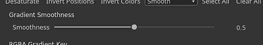

# Versione 2020.2 (10.2)

**Substance Designer 2020.2** introduce un nuovo aggiornamento di Substance Engine, un flusso di lavoro migliorato per l’esposizione dei parametri, alcuni miglioramenti delle prestazioni e nuovi contenuti.

Data di pubblicazione: *12 ottobre 2020*

## Caratteristiche principali

### Aggiornamento del nuovo motore (versione 8)

In questa nuova versione, la Substance Engine è ora nella versione 8 e introduce nuove funzionalità e diversi miglioramenti:

* **Valori predefiniti per le immagini di input**\
  Gli input dell’immagine nel grafico possono ora definire un colore predefinito, rendendo più facile il fallback su un valore appropriato quando non viene caricato o collegato nulla a quell’input.

  {width="600px"}

* **Nuove modalità distanza**\
  [Il nodo distanza](../../../compositing-graphs/nodes-reference-for-com/atomic-nodes/distance/distance.md) dispone ora di due nuove modalità che modificano il modo in cui viene eseguito il calcolo:

  * **Euclideo** (modalità originale): distanza retta tra punti nella geometria euclidea.
  * **Manhattan**: distanza tra punti ma vincolata su una griglia, simile ai blocchi di città.
  * **Chebyshev**: distanza massima dalla differenza di due punti su una griglia di dimensioni uniformi.

  {width="600px"}

* **Nuova interpolazione sfumatura**&#x200B;[&#x200B; Il nodo sfumatura](../../../compositing-graphs/nodes-reference-for-com/atomic-nodes/gradient-map/gradient-map.md) dispone di una nuova modalità **Uniforme** per interpolare le chiavi e produrre transizioni di colori molto più naturali. Funziona guardando le chiavi del vicino. La modalità precedente **Interpolazione** è stata rinominata **Tangente piatta**.

  {width="600px"}

  

  È inoltre disponibile un parametro aggiuntivo per la modalità **Arrotonda** che controlla la lunghezza della Tangente utilizzata per calcolare la curva che si fonde tra i colori. Un valore pari a 0 indica che le tangenti hanno una lunghezza pari a 0, mentre un valore pari a 1 indica che le tangenti saranno pari alla metà della lunghezza tra due chiavi.

  

* **Nodo curva migliorato**&#x200B;[&#x200B; Il nodo curva](../../../compositing-graphs/nodes-reference-for-com/atomic-nodes/curve/curve.md) può ora generare direttamente un&#39;immagine in scala di grigio. Questa modifica consente di definire una curva e di inviarla direttamente all’output senza dover prima collegare una texture di sfumatura.

  

### Parametro di esposizione migliorato

Il flusso di lavoro per l’esposizione e la modifica dei parametri è stato migliorato per essere più semplice:

* **Azioni di menu migliorate** Le azioni per esporre e modificare i parametri esposti sono state separate per essere più esplicite. Sono state inoltre introdotte nuove scelte rapide per modificare più facilmente e rapidamente i parametri esposti. Ad esempio, ora sono disponibili un pulsante dedicato per modificare la funzione di un parametro e un’azione dedicata per passare al parametro esposto del grafico.

  

  

* **Configurazione di un nuovo parametro direttamente dalla finestra di dialogo** Quando si espone un parametro, tutti i controlli regolari, ad esempio la descrizione e i valori predefiniti, sono ora accessibili dalla finestra di dialogo **Esposizione parametro**. In questo modo la configurazione e la creazione di nuovi parametri del grafico risultano molto più semplici e veloci, evitando di dover accedere alla vista dei parametri del grafico subito dopo aver creato un parametro.

  {width="600px"}

### Configurazione dell’icona migliorata per il grafico a Substance

L’impostazione delle miniature nel grafico a Substance è ora molto più semplice grazie all’interfaccia migliorata:

* **Generazione automatica delle miniature dei grafici**\
  Ora è possibile generare automaticamente un’anteprima per un grafico a Substance facendo semplicemente clic sul pulsante Genera accanto all’icona nei parametri del grafico. Attualmente supporta solo il grafico utilizzando il flusso di lavoro PBR Metallico/rugosità come nodi di output. Quando si genera la miniatura, l’intensità di spostamento viene calcolata in base al valore della Dimensioni fisiche, se definito; in caso contrario, il valore predefinito è 0,1.

  {width="600px"}

* **Aggiunta di miniature personalizzate con i nuovi pulsanti**\
  Abbiamo aggiunto diversi nuovi pulsanti per semplificare la configurazione delle miniature personalizzate:

  * **Sfoglia**: aprite una finestra di dialogo per caricare un&#39;immagine. Può essere fatto anche facendo clic sull&#39;icona della cartella accanto ai pulsanti.
  * **Genera**: visualizzate la dimostrazione appena sopra.
  * **Incolla**: carica un&#39;immagine dagli Appunti.
  * **Rimuovi**: rimuovi l&#39;immagine attualmente assegnata per l&#39;icona.

  

### Prestazioni migliorate

In questa nuova versione sono state apportate due nuove ottimizzazioni che riducono i tempi tra le iterazioni:

* **Prestazioni migliorate per il calcolo grafico**\
  I nodi di output vengono ora calcolati direttamente quando richiesto anziché calcolare i nodi intermedi in viaggio (che è ora in un secondo passaggio). Questa modifica consente di visualizzare in anteprima i risultati di un grafico molto più rapidamente anche durante l’ottimizzazione dei nodi principali. Nel confronto seguente, questa ottimizzazione consente di vedere più iterazioni del grafico nello stesso periodo di tempo (qui con un materiale a risoluzione 4K):

  

* **Generazione migliorata di dilatazione e diffusione dei forni**\
  La generazione della dilatazione e della diffusione delle texture cotte è ora fino a 4 volte più veloce rispetto alle versioni precedenti. In questo modo si riduce il tempo di attesa tra una cottura e l’altra.

  

### Nuovo contenuto

Questa versione include l&#39;aggiunta di alcuni nuovi nodi e possibilità aggiuntive su alcuni già esistenti:

* **[Nuovo filtro Soglia](../../../compositing-graphs/nodes-reference-for-com/node-library/filters/adjustments/threshold/threshold.md)**&#x200B;Questo nodo consente di isolare rapidamente come maschera in bianco e nero parte di un&#39;immagine in base a un input in scala di grigio. Questo è simile in pratica al filtro già esistente Istogram Scan, ma più conveniente da utilizzare su base giornaliera. Ulteriori informazioni sono disponibili nella [pagina dedicata alla documentazione](../../../compositing-graphs/nodes-reference-for-com/node-library/filters/adjustments/threshold/threshold.md).

  {width="650px"}

* **[Nuovo filtro Sezione trasversale](../../../compositing-graphs/nodes-reference-for-com/node-library/filters/effects/cross-section/cross-section.md)**&#x200B;Questo nodo consente di visualizzare la forma di un input in scala di grigi come profilo, semplificando notevolmente la creazione di forme e mappe altezza con questo filtro come strumento di debug. Per ulteriori informazioni, consulta la [pagina dedicata alla documentazione](../../../compositing-graphs/nodes-reference-for-com/node-library/filters/effects/cross-section/cross-section.md).

  {width="600px"}

  {width="600px"}

* **Miglioramento di [Tile Generator](../../../compositing-graphs/nodes-reference-for-com/node-library/texture-generators/patterns/tile-generator/tile-generator.md) e** [**Affianca Sampler**](../../../compositing-graphs/nodes-reference-for-com/node-library/texture-generators/patterns/tile-sampler/tile-sampler.md)\
  Questi due nodi ora hanno nuovi parametri per espandere ulteriori funzionalità e utilizzi:

  * **Mantieni rapporto**: mantieni il rapporto delle porzioni, non è necessario compensare manualmente le dimensioni quando il conteggio sugli assi X e Y è irregolare.
  * **Assoluto**: mantieni la porzione come percentuale predefinita della larghezza dell&#39;immagine finale.
  * **Pixel**: definisci la dimensione della porzione in pixel.

  Per ulteriori informazioni, consulta la [pagina dedicata alla documentazione](../../../compositing-graphs/nodes-reference-for-com/node-library/texture-generators/patterns/tile-generator/tile-generator.md).

  

### Varie

**Iray** è stato aggiornato alla versione 2020.1.0, che aggiunge il supporto della nuova GPU Ampere di Nvidia (ad esempio RTX 3080 e RTX 3090).

## Note sulla versione

### 2020.2.0

*(Rilasciato il 12 ottobre 2020)*

**Aggiunto:**

* [Content] Aggiungi nodo &quot;Cross Section&quot;
* [Content] Aggiungere la funzione &quot;Cross product vec2&quot; alle funzioni.sbs
* [Content] Aggiungi nodo valore &quot;Get Size&quot;
* [Contenuto] Aggiungere la funzione &quot;Orthogonal vec2&quot; alle funzioni.sbs
* [Content] Aggiungi funzioni Average a functions.sbs
* [Content] Aggiungi filtro Soglia
* [Content] Corrispondenza colori: aggiungete un input maschera per specificare dove applicare il filtro
* [Content] Tile Generator/Sampler: aggiungete nuove opzioni per controllare le dimensioni del pattern
* [Content] Aggiorna il nodo del PBR render con il valore predefinito per gli input dell&#39;immagine
* [Parametri] Aggiungere icone di avvertenza per evidenziare i problemi in Parametri istanza
* [Parametri] Ignora istruzioni If visibili per Input/Output che coinvolgono parametri a cui è applicata una funzione
* [Parametri] Miglioramento dell&#39;esperienza utente per l&#39;associazione dei gruppi
* [Parametri] Rielaborazione del modo in cui esporre un singolo parametro
* [Parametri] Evidenzia parametri esposti
* [Parametri] Miglioramento della pulizia dei parametri non utilizzati
* [Engine] Nodo di curva: nuova opzione per generare la texture della curva
* [Engine] Valori predefiniti sulle immagini di input
* [Engine] Nodo Distanza: nuove modalità di distanza (distanze Manhattan e Chebyshev)
* [Engine] Nodo sfumatura: nuova modalità di interpolazione per un mix più naturale tra i colori
* [Engine] Alcuni parametri sono ora disattivati a seconda di altri parametri
* [UX] Accettare colori RGB a 6 cifre nel campo esadecimale del Selettore colore
* [UX] Evita di visualizzare le proprietà dei commenti non appena vengono selezionati
* [UX] Visualizzare i gruppi rilevanti quando si inizia a scrivere un nome di gruppo
* [UX] Scelta rapida per riesportare gli output del grafico
* [UX] Rendi tutte le caselle combinate Dropdown-textfield diverse dalle caselle combinate normali
* [GraphRender] Visualizza le miniature dei nodi uno alla volta e non solo quando vengono calcolate tutte
* [GraphRender] Migliora il ritardo di annullamento durante il rendering del grafico
* [GraphRender] Migliora la precisione della barra di avanzamento del rendering
* [Miniature] Calcolo automatico delle miniature (icona)
* [Miniature] Rielaborazione dell&#39;esperienza utente per aggiungere una miniatura (icona) a un pacchetto
* [Preferenze] Abilita Raytracing GPU per impostazione predefinita per i nuovi utenti
* [Preferenze] 3DView/OpenGL/Qualità: sostituisci il cursore per il conteggio dei campioni con un elenco di opzioni più intuitivo
* [Panettieri] Migliorare le prestazioni post-elaborazione
* [Gestione colore] Mostra lo spazio colore di lavoro corrente nella finestra di dialogo delle preferenze.
* [Iray] Passa automaticamente alla modalità CPU quando non è disponibile una GPU compatibile
* [Prestazioni] Migliorare il tempo di risposta per calcolare il nodo di interesse (ora calcolato per primo)
* [API Python] Nuovo metodo addActionToExplorerToolbar per aggiungere icone alla barra degli strumenti di Esplora risorse
* [Resources] Aggiornamento a FBX 2020.0.1
* [iRay] Aggiornamento a Iray 2020.1.0
* [API] Aggiungi l’accesso Python alle impostazioni e alle proprietà della gestione colore

**Corretto:**

* [Grafico] La modifica delle dimensioni della pagina principale o del riquadro uv non annulla il rendering corrente
* [Grafico] Arresto anomalo quando si sposta una connessione di output e si preme Alt+LMB
* [Grafico] Arresto anomalo durante lo spostamento delle connessioni in modalità Materiale o Materiale compatto
* [Grafico] I nodi di input non possono visualizzare in anteprima le risorse bitmap
* [Grafico] Compatibilità del nodo interrotta sulle istanze
* [Grafico] Troppi nodi sono invalidati quando si modifica un parametro del grafico
* [Contenuto] La forma di output &quot;Estrusione forma&quot; viene capovolta in casi specifici: è necessaria una nuova versione, quella precedente è deprecata
* [Contenuto] Risultato errato con Variazione colore personalizzata nel nodo Corrispondenza colore
* [Content] Il rapporto tra dimensioni X/Y in Atlas scatter ha l&#39;effetto opposto
* [Content] Il rapporto tra dimensioni X/Y nello splatter di forma ha l&#39;effetto opposto
* [Vista 3D] Arresto anomalo durante l’operazione Annulla dopo il caricamento di una risorsa Scena da un pacchetto
* [Vista 3D] Ambiente personalizzato non salvato in SBSSCN se il percorso contiene alias con caratteri speciali
* [Vista 3D] Il passaggio dal formato normale alle impostazioni del materiale genera stati capovolti
* [UI] Il testo del pulsante &quot;Imposta come principale&quot; è in eccesso dall’area di visualizzazione
* [UI] La posizione della finestra principale non viene ripristinata correttamente quando si lavora in modalità finestra
* [UI] Il testo della barra di stato viene scostato quando la finestra è a schermo intero o trascinata vicino al bordo dello schermo
* [Iray] Arresto anomalo con messaggio &quot;Tag non valido&quot; quando si passa da un modulo di rendering all’altro
* [Iray] Facce visibili su superfici non opache
* [Predefiniti] Arresto anomalo quando si applicano predefiniti in istanze di alcuni grafici a Substance Source
* [Predefiniti] nome errato visualizzato dopo l&#39;annullamento sull&#39;istanza sbs
* [Rendering] Rendering errato durante l’ottimizzazione di un parametro in modalità di anteprima
* [Panettieri] L&#39;aggiornamento di più mappe con baking genera avvisi che bloccano alcuni dolci
* [Cooker] La modifica dei nodi SBSAR nelle istanze SBS genera un output pari a 0 dall&#39;istanza
* [Explorer] Gli alias personalizzati non vengono passati quando si utilizza &#39;Salva e apri in Substance Player&#39;
* [Editore sfumatura] La selezione assoluta del colore non influisce su tutti i tasti selezionati
