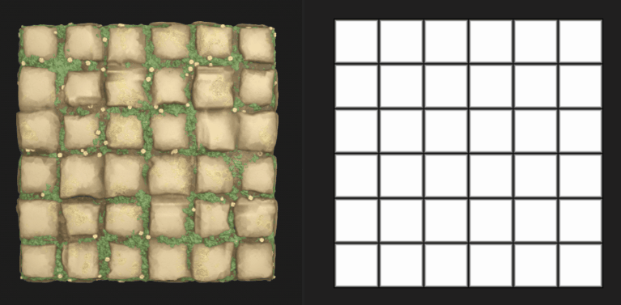

# Versione 12.1

**Substance 3D Designer 12.1** offre molti nuovi nodi per i grafici dei materiali Substance, il supporto del formato di file USD e l&#39;aggiunta di una maggiore interoperabilità con Stager.

Data di pubblicazione: *26 aprile 2022*

## Caratteristica principale

### Nuovo contenuto per i grafici del materiale Substance

Sono stati aggiunti molti nodi in questa versione, troverai nuovi pattern, nuovi rumori, nuovi filtri, ...

Date un&#39;occhiata alle pagine dei nodi collegate di seguito per esempi dell&#39;ampiezza dell&#39;output che viene raggiunto da questi nuovi potenti nodi!

* **Nuovi pattern**

  * Abbiamo aggiunto un nuovo nodo <b>Affianca casuale 2</b> per generare porzioni adiacenti di dimensioni e rapporti casuali, molto utile per creare rapidamente griglie completamente irregolari con inclinazione, angoli arrotondati e smussatura.

    {width="640px"}
  * Nuovo pattern <b>Triangle Grid</b> per generare una griglia composta da triangoli. Lo stiamo utilizzando nel materiale sottostante per simulare facilmente e perfettamente la granulosità in pelle. Questo generatore rappresenta una superficie di vertici nello spazio 3D e può essere utilizzato per creare una varietà di stili poligonali.

    {width="640px"}
* **Nuovi Rumori**

  * Per darvi più varietà, una serie di <b>15 nuove mappe Grungi</b> (calcestruzzo, perdite, schizzi sporchi, ...) è stato aggiunto alla libreria.

    {width="640px"}
  * Troverai anche molti <b>nuovi rumori 2D e 3D</b>, come Voronoi (2D e 3D), Voronoi Fractal (2D e 3D), 3D Ridged Fractal e un aggiornamento dell&#39;attuale disturbo di Perlin 3D (aggiungendo opzioni di affiancamento e assolute).\
    Questi rumori sono tutti mappati nello spazio 3D e offrono più stili, consentendo una maggiore varietà e controllo che vi darà un sacco di scelta per creare la mappa perfetta per il vostro materiale, come il mare e i materiali dei pannelli di fantascienza di seguito.

    {width="640px"}

    {width="640px"}
  * Insieme di <b>nodi Texture 3D</b> (Posizione, SDF, Scostamento) e <b>nodi Rendering 3D </b> (Superficie o Volume) per creare ed eseguire il rendering delle texture 3D, che rappresentano un atlante delle sezioni di un modello 3D.

    {width="640px"}

* **Nuovi filtri**

  * Con il nodo <b>Ritaglio automatico</b>, puoi posizionare una forma al *centro* dell&#39;immagine senza ridimensionarla o ridimensionarla per adattarla allo spazio. Ad esempio, la forma può essere modificata liberamente mantenendo una posizione e una dimensione costanti quando viene dispersa.

    {width="640px"}
  * Con il nodo Extend Shape</b> di <b> sarà possibile estendere una sezione di una forma su una direzione e una distanza personalizzate.

    {width="640px"}
  * E con il nodo <b>Rotazione non uniforme</b> puoi ruotare un input in base a una determinata mappa.

    {width="640px"}
* **E anche...**

  * Funzioni di andamento (grafico delle funzioni) molto utili per guidare un valore in modo non lineare.
  * Infine, questa versione introduce anche una nuova versione più accurata del nodo <b>Quantize</b> e un nuovo filtro dell&#39;utilità <b>Summed Area Table</b>.

### Migliorare l&#39;interoperabilità

* **Supporto USD** Oltre al

  e

  formati di file, ora puoi importare ed esportare file USD (

  ,

  ,

  ) per utilizzarli come risorse dei grafici dei modelli Substance, per la cottura al forno o nella vista 3D per mostrare il materiale Substance. Potete usare questo formato anche per esportare il grafico del modello Substance o il contenuto della vista 3D.
* <b>Invia a Stager\
  </b>Ora puoi inviare il tuo materiale Substance a Stager con un solo clic, come era già possibile con Sampler e Painter. Grazie a questa funzione, non è più necessario pubblicare come SBSAR e caricare singoli file (è richiesta la versione 1.2.0 di Stager con il nuovo gestore di materiali)

  

### Varie

* Se stai lavorando sui tessuti, ora puoi visualizzare una trama dedicata nella vista 3D per vedere meglio come viene renderizzato il materiale su una forma drappeggiata. Apri il menu <b>Scena</b> nel pannello della vista 3D e seleziona l&#39;opzione <b>Stoffa</b> per visualizzare questo modello.

  {width="640px"}

* Sono stati inoltre aggiunti nuovi nodi di gestione delle scene per i grafici dei modelli di Substance. Questi nodi consentono di rinominare, modificare il nome, fondere o espandere gli elementi della scena per organizzare la gerarchia delle scene. È inoltre disponibile un nuovo nodo per impostare il perno di uno o più elementi di una scena.

* Durante l’utilizzo dei progetti in Designer, è possibile che vengano visualizzati avvisi e messaggi di errore che segnalano un problema nel progetto. In questa versione, viene <b>migliorato il sistema di gestione degli errori</b> per evidenziare tutti gli errori e gli avvisi in Esplora risorse: tutti gli elementi sono elencati in un&#39;unica posizione, quindi è più semplice verificare se il progetto contiene problemi.

  {width="640px"}

## Note sulla versione

### 12.1.0

*(Rilasciato il 19 aprile 2022)*

<b>Aggiunto:</b>

* [Principale] Nuovo contenuto per i grafici dei materiali
* [Principale] Invio di materiali a Stager
* [Principale] Supporto dei file USD
* [Principale] Miglioramento della segnalazione degli errori nell’interfaccia utente
* [Principale] Nodi di Gestione scene per i grafici dei modelli
* [Contenuto] Aggiungi più opzioni ai Rumori Perlin 3D (affiancatura, assoluto...)
* [Content] Nuovo nodo frattale con disturbo ridotto 3D
* [Contenuto] Nuovo nodo Scostamento texture 3D
* [Content] Nuovo nodo Posizione texture 3D
* [Content] Nuovo nodo superficie di rendering texture 3D
* [Content] Nuovo nodo Volume rendering texture 3D
* [Content] Nuovo nodo Signed distance field texture 3D
* [Content] Nuovo nodo Ritaglio automatico
* [Content] Nuove funzioni di ottimizzazione
* [Content] Nuovi nodi di Extend Shape
* [Content] Nuove Mappe Grunge
* [Contenuto] Nuovo nodo Rotazione non uniforme
* [Contenuto] Nuovo filtro Tabella area sommata
* [Content] Nuovo modulo generatore 2 casuale
* [Contenuto] Nuovo generatore pattern Triangle Grid
* [Content] Nuova versione del nodo Quantizza scala di grigi
* [Content] Nuovi rumori frattali di Voronoi e Voronoi (2D/3D)
* [Content] Threshold: aggiungi modalità di confronto &#39;Lower&#39; e &#39;Lower and equal&#39;
* [Content]&#x200B;[Vista 3D] Aggiungi una trama adatta alla visualizzazione dei tessuti nelle risorse spedite
* [Substance modelli] Nuovo nodo Espandi istanze gruppo
* [Modelli Substance] Nuovo nodo Fuse
* [Substance modelli] Nuovo nodo Rinomina
* [Modelli Substance] Nuovo nodo Reparent
* [Modelli Substance] Nuovo set nodo pivot
* [Substance modelli] Aggiornamento a SDK 1.6.0
* [ThirdParty] Aggiorna Qt (e QtForPython) alla versione 5.15.8
* [Third Party] Aggiorna Python alla versione 3.9.9
* [ThirdParty] Aggiornamento di OpenSSL a 1.1.1m
* [UI] Migliora il comportamento del menu Nodo quando si fa clic su di esso
* [UI] Apri i grafici secondari nella stessa scheda anche se bloccati
* [UI] Rimuovi il pulsante del perno dalla barra del titolo del pannello Esplora risorse
* [UI] Salva l’opzione &quot;Non visualizzare più&quot; nella schermata di benvenuto nelle diverse versioni
* [Vista 3D] Visualizza l&#39;unità della griglia nella finestra della vista quando è attivato l&#39;helper &quot;Asse&quot;
* [Automazione] Fornisci lo strumento da riga di comando sbsbaker con Designer
* [Gestione colore] Implementazione del nuovo back-end GPU per Adobe
* [Cooker] Aggiungi un&#39;opzione per cucinare un pacchetto senza timestamp
* [Grafico] Aggiungere i distintivi nel grafico FxMap
* [Library] Aggiungi un nuovo filtro per le funzioni di regolazione
* [Player] Supporto USD
* [Properties] Aggiunge un errore di avvertenza nel parametro &quot;PKG Resource Path&quot; di un nodo Bitmap quando la risorsa non viene trovata
* [Substance Engine] Aggiornamento alla versione 8.4.1
* [Sì] Avvisa l’utente che gli effetti post di Yebis verranno rimossi nella prossima versione
* [Documentazione] Nuova pagina &quot;Avvisi ed errori&quot;
* [Documentazione] Nuova pagina che descrive l’ereditarietà nei grafici Substance
* [Documentation] Aggiornamento della sezione &#39;Iray&#39;
* [Documentazione] Aggiornamento della sezione &quot;Grafici MDL&quot;

<b>Corretto:</b>

* [UI] Problemi di ritaglio nelle descrizioni dei modelli nella nuova finestra del grafico
* [UI] Difficile leggere il testo bianco nei nodi quando si utilizza la modalità scura in macOS
* [UI] Problema di layout in alcune finestre di dialogo
* [UI] Il messaggio di avviso viene visualizzato troncato durante la creazione del grafico della funzione Substance in Esplora risorse.
* [UX] Il selettore colore si sposta verso il basso su ogni nuova apertura
* [UX] La finestra dell’editor sfumatura si sposta verso l’alto ogni volta che viene generata
* [UX] Le proprietà del grafico non vengono visualizzate automaticamente per i pacchetti caricati
* [Content] Mappatura Flood Fill: selezione di input errata in un caso specifico
* [Content] Flood Fill: pagina al vivo del testo nei pulsanti dei parametri booleani
* [Contenuto] Intervallo errato per il parametro da multi-angolo a angolo luce primo campione del nodo normale
* [Modelli Substance] Le proprietà del nodo mostrano l&#39;identificatore anziché l&#39;etichetta
* [Substance modelli]&#x200B;[Vista 3D] Problema di aggiornamento durante la riapertura di un progetto
* [Substance models]&#x200B;[3Dview] Problema di aggiornamento quando si utilizza l&#39;anteprima wireframi
* [Parametri] Arresto anomalo quando si eliminano gli input del grafico in rapida successione in un caso specifico
* [Parametri] Arresto anomalo durante la reimpostazione di un parametro di istanza durante la modifica della relativa descrizione di riferimento
* [Bitmap] Il rilevamento UDIM non viene attivato per i file bitmap rilasciati nel grafico
* [Grafico] I nodi Bitmap/SVG non vengono invalidati quando la risorsa viene modificata sul disco dopo aver caricato il pacchetto
* [GraphRender] Perdita di memoria quando la valutazione del grafico Substance viene annullata
* [Localizzazione] La stringa &quot;Ripristina tutte le mappe per questa risorsa&quot; viene visualizzata non localizzata
* [MDL] Parametro esposto inizializzato su 0 se l&#39;input è connesso a un nodo punto non connesso
* [Preferenze] Le descrizioni comandi vengono visualizzate anche quando il cursore si trova in uno spazio vuoto
* [Proprietà] Annullando una modifica del valore dello spazio colore si imposta il valore predefinito anziché in un caso specifico
* [Text] Impossibile annullare il passaggio del font a una risorsa font mancante
