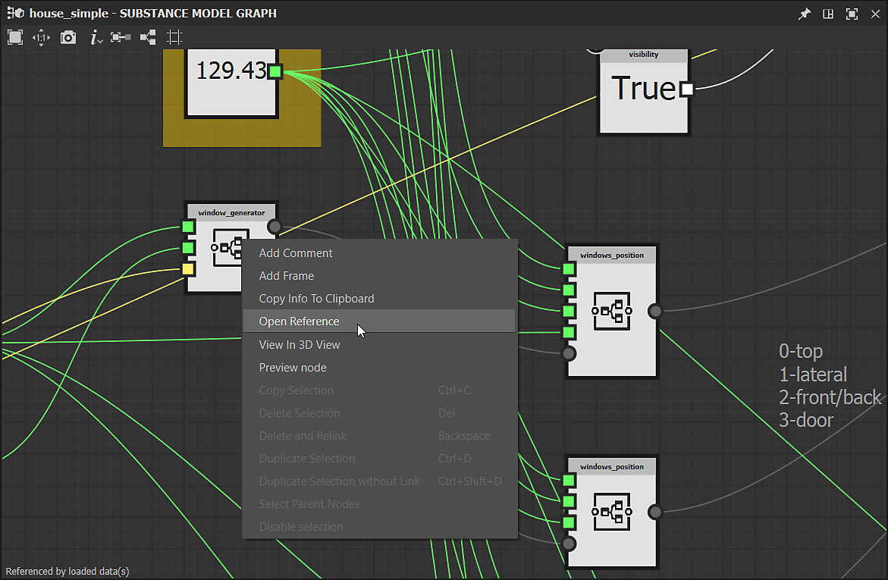

# Versione 12.3

<b>Substance 3D Designer 12.3</b> porta i grafici dei modelli di Substance a un nuovo livello con il <b>supporto dei grafici secondari</b> (o istanze di grafici), più <b> &#39;Visible if&#39; </b>controllo per parametri esposti e alcuni<b> nuovi nodi</b> dedicati all&#39;edizione curve. Questa versione introduce anche due nuovi pannelli (<b>Benvenuti </b>e <b>Novità</b>) per migliorare l&#39;onboarding dell&#39;utente e alcune altre funzioni minori o correzioni di bug descritte di seguito.

Data di pubblicazione: *6 ottobre 2022*

{width="1111px"}

## Funzioni principali

### Supporto delle istanze del grafico nei grafici dei modelli di Substance

Se siete abituati a creare grafici, volete essere in grado di creare grafici secondari (o istanze di grafici) per riutilizzare il lavoro, rendere i grafici meno disordinati ed essere più efficienti.\
Questo è ora possibile anche per i grafici dei modelli di Substance: è sufficiente trascinare e rilasciare il grafico secondario da Esplora risorse al grafico principale per utilizzarlo come nodo di istanza.

{width="600px"}

Abbiamo anche introdotto il concetto di nodi di output per i grafici dei modelli di Substance, come Scena di output. Ora hai la possibilità di avere uno o più output nel tuo grafico.\
Ogni output corrisponderà a un pin di output quando verrà creata un’istanza del grafico in un altro grafico.

{width="600px"}

Facendo clic con il pulsante destro del mouse su un nodo di istanza, è possibile accedere al grafico secondario di riferimento per visualizzarlo o modificarlo.

{width="600px"}

Grazie ai grafici secondari e ai parametri esposti, puoi creare risorse complesse e applicare infinite variazioni, come dimostrato nell&#39;illustrazione seguente.

{width="600px"}

### Altri miglioramenti per i grafici dei modelli di Substance

* <b>Visibile se per i parametri esposti</b>\
  Durante l&#39;esposizione dei parametri, potete nascondere o mostrare i parametri in base allo stato degli altri parametri. Ad esempio, un cursore che viene visualizzato solo quando un pulsante è attivato.\
  Con <b>Visible If</b>, puoi aggiungere condizioni alla visibilità dei parametri, mantenendo un&#39;interfaccia utente pulita e funzionale. Questo meccanismo, già disponibile per i grafici a Substance, è stato esteso ai grafici dei modelli a Substance, ovviamente utilizzando la stessa sintassi. <b>\
  </b>

  {width="600px"}

* <b>Nuovi nodi dedicati all&#39;edizione curva\
  </b>Questa versione introduce alcuni nuovi nodi dedicati all&#39;edizione della curva: <b>Curva inversa</b> scambia le due estremità di una curva, <b>Suddivisione della curva</b> aggiunge più vertici sui segmenti in base a due metodi, <b>La curva di arrotondamento </b>smussa tutti gli angoli su una curva 2D e infine <b>La curva di scostamento</b> gonfia o sgonfia una curva 2D, come illustrato di seguito.<b>

  </b>

  {width="600px"}
* <b>Nuova finestra del grafico </b>\
  La finestra <b>Nuovo grafico modello Substance</b> è ora disponibile anche per i grafici modello Substance. Potete aggiungere i vostri modelli o selezionarne uno predefinito, quindi immettere direttamente il nome del grafico e selezionare il pacchetto a cui verrà aggiunto il grafico.

  {width="600px"}

### Pannelli Benvenuti e Novità

Per aiutarti a iniziare a usare Designer, abbiamo introdotto due nuovi pannelli:

Innanzitutto, il pannello <b>Benvenuti </b> - visualizzato la prima volta che *avviate* Designer - offre una panoramica globale del software e del suo ruolo nell&#39;ecosistema Substance 3D. Successivamente, il <b>pannello Novità </b> - visualizzato la prima volta che si esegue una *nuova versione* di Designer - presenta rapidamente le funzionalità principali introdotte in questa versione.

Questi due pannelli sono accessibili anche dal menu Aiuto.

### Varie

* <b>Widget di due pulsanti per i parametri booleani esposti</b>\
  Ora è disponibile un nuovo modo per esporre i parametri booleani in un grafico a Substance. Oltre al pulsante di attivazione, è possibile utilizzare <b>pulsanti affiancati</b> con testo personalizzato per rendere più visibili le due diverse modalità guidate dal parametro booleano.
* <b>Risoluzione dei problemi di ridimensionamento per schermi ad alto DPI </b>\
  Nelle versioni precedenti, Designer non era in grado di gestire correttamente il fattore di ridimensionamento impostato nel sistema operativo. Come potete vedere nell&#39;illustrazione seguente, tutto è perfettamente gestito su un display 4K con un ridimensionamento del 125% e tutti i font e i pulsanti visualizzati a dimensioni coerenti.\
  Si noti che in questa nuova versione l&#39;opzione &quot;Disattiva High DPI&quot; nelle Preferenze è stata reimpostata su *False* poiché questa opzione non è più necessaria per disporre di un&#39;interfaccia utilizzabile.

  {width="600px"}

* **Supporto nativo di Apple Silicon (M1 / M2) per la versione Steam**\
  La versione 12.2 di Designer è stata la prima a portare il supporto completo di nuovi computer Apple basati su chip M1 o M2, ma tale supporto non era presente nell&#39;edizione Steam. D&#39;ora in poi, tutti gli utenti di Designer potranno beneficiare di un&#39;esperienza più veloce ed efficiente su questi computer.

## Note sulla versione

### 12.3.0

*(Rilasciato il 6 ottobre 2022)*

**Aggiunto:**

* [Generale] Pannello Onboarding per accogliere nuovi utenti
* [Generale] Novità del pannello per migliorare la ricerca di nuove funzioni
* [Modello Substance] Supporto di sottografi e istanze
* [Modello Substance] Supporto Visibile se per i parametri esposti
* [Modello Substance] Aggiunta del supporto dei nodi di output
* [Modello Substance] Nodo offset curva
* [Modello Substance] Nodo di ripristino della curva
* [Modello Substance] Nodo di arrotondamento della curva
* [Modello Substance] Nodo di suddivisione della curva
* [Modello di Substance] Nodo dell&#39;innesto
* [Modello Substance] Aggiornamento del nodo &quot;Filtra scena&quot;
* [Modello Substance] Rendere individuabili i nodi non atomici nel menu Nodo
* [Modello Substance] Aggiungere l&#39;azione &quot;Apri riferimento&quot; nel menu di scelta rapida di un nodo di variante
* [Substance modello] Aggiungere un&#39;azione &quot;Visualizza in 3DView&quot; nel menu contestuale dei nodi che possono essere inviati a 3DView
* [Substance modello] Visualizza automaticamente le proprietà di un nodo dopo averlo esposto
* [Modello Substance] Finestra Crea &quot;Nuovo grafico modello Substance&quot; con elenco modelli
* [UI] Migliorare la coerenza delle opzioni di salvataggio delle immagini in Vista 2D e Vista 3D
* [UI] Rinomina &quot;Collega > Trama 3D&quot; in &quot;Collega > Scena 3D&quot; nel menu di scelta rapida di Explorer
* [UI] Il ripristino del layout ora si applica a tutte le finestre mobili
* [UI] Usa l&#39;etichetta &quot;Visualizza output in vista 3D&quot; nei menu contestuali per i grafici
* [Library] Supporta i grafici dei modelli di Substance non atomici
* [SBSAR] Descrizione dei grafici di supporto nella SBSAR
* [Shader] Impostate il valore predefinito del fattore di tassellatura su 1 per tutti gli shader
* [UI] Esporre il widget a 2 pulsanti per i parametri booleani
* [Engine] Aggiornamento alla versione 8.6.4
* [Steam] Versione ottimizzata per chipset Apple Silicon (Apple M1 / M2)

**Corretto:**

* [UI] Risoluzione dei problemi di ridimensionamento per schermi ad alto DPI
* [UI] Modello &#39;$(udim)&#39; mancante dall&#39;elenco nella finestra di cottura
* [UI] Arresto anomalo durante la visualizzazione del menu Nodo sul bordo destro dello schermo (solo macOS)
* [UI] Il pulsante dell’estensione nel menu della vista 3D non è visibile
* [UI] Il menu dell&#39;estensione della barra degli strumenti Grafico è incompleto
* [UI] Valore del widget del parametro errato dopo aver annullato l’attivazione dell’intervallo rigido
* [Vista 3D] L&#39;impostazione dello shader non predefinita viene persa su Iray da una sessione a un&#39;altra
* [Bakers] Arresto anomalo durante il caricamento della finestra di cottura con una scena senza trame
* [Funzione] Arresto anomalo quando si copia un’istanza nel grafico a cui fa riferimento
* [Funzione] Correggere un possibile arresto anomalo durante la manipolazione dei nodi
* [Globalizzazione] Il corsivo non è sempre disabilitato correttamente in giapponese, coreano e cinese
* [Grafico] Identificatore fallback errato per i nuovi grafici MDL e Substance modelli
* [Grafico] I parametri ereditati guidati da valori a volte vengono calcolati in modo errato
* [GraphRender] Arresto anomalo durante il cambio di motore durante l&#39;elaborazione del grafico ad alta risoluzione (solo macOS)
