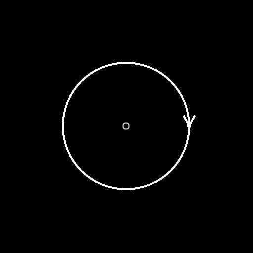

# Versione 13.0

Questa versione 13.0.0 di Substance 3D Designer porta molto amore agli artisti dei materiali, con un&#39;enorme quantità di nuovi nodi, la Substance Engine 9.0 che introduce i loop per la prima volta e con una grande aggiunta al grafico: il nodo del portale. Inoltre, per soddisfare un numero maggiore di utenti, viene introdotta una nuova schermata iniziale e vengono fornite ulteriori lingue.

Come accennato nella versione precedente, questa versione non supporta più i grafici dei modelli di Substance: ciò significa che non è più possibile aprire, modificare o esportare tali grafici in Designer. Puoi trovare tutti i motivi per cui abbiamo preso questa decisione in questo [post](https://community.adobe.com/t5/substance-3d-designer-discussions/substance-model-graphs-end-of-life/td-p/13693731)sul forum della community.

*Data di pubblicazione: 6 giugno 2023*

*Illustrazione di [Celine Dameron](https://www.artstation.com/cline)*

## Nuovo contenuto

Questa versione 13.0 introduce molti nuovi contenuti. Sono disponibili principalmente due nuove raccolte di nodi: Strumenti spline e Strumenti tracciato.

* [Gli Strumenti spline](../../compositing-graphs/nodes-reference-for-com/node-library/spline-paths-tools/spline-tools/spline-tools.md) sono una raccolta di nodi per la generazione e la regolazione di spline e per il loro utilizzo per la mappatura, la dispersione o l&#39;alterazione delle immagini.
* [Gli strumenti tracciato](../../compositing-graphs/nodes-reference-for-com/node-library/spline-paths-tools/path-tools/path-tools.md) sono un altro insieme di nodi da estrarre, sotto forma di elenco di segmenti, i contorni da una maschera e quindi modificarli e migliorarli.

Tutti questi nodi offriranno un sacco di possibilità e avranno sicuramente un sacco di applicazioni creative. Consulta la sezione [Utilizzo di tracciati e Strumenti spline](../../compositing-graphs/nodes-reference-for-com/node-library/spline-paths-tools/working-with-path-and-spl/working-with-path-and-spline-tools.md) per un tour dei concetti importanti da comprendere per conoscere bene questo set di strumenti.

*Illustrazione di [Louise Melin](https://www.artstation.com/troglodette)*

### Strumenti spline

I nuovi nodi dedicati alle spline possono essere suddivisi in quattro categorie:

#### Crea

La prima categoria è naturalmente quella per generare spline:

* [Spline Cubic](../../compositing-graphs/nodes-reference-for-com/node-library/spline-paths-tools/spline-tools/spline-cubic/spline-cubic.md): da due punti e due tangenti;
* [Spline Poly Quadratic](../../compositing-graphs/nodes-reference-for-com/node-library/spline-paths-tools/spline-tools/spline-poly-quadratic/spline-poly-quadratic.md): da una serie di punti;
* [Cerchio spline](../../compositing-graphs/nodes-reference-for-com/node-library/spline-paths-tools/spline-tools/spline-circle/spline-circle.md): segue una forma circolare.

È inoltre possibile creare <b>ponti </b>tra spline per ottenere un insieme completo di spline tra [2 spline](../../compositing-graphs/nodes-reference-for-com/node-library/spline-paths-tools/spline-tools/spline-bridge-2-splines/spline-bridge-2-splines.md) o [spline N](../../compositing-graphs/nodes-reference-for-com/node-library/spline-paths-tools/spline-tools/spline-bridge-list/spline-bridge-list.md).

<table>
<tr style="border: 0;">
<td style="border: 0;" valign="top">

</td>
<td style="border: 0;" valign="top">

</td>
<td style="border: 0;" valign="top">

</td>
<td style="border: 0;" valign="top">

</td>
</tr>
</table>

#### Assembla

In alcuni casi, dovrete trattare più spline come entità singola, quindi avete bisogno di strumenti per gestire un insieme di spline. L&#39;[Elenco unione spline](../../compositing-graphs/nodes-reference-for-com/node-library/spline-paths-tools/spline-tools/spline-merge-list/spline-merge-list.md) consente di unire tutte le spline in un&#39;unica spline collegando le estremità in ordine, il nodo [Aggiungi spline](../../compositing-graphs/nodes-reference-for-com/node-library/spline-paths-tools/spline-tools/spline-append/spline-append.md) consente di aggiungere un elenco di spline a un altro elenco e grazie al nodo [Selezione spline](../../compositing-graphs/nodes-reference-for-com/node-library/spline-paths-tools/spline-tools/spline-select/spline-select.md) è possibile filtrare e selezionare spline specifiche da un elenco specifico.

#### Modifica

Forniamo anche strumenti per rielaborare e rifinire le spline. Troverai un nodo per applicare una [trasformazione 2D](../../compositing-graphs/nodes-reference-for-com/node-library/spline-paths-tools/spline-tools/spline-2d-transform/spline-2d-transform.md), ad esempio una rotazione, una traduzione, una scala e un altro per [alterare](../../compositing-graphs/nodes-reference-for-com/node-library/spline-paths-tools/spline-tools/spline-warp/spline-warp.md)<b> </b>la forma e altri due nodi per modificare il [thickness](../../compositing-graphs/nodes-reference-for-com/node-library/spline-paths-tools/spline-tools/spline-sample-thickness/spline-sample-thickness.md)<b> </b>o il [height](../../compositing-graphs/nodes-reference-for-com/node-library/spline-paths-tools/spline-tools/spline-sample-height/spline-sample-height.md) delle spline.

<table>
<tr style="border: 0;">
<td style="border: 0;" valign="top">

</td>
<td style="border: 0;" valign="top">

</td>
<td style="border: 0;" valign="top">

</td>
<td style="border: 0;" valign="top">

</td>
</tr>
</table>

#### Rendering

L&#39;ultima categoria è quella che consente di creare la forma o il motivo finale in base alle spline. La prima idea che vi verrà in mente sarà quella di ripetere una determinata forma lungo la spline: il nodo [Dispersione sulla spline](../../compositing-graphs/nodes-reference-for-com/node-library/spline-paths-tools/spline-tools/scatter-on-spline-color/scatter-on-spline-color.md) consente di farlo, con molti parametri per controllare perfettamente la distribuzione (rotazione, ridimensionamento, scostamento, colori, maschere, ecc.).

Grazie a [Riempimento spline](../../compositing-graphs/nodes-reference-for-com/node-library/spline-paths-tools/spline-tools/spline-fill/spline-fill.md)<b> </b>nodo, è possibile creare facilmente un pattern da una spline chiusa. E se vuoi mappare qualsiasi texture sulle tue spline, con un alto grado di controllo e precisione, il nodo [Spline Mapper](../../compositing-graphs/nodes-reference-for-com/node-library/spline-paths-tools/spline-tools/spline-mapper-color/spline-mapper-color.md) è fatto per te!

<table>
<tr style="border: 0;">
<td style="border: 0;" valign="top">

</td>
<td style="border: 0;" valign="top">

</td>
<td style="border: 0;" valign="top">

</td>
<td style="border: 0;" valign="top">

</td>
</tr>
</table>

### Strumenti percorso

Il nodo [Maschera su tracciati](../../compositing-graphs/nodes-reference-for-com/node-library/spline-paths-tools/path-tools/mask-to-paths/mask-to-paths.md) consente di estrarre il bordo di un pattern in scala di grigio, sotto forma di elenco di segmenti.

È quindi possibile elaborare questi percorsi con i nodi [Path 2D Trasforma](../../compositing-graphs/nodes-reference-for-com/node-library/spline-paths-tools/path-tools/path-2d-transform/path-2d-transform.md) o [Paths Warp](../../compositing-graphs/nodes-reference-for-com/node-library/spline-paths-tools/path-tools/paths-warp/paths-warp.md) per adattarli alle proprie esigenze.  E grazie al nodo [Tracciati per spline](../../compositing-graphs/nodes-reference-for-com/node-library/spline-paths-tools/path-tools/paths-to-spline/paths-to-spline.md), puoi convertire il tuo tracciato in una spline e quindi sfruttare tutti i nodi dedicati alle spline precedentemente menzionate, come la dispersione.

<table>
<tr style="border: 0;">
<td style="border: 0;" valign="top">

</td>
<td style="border: 0;" valign="top">

</td>
<td style="border: 0;" valign="top">

</td>
<td style="border: 0;" valign="top">

</td>
</tr>
</table>

Per aiutarvi ad apprendere tutti questi nuovi nodi, abbiamo pubblicato due nuove esercitazioni:

* [Introduzione ai nodi spline](https://www.adobe.com/go/designer-tutorial-splines)
* [Introduzione ai nodi Path](https://www.adobe.com/go/designer-tutorial-paths)

## Nuova versione di Substance Engine v9

Tutti i nuovi nodi elencati sopra si basano sulla nuova versione di Substance Engine e sfruttano appieno la nuova funzionalità principale: <b>loop</b>.

I loop devono essere utilizzati solo all&#39;interno di [grafici di funzioni Substance](../../function-graphs/function-graphs.md) ed è molto probabile che vengano implementati in un [Elaboratore pixel](../../compositing-graphs/nodes-reference-for-com/atomic-nodes/pixel-processor/pixel-processor.md), una [mappa Fx](../../compositing-graphs/nodes-reference-for-com/atomic-nodes/fx-map/fx-map.md) o un [Processore di valori](../../compositing-graphs/nodes-reference-for-com/atomic-nodes/value-processor/value-processor.md). I loop consentono naturalmente di ripetere facilmente una funzione più volte, fino a quando una condizione non viene rispettata. Ti aiuterà a schiarire molto i tuoi grafici e a migliorare la precisione.

Questo [tutorial](https://www.youtube.com/watch?v=Ggoy8G90oDI)dedicato ti aiuterà a iniziare a lavorare con i loop.

Substance Engine v9 offre inoltre i seguenti miglioramenti:

* Nuova modalità tinta unita nell&#39;editor sfumatura del nodo [Mappa sfumatura](../../compositing-graphs/nodes-reference-for-com/atomic-nodes/gradient-map/gradient-map.md) (ovvero nessuna interpolazione)
* Nodo atomic pow() nei grafici delle funzioni Substance
* Aggiungere opzioni di disposizione dei bordi (blocco ai bordi, ripetizione) nei nodi di Sampler
* Campionamento più vicino nei nodi [Altera](../../compositing-graphs/nodes-reference-for-com/atomic-nodes/warp/warp.md) e [Alterazione direzionale](../../compositing-graphs/nodes-reference-for-com/atomic-nodes/directional-warp/directional-warp.md)

## Nodo portale

Il nodo [Portal](../../interface/the-graph-view/graph-items/graph-items.md) è una nuova estensione del nodo [Dot](../../interface/the-graph-view/graph-items/graph-items.md) con la possibilità di nascondere le connessioni nel grafico.

Grazie a questa funzione, puoi migliorare la leggibilità del grafico nascondendo connessioni molto lunghe e avere anche un accesso rapido ai nodi chiave da qualsiasi punto del grafico.

Questa nuova funzione è stata spiegata dettagliatamente in questo [tutorial](https://www.adobe.com/go/designer-tutorial-portals) dedicato.

## Schermata Home

Quando avvii Designer, sai di avere accesso a una [schermata Home](../../interface/home-screen/home-screen.md) nuova di zecca come quella che hai in altri prodotti di Adobe. Da questa schermata, puoi:

* Crea rapidamente un nuovo grafico;
* Consultate l’elenco di tutti i file aperti di recente in Designer, con alcuni dettagli come le dimensioni, la data in cui è stata modificata per l’ultima volta o il percorso completo del file;
* Una pagina di apprendimento in cui è disponibile un collegamento a risorse di apprendimento, ad esempio esercitazioni per presentarti nuove funzioni o per scoprire suggerimenti rapidi;
* Collegamenti diretti alla schermata Novità, alla schermata Informazioni su, al sito Web di Substance 3D, al forum della community di supporto e così via.

## Nuove lingue

Questa versione include tre lingue aggiuntive:

* Spagnolo (Spagna)
* Italiano (Italia);
* Portoghese (Brasile)

Ti ricordiamo che, per modificare la lingua in Designer, è sufficiente accedere alle [Preferenze](../../interface/preferences-window/preferences-window.md) e consultare l&#39;elenco di tutte le lingue disponibili nella sezione Generale.

## Note sulla versione

### 13.0.0

*(Rilasciato il 6 giugno 2023)*

### Aggiunto

* [Grafico] Nodo portale
* [Onboarding] Nuova schermata iniziale
* Nodo [Content] Spline (Cubic)
* Nodo spline (poli quadratico) di [Content]
* [Content] Spline Circle, nodo
* [Content] - Nodo elenco punti
* Nodo [Content] Spline Bridge (2 spline)
* Nodo [Content] Spline Bridge (List)
* [Content] Spline - Aggiungi nodo
* [Content] Spline Seleziona nodo
* [Contenuto] Nodo Elenco unione spline
* [Content] Spline 2D Transform, nodo
* [Contenuto] Nodo Alterazione spline
* [Content] Spline Nodo Height di esempio
* [Content] Spline Nodo Thickness di esempio
* [Content] Nodo Rendering spline
* [Content] Dispersione sul nodo Colore spline
* [Contenuto] Dispersione sul nodo Scala di grigi spline
* [Content] Nodo colore di Spline Mapper
* [Content] Spline Mapper Nodo in scala di grigi
* [Content] Spline Bridge Mapper Nodo colore
* [Content] Spline Bridge Mapper Nodo in scala di grigi
* [Content] Nodo Mappatore flusso spline
* [Content] Nodo colore mappatore UV
* [Contenuto] Nodo in scala di grigi con mappatura UV
* [Content] Percorsi al nodo Spline
* Nodo [Contenuto] Maschere su tracciati
* [Content] Nodenode trasformazione tracciati 2D
* Nodo poligono [Content] Paths
* [Contenuto] Nodo Anteprima tracciati
* [Contenuto] Nodo Alterazione tracciati
* [Content] Seleziona tracciati, nodo
* [Content] Nodo processore vertici tracciati
* [Content] Elaboratore vertici tracciati Nodo semplice
* [Content] Quad Transform sul nodo Path
* [Content] Occlusione ambientale con ray tracing v2
* [Contenuto] Normale curvato con ray tracing v2
* [Content] Ombre con ray tracing v2
* [Engine] Aggiornamento alla versione 9
* [Engine] Nodo loop nei grafici di funzione
* [Motore] Aggiungi modalità solida a Sfumatura
* [Engine] Nodo atomic pow() nel grafico delle funzioni
* [Engine] Aggiungi opzioni di disposizione dei bordi (blocco a spigolo / ripetizione) nel nodo Sampler
* [Engine] Campionamento più vicino nei nodi Altera e Alterazione direzionale
* [Motore] Aggiungete una modalità &quot;punchthrough alfa&quot; al filtro Nitidezza per gli input di colore
* [Engine] FxMap: morphlet Emisfero
* [Engine] Operazioni Atomic Get/Set nei grafici delle funzioni
* [Motore] Funzioni: utilizzare la funzione precisa di log/log2/exp, 2pow - Unificare le funzioni tra la cucina e il motore
* [Engine] Aggiungete un parametro di &quot;offset intensità&quot; al filtro Alterazione direzione
* [API] Supporto della gestione dei predefiniti per la composizione di grafici
* [Funzioni] Modificare il nome di input per le funzioni nodi atomici
* [Localizzazione] Aggiungere le lingue portoghese (Brasile), italiano (Italia) e spagnolo (Spagna)
* [Localizzazione] Rispetta la regola &quot;Lingua (Paese)&quot; nell’elenco delle lingue
* [Predefiniti] Disattiva i pannelli &quot;Anteprima&quot; e &quot;Predefiniti&quot; nelle proprietà del grafico quando si utilizza la modifica in contesto
* [Grafico modelli Substance] Fine del supporto dei grafici modelli Substance

### Correzioni

* [Vista 3D] La visualizzazione di stringhe lunghe nelle statistiche delle scene è tagliata (solo macOS)
* [API] Il modulo &#39;structure::Structure&#39; è ancora incluso nel riferimento API
* [API] I nodi dei punti nei grafici MDL non hanno definizioni né proprietà
* [API] Comportamento errato durante l&#39;impostazione del parametro dei nodi di funzione
* [Content] Voronoi 3D e i nodi 3D voronoi fractal generano un avviso di cottura
* [Engine] Il parametro &#39;Intensity Map Offset&#39; non ha alcun effetto sui dati in scala di grigi nel motore SSE2
* [Explorer] È possibile eliminare l&#39;i/o del grafico
* [Graph] La bitmap viene ignorata quando viene utilizzata nelle istanze
* [Grafico] Posizione del nodo punto errata durante la creazione del nodo da un nodo
* [Grafico] Attivazione errata nella finestra di dialogo &#39;Esporta parametro&#39; quando si utilizza il tasto &#39;Invio&#39;
* [Grafico] Risultato errato nella scansione dell&#39;istogramma con bitmap nella modifica del contesto
* [Localizzazione] Risolvere vari problemi di ritaglio
* [Parametri] Arresto anomalo quando si elimina un parametro di input
* [Publish] I grafici nelle cartelle vengono spostati nella cartella principale nel pacchetto pubblicato
* [Resources] Arresto anomalo durante l&#39;aggiornamento di una risorsa caricata sul disco
* [VisibleIf] Correggere la regressione nella valutazione della visibilità condizionale
