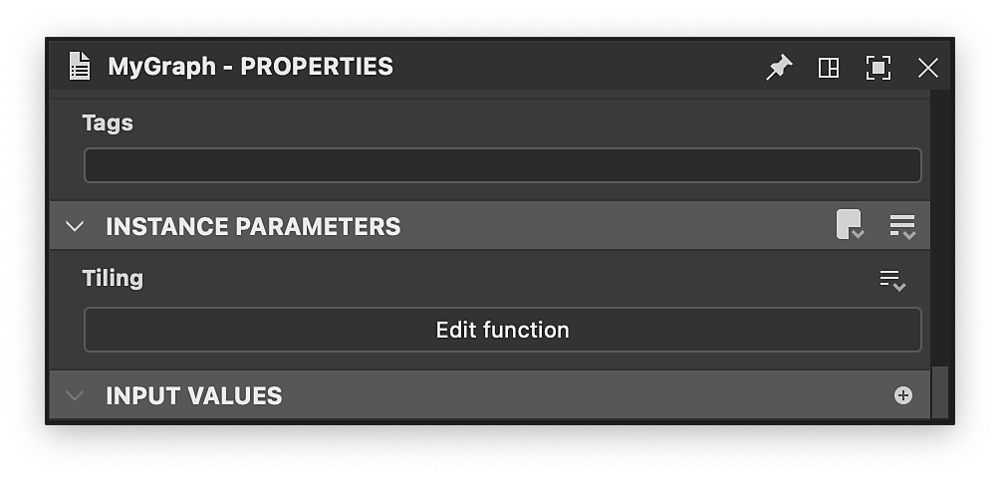

# Versione 14.0

<b>Substance 3D Designer 14.0 </b>offre diversi miglioramenti a livello di qualità di vita (navigazione tramite grafici, prestazioni, ...) ma soprattutto include molti nuovi nodi (manipolazione del colore, filtro Kuwahara, strumenti di istogramma, smusso uniforme, distanza direzionale, ...). Vedere di seguito per ulteriori dettagli su tutte queste modifiche.

*Data di pubblicazione: 30 luglio 2024*

## Nuovo contenuto

Questa versione 14.0 introduce molti nuovi contenuti con i nuovi nodi elencati di seguito:

* <b>Nodi dedicati alla manipolazione del colore: </b>un nodo <b>(</b>[Quantizza colore](../../compositing-graphs/nodes-reference-for-com/node-library/filters/adjustments/quantize-color/quantize-color.md)<b>) </b>a<b> </b>ridurre il numero di colori in un&#39;immagine ed estrarre una tavolozza da essa, una famiglia di nodi di strumenti per creare la tua tavolozza di colori ([Visualizza](../../compositing-graphs/nodes-reference-for-com/node-library/filters/adjustments/view-color-palette/view-color-palette.md) / [Crea](../../compositing-graphs/nodes-reference-for-com/node-library/filters/adjustments/create-color-palette-16/create-color-palette-16.md) / [Modifica](../../compositing-graphs/nodes-reference-for-com/node-library/filters/adjustments/modify-color-palette/modify-color-palette.md)<b> </b>tavolozza colori) e uno per applicarla a un&#39;altra immagine utilizzando una mappa ID ([Applica tavolozza colori](../../compositing-graphs/nodes-reference-for-com/node-library/filters/adjustments/apply-color-palette/apply-color-palette.md)). Troverai anche il nodo [ID per mascherare la scala di grigi](../../compositing-graphs/nodes-reference-for-com/node-library/filters/adjustments/id-to-mask/id-to-mask.md) per convertire la mappa ID, calcolata da Quantizza colore, in una maschera in scala di grigi. Con questo insieme completo di nodi, hai tutto il necessario per creare effetti di stilizzazione utilizzando i colori.

{zoomable="yes"}

{zoomable="yes"}

* <b>Filtro Kuwahara</b>: se desiderate migliorare ulteriormente la stilizzazione, potete generare alcuni effetti pittorici grazie ai filtri [Colore Kuwahara anisotropo](../../compositing-graphs/nodes-reference-for-com/node-library/filters/effects/anisotropic-kuwahara/anisotropic-kuwahara.md) / [Scala di grigi](../../compositing-graphs/nodes-reference-for-com/node-library/filters/effects/anisotropic-kuwahara-gra/anisotropic-kuwahara-grayscale.md). Nei dettagli, applica una sfocatura direzionale anisotropa conforme ai dettagli dell&#39;immagine. Il risultato è un’immagine che sembra scorrere nella direzione delle forme al suo interno.

Questi nodi (Quantizza colore e Kuwahara anisotropo) sono spiegati in [questa esercitazione](https://www.adobe.com/go/designer-tutorial-quantize). Mostra come utilizzarli per stilizzare i materiali e gestire i colori in modo più efficiente e intuitivo.

Altri nodi potenti si uniscono al gruppo:

* [<b>Curvatura uniforme</b>](../../compositing-graphs/nodes-reference-for-com/node-library/filters/effects/curvature-smooth/curvature-smooth.md): questa nuova versione ora supporta correttamente tutte le modalità di Affiancamento, aggiunge due nuovi output (convessità e concavità) e migliora sia la precisione che le prestazioni.
* <b>[Equalizzazione istogramma](../../compositing-graphs/nodes-reference-for-com/node-library/filters/adjustments/histogram-equalize/histogram-equalize.md):</b> questo nodo equalizza l&#39;istogramma di un&#39;immagine in scala di grigio regolando i valori per ottenere una distribuzione uniforme. Questi nodi sono dotati di due nodi complementari: [Rendering istogramma](../../compositing-graphs/nodes-reference-for-com/node-library/filters/adjustments/histogram-render/histogram-render.md) per generare l&#39;istogramma dell&#39;immagine e [Calcolo istogramma](../../compositing-graphs/nodes-reference-for-com/node-library/filters/adjustments/histogram-compute/histogram-compute.md)<b> </b>per codificare un istogramma come riga di pixel.
* <b>[Smusso uniforme](../../compositing-graphs/nodes-reference-for-com/node-library/filters/effects/bevel-smooth/bevel-smooth.md):</b> grazie a questo, puoi disegnare una sfumatura o un colore piatto dai bordi di una maschera (verso l&#39;esterno, l&#39;interno o entrambi). Nodo [Distanza direzionale](../../compositing-graphs/nodes-reference-for-com/node-library/filters/effects/directional-distance/directional-distance.md)<b> </b>disegna anche la sfumatura, ma in una direzione specifica.
* <b>[Normal uncombine](../../compositing-graphs/nodes-reference-for-com/node-library/filters/normal-map/normal-uncombine/normal-uncombine.md):</b> questo nodo è l&#39;opposto del nodo [Normal combine](../../compositing-graphs/nodes-reference-for-com/node-library/filters/normal-map/normal-combine/normal-combine.md) e rimuove da una mappa normale i dettagli della superficie descritti da una mappa di altezza.

<table>
<tr style="border: 0;">
<td style="border: 0;" valign="top">

Curvatura uniforme

<table>
  <tr>
    <td>
      
       <i>Prima</i>
    </td>
    <td>
      
       <i>Dopo</i>
    </td>
  </tr>
</table>

</td>
<td style="border: 0;" valign="top">

Istogramma equalizza

<table>
  <tr>
    <td>
      
       <i>Prima</i>
    </td>
    <td>
      
       <i>Dopo</i>
    </td>
  </tr>
</table>

</td>
</tr>
</table>

<table>
<tr style="border: 0;">
<td style="border: 0;" valign="top">

Smusso uniforme

<table>
  <tr>
    <td>
      
       <i>Prima</i>
    </td>
    <td>
      
       <i>Dopo</i>
    </td>
  </tr>
</table>

</td>
<td style="border: 0;" valign="top">

Separa normale

<table>
  <tr>
    <td>
      
       <i>Prima</i>
    </td>
    <td>
      
       <i>Dopo</i>
    </td>
  </tr>
</table>

</td>
</tr>
</table>

## Miglioramenti della qualità della vita

* <b>Sono state migliorate le prestazioni </b>e la <b>reattività</b> quando si lavora su grandi progetti. Ad esempio, la rimozione dei nodi può essere fino a 75 volte più veloce. Anche il tempo di [cottura](../../glossary/glossary.md) è stato ridotto per i grafici che fanno riferimento più volte alla stessa bitmap.
* <b>Parametri ereditati</b>: quando un parametro è [ereditato](../../glossary/glossary.md), invece di visualizzare il valore predefinito, viene visualizzato quello ereditato in modo da conoscere il valore attualmente utilizzato. Ulteriori informazioni sull&#39;ereditarietà in [questa pagina dedicata della nostra documentazione](../../compositing-graphs/inheritance-compositing/inheritance-in-substance-compositing-graphs.md).
* Il supporto per <b>trackpad</b> su MacOS è stato completamente rielaborato per essere più naturale e in linea con altri software. Anche lo spostamento di nodi oltre i bordi della [Visualizzazione grafico](../../interface/the-graph-view/the-graph-view.md) è stato riprogettato per garantire maggiore fluidità e coerenza in tutti i sistemi operativi.

* <b>vista 2D: </b>quando la visualizzazione in porzioni è abilitata in [vista 2D](../../interface/2d-view/2d-view.md), ora puoi ottenere valori anche per i pixel che non si trovano nella porzione originale: è molto utile controllare il [campionamento](../../glossary/glossary.md) e le transizioni dei valori tra le porzioni.

{width="320px" zoomable="yes"}

* <b>Mappa sfumatura</b>: fate clic con il pulsante centrale del mouse per spostare tutti i [tasti sfumatura](../../compositing-graphs/nodes-reference-for-com/atomic-nodes/gradient-map/gradient-map.md) verso sinistra o verso destra (in modo da mantenere gli spazi vuoti tra tutti i tasti).
* <b>Parametri</b>: per inserire funzioni personalizzate tramite parametri, è ora possibile utilizzare il widget della funzione Modifica. È una soluzione efficace per la creazione di strumenti personalizzati in cui si desidera guidare i parametri utilizzando un [grafico delle funzioni Substance](../../function-graphs/the-function-graph/the-function-graph.md).

<table>
<tr style="border: 0;">
<td style="border: 0;" valign="top">

{zoomable="yes"}

</td>
<td style="border: 0;" valign="top">

{zoomable="yes"}

</td>
</tr>
</table>

## Miglioramenti alle API

L’API di scripting include quattro nuovi metodi:

* Metodi per ottenere e impostare il tipo di grafico di un grafico di composizione Substance: myGraph.setGraphType(&quot;newType&quot;) ; myGraph.getGraphType()
* Metodo per aprire una risorsa pacchetto nel relativo editor (ad esempio, un grafico a Substance nella visualizzazione Grafico): myUIManager.openResourceInEditor(myResource)
* Metodo per selezionare una risorsa pacchetto in Esplora risorse (ad esempio, un grafico a Substance): myUIManager.setExplorerSelection(myResource)
* Metodo per il fotogramma di un nodo specifico nella visualizzazione grafico: myUIManager.focusGraphNode(myGraphViewID, myNode)

## Requisiti della piattaforma VFX

Ogni anno, la [VFX Reference Platform](https://vfxplatform.com/) pubblica un elenco di strumenti e librerie di versioni da utilizzare in ogni software per il settore VFX al fine di ridurre al minimo le incompatibilità tra software. Come al solito, *aggiorniamo tutte le nostre dipendenze* al fine di rispettare tutte queste raccomandazioni.

Tieni presente che questi aggiornamenti hanno due conseguenze principali:

* <b>I requisiti Linux</b> sono stati modificati e Designer richiede ora RHEL versione 8 o 9 (CentOS non è più supportato). Tutti i dettagli sono disponibili nella pagina [Requisiti di sistema](../../getting-started/system-requirements/system-requirements.md).
* <b>I plug-in per Designer devono essere aggiornati </b>poiché alcune funzioni sono state dichiarate obsolete in Qt6. Nel [forum della community](https://community.adobe.com/t5/substance-3d-designer-discussions/plugins-required-updates-in-designer-14-0/td-p/14768559) sono disponibili tutte le informazioni necessarie per aggiornare i plug-in.

## Note sulla versione

### 14.0.0

*(Rilasciato il 30 luglio 2024)*

### Aggiunto

* [Contenuto] Nuovo filtro Kuwahara anisotropo
* [Content] Nuovo nodo Smusso uniforme
* [Contenuto] Nuovo nodo v2 arrotondato curvatura
* [Content] Nuovo nodo Distanze direzionali
* [Content] Nuovi strumenti istogramma: Calcola, Equalizza, Rendering
* [Contenuto] Nuovo ID per il nodo Maschera
* [Contenuto] Nuovo nodo Normale per la rimozione della combinazione
* [Content] Nuovi nodi della tavolozza: Crea, Applica, Modifica, Visualizza
* [Content] Nuovo nodo Quantize Color
* [Contenuto] Alterazione direzionale non uniforme: imposta il valore predefinito della mappa dell’intensità su 1
* [Content] Aggiungere il suffisso &quot;Color&quot; o &quot;Grayscale&quot; a tutte le etichette dei nodi che dispongono di queste versioni
* [Contenuto] L’opzione &quot;Disturbo bianco&quot; obsoleta mantiene solo &quot;Disturbo bianco veloce&quot;
* [Content] Nodo &#39;Negate Float1&#39; deprecato nel grafico della funzione Substance
* [Content] Rinomina &quot;Quantizza colore&quot; in &quot;Quantizza colore (semplice)&quot;
* [Vista 2D] Visualizza i valori nel pannello Informazioni per i pixel esterni all’intervallo 0-1
* [Engine]&#x200B;[Testo] Nuova crenatura per alcuni font
* [Grafico] Miglioramento del tempo di invalidamento durante la modifica di grafici secondari profondi durante l&#39;utilizzo di un&#39;edizione contestuale
* [Linker] Non duplicare bitmap in SBSASM
* [Parameters] Aggiungere un nuovo widget &quot;function&quot; per tutti i tipi di parametri di input
* [Proprietà] Miglioramento della visualizzazione dei parametri ereditati
* [UX] Miglioramento del supporto del trackpad (solo Mac)
* [UX] Modernizza il panning quando si raggiunge il bordo del grafico durante la selezione
* [UX] Rimozione della funzionalità &quot;Disattiva High DPI&quot;
* [Branding] Nuovo branding per la schermata iniziale e la finestra Informazioni su
* [Mappa sfumatura] Aggiungi un modo per spostare tutti i tasti e il ciclo
* [Library] Imposta tutti i filtri predefiniti su maiuscole/minuscole
* [API] Aggiungi metodo per raggruppare un nodo specifico nella finestra della vista Grafico
* [API] Metodo Add per aprire una risorsa pacchetto nel relativo editor (ad esempio, un grafico a Substance nella vista Grafico)
* [API] Aggiungi metodo per selezionare una risorsa pacchetto in Esplora risorse (ad esempio, un grafico a Substance)
* [API] Aggiungi metodi per ottenere e impostare il tipo di grafico di un grafico di composizione Substance
* [ThirdParty] Segui le raccomandazioni sulle piattaforme VFX del 2023
* [ThirdParty] Segui le raccomandazioni sulle piattaforme VFX del 2024
* [Third Party] Aggiornamento incrementato alla versione 1.82.0 + USD alla versione 23.08
* [ThirdParty] Aggiornamento NGL alla 1.38
* [Third Party] Aggiornamento OpenColorIO alla versione 2.3.x
* [ThirdParty] Aggiornamento di OpenExr alla versione 3.2.x
* [ThirdParty] Aggiornamento di OpenSubdiv alla versione 3.6.x
* [ThirdParty] Aggiorna Python alla versione 3.11.x
* [ThirdParty] Aggiornamento di Qt alla versione 6.5.x
* [ThirdParty] Aggiornamento di gcc alla versione 11.2.1
* [ThirdParty] Aggiorna glibc a 2.28
* [ThirdParty] Aggiorna libstdc++ ABI a C++11 one
* [Documentazione] Nuova pagina &quot;Glossario&quot;

### Correzioni

* [Baker] Arresto anomalo quando si rigenera una scena il cui nome file è stato modificato
* [Bakers] Arresto anomalo durante il salvataggio del predefinito bakers in un file JSON
* [Content] &#39;Dispersione su spline&#39;: Esposizione parametro alfa immagine di input
* [Content] &#39;Tile Sampler Color&#39;: espressione visibleif mancante
* [Contenuto] Disturbo anisotropo: un valore negativo per la quantità X/Y produce un risultato errato
* [Content] Disturbo anisotropo: problema di suddivisione quando si utilizza un valore dispari come quantità X e nessun smoothness
* [Content] Funzione Distrib normale: max() posizionato in modo errato può portare a NaN
* [Contenuto] Le ombre RTAO, Normale piegato e RT non funzionano correttamente su alcune piattaforme
* [Content] Colore fusione splatter forma: le mappe normali OpenGL non vengono fuse correttamente
* [Content] Spazio non garantito dopo il prefisso &quot;Multi&quot; nelle etichette dei nodi
* [Dipendenze] Arresto anomalo quando si sposta il grafico all’interno o tra i pacchetti
* [Engine] Errore di precisione nei nodi di alterazione che influisce sui nodi di sfocatura Pendenza
* [Engine] Il livello SBSAR in SD non è in grado di leggere SBSAR con contenuto SBSASM > 2 GB
* [Grafico a funzioni] Risultato errato per 0^n
* [Grafico] L&#39;opzione &quot;Dimensione del nodo di visualizzazione&quot; è etichettata in modo errato
* [Grafico] Arresto anomalo quando si copia un commento principale in un altro grafico
* [Grafico] Si verifica un blocco quando Alt trascina un nodo Punto
* [Grafico] In alcuni casi, la ricerca nei nodi può non rilevare le corrispondenze evidenti
* [Grafico] Problema di prestazioni durante la modifica di un grafico a funzioni istanziato più volte con il supergrafico aperto
* [Grafico] Troppe invalidazioni durante la creazione di un output
* [Sicurezza] Vulnerabilità scrittura analisi fuori limite ICO
* [Protezione] Elimina alcuni formati immagine inutilizzati
* [Parametri] Il percorso di risorsa PKG bitmap non deve essere modificabile
* [Parametri] Risolvi i problemi relativi all&#39;esposizione/batch che espone il parametro di un processore di valori
* [Parametri] I parametri stringa vengono ignorati quando si espone un batch
* [Proprietà] Problema di prestazioni durante la modifica di un grafico a funzioni istanziato più volte con proprietà aperte
* [SVG] Le modifiche alle forme non vengono applicate nell’immagine rasterizzata
* [UI] Correggere alcuni bug/incoerenze con i widget scorrevoli (solo Windows)
* [UI] Ordine incoerente dei formati di file di scena 3D negli elenchi di importazione/esportazione
* [UI] Le azioni della finestra sono duplicate nell&#39;interfaccia utente
* [Controllo versione] Lo script &#39;perforce.py&#39; non funziona su Python 3
