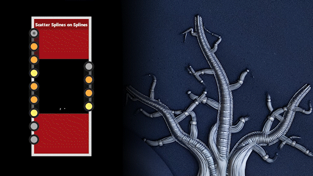

# Versione 14.1

Questo aggiornamento introduce nuove funzioni per migliorare l’utilizzo quotidiano di Substance 3D Designer: strumenti di disposizione dei nodi per migliorare rapidamente il layout del grafico, parametri di copia/incolla per applicare un set di parametri a un altro nodo e un segnaposto di pixel nel Vista 2D per tenere traccia di un pixel specifico durante il debug del grafico. Viene inoltre aggiunto nuovo contenuto, principalmente per completare i set di nodi Spline e Path.

*Data di pubblicazione: 14 gennaio 2025*

## Aggiornamenti di spline e tracciati

Le spline e i nodi di percorso sono stati introdotti nella versione 13.0 e, grazie al tuo feedback, abbiamo apportato una serie iniziale di miglioramenti. In primo luogo, abbiamo aggiunto le [spline Dispersioni su spline](../../compositing-graphs/nodes-reference-for-com/node-library/spline-paths-tools/spline-tools/scatter-splines-splines/scatter-splines-on-splines.md) nodo, che distribuisce spline lungo una spline padre, offrendo opzioni simili a quelle di un normale nodo dispersione. Inoltre, il nodo [Maschera su tracciati](../../compositing-graphs/nodes-reference-for-com/node-library/spline-paths-tools/path-tools/mask-to-paths/mask-to-paths.md) è stato migliorato per fornire un maggiore controllo sulla posizione del primo vertice sul tracciato. Abbiamo inoltre reso possibile l&#39;introduzione della casualità nel nodo [Spline Bridge List](../../compositing-graphs/nodes-reference-for-com/node-library/spline-paths-tools/spline-tools/spline-bridge-list/spline-bridge-list.md).

<table>
<tr style="border: 0;">
<td style="border: 0;" valign="top">

{zoomable="yes"}

</td>
<td style="border: 0;" valign="top">

{zoomable="yes"}

</td>
</tr>
</table>

## Strumenti di allineamento dei nodi

Se desideri mantenere un grafico pulito e leggibile, gli [strumenti di allineamento dei nodi](../../interface/the-graph-view/node-alignment-tools/node-alignment-tools.md) sono stati creati per te e sono stati completamente rinnovati. Ora è possibile spaziare in modo uniforme i nodi (in orizzontale o in verticale) e allineando i nodi si evitano sovrapposizioni sovrapponendoli in modo ordinato. Ciliegia in alto: entrambe le funzionalità tengono conto delle dimensioni effettive dei nodi.

{zoomable="yes"}

## Copia/incolla i parametri

È ora possibile [copiare i parametri di un nodo e incollarli in un altro](../../compositing-graphs/manage-parameters/manage-parameters.md), pertanto tutti i parametri corrispondenti nel nodo di destinazione verranno aggiornati ai valori del nodo di origine. Questo è molto utile se, ad esempio, volete trasferire i parametri di un nodo di colore alla relativa versione in scala di grigio o viceversa. (ad esempio, il nodo Tile Sampler)

## Fissa il pixel nella vista 2D

Il nuovo [strumento Sampler colori](../../interface/2d-view/color-sampler/color-sampler.md) nel Vista 2D consente di tenere traccia del valore di un pixel selezionato rilasciando un segnaposto su di esso. Questo è molto utile per assicurarti di visualizzare sempre le informazioni dello stesso pixel su più nodi in un grafico. Aprite il pannello Informazioni per accedere allo strumento e provatelo!

{width="640px" zoomable="yes"}

## Miglioramenti alla ricerca

Lo strumento [Ricerca nodi](../../interface/the-graph-view/node-finder/node-finder.md) è stato leggermente migliorato:

* Ora puoi attivare una modalità ricorsiva per una ricerca più approfondita;
* La modalità sfocata può essere disattivata se si desidera cercare un termine esatto;
* Quando si abilita lo strumento Node Finder, l’attenzione viene impostata automaticamente sul campo di ricerca;
* Il layout della barra degli strumenti è stato ripensato per risparmiare spazio.

{width="640px"}

## Video

<table>
<tr style="border: 0;">
<td style="border: 0;" valign="top">

</td>
<td style="border: 0;" valign="top">

</td>
</tr>
</table>

## Note sulla versione

### 14.1.0

*(Rilasciato il 14 gennaio 2025)*

### Aggiunto

* [Vista 2D] Aggiungere la visualizzazione dei pixel bloccati nel pannello Informazioni
* [API] Esposizione dei nodi Dimensione riquadro nella scena di visualizzazione grafico
* [Content] &quot;Material Height Blend&quot;: output &quot;Height Mask&quot;
* [Content] &#39;Path Vertex Processor&#39;: usa il pulsante &#39;Edit function&#39; per il parametro &#39;Per vertex function&#39;
* [Contenuto] Livelli automatici: pulisci il parametro non utilizzato, regola le etichette e la descrizione comandi
* [Contenuto] Maschera per tracciati v2
* [Contenuto] Nuova media del nodo della minima varianza (MLV)
* [Contenuto] Nuovo nodo Filtro mediano
* [Content] Quantizza colore: aggiungi l’opzione di filtro &quot;Più vicino&quot;
* [Content] Elenco Spline Bridge: aggiungete parametri di scostamento spline casuali
* [Content] Strumenti spline: nuovo nodo della spline (quadratico)
* [Content] Triangle Grid: modifica il metodo di triangolazione e utilizza i loop
* [Contenuto] Nuove spline Dispersione nel nodo Spline
* [Cooker] Esporre il parametro di base &#39;Pixel ratio&#39; come variabile statica &#39;$pixelratio&#39;
* [CrashReport] Finestra Integra nuovo report di arresto anomalo
* [Engine] Aggiungi la versione Vulkan/Metal del motore di fusione
* [Grafico] Modalità materiale: consente la connessione all&#39;input senza utilizzo quando è selezionato un singolo collegamento
* [Grafico] Collegamento materiale: consenti connessioni standard quando la connessione non è ambigua
* [Grafico] Strumenti di allineamento dei nodi: aggiunta di distribuzioni orizzontali/verticali, allineamenti sinistro/destro/superiore/inferiore e supporto di nodi sovrapposti
* [Libreria] Correggere il colore del testo nei menu contestuali
* [Parametri] Copiare i parametri da un nodo a un altro
* [Proprietà] &quot;Ripristina tutto&quot;: rimuovi la finestra a comparsa di conferma
* [Resources] Impostare il formato su &quot;All format&quot; nella finestra di dialogo &quot;Link Bitmap&quot;
* [Cerca] Aggiungi un modo per abilitare/disabilitare una modalità ricorsiva
* [Cerca] Aggiungi un modo per abilitare/disabilitare la ricerca fuzzy
* [Cerca] Mostra sempre e attiva il campo dei termini di ricerca quando si abilita Ricerca nodi utilizzando la relativa scelta rapida da tastiera da tastiera
* [Search] Rielaborare l&#39;opzione di filtro
* [Scelte rapide] Consenti assegnazione tasti &#39;V&#39;, &#39;H&#39; e &#39;S&#39;
* [ThirdParty] Upgrade to Qt 6.5.7
* [UX] Le finestre di dialogo modali non devono essere minimizzabili
* [UX] Rimuovi scorrimento orizzontale nella finestra di dialogo di avviso

### Correzioni

* [Content] Smussato: il formato normale non è interessato dalla preferenza globale
* [Contenuto] Il nodo Colore da maschera non ignora il canale alfa
* [Content] Distanza direzionale: risultato errato quando l&#39;input ha un rapporto di immagine verticale
* [Content] Mappatura Flood Fill: avviso generato per la variabile assente
* [Contenuto] Calcolo istogramma: il risultato è 16 volte quello che dovrebbe essere
* [Contenuto] Le caustiche RT non funzionano con risoluzione non quadrata
* [Contenuto] Elenco Spline Bridge: risultato errato quando si utilizzano gli offset di inizio/fine
* [Contenuto] Selezione spline: la quantità di spline di output può essere maggiore della quantità di spline di input
* [Content] Spline Warp genera un risultato nero con il motore SSE
* Triangle Grid [Content]: il pattern non viene affiancato correttamente
* [Content] Triangle Grid: la suddivisione in porzioni è interrotta in un caso specifico
* [Data] Arresto anomalo quando si modifica l’identificatore di input del grafico in un caso specifico
* [Grafico a funzioni] I valori lunghi appaiono sovrapposti sui nodi &quot;mobili&quot;
* [Fx-Map] Arresto anomalo durante la visualizzazione delle proprietà del nodo quadrante
* [Grafico] [UDIM] Una barra di scorrimento nell&#39;elenco UDIM genera 1.1 1.2 voci
* [Grafico]&#x200B;[Scelte rapide] Il nodo creato utilizzando una scelta rapida non viene posizionato sul collegamento esistente dopo la duplicazione del nodo
* [Properties] Visualizzazione del parametro non corretta quando il valore non è valido
* [Publish] Le dipendenze reciproche generano un ciclo infinito durante la pubblicazione di un pacchetto
* [Publish] Errore invisibile quando si utilizza l&#39;azione &#39;Publish&#39; su un pacchetto con dipendenza scaricata
* [UI] Il widget &quot;Dimensione principale&quot; non viene visualizzato correttamente quando viene espanso e potrebbe bloccare l’interfaccia (solo macOS)
* [UI] In alcuni casi, la finestra principale si trova dietro ad altre applicazioni (solo Windows)
