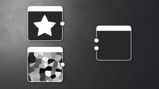

# Versione 15.0

Questo aggiornamento introduce un nuovissimo modulo di rendering 3D, con modalità rasterizzatore e tracciatore dei percorsi, e un supporto nativo di [USD](https://openusd.org/release/index.html) per consentire la modifica e l’esportazione delle scene senza perdita di dati.

*Data di pubblicazione: 15 luglio 2025*

## Nuovo renderizzatore 3D

### Nuovo rasterizzatore e tracciatore

Questa nuova versione offre l’accesso a un [modulo di rendering 3D](../../interface/3d-view/3d-renderers/3d-renderers.md) avanzato, con una modalità rasterizzatore (per avere un’anteprima in tempo reale mentre lavorate sul materiale) e una modalità tracciatore tracciato (una modalità ray tracing per ottenere un rendering perfetto e preciso). Questo nuovo modulo di rendering migliora le funzionalità con funzioni quali ombre in modalità rasterizzatore, migliora la qualità e le prestazioni ed è progettato per supportare tecnologie future come [MaterialX](https://materialx.org/). Completa i moduli di rendering OpenGL e Iray esistenti in Designer e si allinea con i moduli di rendering disponibili in Substance 3D Viewer e Substance 3D Sampler, garantendo un’esperienza uniforme in tutto l’ecosistema.

La [barra degli strumenti della vista 3D](../../interface/3d-view/3d-view.md) è stata aggiornata per accedere rapidamente ad alcune delle nuove funzioni disponibili in questo modulo di rendering:

* <b>Strumento di selezione:</b> per selezionare un submesh nella scena. Una volta selezionato un submesh, puoi concentrarti su di esso (F) o accedere alle sue proprietà di materiale (clic con il pulsante destro del mouse).
* <b>Abilita pathtracer:</b> per passare rapidamente dalla modalità pathtracer alla modalità rasterizzatore e viceversa.
* <b>Attiva ombre:</b> per attivare le ombre nella scena, utile per vedere come si comportano i materiali in base alla luce.
* <b>Abilitare il piano terreno </b> per abilitare o meno il piano terreno nella scena.

Inoltre, il tasto di scelta rapida per ruotare la luce ambiente è stato modificato in modo che corrisponda alle altre app Substance, quindi ora è *<b>clic con il pulsante destro del mouse tenendo premuto il tasto Maiusc</b>* invece di *<b>clic con il tasto Ctrl e il tasto Maiusc</b>*.

### Effetti post

[Gli effetti post sono tornati](../../interface/3d-view/camera/post-effects/post-effects.md). Sono ora disponibili tramite il menu Camera e sono stati sviluppati internamente.

* <b>Bloom:</b> simula il bagliore attorno a punti luminosi come luci e riflessi, consentendo una migliore visualizzazione delle superfici emissive.
* <b>Mappatura toni: </b>l&#39;intervallo di colori con profili per ottenere un effetto HDR (High-Dynamic-Range).
* <b>Profondità di campo:</b> simula le proprietà di messa a fuoco di un obiettivo della fotocamera (solo rasterizzatore).

## Edizione delle risorse nel contesto

Quando lavori sui tuoi materiali, potresti voler [visualizzarli in anteprima nel contesto di una scena 3D specifica](../../working-with-3d-scenes/working-with-3d-scenes.md). Ecco perché abbiamo aggiunto la possibilità di importare ed eseguire il rendering di una scena completa, con tutte le texture, le fotocamere e le luci. E ciliegia in alto, se questa scena fa riferimento a Ombreggiature MaterialX, verranno renderizzati correttamente con il rasterizzatore!

Una volta importato, puoi lavorare sulla scena selezionando una trama (con MAIUSC + clic o grazie al browser scene) e [ignorandone uno qualsiasi dei materiali](../../working-with-3d-scenes/overriding-scene-mat/overriding-scene-materials.md). L’Utente può quindi:

* Create o caricate un grafico e applicatelo a un materiale della scena.
* Apportate le regolazioni a un materiale esistente [estraendone le texture](../../working-with-3d-scenes/extracting-materials-val/extracting-materials-values-and-textures.md) in un nuovo grafico.

Infine, una volta modificata la scena 3D, potete [esportarla](../../working-with-3d-scenes/exporting-scenes/exporting-scenes.md) come nuovo file o come nuovo livello del file originale, per evitare la perdita di dati (solo per il formato USD).

Infine, sono ora supportati più formati 3D sia per l’importazione che per l’esportazione: USD (+ usda, usdc, usdz), STL, PLY e GLTF, oltre ai formati già disponibili FBX e OBJ.

## Descrizioni avanzate

Sono state introdotte descrizioni avanzate per illustrare meglio lo scopo di ogni nodo. Queste descrizioni, attualmente disponibili solo per [nodi atomici](../../compositing-graphs/nodes-reference-for-com/atomic-nodes/atomic-nodes.md), includono immagini che illustrano l&#39;effetto del nodo e forniscono un collegamento diretto alla documentazione per informazioni dettagliate, incluso l&#39;elenco di parametri, suggerimenti e trucchi.

<table>
<tr style="border: 0;">
<td style="border: 0;" valign="top">

</td>
<td style="border: 0;" valign="top">

</td>
<td style="border: 0;" valign="top">

</td>
</tr>
</table>

## Miglioramento del supporto non quadrato

Se dovete lavorare con texture non quadrate, questa nuova opzione è stata creata appositamente. Nelle [proprietà del materiale](../../interface/3d-view/material-properties/material-properties.md) nella vista 3D, nelle opzioni UV per controllare la suddivisione in porzioni, è ora possibile impostare un valore diverso per entrambi gli assi.

{zoomable="yes"}

## Baker

Mentre l’interfaccia di cottura ha rilevato solo aggiornamenti minori (fate riferimento all’elenco dettagliato di seguito per ulteriori informazioni), la libreria di cottura è stata completamente ricostruita per utilizzare i forni basati su GPU, con risultati di prestazioni molto migliori. Insieme ai nuovi formati di file supportati sopra menzionati, questo aggiornamento rappresenta un progresso sostanziale per gli utenti impegnati in flussi di lavoro di cottura.

Nota: se utilizzate sbsbaker.exe per automatizzare il processo, lo strumento è stato rinominato substance3d\_baker.exe (utilizzate substance3d-baker —help per ulteriori informazioni).

## Aggiornamenti dei requisiti della piattaforma VFX

Ogni anno, la [VFX Reference Platform](https://vfxplatform.com/) pubblica un elenco di strumenti e librerie di versioni da utilizzare in ogni software per il settore VFX al fine di ridurre al minimo le incompatibilità tra software. Come al solito, *aggiorniamo tutte le nostre dipendenze* al fine di rispettare tutte queste raccomandazioni.

## Video

## Note sulla versione

### 15.0.0

*(Rilasciato il 15 luglio 2025)*

### Aggiunto

* [Vista 3D] Nuovo modulo di rendering, con modalità rasterizzatore e tracciatore tracciatore
* [Vista 3D] Aggiungi uno strumento di selezione per selezionare un oggetto nella scena 3D
* [Vista 3D] Aggiungi nuova &quot;Esporta scena con livelli...&quot; azione nel menu &quot;Scena&quot;
* [Vista 3D] Aggiungere nuovi pulsanti della barra degli strumenti
* [Vista 3D] Aggiungi la possibilità di passare da una videocamera all’altra contenuta in una scena USD
* [Vista 3D] Consente di attivare l&#39;oggetto selezionato quando si preme &#39;F&#39; nella finestra della vista
* [Vista 3D] Consente di generare un grafico di composizione Substance da un materiale esistente
* [Vista 3D] Consenti l’invio di un grafico composizione SBS nella vista 3D e assegna il suo output univoco all’utilizzo Ambiente/Panorama
* [Vista 3D] Cancella la selezione corrente premendo il tasto Esc
* [Vista 3D] Visualizza una scena 3D importata con texture
* [Vista 3D] Distinguere i controlli di ripetizione delle texture X e Y
* [Vista 3D] Attivare/Disattivare le ombre
* [Vista 3D] Attivare/Disattivare il piano terreno
* [Vista 3D] Nel menu &quot;Materiali&quot;, aggiungi &quot;Rimuovi&quot; solo per il Materiale che è stato aggiunto manualmente e che non è utilizzato
* [Vista 3D] Nel menu &quot;Materiali&quot;, rimuovi l&#39;azione &quot;Rimuovi tutto&quot;
* [Vista 3D] Rendere i file USDZ esportati autonomi
* [Vista 3D] Rendi persistenti le proprietà del modulo di rendering quando si cambia modalità
* [Vista 3D] Mantiene gli input di materiale esistenti quando si sostituisce un materiale
* [Vista 3D] Ridisporre le proprietà della videocamera
* [Vista 3D] Rimuovi azioni &quot;Videocamera/Salva schermata...&quot; e &quot;Videocamera/Copia schermata negli Appunti&quot;
* [Vista 3D] Rimuovi l&#39;azione del menu &quot;Materiale/Ricostruisci tutto&quot;
* [Vista 3D] Rimuovi il prefisso &quot;Default&quot; dell&#39;etichetta della fotocamera predefinita
* [Vista 3D] Imposta l&#39;azione di menu &quot;Ripristina valore predefinito&quot; come ultima nel menu hamburger delle proprietà di input del materiale
* [Vista 3D] Regolazioni scelte rapide
* [Vista 3D] Supporto di ombre e trasparenza in modalità tempo reale
* [Vista 3D] Supporto degli shader MaterialX da una scena USD importata
* [Vista 3D/OpenGL] Rinomina il parametro &quot;Scala UV abilitata&quot; in &quot;Abilita Dimensioni fisiche da grafico&quot;.
* [Vista 3D / Effetti Post] Bloom
* profondità del campo [Vista 3D/Effetti Post]
* [Vista 3D / Effetti Post] Mappatura toni
* [Vista 3D / Browser scena] Consente di visualizzare le proprietà del materiale quando lo si seleziona in SceneBrowser
* [Vista 3D/Visualizzatore scene] Nascondi la colonna &quot;Materiale&quot;
* [Vista 3D/Visualizzatore scene] Inserisci in grassetto gli elementi di base USD controllati da un&#39;entità predefinita
* [Panettieri] Aggiungi un menu di scelta rapida nella vista albero con le azioni &quot;Seleziona tutto&quot;/&quot;Deseleziona tutto&quot;
* [Baker] Aggiungete un&#39;opzione per controllare l&#39;interpolazione bitangent
* [Bakers] Aggiungi splitter orizzontale nella GUI
* [Bakers] Aggiungi macro UDIM per impostazione predefinita nel nome di output quando la scena è udim
* [Pannelli] Consente di ricalcolare la tangente
* [Panettieri] Consenti di rinominare un panettiere senza interrompere i collegamenti
* [Panettieri] Modificare le dimensioni predefinite del pannello centrale
* [Bakers] Texture di input per flusso di lavoro UDIM
* [Bakers] Imposta l&#39;ordine dell&#39;elenco di mappe 2D View come ordine dell&#39;elenco di rendering Bakers
* [Panettieri] Rendete modale la finestra di cottura
* [Panettieri] Gestire i parametri di mappatura tonale
* [Bakers] Rimuovi selezione plug-in spazio tangente
* [Panettieri] Salva stato &quot;abilitato&quot; o &quot;disabilitato&quot; per i panettieri durante il salvataggio di un predefinito
* [Panettieri] Selezionare il materiale per impostazione predefinita nel widget di selezione
* [Bakers] Impostare l&#39;orientamento predefinito della texture di output Normale rispetto alla preferenza
* [Panettieri] Per impostazione predefinita, imposta le porzioni UV su Tutto
* [Bakers] Opzione di aggiunta WordSpaceDirection FromTexture/FromValue
* [Pannelli] Da universale a tangente: imposta l’input predefinito su &quot;Da texture&quot;
* [SBSBaker] Create un&#39;opzione per controllare l&#39;ordine backend
* [SBSBaker] Migliore utilizzo dell&#39;argomento StringList
* [SBSBaker] Rinominare &quot;match\_source\_instance&quot; in &quot;match\_mesh\_name&quot;
* [SBSBaker] Rinominare &quot;Submesh&quot; in &quot;GeomSubset&quot;
* [SBSBaker] Rinomina in substance3d\_baker
* [Content] Aggiungi la forma &#39;Hemisphere&#39; ai nodi del generatore che espongono le forme Quadrant
* [Interop] Supporto del formato di file GLTF
* [Interop] Supporto del formato file PLY
* [Interop] Supporto del formato di file STL
* [Library] Uniformizzare le descrizioni comandi per i nodi atomici
* [Mac] Interrompi il supporto della piattaforma MacIntel
* [Nodes] Aggiungere descrizioni comandi avanzate per i nodi atomici
* [Parameters] Chiude la sezione &#39;Attributes&#39; per impostazione predefinita
* [Parametri] Consente all&#39;utente di specificare i valori di default dei parametri di base per le nuove istanze
* [Preferenze] Pannelli: aggiungi un&#39;opzione booleana per calcolare lo spazio tangente per frammento
* [Preferenze] Rimuovi i plug-in dello spazio tangente
* [Preferenze] Memorizzare le preferenze per le versioni secondarie di SD (XX.X)
* [VFX] Aggiornamento incrementale alla versione 1.85.0
* [VFX] Aggiornate MacOS versione minima alla versione 12.0
* [VFX] Aggiornamento OpenColorIO alla versione 2.4.2
* [VFX] Aggiornamento OpenColorIO alla versione 2.4.x
* [VFX] Aggiornamento di OpenExr alla versione 3.3.x
* [VFX] Aggiornare Qt alla versione 6.5.8

### Correzioni

* [Vista 3D] Le texture nella scena USD esportata non vengono applicate correttamente
* [Vista 3D] [UDIM] Impossibile visualizzare gli output del grafico UDIM in Vista 3D quando la visualizzazione automatica all&#39;apertura del grafico è disattivata nelle preferenze del grafico
* [Panettieri] &#39;Antialiasing.&#39; e &#39;Media. le celle normali per i baker non applicabili sono vuote e modificabili
* [Baker] L’azione &quot;Aggiorna&quot; utilizza il back-end raytracing quando è disattivato nelle preferenze
* [Panettieri] Panettieri bloccati come occupati dopo un errore durante il processo &quot;Aggiorna tutte le mappe con baking&quot;
* [Baker] Arresto anomalo a oltre 180 UDIM quando si esegue i baking la mappa di posizione OpenGL su una trama specifica
* [Baker] Arresto anomalo quando si apre la finestra di dialogo &quot;Esegue i baking informazioni sul modello&quot; più volte in una riga (solo macOS)
* [Baker] Nell’esportazione dei predefiniti JSON, il valore &quot;udim&quot; è sostituito da &quot;1001&quot; quando era impostato su &quot;All&quot;
* [Baker] Memoria non rilevata correttamente su Linux
* [Baker] La dipendenza di input mappa mancante non attiva il rendering di avvisi e/o blocchi
* [Baker] Nessuna etichetta di errore quando il nome dell&#39;output è vuoto
* [Pannelli] Il passaggio della trama ad alto poli dal file non ha alcun effetto
* [Baker] Il baker di destinazione non è selezionato per impostazione predefinita quando si utilizza l’azione &quot;Ripristina&quot;
* [Engine] Distanza: visibile &quot;taglio&quot; in alcune situazioni
* [Engine] Mappa Fx: i colori negativi non sono supportati quando la profondità di bit è 8 bit (solo motori GPU)
* [Localizzazione] L’input di caratteri torna dal giapponese al latino nel menu dei nodi
* [Sicurezza] Analisi dei file USDC senza vulnerabilità di scrittura associata
* [Security] Vulnerabilità di scrittura II non associata, durante l&#39;analisi del file NEF
* [Sicurezza] Vulnerabilità di lettura non associata III, durante l&#39;analisi del file DNG
* [Preferenze] Problemi UX nelle impostazioni del progetto per progetti di sola lettura
* [Risorse] Più set UV non vengono visualizzati quando si aprono file FBX
* [UI] Etichette sovrapposte nella barra di stato
* [UI] Le descrizioni del menu a discesa &quot;Modalità creazione collegamento&quot; non vengono visualizzate

### PROBLEMI NOTI

* [Bakers] Arresto anomalo durante la cottura con alcuni driver NVidia specifici
* [Vista 3D] OpenGL: alcune scene importate potrebbero non essere renderizzate
* [Vista 3D] Rasterizzatore: artefatti di ombra quando si utilizza lo spostamento su una scena piatta
* [Vista 3D] Tracciatore: prestazioni lente durante l&#39;aggiornamento delle texture con tasselation/spostamento abilitato
* [Vista 3D] Alcune proprietà del materiale cromatico non sono gestite correttamente dal colore quando vengono modificate localmente
* [Vista 3D] Le scene con forme di base animate non sono supportate correttamente
* [Vista 3D] La trama con più elementi UDim non è ancora supportata
* [Vista 3D] Le trame con più UV non sono supportate e potrebbero causare un rendering del materiale non valido
* [Vista 3D] Tracciatore non supportato sulle schede grafiche AMD
