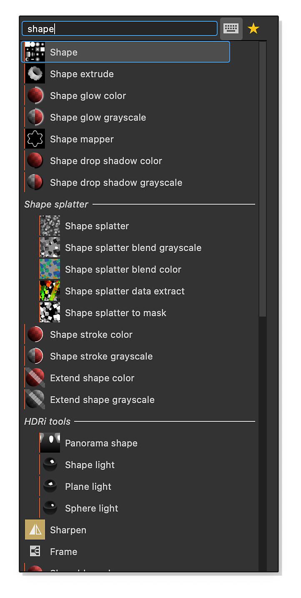
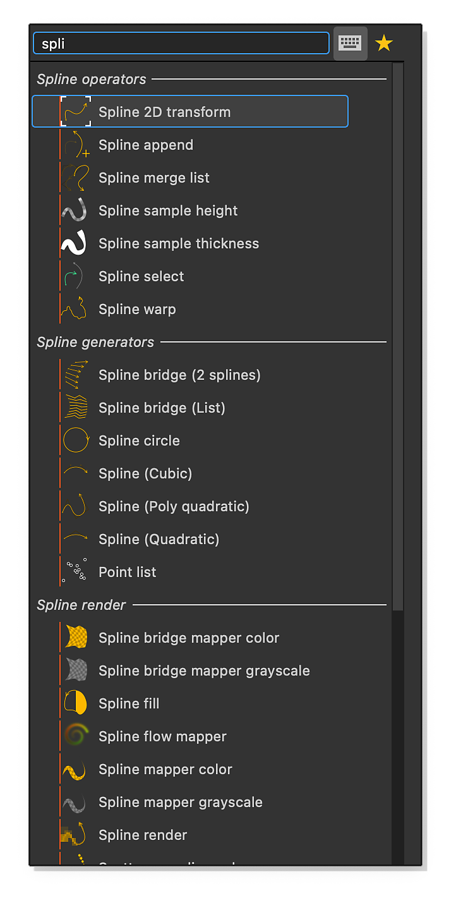

# Versione 15.1

Substance Designer 15.1 introduce una finestra di creazione del grafico completamente rinnovata con accesso diretto ai campioni, nodi di disturbo migliorati per maggiori possibilità creative, categorie organizzate nel menu dei nodi e molto altro ancora.

*Data di pubblicazione: 11 dicembre 2025*

## Migliorare la creazione di grafici

In questa versione, la [finestra per la creazione del grafico](../../compositing-graphs/creating-compositing-gra/creating-a-substance-compositing-graph.md) è stata <b>completamente riprogettata</b> per migliorare l&#39;esperienza iniziale dell&#39;utente in Substance 3D Designer. L’obiettivo principale di questo aggiornamento è quello di semplificare il processo di selezione dei modelli, consentendo agli utenti di identificare in modo efficiente il modello più adatto alle loro esigenze.

Le miniature offrono <b>riferimenti visivi</b> immediati per i tipi di materiale desiderati, mentre le descrizioni comandi dettagliate forniscono tutte le informazioni pertinenti. Per una migliore organizzazione, i modelli sono ora classificati in <b>categorie</b> specifiche, ad esempio materiali, filtri ed elaborazioni di scansione.

Sebbene l’interfaccia principale sia stata aggiornata, gli utenti continuano ad avere accesso alle visualizzazioni precedenti, tra cui le opzioni elenco, pacchetti e directory.

[Ulteriori informazioni](../../compositing-graphs/creating-compositing-gra/creating-a-substance-compositing-graph.md)

{zoomable="yes"}

## Campioni incorporati

Con il lancio della nuova finestra per la creazione del grafico, abbiamo aggiunto una serie di [<b>materiali di esempio</b>](../../compositing-graphs/creating-compositing-gra/material-samples/material-samples.md) direttamente all&#39;interno del software. Questo miglioramento risponde alla tua richiesta di un migliore accesso alle risorse di apprendimento.

{zoomable="yes"}

Per soddisfare questa esigenza abbiamo incluso campioni di materiale come tessuti (tra cui pelle e raso), legno, metallo, plastica, ceramica e altro ancora. Questi esempi hanno lo scopo di aiutarti a iniziare i tuoi progetti con facilità e a conoscere i principali nodi familiari disponibili in Substance 3D Designer

Ogni grafico è <b>annotato</b>, organizzato con cura e contiene un numero minimo di nodi per facilitarne la comprensione.

Potete accedere ai campioni nella categoria &quot;Campioni di materiale&quot; durante la creazione di un nuovo grafico a Substance o direttamente dalla schermata Home utilizzando il pratico pulsante &quot;Vai a campioni&quot;.

Oltre a questi materiali di base, abbiamo fornito anche <b>esempi avanzati</b> per dimostrare come utilizzare le funzionalità <b>FX-map e del processore Pixel</b> in modo più efficace.

[Ulteriori informazioni](../../compositing-graphs/creating-compositing-gra/material-samples/material-samples.md)

{zoomable="yes"}

## Nuovi disturbi

I rumori svolgono un ruolo cruciale nella maggior parte dei grafici ed è per questo che ci siamo concentrati su diversi miglioramenti chiave in questa versione per migliorarne la funzionalità e l’usabilità.

Con questo aggiornamento è stato introdotto <b>un migliore supporto per scenari senza suddivisione in porzioni</b>, in modo da garantire che i modelli di disturbo funzionino come previsto senza suddivisione in porzioni obbligatoria. In precedenza, i nodi di disturbo venivano suddivisi in porzioni o producevano risultati errati quando la suddivisione in porzioni era disattivata.

La maggior parte dei rumori ora include <b>nuovi parametri</b>, che offrono agli utenti un maggiore controllo creativo. Queste opzioni aggiuntive consentono agli autori dei grafici di regolare l’aspetto e il comportamento del disturbo all’interno dei flussi di lavoro.

Infine, la profondità di bit <b>non è più bloccata a 16 bit</b>. Ora potete ignorare l’impostazione della profondità di bit sulle singole istanze del nodo, per ottenere maggiori dettagli e un intervallo dinamico quando necessario, oppure ottimizzare i grafici per le prestazioni.

Consulta l&#39;elenco completo dei rumori aggiornati nelle [note sulla versione](#release-notes) di seguito.

Esempi: [Cella 1](../../compositing-graphs/nodes-reference-for-com/node-library/texture-generators/noises/cells-1/cells-1.md) [Nuvole 2](../../compositing-graphs/nodes-reference-for-com/node-library/texture-generators/noises/clouds-2/clouds-2.md) [&#x200B; Graffi direzionali](../../compositing-graphs/nodes-reference-for-com/node-library/texture-generators/noises/directional-scratches/directional-scratches.md) [&#x200B; Rumore di umidità 1](../../compositing-graphs/nodes-reference-for-com/node-library/texture-generators/noises/moisture-noise/moisture-noise.md)

{zoomable="yes"}

## Gerarchia nel menu dei nodi

Per risolvere il problema di individuare nodi specifici all&#39;interno della libreria estesa, abbiamo introdotto le categorie nel menu Nodo.

Il gran numero di nodi disponibili può rendere difficile trovare rapidamente quello desiderato. Per semplificare questo processo, è stato implementato un nuovo attributo [<b>Gruppo</b>](../../compositing-graphs/graph-parameters/graph-parameters.md) a livello di grafico. Quando questo attributo viene definito, viene utilizzato per organizzare e ordinare i risultati della ricerca.

<table>
<tr style="border: 0;">
<td style="border: 0;" valign="top">

Ricerca di {zoomable="yes"}

</td>
<td style="border: 0;" valign="top">

Ricerca di {zoomable="yes"}

</td>
</tr>
</table>

## Output predefinito

Quando un nodo dispone di più [output](../../compositing-graphs/nodes-reference-for-com/atomic-nodes/output/output.md), non è possibile visualizzarli tutti contemporaneamente nella vista 2D o come miniatura del nodo. In questi casi, la linea guida prevalente è quella di utilizzare il primo pin collegato o, se non ne è collegato nessuno, il primo output per impostazione predefinita.

Tuttavia, questo approccio potrebbe non sempre produrre risultati ottimali. Ad esempio, in alcuni nodi della spline il primo pin collegato spesso rappresenta i dati delle coordinate della spline, che non è adatto per scopi di anteprima.

Per risolvere questo problema, è stato introdotto un attributo di output predefinito. Questa funzione consente all&#39;autore del grafico di <b>specificare l&#39;output da visualizzare per impostazione predefinita</b>, migliorando in tal modo l&#39;intuitività dell&#39;utilizzo del nodo e facilitando una comprensione più chiara del grafico creato.

Sperimentate con l’immagine seguente per vedere la differenza prima e dopo la definizione di output predefinita.

[Ulteriori informazioni](../../compositing-graphs/nodes-reference-for-com/atomic-nodes/output/output.md)

<table>
  <tr>
    <td>
      
       <i>Prima</i>
    </td>
    <td>
      
       <i>Dopo</i>
    </td>
  </tr>
</table>

## Nodo &#39;È definito&#39;

Quando lavorate con i grafici delle funzioni, potrebbe essere necessario determinare se una [variabile](../../function-graphs/nodes-reference-for-fun/atomic-function-nodes/get-nodes/get-nodes.md) esiste nel grafico.

Ad esempio, il rilevamento dell’assenza di una variabile consente di fornire un valore di fallback, garantendo che la funzione si comporti come previsto senza richiedere che ogni input venga impostato in modo esplicito. Per questo motivo è stato aggiunto il nodo [&#39;È definito&#39;](../../function-graphs/nodes-reference-for-fun/atomic-function-nodes/get-nodes/get-nodes.md).

[Ulteriori informazioni](../../function-graphs/nodes-reference-for-fun/atomic-function-nodes/get-nodes/get-nodes.md)

{zoomable="yes"}

## Note sulla versione

### 15.1.0

*(Rilasciato l&#39;11 dicembre 2025)*

### Aggiunto

* [NewGraph] Rielaborazione della nuova finestra del grafico
* [NewGraph] Aggiungere campioni di materiali e campioni avanzati
* [NewGraph] Aggiungere un nuovo attributo per il grafico per i dati del modello (categoria e sottotitolo)
* [NewGraph] Rimuovi opzione Formato di output
* [Content] Aggiungi funzioni hash
* [Content] Aggiungi tonemapper alle funzioni.sbs
* [Contenuto] Rumore anisotropo v2: aggiungere il formato di output predefinito, aggiungere il disturbo
* [Content] Applicare le maiuscole/minuscole al nodo e alle etichette dei parametri
* [Content] BnW spot 1 v2: aggiungete il formato di output predefinito, senza supporto per la suddivisione in porzioni
* [Content] BnW spots 2 v2: aggiungete il formato di output predefinito, senza supporto per la suddivisione in porzioni
* [Content] BnW spot 3 v2: aggiungete il formato di output predefinito, senza supporto di suddivisione in porzioni
* [Contenuto] Celle 1,2,3,4 v2: aggiungi formato di output predefinito, nessun supporto per la suddivisione in porzioni, opzioni per i disturbi
* [Content] Cloud 1 v2: aggiungete il formato di output predefinito, senza supporto per la suddivisione in porzioni
* [Content] Cloud 2 v2: aggiungi formato di output predefinito, senza supporto per la suddivisione in porzioni
* [Content] Cloud 3 v2: aggiungete il formato di output predefinito, senza supporto per la suddivisione in porzioni
* [Contenuto] Da colore a maschera v2
* [Content] Disturbo direzionale 1 v2: aggiungi formato di output predefinito, senza supporto per la suddivisione in porzioni
* [Content] Disturbo direzionale 2 v2: aggiungi formato di output predefinito, senza supporto per la suddivisione in porzioni
* [Content] Disturbo direzionale 3 v2: aggiungi formato di output predefinito, senza supporto per la suddivisione in porzioni
* [Content] Disturbo direzionale 4 v2: aggiungi formato di output predefinito, senza supporto per la suddivisione in porzioni
* [Contenuto] Graffi direzionali v2: aggiungi il formato di output predefinito, senza supporto per la suddivisione in porzioni
* [Content] Dirt 1 v2: aggiungi formato di output predefinito, senza supporto per la suddivisione in porzioni
* [Content] Dirt 2 v2: aggiungi formato di output predefinito, senza supporto per la suddivisione in porzioni
* [Content] Dirt 3 v2: aggiungi formato di output predefinito, senza supporto per la suddivisione in porzioni
* [Content] Dirt 4 v2: aggiungi formato di output predefinito, senza supporto per la suddivisione in porzioni
* [Content] Dirt 5 v2: aggiungi formato di output predefinito, senza supporto per la suddivisione in porzioni
* [Contenuto] Sfumatura Dirt v2: aggiungi formato di output predefinito, nuove opzioni per i disturbi
* [Contenuto] Base Somma frattale v2: aggiungi formato di output predefinito, disturbo, nessun supporto di suddivisione
* [Contenuto] Somma frattale 1,2,3,4 v2: aggiungi formato di output predefinito
* [Content] Gaussian noise v2: aggiungi formato di output predefinito, nessun supporto di suddivisione in porzioni
* [Contenuto] Punte gaussiane 1&amp;2 v2: aggiungete il formato di output predefinito, senza supporto di porzioni
* [Contenuto] Fibre disordinate 1,2,3 v2: aggiungi formato di output predefinito, nessun supporto di affiancamento, opzioni di disturbo
* [Contenuto] Disturbo da umidità v2: aggiungi il formato di output predefinito, senza supporto per la suddivisione in porzioni
* [Content] Nuovo nodo &quot;Disturbo umidità 2&quot;
* [Content] Noises: aggiorna per aggiungere il formato di output predefinito
* [Content] Perlin noise v2: aggiungi formato di output predefinito, nessun supporto di suddivisione in porzioni
* [Content] Mappatura forme: aggiungi modalità filtro
* [Content] Mappatura UV: aggiungi modalità filtro
* [Contenuto] Forma d’onda 1 v2: usa il formato di output predefinito + nuove opzioni
* [Content] Rumore bianco v2: utilizzate il formato di output predefinito e aggiungete le opzioni di distribuzione
* [Bakers] Visualizza gli UV solo dalla trama selezionata
* [Bakers] Aggiungere un&#39;opzione per selezionare il metodo di corrispondenza della geometria in base al nome
* [Panettieri] Seleziona il panettiere più vicino quando viene eliminato un panettiere
* [Panettieri] UDIM: definire un elenco di porzioni UV da cuocere
* [Bakers] Aggiornare bake sdk alla versione 3.15.4
* [3D View/SceneBrowser] Evitare di selezionare un oggetto UsdPrimitive quando si fa clic con il pulsante destro del mouse
* [ColorManagement] Supporto di ACES 2.0
* [Grafico di composizione] Consenti di impostare un nodo di output come &quot;Output predefinito&quot;
* [Cooker] Rimuovere l&#39;avviso sugli input non connessi delle istanze di funzione †
* [Functions] Aggiungi operatore isDefined
* [Grafico] Raggruppare gli elementi per l&#39;attributo &#39;group&#39; nel menu del nodo
* [Grafico] Migliorare il rendering delle miniature

### Correzioni

* [Vista 3D] La texture in scala di grigi L16 viene visualizzata con una tinta rossa quando collegata all&#39;ambiente o a baseColor
* [Vista 3D] La modifica del binding del materiale di una scena senza materiale crea un nuovo materiale &quot;predefinito&quot;
* [Vista 3D] Le normali calcolate non sono corrette per mesh OBJ specifiche
* [Vista 3D] L&#39;ambiente personalizzato da SBSSCN non è visibile al caricamento in Pathtracer
* [Vista 3D] Errori nella console durante la rotazione di un ambiente disabilitato
* [Vista 3D] Lo Specular level non viene applicato correttamente
* [Vista 3D] Il Specular edge color non funziona quando si utilizza il rasterizzatore Eclair
* [Vista 3D] Il materiale aggiunto dall&#39;utente non viene applicato alle scene predefinite
* [Vista 3D]&#x200B;[Pannelli] Il colore del materiale è troppo scuro una volta sovrascritto o quando si utilizza un panettiere a &quot;colori&quot;
* [Vista 3D]&#x200B;[Pannelli] Nessun colore materiale dal file FBX
* [Pannelli] I colori dei materiali nei file FBX non vengono rilevati correttamente
* [Bakers] L’opzione &quot;recompute\_tangents&quot; è sempre &quot;false&quot; nelle esportazioni di predefiniti JSON
* [Bakers] CLI: arresto anomalo durante l&#39;esecuzione consecutiva dello stesso baker tramite file JSON
* [Bakers] L&#39;aggiornamento del parametro &#39;color-generator&#39; non funziona per &#39;Grayscale&#39;
* [Contenuto] Maschera per tracciati: errore nelle proporzioni non quadrate
* [Content] Renderer PBR render/icone: funzione del lobo specular errata
* [Content] Tracciati da spline: impostate la &#39;Dimensione output&#39; su &#39;Relativa alla principale&#39; per impostazione predefinita
* [Contenuto] Elenco punti: i punti non sono nell&#39;ordine corretto quando la texture dei dati è non quadrata
* [Content] Mappatura spline: errore di riga di 1px in casi casuali
* [Contenuto] Mappatura spline: UV estesi in alcuni casi quando il thickness è 0
* [Grafico] Arresto anomalo quando si elimina l’output di un grafico secondario di funzioni
* [Grafico] Il tipo di colore del nodo di input può essere modificato in pacchetti di sola lettura
* [Graph] L&#39;input principale può essere modificato in pacchetti di sola lettura
* [Proprietà] Il colore del widget di anteprima colore non corrisponde allo stato del pulsante sRGB
* [Scene] Impossibile caricare un file OBJ di dimensioni superiori a 2 GB
* [UI] Gli stati di ancoraggio di Console e Gestione dipendenze non vengono ripristinati dopo il riavvio

### PROBLEMI NOTI

* [Bakers] Arresto anomalo durante la cottura con alcuni driver NVIDIA specifici
* [Vista 3D] OpenGL: alcune scene importate potrebbero non essere renderizzate
* [Vista 3D] Tracciatore: prestazioni lente durante l&#39;aggiornamento delle texture con tasselation/spostamento abilitato
* [Vista 3D] Alcune proprietà del materiale cromatico non sono gestite correttamente dal colore quando vengono modificate localmente
* [Vista 3D] Le scene con forme di base animate non sono supportate correttamente
* [Vista 3D] La trama con più elementi UDim non è ancora supportata
* [Vista 3D] Le trame con più UV non sono supportate e potrebbero causare un rendering del materiale non valido
* [Vista 3D] Tracciatore non supportato sulle schede grafiche AMD
