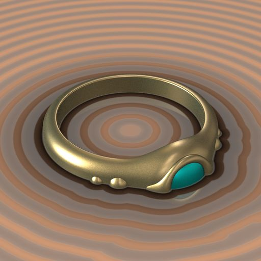
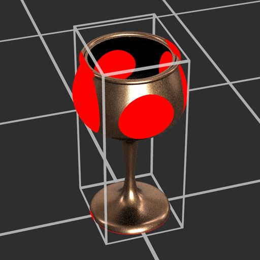

# Versione 16.0

Questa versione 16.0 introduce un flusso di lavoro più creativo per la dispersione e la manipolazione dei pattern grazie ai nuovi splatter di forma e ai nodi SDF. Inoltre, supporta in modalità nativa e migliora le impostazioni di spostamento nella vista 3D.

*Data di pubblicazione: 14 aprile 2026*

## Nodi splatter forma v2

### Nuovi modi di dispersione delle forme

I nuovi nodi [Shape splatter v2](../../compositing-graphs/nodes-reference-for-com/node-library/texture-generators/patterns/shape-splatter-v2/shape-splatter-v2.md) sbloccano i comportamenti di dispersione complessi che sono stati finora difficili, con **altri metodi di distribuzione delle forme** (disco di Poisson, uniforme) che sono *senza collisioni* per impostazione predefinita e controllano la *raccolta pulita* delle forme in aree specifiche con una **mappa di densità**.\
Gli utenti esperti possono impostare *distribuzioni personalizzate* definite da un grafico delle funzioni.

<table style="margin-top: 32px; margin-bottom: 32px">
    <tr style="border: 0">
        <td style="width: 33%; border: 0">
             <i>Distribuzione di Poisson</i>
        </td>
        <td style="width: 33%; border: 0">
             <i>Distribuzione uniforme</i>
        </td>
        <td style="width: 33%; border: 0">
             <i>Splatter forma v2: Mappa di densità</i>
        </td>
    </tr>
</table>

### Forme 3D

Le forme sparse sono ora **oggetti 3D** che possono essere spostati, ruotati e ridimensionati su tutti gli assi XYZ.

Usate **forme primitive semplici** come cubi, sfere e cilindri o **forme personalizzate complesse** formate *estrudendo una mappa di height* o creando *forme SDF 3D*. (Ulteriori informazioni in basso)

In questo modo si sblocca una dispersione più dinamica, più variegata e più credibile a tutto campo. Ed è ora possibile riutilizzare le forme 3D per le variazioni capovolgendole. (Ti vediamo, artisti dell&#39;ambiente!)

<table style="margin-top: 32px; margin-bottom: 32px; border: none">
    <tr style="border: 0">
        <td style="width: 33%; border: 0">
             <i>Rotazione 3D casuale</i>
        </td>
        <td style="width: 33%; border: 0">
             <i>Estrusione forma</i>
        </td>
        <td style="width: 33%; border: 0">
             <i>Forme SDF 3D</i>
        </td>
    </tr>
</table>

### Nodi complementari

Analogamente alla famiglia di nodi Shape splatter v1, Shape splatter v2 è dotato di una propria coorte di nodi complementari.

I nodi [Shape splatter v2 mapper](../../compositing-graphs/nodes-reference-for-com/node-library/texture-generators/patterns/shape-splatter-v2-mapper-color/shape-splatter-v2-mapper-color.md) consentono la proiezione di texture sulle forme 3D sparse, con supporto per *proiezione triplanare* e *ID materiale* per la mappatura di più texture. I risultati possono essere regolati globalmente o per forma per scostamenti di texture e variazioni di colore.\
Anche in questo caso, gli utenti esperti possono impostare *mappature di texture personalizzate* definite da un grafico di funzioni.

[Lo splatter di forme v2 da mascherare](../../compositing-graphs/nodes-reference-for-com/node-library/texture-generators/patterns/shape-splatter-v2-to-mask/shape-splatter-v2-to-mask.md) crea maschere per una selezione specifica di forme e/o ID materiale, consentendo un uso più granulare delle forme a valle nel grafico.

<table style="margin-top: 32px; margin-bottom: 32px; border: none">
    <tr style="border: 0">
        <td style="width: 33%; border: 0">
             <i>Mappatura triplanare</i>
        </td>
        <td style="width: 33%; border: 0">
             <i>Mappatura normale</i>
        </td>
        <td style="width: 33%; border: 0">
             <i>Mappatura per ID materiale dalle forme SDF</i>
        </td>
    </tr>
</table>

### Atlante griglia

<table>
    <tr style="vertical-align: top; border: 0">
        <td style="border: 0">
            
I pattern personalizzati possono essere forniti separatamente al nodo splatter forma v2 o inseriti in un atlante griglia per flussi di lavoro più snelli ed efficienti.

I modelli di Impacchettamento sono stati semplificati grazie ai nuovi nodi <a href="../../compositing-graphs/nodes-reference-for-com/node-library/texture-generators/patterns/grid-atlas-color/grid-atlas-color.md">Atlante griglia</a>.

        </td>
        <td style="text-align: right; width: 33%; margin-left: 32px; border: 0">
            
        </td>
    </tr>
</table>

### Campione materiale

<table style="border: none">
    <tr style="border: none">
        <td style="border: none; vertical-align: top">
            
I <b>bulloni arrugginiti</b> <a href="../../compositing-graphs/creating-compositing-gra/material-samples/material-samples.md">campioni di materiale</a> sono disponibili per saltare la famiglia di nodi Shape splatter v2 e le relative funzionalità.

Il grafico è organizzato e annotato per guidarvi attraverso la struttura, le impostazioni e le tecniche dei nodi.

È anche <i>completamente modificabile</i>, quindi può essere utilizzato come sandbox per comprendere meglio il set di strumenti Shape splatter v2. Puoi creare tutti i grafici campione che desideri, quindi non esitare a giocare!

        </td>
        <td style="border: none; width: 20%; vertical-align: top; text-align: right">
            
        </td>
    </tr>
</table>

## Nodi SDF 3D (campo distanza con segno)

<table>
    <tr style="vertical-align: top; width: 75%; border: 0">
        <td style="border: 0">
            
Designer 16.0 aggiunge un potente metodo per generare forme 3D in un grafico di funzioni utilizzando un vasto catalogo di nodi per la creazione di Funzioni SDF.

I campi di distanza firmati sono rappresentazioni dello spazio come distanza dalle superfici definite matematicamente. Possono essere utilizzati per definire forme di complessità crescente, poiché queste superfici vengono Trasforma e combinate utilizzando vari operatori.

        </td>
        <td style="text-align: right; width: 25%; margin-left: 32px; border: 0">
            
        </td>
    </tr>
</table>

### Creazione di Funzione SDF 3D

Le funzioni SDF coinvolgono una [nuova famiglia di nodi](../../function-graphs/nodes-reference-for-fun/function-node-library/function-node-library.md#sdf-functions) che si suddividono in 4 categorie:

* Le **forme primitive** sono gli elementi costitutivi di base e generano forme semplici regolabili con alcuni controlli che consentono di personalizzarle in base alle esigenze.
* **Gli operatori** combinano o replicano le forme in modi semplici o complessi a seconda del nodo: da semplici operatori booleani a morphs, shell e simmetria, espandono notevolmente le possibilità di quale tipo di forma 3D è possibile ottenere
* **I Trasforma** consentono di regolare la posizione, la rotazione e le dimensioni delle forme come previsto e oltre con piegature, torsioni e allungamenti.
* I nodi **Materiale** consentono di impostare alcuni attributi di materiale di base, ad esempio colore e ID materiale, che possono essere utilizzati dalla famiglia di nodi [splatter forma v2](../../compositing-graphs/nodes-reference-for-com/node-library/texture-generators/patterns/shape-splatter-v2/shape-splatter-v2.md) per mascherare o colorare le forme.

>[!INFO]
> 
> Andare alla pagina [Utilizzo della Funzione SDF](../../function-graphs/nodes-reference-for-fun/function-node-library/function-nodes-sdf-functions/working-with-sdf-functions.md) per iniziare a utilizzare questi nodi.

I nodi leggeri con icone chiare e leggibili semplificano la creazione di Funzione SDF 3D, soprattutto con questa nuova aggiunta al set di strumenti...

### Nodo visualizzatore 3D

Durante la creazione della Funzione SDF 3D, sarà necessario visualizzare le forme risultanti in uno spazio 3D. Il [nodo del visualizzatore 3D](../../compositing-graphs/nodes-reference-for-com/node-library/filters/effects/3d-viewer/3d-viewer.md) esegue il rendering di SDF 3D o funzioni di intersezione come una scena 3D con controlli videocamera regolabili, luce ambientale personalizzata e supporto per il rendering dei materiali di base. (Colore, rugosità e metallicità)

Il nodo include inoltre funzionalità per il controllo dettagliato delle forme generate e problemi di debug: passaggi di rendering separati (AOV), isolinee SDF e helper visivi. (E.g. Colore pagina al vivo casella, griglia e archi di rotazione)

<table style="margin-top: 32px; margin-bottom: 32px">
    <tr style="width: 50%; border: 0">
        <td style="text-align: center; width: 50%; border: 0; padding: 15px">
            
        </td>
        <td style="width: 50%; border: 0; padding: 0">
            <table>
                <tr style="vertical-align: top; border: 0">
                    <td style="text-align: center; border: 0">
                        
                    </td>
                    <td style="text-align: center; border: 0">
                        
                    </td>
                </tr>
                <tr style="vertical-align: top; border: 0; background: transparent">
                    <td style="text-align: center; border: 0; background: transparent">
                        
                    </td>
                    <td style="text-align: center; border: 0; background: transparent">
                        
                    </td>
                </tr>
            </table>
    </tr>
</table>

## Supporto OpenPBR

[OpenPBR Surface](https://academysoftwarefoundation.github.io/OpenPBR/) è una specifica di un modello di ombreggiatura di superficie progettato come standard per la grafica computerizzata ed è in grado di modellare accuratamente la maggior parte dei materiali.

Questo modello di materiale è ora supportato in tutta l’applicazione, con [shader dedicati](../../interface/3d-view/material-properties/material-properties.md#openpbr) sia nei nuovi moduli di rendering (rasterizzatore, Pathtracer GPU) che nel modulo di rendering OpenGL.

Inizia con questo standard di settore ampiamente adottato con nuovi modelli di grafici o esamina i campioni di materiale incorporati ora basati su OpenPBR.

<table style="border: none; margin-top: 32px; margin-bottom: 32px">
    <tr style="vertical-align: top; border: 0">
        <td style="text-align: center; border: 0">
            
        </td>
        <td style="text-align: center; border: 0">
            
        </td>
    </tr>
</table>

OpenPBR Shader è ora l’impostazione predefinita per la vista 3D e supporta in modalità nativa i grafici delle versioni precedenti, corrispondendo gli usi PBR legacy a quelli di OpenPBR.

Gli ombreggiatori OpenPBR supportano più effetti rispetto agli ombreggiatori esistenti, ad esempio pellicola sottile e parete sottile. Tutti gli effetti sono disponibili nella rasterizzazione (rasterizzatore, OpenGL), inclusa la rifrazione alla fine.

<table style="border: none;">
    <tr style="vertical-align: top; border: 0">
        <td style="border: 0">
            Inoltre, è più semplice mantenere sincronizzati i flussi di lavoro che coinvolgono specifici shader, con un nuovo attributo <a href="../../compositing-graphs/graph-parameters/graph-parameters.md#attributes">'Modello di materiale'</a> per i grafici a Substance che garantisce che i grafici visualizzati nella vista 3D utilizzino lo shader appropriato per il modello di materiale del grafico.
        </td>
        <td style="text-align: right; margin-left: 32px; border: 0">
            
        </td>
    </tr>
</table>

>[!NOTE]
> 
>L&#39;attributo è incluso anche nei file SBSAR pubblicati per l&#39;integrazione nel flusso di lavoro del materiale.

## Controlli di Spostamento nella vista 3D

La regolazione dello spostamento e della tassellatura nella vista 3D è ora più semplice e veloce, con accesso diretto in una [nuova finestra a comparsa dello Spostamento](../../interface/3d-view/displacement/displacement.md) disponibile nella barra degli strumenti vista 3D.

Regolate i valori **Scala Height**, **Livello Height** e **Tassellatura** senza ripetere avanti e indietro nelle proprietà dei materiali e nelle impostazioni del modulo di rendering.

Questi controlli sono disponibili sia per i nuovi moduli di rendering (rasterizzatore, Pathtracer GPU) che per il modulo di rendering OpenGL.

Se la scena include più materiali, seleziona l’oggetto da regolare in precedenza tenendo premuto <code>Maiusc</code> e facendo clic su di esso (solo rasterizzatore e Pathtracer GPU) oppure selezionatelo nel browser Scena.

>[!NOTE]
> 
>La tassellatura è *per oggetto* in Rasterizzatore e Pathtracer GPU e *per materiale* in OpenGL.

## Altre modifiche

### Nodi di valori costanti

<table style="border: none; margin-top: 32px; margin-bottom: 32px">
    <tr style="vertical-align: top; border: 0">
        <td style="border: 0">
            
Per semplificare l'accesso ai valori costanti nei grafici delle Substance, sono stati aggiunti <a href="../../compositing-graphs/nodes-reference-for-com/node-library/values/constant.md">nuovi nodi</a> per generare un valore semplice per ogni tipo.

Potete trovarli tutti nella sezione <b>Valori &gt; Costanti</b> della libreria.

        </td>
        <td style="width: 60%; border: 0">
            
        </td>
    </tr>
</table>

### Fine del ciclo di vita dei grafici MDL e Iray

Come ti è stato notificato nella versione 15.1, il set di funzioni del grafico MDL e il modulo di rendering Iray sono stati rimossi da Designer.\
Il nostro Pathtracer GPU interno è il renderer ideale per il rendering fotorealistico di alta qualità in Designer.

Designer sta abbandonando MDL a favore di MaterialX come lingua di ombreggiatura preferita per le definizioni dei materiali intercambiabili e ampiamente supportate.\
MaterialX ha rapidamente guadagnato terreno nel settore della grafica computerizzata e può essere trasportato da file USD per una portabilità completa delle scene su DCC e renderer.

>[!NOTE]
> 
>La documentazione relativa ai grafici MDL e al modulo di rendering Iray è disponibile nella [pagina dedicata sulla fine del ciclo di vita](../../technical-issues/mdl-graph-iray-eol/mdl-graph-iray-eol.md).

### Aggiornamenti della piattaforma VFX e versione minima macOS

Le seguenti librerie sono state aggiornate per soddisfare i più recenti standard della piattaforma VFX:

* C++ 20
* Python 3,13
* Qt 6,8
* Incrementa 1,88
* OpenColorIO 2.5
* OpenSubDiv 3.7
* OpenEXR 3.4
* oneTBB 2022

Il requisito per la versione minima supportata di macOS è stato aggiornato a macOS 14 Sonoma.

## Note sulla versione

### 16.0.0

*(Rilasciato il 14 aprile 2026)*

### Aggiunto

* [Contenuto] Nodo splatter forma v2
* [Contenuto] Nodi colore/scala di grigi dello splatter di forme v2
* [Contenuto] Schizzo forma v2 nel nodo maschera
* [Content] Atlante griglia di nodi
* [Content] Nodo visualizzatore 3D
* [Content] Nodi operatore SDF 3D
* [Content] Nodi di base SDF 3D
* [Content] Nodi di trasformazione SDF 3D
* [Content] Nodi di materiale SDF 3D
* [Content] Angolo a nodo vettoriale
* [Content] Nodi a valore costante
* [Vista 3D] OpenPBR per il modulo di rendering OpenGL
* [Vista 3D] OpenPBR shader per i moduli di rendering Rasterizzatore e Pathtracer GPU
* [Vista 3D] Finestra di Spostamento per impostare la scala del height, il livello del height e la tassellatura
* [Vista 3D] Riorganizzare gli elementi della barra degli strumenti
* [Vista 3D] Imposta OpenPBR come modello di materiale predefinito nella vista 3D
* [Vista 3D] La vista 3D deve tenere conto dell’attributo grafico &quot;Modello di materiale&quot;
* [Vista 3D] Sincronizzazione dei modelli di materiale quando si passa dal modulo di rendering Rasterizzatore/Pathtracer GPU al modulo di rendering OpenGL
* [Vista 3D] Assicurati che il modello di materiale sia persistente quando cambi i moduli di rendering 3D e le definizioni del materiale
sono sincronizzati
* [Vista 3D] Pathtracer GPU: attiva il ciclo dei pixel blu con disturbo
* [Vista 3D] Esposizione del controllo dell&#39;opacità dell&#39;occlusione ambiente
* [Vista 3D] Imposta l&#39;intervallo del parametro &#39;Tiling&#39; su [0, 10] per tutti gli shader
* [Vista 3D] Rinomina l’azione &quot;Focus&quot; in &quot;Frame&quot;
* [Vista 3D] Gestisce il nuovo parametro refineLevel che sostituisce tassellationFactor
* [Vista 3D] Aggiungere un contatore FPS
* [Vista 3D] Sposta la barra di avanzamento nella stessa barra degli strumenti orizzontale dello spazio colore in basso
* [Panettieri] Visualizza l’UV del panettiere selezionato nell’anteprima
* [Grafico] Aggiungere un nuovo attributo &quot;Modello di materiale&quot; ai grafici Substance
* [NewGraph] Aggiungere separatori nella visualizzazione miniature
* [Parameters] Definire il valore costante predefinito per i parametri di input con l&#39;editor &#39;Function&#39;
* [Parametri] Popolare la casella combinata dei parametri di nodo `Set` e `Is defined` con le variabili disponibili
* [Preferenze] Rimuovere l&#39;opzione obsoleta &quot;Decadimento fattore&quot; nella scheda &quot;Vista 3D&quot;
* [Publish] Finestra di dialogo Publish: Includi modello di materiale nelle informazioni del grafico
* [Python] Aggiungere una nuova classe SDMaterialModelDescription per ottenere le informazioni di un modello di materiale
* [Python] Consenti di ottenere/impostare la proprietà modello di materiale degli oggetti SDSBSCompGraph
* [Python Editor] Aumenta la dimensione del font a 12
* [Modelli] Aggiungi modelli di OpenPBR
* [Modelli] Convertire i campioni di materiale in OpenPBR
* [ThirdParty] Aggiornamento alla versione 1.88
* [ThirdParty] Aggiornamento dell’API C++ in C++20
* [ThirdParty] Aggiornamento NGL alla 1.42
* [ThirdParty] Aggiornamento di oneTBB alla versione 2022.x
* [ThirdParty] Aggiornamento di OpenColorIO alla versione 2.5.x
* [ThirdParty] Aggiornamento OpenEXR alla versione 3.4.x
* [ThirdParty] Aggiorna Qt &amp; QtForPython a 6.8.x e Python a 3.13.x
* [ThirdParty] Aggiorna TBB a oneTBB 2021.x
* [Deprecato] Rimuovi Iray ed editor MDL

### Correzioni

* [Vista 2D] L&#39;intervallo di selezione dell&#39;istogramma non viene mantenuto quando la larghezza del widget diventa piccola
* [Esportazione 3D] Le trame esportate da Designer non vengono riprodotte nello stesso modo in usdview
* [Vista 3D] L’assegnazione di elementi non udim alla vista 3D lascia la modalità di rendering a porzione singola
* [Vista 3D] Risultato bloccato quando si utilizza OCIO
* [vista 3D] Arresto anomalo quando si applica una texture del grafico a un materiale non sottoposto a override per una scena specifica
* [vista 3D] Arresto anomalo durante la creazione di buffer di fotogramma
* [vista 3D] Pathtracer GPU Eclair: geometria danneggiata e prestazioni ridotte durante il rendering di un modello specifico
* [vista 3D] Trasformazione della texture errata per scene specifiche
* [vista 3D] Inquadratura incoerente della scena/selezione quando si utilizza la risoluzione di rendering fissa
* [vista 3D] Colore di diffusione errato durante il rendering di alcuni file GLTF
* [vista 3D] Ambiente invisibile quando si cambia modulo di rendering in un caso specifico
* [vista 3D] I materiali non vengono rilevati correttamente quando si importano alcuni file .fbx
* [vista 3D] Se si escludono più volte i materiali, l’Affiancamento viene reimpostato su 1
* [vista 3D] Le proprietà della categoria &#39;UVs&#39; non vengono salvate nei file SBSSCN
* [vista 3D] L’opzione &quot;Reimposta e visualizza output nella vista 3D&quot; dai grafici a output singolo non reimposta i materiali
* [vista 3D] &quot;Salva rendering&quot;: il formato immagine modificato non viene mantenuto
* [vista 3D] La selezione non funziona su GPU AMD
* [vista 3D] La scena 3D indipendente non viene aggiornata quando viene modificata sul disco
* [vista 3D] Alcune proprietà del materiale cromatico non vengono gestite correttamente quando vengono modificate localmente
* [vista 3D] Le texture UDIM non vengono applicate correttamente a una trama specifica
* [vista 3D] La scena USD con materiale MaterialX non viene più riprodotta correttamente
* [Baker] Arresti anomali con alcune trame
* [Baker] Trasferimento Texture: Arresto anomalo in bkBufferViewCopy
* [Cooker] Ciclo infinito nel nodo While Loop in un caso che potrebbe essere impedito
* [Engine] Arresta il motore di Substance alla chiusura dell&#39;applicazione
* [Generale] Evitare arresti anomali casuali quando si esce dall’applicazione (solo Windows)
* [Grafico] Grafico a funzioni: la propagazione del tipo non funziona correttamente in alcune situazioni
* [Grafico] I collegamenti del grafico vengono eliminati quando un nodo di input dell&#39;immagine viene rinominato
* [Grafico] A volte collegamenti e segnaposti visualizzano artefatti
* [Preferenze] Il ridimensionamento del riquadro di visualizzazione è invertito
* [Properties] Arresto anomalo durante la modifica della regolazione dell&#39;input grafico durante la visualizzazione dei parametri dell&#39;istanza
* [Python] Impossibile importare moduli PySide6 (possibile conflitto con l&#39;installazione PySide6 esistente)
* [Python] I moduli PySide e Shiboken esistenti sono in conflitto con i moduli Designer
* [UI] Lo stile del passaggio del mouse scompare sui pulsanti in casi specifici (solo Windows)
* [UI] Lo stile del passaggio del mouse non è visibile sui pulsanti a discesa quando si fa clic (solo macOS)
* [UI] Il pulsante &quot;Ulteriori informazioni&quot; nella descrizione comandi &#39;?&#39; non funziona quando la descrizione comandi non rientra nei limiti della finestra di dialogo (solo Windows)

### PROBLEMI NOTI

* [Grafico] Le icone generate per gli OpenPBR non sono accurate
* [Vista 3D] Le scene con forme di base animate non sono supportate correttamente
* [Vista 3D] Il tracciatore non è supportato su tutte le schede grafiche AMD

