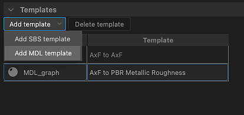
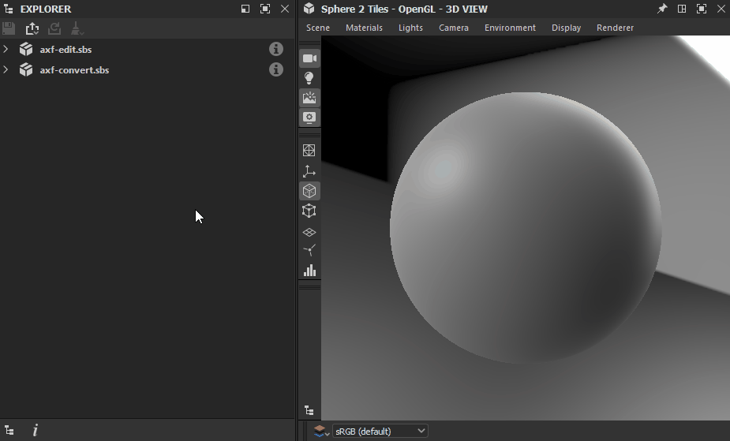

# AxF (Appearance eXchange Format)

<table>
<tr style="border: 0;">
<td width="25.00%" style="border: 0;" valign="top">

</td>
<td width="100.00%" style="border: 0;" valign="top">

Substance 3D Designer supporta il formato eXchange di aspetto di [X-Rite.](https://www.xrite.com/axf) I creatori del formato lo descrivono come segue:

&quot;I file AxF vengono utilizzati per acquisire, archiviare, modificare e comunicare le caratteristiche dei materiali complesse durante il flusso di lavoro di progettazione digitale. AxF fornisce un metodo standard per archiviare e condividere tutti i dati di aspetto rilevanti (colore, texture, lucidità, rifrazione, traslucidità, effetti speciali (scintille) e proprietà di riflessione) in tutte le applicazioni PLM (Product Lifecycle Management), CAD (Computer Aided Design) e di rendering all&#39;avanguardia.

</td>
</tr>
</table>

In parole povere, i file AxF ospitano un certo numero di texture estratte dall&#39;hardware scanner TAC7 di X-Rite, insieme a metadati che descrivono proprietà aggiuntive del materiale. Ciò significa che un AxF è più di semplici dati di texture: ha anche delle proprietà di ombreggiatura.

I file AxF sono *non* importati come pacchetto [risorsa](../../resources/resources.md). Piuttosto, il [processo di importazione](#import) prevede l&#39;estrazione di texture e metadati dal file AxF e l&#39;utilizzo di tali elementi per preparare grafici creati da [modelli dedicati](#graph-templates).

I modelli disponibili sono destinati a due flussi di lavoro AxF:

* <b>Conversione</b> di un materiale SVBRDF in un file AxF in un materiale PBR;
* <b>Modifica</b> di un materiale SVBRDF in posizione e [esportazione](#export) in un file AxF esistente come nuovo livello.

>[!NOTE]
>
> Modelli di materiale supportati
> 
> In Designer è possibile caricare e modificare *completamente* solo i materiali che utilizzano un modello <b>SVBRDF</b> (BRDF con variazione spaziale).
> 
> I materiali che utilizzano il modello <b>EP-SVBRDF</b> (Energy Preserving SVBRDF) possono essere caricati, ma solo le funzionalità esistenti nel modello SVBRDF possono essere modificate e visualizzate. Le funzioni esclusive di EP-SVBRDF non sono supportate.
> 
> Altri modelli non sono supportati.

## Importazione di file AxF

Il flusso di lavoro per l’importazione di file AxF può essere avviato utilizzando uno dei due metodi seguenti:

+++Schermata Home

Fare clic sul pulsante <b>Importa AxF...</b> nella sezione a sinistra della [schermata iniziale](../../interface/home-screen/home-screen.md).

{width="600px"}

+++

+++Explorer

Fai clic su RMB in un pacchetto in [Esplora risorse](../../interface/the-explorer-window/the-explorer-window.md) e seleziona <b>Importa > AxF</b> nel menu di scelta rapida del pacchetto.

{width="600px"}

+++

### Finestra di dialogo Importa

La finestra di dialogo di importazione <b>AxF</b> consente di esaminare i dati caricati dal file AxF selezionato e di configurare i modelli di grafico necessari per eseguire le modifiche o le conversioni previste.

Sono disponibili quattro sezioni:

L&#39;<b>intestazione</b> visualizza il nome del materiale rilevato nel file AxF, nonché la sua rappresentazione (attualmente, sempre SVBRDF). Viene visualizzata anche la miniatura di anteprima incorporata nel file.

La sezione <b>Modelli</b> consente di impostare il modello [Grafico Substance](../../compositing-graphs/substance-compositing-graphs.md) per iniziare a lavorare sul materiale. Per ulteriori informazioni su questi modelli e sulla loro configurazione, consulta la sezione [Modelli di grafico](#graph-templates) riportata di seguito.

<b>Texture</b> elenca tutte le texture estratte dal file AxF interessate dal materiale rilevato. Per ogni texture vengono visualizzati il nome, la risoluzione nativa, il formato dei dati e la dimensioni fisiche.

I <b>metadati</b> e le <b>proprietà</b> elencano i dati estratti dal materiale nel file AxF. Queste modifiche influiscono sulla configurazione di alcune proprietà dei modelli di grafici Substance (vedere la sezione [Modelli di grafico](#graph-templates) di seguito).

### Risultato

Dopo aver fatto clic sul pulsante <b>OK</b>, viene creato un pacchetto in [Explorer](../../interface/the-explorer-window/the-explorer-window.md). Il pacchetto include le seguenti risorse:

<table>
<tr style="border: 0;">
<td style="border: 0;" valign="top">

Una cartella <b>Resources</b> ospita una *sottocartella* per ogni materiale importato dal file AxF.

Ogni sottocartella include un&#39;altra sottocartella contenente le *texture* estratte dal file AxF per tale materiale. Quest&#39;ultima sottocartella prende il nome dal materiale *rappresentazione* utilizzato dalle texture (attualmente solo <b>SVBRDF</b>).

Grafico per ogni modello impostato nella sezione <b>Modelli</b> della finestra di dialogo di importazione.\
Nel caso di [Substance grafici](../../compositing-graphs/substance-compositing-graphs.md), questi sono preconfigurati con le texture e i dati estratti dal file AxF, nonché con le impostazioni del modello selezionato (vedere la sezione Modelli di grafico di seguito).

</td>
<td style="border: 0;" valign="top">

</td>
</tr>
</table>

## Modelli di grafici

<table>
<tr style="border: 0;">
<td style="border: 0;" valign="top">

Esistono modelli di grafico dedicati ai flussi di lavoro AxF per [Substance grafici](../../compositing-graphs/substance-compositing-graphs.md).

Fai clic sul pulsante <b>Aggiungi modello</b> e seleziona il tipo di grafico desiderato nel menu a discesa.

</td>
<td style="border: 0;" valign="top">

</td>
</tr>
</table>

### Substance modelli grafici

<table>
<tr style="border: 0;">
<td style="border: 0;" valign="top">

Sono disponibili due tipi di modelli di grafici a Substance:

<b>Da AxF a rugosità metallica</b> e <b>Da AxF a lucidità Specular</b> sono *modelli di conversione* che consentono di mappare i materiali AxF ai modelli PBR standard.\
Questi possono quindi essere utilizzati con gli shader della vista 3D predefiniti e combinati con altri materiali PBR prodotti in Designer, [Sampler](https://www.adobe.com/it/products/substance3d-sampler.html) o acquisiti dalla nostra libreria [Risorse 3D](https://substance3d.adobe.com/assets/).

<b>Da AxF a AxF</b> è un modello *passthrough* che consente di modificare i materiali AxF in posizione ed esportare queste modifiche come nuovi livelli nei file AxF esistenti. Per ulteriori informazioni, consultate Esportazione di file AxF di seguito.

</td>
<td style="border: 0;" valign="top">

</td>
</tr>
</table>

<table>
<tr style="border: 0;">
<td style="border: 0;" valign="top">

Per tutti i modelli di grafici Substance aggiunti all&#39;elenco <b>Modelli</b>, vengono eseguite le seguenti operazioni aggiuntive:

Per qualsiasi nodo [<b>Input</b>](../../compositing-graphs/nodes-reference-for-com/atomic-nodes/input/input.md) che *utilizzo* corrisponde all&#39;*identificatore* di una texture estratta dal file AxF, tale nodo di input viene sostituito da un nodo [Bitmap](../../compositing-graphs/nodes-reference-for-com/atomic-nodes/bitmap/bitmap.md) che fa riferimento a tale texture;

La proprietà <b>Risoluzione</b> del grafico (ovvero, Dimensione di output) viene impostata automaticamente sulla potenza di due valori uguali o superiori alla risoluzione della texture estratta *più grande*.

La proprietà <b>Resolution</b> dei nodi [Bitmap](../../compositing-graphs/nodes-reference-for-com/atomic-nodes/bitmap/bitmap.md) (ad esempio, la dimensione dell&#39;output) è impostata automaticamente per corrispondere a quella del grafico, dopo l&#39;applicazione dell&#39;operazione precedente.

La proprietà <b>Dimensioni fisiche</b> del grafico è impostata sulla dimensioni fisiche della *prima* texture estratta;

I *valori predefiniti* dei parametri del grafico sono impostati per corrispondere ai dati nel file AxF.

I *metadati* estratti dal materiale nel file AxF vengono copiati nella proprietà <b>Descrizione</b> del grafico.

>[!IMPORTANT]
>
> I valori di default dei parametri del grafico non devono essere modificati dopo questa configurazione iniziale.
> 
> Specificano le proprietà di ombreggiatura essenziali per interpretare correttamente i valori delle texture.
> 
> Pertanto, la modifica di queste impostazioni determinerà un rendering errato durante la visualizzazione del materiale nella [vista 3D](../../interface/3d-view/3d-view.md).

</td>
<td style="border: 0;" valign="top">

</td>
</tr>
</table>

## Esportazione di file AxF

I file AxF esistenti possono essere modificati in posizione da Designer e le relative risorse vengono aggiornate utilizzando [output](../../compositing-graphs/nodes-reference-for-com/atomic-nodes/output/output.md) di un [grafico Substance](../../compositing-graphs/substance-compositing-graphs.md).

Grazie alla possibilità di esportare gli output dei grafici in file AxF, un tipico flusso di lavoro AxF in Designer può avere il seguente aspetto:

1. Importa file AxF
1. Usa il modello di grafico da &#39;AxF a AxF&#39; per la Substance
1. Modificate le texture estratte utilizzando le funzioni e i nodi disponibili nei grafici a Substance
1. Esportate gli output del grafico nello stesso file AxF

La proprietà <b>Dimensioni fisiche</b> del grafico viene utilizzata per impostare l&#39;attributo <b>Dimensioni fisiche</b> delle texture aggiornate nel file AxF modificato.

>[!NOTE]
>
> Le modifiche alle risorse nel file vengono aggiunte come *nuovo livello*. Ciò significa che ogni esportazione eseguita da Designer allo stesso file AxF aumenterà le dimensioni di quel file.

<table>
<tr style="border: 0;">
<td width="33.33%" style="border: 0;" valign="top">

### Finestra di dialogo Esporta

La finestra di dialogo di esportazione <b>AxF</b> è disponibile nella finestra di dialogo <b>Output di esportazione</b> come scheda dedicata.

Nella barra degli strumenti [Visualizzazione grafico](../../interface/the-graph-view/the-graph-view.md), apri il menu  <b>Strumenti</b> e seleziona l&#39;opzione <b>Esporta output...</b> per visualizzare la finestra di dialogo, quindi seleziona la scheda <b>AxF</b>.

</td>
<td width="100.00%" style="border: 0;" valign="top">

</td>
</tr>
</table>

La finestra di dialogo presenta tre sezioni principali:

Il campo di input <b>File</b> consente di selezionare il file AxF di destinazione che deve essere modificato. Il file viene caricato e controllato, quindi se i dati sono validi, vengono utilizzati per popolare le colonne &#39;Risorsa AxF&#39; di seguito.

<b>Output mappati</b> elenca gli output del grafico nella colonna Output e corrisponde al relativo *utilizzo* con una risorsa AxF nel file di destinazione che condivide lo stesso *identificatore*. Se vengono rilevati problemi, questi vengono visualizzati come un avviso (giallo) o un errore (rif) nella colonna Note.

<b>Output non mappati</b> elenca gli output del grafico e le risorse AxF nel file di destinazione che non è stato possibile mappare. Queste uscite vengono ignorate e le risorse AxF rimangono invariate.

>[!NOTE]
>
> La proprietà <b>Group</b> di un output grafico deve essere impostata su &#39;AxF&#39; affinché venga elencato in questa finestra di dialogo.

Fai clic su <b>Inizia esportazione </b> per modificare il file AxF di destinazione con il nuovo livello contenente le modifiche negli output mappati.

Il risultato viene visualizzato come messaggio accanto alla barra di avanzamento nella barra di stato della finestra di dialogo.

>[!TIP]
>
> Ogni volta che viene eseguita un’esportazione, viene creato un nuovo livello nel file di destinazione. Pertanto, presta attenzione a effettuare esportazioni deliberate e mirate per gestire le dimensioni e la complessità del file.

### Associazione degli output alle risorse AxF

Quando esportate in un file AxF esistente, le sue risorse vengono aggiornate utilizzando gli output del grafico. Designer fa corrispondere l&#39;identificatore di risorsa ai nodi [Output](../../compositing-graphs/nodes-reference-for-com/atomic-nodes/output/output.md) che hanno lo stesso identificatore di <b>Utilizzo</b>.

Inoltre, la proprietà *Group* dell&#39;output <b>deve essere impostata su &#39;AxF&#39; affinché venga elencata nella finestra di dialogo di esportazione AxF (vedere sopra).</b>

Le risorse possono essere texture (bitmap) o uniformi (valori) con un numero specifico di canali. È obbligatorio che l’output del grafico corrisponda esattamente a tale numero di canali. In caso contrario, verrà generato un errore per la risorsa durante l&#39;esportazione e la risorsa non verrà modificata.

Il numero di canali viene specificato in modo diverso a seconda del tipo di dati forniti al nodo di output:

* <b>Bitmap (Texture):</b> La proprietà [Componenti](../../compositing-graphs/nodes-reference-for-com/atomic-nodes/output/output.md) viene utilizzata per specificare il numero di canali, dove R è un canale, RG è due canali e così via. Questa proprietà viene utilizzata per comunicare a Designer quale canale RGBA della bitmap deve essere codificato nella risorsa.
* <b>Valore (uniforme):</b> Il numero di componenti del valore vettoriale viene utilizzato per specificare il numero di canali, dove [Virgola mobile](../../function-graphs/nodes-reference-for-fun/atomic-function-nodes/constant-nodes/constant-nodes.md) è un canale, [Virgola mobile 2](../../function-graphs/nodes-reference-for-fun/atomic-function-nodes/constant-nodes/constant-nodes.md) è due canali e così via.

>[!IMPORTANT]
>
> Nel modello di grafico a Substance da <b>AxF a AxF</b>, il nodo [Output](../../compositing-graphs/nodes-reference-for-com/atomic-nodes/output/output.md) per il contributo <b>Lobe Specular</b> è configurato per impostazione predefinita per un *canale singolo* (ad esempio, la proprietà Components è impostata su &#39;R&#39;).\
> Se il file AxF importato utilizza più di un canale nella risorsa Specular del lobo, impostare di conseguenza la proprietà <b>Componenti</b> dell&#39;output.
> 
> Ad esempio, per una risorsa lobo Specular che utilizza due canali (Rosso per la rugosità dello Specular e Verde per l’Anisotropia dello Specular), imposta la proprietà Componenti su &quot;RG&quot;.

## Visualizzazione dei file AxF nel vista 3D

Il metodo per eseguire il rendering dei materiali AxF per SVBRDF in [vista 3D](../../interface/3d-view/3d-view.md) dipende dalla [configurazione dell&#39;importazione](#import).

+++Converti in PBR

Se desideri convertire un materiale SVBRDF contenuto in un file AxF in un materiale PBR standard, la configurazione di importazione richiederà probabilmente un [modello di conversione del grafico di Substance](#graph-templates).

In tal caso, è necessario utilizzare il **modulo di rendering OpenGL** nel vista 3D e selezionare il <code>modulo di rendering AxF SVBRF</code> shader.\
Puoi quindi trascinare e rilasciare il grafico a Substance impostato nella finestra di dialogo di importazione per connettere gli output allo shader.

+++

+++Modifica in posizione

Se il tuo obiettivo è quello di eseguire *modifiche* su un file AxF esistente, segui le istruzioni riportate di seguito per visualizzare il materiale SVBRDF in base al modulo di rendering selezionato:

È disponibile uno shader GLSLFX dedicato per visualizzare materiali utilizzando una rappresentazione SVBRDF da un file AxF: <b>AxF SVBRDF</b>.

Lo shader è disponibile nel menu <b>Materiali</b>: aprite il sottomenu del materiale della scena (&quot;Predefinito&quot; per impostazione predefinita) e selezionate qualsiasi tecnica nella voce <b>AxF SVBRDF</b>.

Utilizzare l&#39;opzione <b>Modifica</b> nello stesso sottomenu per visualizzare le proprietà dello shader nel dock [Proprietà](../../interface/properties/properties.md).\
In particolare, la proprietà <b>Divisione in porzioni</b> consente di regolare la suddivisione in porzioni delle texture sul modello, in modo da poter visualizzare il materiale a una scala appropriata.

Dopo aver selezionato lo shader, fate clic su RMB in uno spazio vuoto nel grafico e selezionate l&#39;opzione <b>Visualizza output in vista 3D</b> per visualizzarne gli output nella [vista 3D](../../interface/3d-view/3d-view.md).

{width="600px"}

Questo shader è attualmente un *lavoro in corso* e alcune funzionalità non sono ancora supportate. Pertanto, sebbene possa fornire una panoramica delle caratteristiche dei materiali, non deve essere utilizzato per regolazioni di precisione .

Utilizzare l&#39;opzione <b>Modifica</b> nello stesso sottomenu per visualizzare le proprietà dello shader nel dock [Proprietà](../../interface/properties/properties.md).\
In particolare, la proprietà <b>Divisione in porzioni</b> consente di regolare la suddivisione in porzioni delle texture sul modello, in modo da poter visualizzare il materiale a una scala appropriata.

Dopo aver selezionato lo shader, fate clic su RMB in uno spazio vuoto nel grafico e selezionate l&#39;opzione <b>Visualizza output in vista 3D</b> per visualizzarne gli output nella [vista 3D](../../interface/3d-view/3d-view.md).

<i>Nota:</i> ignorate la parte del video dal passaggio al modulo di rendering Iray fino alla fine, poiché il modulo di rendering Iray e il supporto MDL sono stati <i>rimossi</i> da Designer nella versione 16.0.0.

+++

### Varianti di modello supportate

Gli shader utilizzati nella vista 3D supportano le seguenti varianti per i modelli di trasmissione specular, Fresnel e pelo trasparente:

<table>
<tr style="border: 0;">
<td style="border: 0;" valign="top">
<b>Varianti Specular</b>

* Geisler-Moroder 2010
* GGX/Walter2007
* GGX/Ross 2005

</td>
<td style="border: 0;" valign="top">
<b>Varianti Fresnel</b>

* Schlick 1994
* Schlick 1994 a colori
* Simple Fresnel

</td>
<td style="border: 0;" valign="top">
<b>Cancellare le varianti di trasmissione del pelo</b>

* Dirac rifrattivo *(solo OpenGL)*
* Dirac rifrattivo/Nessuna compressione angolo solido *(solo OpenGL)*
* Dirac non rifrattivo
* Dirac non rifrattivo/DSPBR 2020x
* GX

</td>
</tr>
</table>
