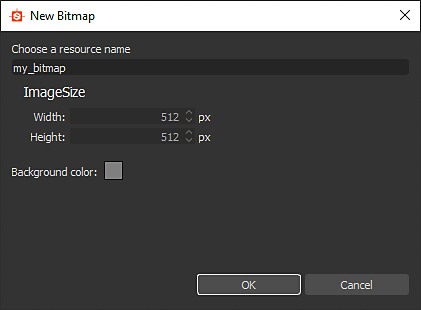

# Strumenti di pittura Bitmap

Questa pagina descrive gli strumenti di pittura disponibili nel pannello [vista 2D](../../../interface/2d-view/2d-view.md) per bitmap compatibili.

{width="512px"}

## Panoramica

Il pannello [vista 2D](../../../interface/2d-view/2d-view.md) offre strumenti di base per la pittura delle bitmap che consentono di creare o modificare le immagini *manualmente* direttamente nell&#39;applicazione. Questi strumenti sono particolarmente utili, ad esempio, per colorare rapidamente *maschere*.

Gli strumenti supportano l&#39;input penna, inclusa la *pressione della penna*. Per sfruttare le visualizzazioni a penna, puoi [disancorare](../../../interface/customizing-your-wor/customizing-your-workspace.md) il pannello [Visualizzazione 2D](../../../interface/2d-view/2d-view.md), quindi posizionarlo e ridimensionarlo in qualsiasi configurazione più adatta per la pittura.

Le modifiche possono essere *annullate singolarmente* e tutte le altre funzioni del pannello vista 2D sono ancora *disponibili* mentre modificate l&#39;immagine, ad esempio il pannello [Istogramma](../../../interface/2d-view/2d-view.md), [Visualizzazione affiancata](../../../interface/2d-view/2d-view.md) e [Immagine di sfondo](../../../interface/2d-view/2d-view.md).

>[!IMPORTANT]
>
> È possibile eseguire la pittura di *solo* su *risorse bitmap*  [nuove o importate](../../../resources/importing-linking-and-new/importing-linking-and-new-resources.md).

>[!WARNING]
>
> **Solo Windows**
> 
> Gli utenti di Tablet PC devono applicare le impostazioni descritte nella pagina seguente per un&#39;esperienza affidabile: [Configurazione di penne e tablet](https://docs.substance3d.com/display/SPDOC/Configuring+Pens+and+Tablets)

{width="512px"}

## Attivazione degli strumenti di pittura

Gli strumenti di pittura verranno attivati automaticamente nel pannello [Vista 2D](../../../interface/2d-view/2d-view.md) quando vengono soddisfatti i seguenti criteri relativi a una bitmap:

* La bitmap è una risorsa [nuova o importata](../../../resources/importing-linking-and-new/importing-linking-and-new-resources.md)
* La bitmap ha una precisione di *8 bit*
* La bitmap viene visualizzata nel pannello [Visualizzazione 2D](../../../interface/2d-view/2d-view.md)

È possibile creare *nuove* bitmap nei modi seguenti:

* Nel pannello [Esplora risorse](../../../interface/the-explorer-window/the-explorer-window.md), fate clic su RMB in un *pacchetto SBS* o in una *cartella* all&#39;interno di un pacchetto per aprire il relativo menu di scelta rapida, quindi aprite il sottomenu <b>Nuovo</b> e selezionate l&#39;opzione <b>Bitmap</b>
* In un [grafico](../../../interface/the-graph-view/the-graph-view.md), creare un [nodo bitmap](../../../compositing-graphs/nodes-reference-for-com/atomic-nodes/bitmap/bitmap.md) e selezionare l&#39;opzione <b>Da nuova risorsa...</b> nel menu di scelta rapida

Verrà aperta la finestra <b>Nuova bitmap</b>, che consente di impostare il *nome*, la *risoluzione* e il *colore di sfondo* della nuova risorsa bitmap.

>[!NOTE]
>
> Le *nuove* risorse bitmap *sempre* hanno *colori RGBA* e *precisione a 8 bit*.

>[!WARNING]
>
> Per prestazioni ottimali con gli strumenti di pittura, si consiglia di utilizzare bitmap con risoluzioni *pari a due*, ad esempio 128, 256, 512, 1024, ...

## Barre degli strumenti

Gli strumenti e le opzioni di pittura sono disposti in *barre degli strumenti* all&#39;interno del pannello [vista 2D](../../../interface/2d-view/2d-view.md). Queste barre degli strumenti possono essere riposizionate su *qualsiasi lato* del pannello o come *barra degli strumenti mobile*, facendo clic e tenendo premuto <b>LMB</b> sulla relativa *maniglia*, visualizzata come tripla riga, quindi rilasciando <b>LMB</b> nella posizione desiderata.

Quando sono attivati gli strumenti di disegno, vengono visualizzate due barre degli strumenti: la [barra degli strumenti di selezione degli strumenti](#bitmappaintingtools-toolselectiontoolbar) e la barra degli strumenti Opzioni degli strumenti, descritte di seguito.

## Barra degli strumenti Selezione strumenti

Gli strumenti di pittura si trovano nella **barra degli strumenti di selezione degli strumenti**, che per impostazione predefinita si trova sul *lato sinistro* del pannello [vista 2D](../../../interface/2d-view/2d-view.md). Le scelte rapide da tastiera consentono di accedere rapidamente a questi strumenti e sono contrassegnate di seguito tra parentesi dopo il nome dello strumento/funzione:

 <b>Selezione colore</b> <b>miniature:</b> Consente di definire un colore *primario* e *secondario*. Fate clic su una di queste miniature per visualizzare la finestra <b>Editor colori</b> e definire un colore. Gli strumenti utilizzeranno il colore *primario*. I colori primario e secondario possono essere *scambiati* (<b>X</b>) in qualsiasi momento

 <b>Strumento Pennello (B):</b> Applica il colore *primario* nella posizione del cursore, quando si preme la punta della penna o il pulsante <b>LMB</b>, utilizzando le opzioni definite nella barra degli strumenti Opzioni strumento

 <b>Strumento Timbro (T):</b> consente di applicare un timbro a una parte dell&#39;immagine su un&#39;altra. Puoi definire l&#39;*origine* che deve essere contrassegnata tenendo premuto il tasto <b>Alt</b> e facendo clic su <b>LMB</b>. Quest&#39;area dell&#39;immagine verrà quindi stampata sull&#39;area *target* dell&#39;immagine in corrispondenza della posizione del cursore, quando si preme la punta della penna o il pulsante <b>LMB</b>, utilizzando le opzioni definite nella barra degli strumenti Opzioni strumento. L&#39;origine *tiene traccia* dei movimenti della destinazione e le dimensioni dell&#39;area *origine* *corrispondono* alle dimensioni del *pennello*

 <b>Abilita allineamento (opzione strumento Timbro):</b> consente di definire se l&#39;origine deve *rimanere in posizione* quando inizia un nuovo timbro o se deve *spostarsi relativamente nella nuova posizione del timbro*

<b> Gomma (E):</b> Sostituisce il colore corrente dell&#39;immagine con il valore (0, 0, 0, 0) nella posizione del cursore, quando si preme la punta della penna o il pulsante <b>LMB</b>, utilizzando le opzioni definite nella barra degli strumenti Opzioni strumento. Assicurati che la [visualizzazione della trasparenza](../../../interface/2d-view/2d-view.md) sia abilitata per tenere traccia dell&#39;impatto di questo strumento sul canale <b>Alpha</b>.

## Barra degli strumenti Opzioni

Le opzioni per gli strumenti disponibili nella [barra degli strumenti di selezione degli strumenti](#bitmappaintingtools-toolselectiontoolbar) si trovano nella barra degli strumenti Opzioni strumenti, che per impostazione predefinita si trova sul *lato superiore* del pannello [Visualizzazione 2D](../../../interface/2d-view/2d-view.md).

<table>
<tr style="border: 0;">
<td style="border: 0;" valign="top">

### SELEZIONE PENNELLO

La  <b>Selezione pennello</b> consente di selezionare un pennello *preconfigurato* dal pennello disponibile *predefiniti*, impostarne <b>Dimensioni</b> e <b>Durezza</b> *(* vedere la sezione <b>Forma</b> dell&#39;editor pennelli) e visualizza una *anteprima* di un tratto del pennello.

I predefiniti per i pennelli possono essere creati e modificati nell&#39;editor Pennelli e sono disponibili in *librerie*. I pennelli predefiniti che verranno visualizzati in questo pannello sono la *somma* di tutte le librerie di pennelli predefiniti caricate. Queste librerie possono essere gestite accedendo al menu  <b>Libreria pennelli</b> (consulta la sezione <b>Predefiniti</b> dell&#39;editor pennelli)

Il pulsante  <b>Seleziona colore di sfondo</b> consente di modificare il colore di sfondo dell&#39;*anteprima del tratto del pennello*.

</td>
<td style="border: 0;" valign="top">

</td>
</tr>
</table>

<table>
<tr style="border: 0;">
<td style="border: 0;" valign="top">

### EDITOR PENNELLI

L&#39; <b>editor pennelli</b> consente di accedere alle opzioni granulari per definire il comportamento del pennello:

<b>Predefiniti</b>

I pennelli possono essere personalizzati e quindi salvati come <b>Pennello predefinito</b>, che sarà disponibile nell&#39;elenco  <b>Pennelli predefiniti</b> e nel pannello  <b>Selezione pennello</b>.

Per creare un predefinito, impostate le proprietà seguenti in base alle vostre preferenze, quindi fate clic sul pulsante  <b>Aggiungi pennello predefinito </b> e impostate un nome per il pennello nella finestra <b>Nome predefinito</b>. Il nuovo predefinito è ora selezionato automaticamente nell&#39;elenco <b>Pennelli predefiniti</b> e in qualsiasi momento è possibile  <b>aggiornarlo</b> con le nuove impostazioni correnti o  <b>eliminarlo</b>.

I predefiniti sono organizzati e salvati in *librerie*, che possono essere gestite nel menu  <b>Libreria pennelli</b>:

<b>Esporta libreria:</b> *salva* i predefiniti correnti e tutte le relative impostazioni in un file di libreria

<b>Importa libreria:</b> *carica* predefiniti da un file di libreria esistente e *aggiungili* all&#39;elenco corrente: i predefiniti con *lo stesso nome vengono sostituiti* da quelli del file di libreria

<b>Reimposta libreria:</b> reimposta i predefiniti correnti in base alla libreria predefinita

<b>Sostituisci libreria:</b> *carica* predefiniti da un file di libreria esistente e *annulla* l&#39;elenco corrente

</td>
<td style="border: 0;" valign="top">

</td>
</tr>
</table>

#### Impostazioni pennello

Le impostazioni di un pennello sono raggruppate nelle seguenti sezioni:

+++Forma
Il parametro <b>Tipo di forma</b> controlla la forma di base del pennello. Le forme disponibili sono:

* *Ellisse*: una forma rotonda impostata come *cerchio* per impostazione predefinita

* *Rettangolo*: una forma retta impostata come *quadrato* per impostazione predefinita

* *Poligono*: una forma retta con un numero di bordi e angoli *personalizzabili*

<b>Conteggio bordi </b>(*Solo forma poligono*): consente di scegliere il numero di *facce* del poligono

<b>Raggio interno </b>(*Solo forma Poligono*): consente di controllare la distanza tra un carattere *punto medio* e il centro della forma, creando in modo efficace un motivo a *stella*

<b>Durezza</b>: definisce il *raggio di dissolvenza* della forma

+++

+++Trasformazione
Quando applicate un tratto del pennello all&#39;immagine, il tratto è in effetti una ripetizione dell&#39;apposizione del timbro al motivo del pennello, in base al comportamento definito dai controlli in questa sezione.

<b>Dimensioni</b>: imposta il *diametro* della forma del pennello in pixel

<b>Variazione dimensioni</b>: consente di *rendere casuale* la dimensione del pennello per timbro, espressa come *percentuale* del valore <b>Dimensione</b> e controlla l&#39;*intervallo* di valori casuali da <b>0</b> al valore <b>Dimensione</b>

<b>Controllo dimensioni</b>: se si utilizza un input penna con supporto per *pressione penna*, è possibile utilizzare questo parametro per consentire il controllo della dimensione del pennello

<b>Spaziatura</b>: controlla la spaziatura *tra ogni singolo timbro* lungo un tratto del pennello. In questo modo è possibile separare e definire più chiaramente i motivi forma

<b>Rotondità</b>: per impostazione predefinita, il <b>Tipo di forma</b> selezionato nella sezione <b>Forma</b> presenta un rapporto larghezza/height di *1:1*. Questo parametro consente di modificare questo rapporto *riducendo la larghezza* come percentuale del height

<b>Variazione rotondità</b>: consente di *casualizzare* la rotondità per timbro, è espressa come *percentuale* del valore <b>Rotondità</b> e controlla l&#39;*intervallo* di valori casuali da <b>0</b> al valore <b>Rotondità</b>

<b>Angolo</b>: controlla la *rotazione* del pattern del pennello in *gradi*

<b>Variazione angolo</b>: consente di *casualizzare* la rotazione per timbro, espressa come *percentuale* del valore <b>Angolo</b> e controlla l&#39;*intervallo* di valori casuali da <b>0</b> a <b>360 </b>gradi

+++

+++Dispersione
Per impostazione predefinita, il motivo forma viene stampato lungo il tratto. Puoi interrompere l’operazione applicando uno scostamento al pattern della forma in modo che possano essere sparsi attorno al tratto per ottenere un effetto più organico o caotico.

<b>Dispersione</b>: la *distanza* massima entro la quale ogni singolo timbro deve essere scostato dal tratto, espressa come percentuale della *dimensione pennello*. Si noti che questa distanza è *casuale per impostazione predefinita* da <b>0</b> alla *percentuale impostata* della dimensione del pennello e che anche la *direzione* dell&#39;offset è casuale

<b>Conteggio</b>: numero di copie sparse di singoli timbri

+++

+++Colore
Il colore applicato dal pennello è definito dal *colore primario selezionato* e dalla <b>texture del pennello</b>, se attualmente applicata. Questo colore può essere modificato dinamicamente utilizzando i controlli di questa sezione.

<b>Variazione flusso</b>: consente di *rendere casuale* il flusso per timbro, espresso come *percentuale* del flusso massimo

<b>Controllo flusso</b>: se si utilizza un input penna con supporto per *pressione penna*, è possibile utilizzare questo parametro per consentire il controllo del flusso

<b>Variazione tonalità</b>: consente di *rendere casuale* la tonalità di colore *scostare* per timbro, espressa come *percentuale* dell&#39;intera estensione di tonalità

<b>Variazione saturazione</b>: consente di *rendere casuale* la saturazione del colore *scostare* per timbro, espressa come *percentuale* dell&#39;intera estensione di saturazione

<b>Variazione luminosità</b>: consente di *casualizzare* la luminosità del colore *scostare* per timbro, espressa come *percentuale* dell&#39;intera estensione della luminosità

+++

+++Texture
Potete applicare un *file bitmap* al pennello e utilizzarlo per *timbrare* quella bitmap anziché un colore a tinta piatta. La texture del pennello si comporta come segue:

<b>File di Texture: </b>definisce il *percorso* della bitmap da utilizzare come texture del pennello. È possibile selezionare la bitmap tramite il browser dei file di sistema utilizzando il pulsante  accanto al campo di input

La texture *solo* sostituisce il colore piatto di base del pennello, il che significa che *tutte le proprietà del pennello sopra elencate possono ancora essere utilizzate* e funzionano come descritto

I colori della texture sono *scostati di tonalità* verso il *colore primario impostato*, il che significa che se il colore primario impostato è il bianco, i colori della texture possono essere utilizzati così come sono. Più saturo è il colore primario impostato, più i colori della texture verranno spostati verso di esso

+++

### OPACITÀ/FLUSSO

Gli strumenti Pennello, Timbro e Gomma offrono controlli per <b>Opacità</b> e <b>Flusso</b>:

<b>Opacità</b> controlla l&#39;*opacità massima* del timbro. È *additivo su tratti separati*, il che significa che l&#39;opacità di un&#39;area può essere aggiunta al massimo del 100% eseguendo più *tratti separati* in quell&#39;area

<b>Flusso</b> controlla la *quantità dell&#39;effetto dello strumento* che viene applicata in un dato momento. È *additivo sullo stesso tratto*, il che significa che l&#39;opacità di un&#39;area può essere aggiunta al massimo del 100% eseguendo più passaggi dello *stesso tratto* in quell&#39;area, o più tratti separati.

<table>
<tr style="border: 0;">
<td width="100.00%" style="border: 0;" valign="top">

### MODALITÀ AFFIANCAMENTO

Gli strumenti Pennello, Timbro e Gomma consentono inoltre di impostare le  <b>modalità di Affiancamento</b>, che definiscono la loro capacità di *scorrere all&#39;indietro* sul lato opposto dell&#39;immagine quando un tratto influisce su un&#39;area al di fuori dei limiti dell&#39;immagine:

<b>Affiancamento X e Y</b>: riquadro tratti pennello *sia in orizzontale che in verticale*

<b>Affiancamento X</b>: riquadro tratti pennello *solo orizzontalmente*

<b>Affiancamento Y</b>: riquadro tratti pennello *solo verticalmente*

<b>Nessun Affiancamento</b>: i tratti pennello *non sono affiancati*

</td>
<td width="25.00%" style="border: 0;" valign="top">

</td>
</tr>
</table>
