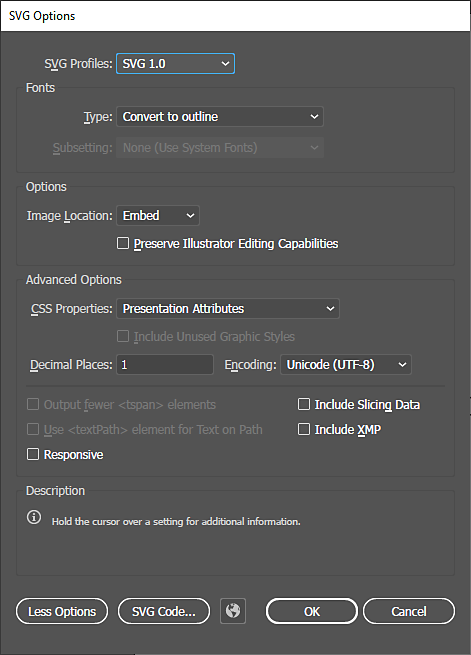
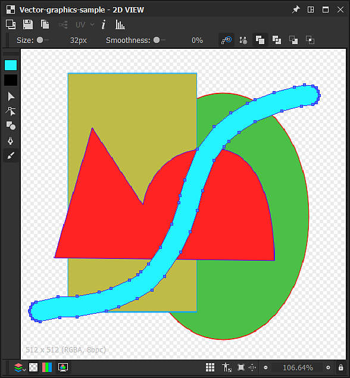
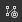

# Strumenti di modifica vettoriale

Questa pagina descrive gli strumenti di modifica disponibili nel pannello [vista 2D](https://docs.substance3d.com/display/SDDOC/2D+view) per la grafica vettoriale compatibile.

## Panoramica

<table>
<tr style="border: 0;">
<td style="border: 0;" valign="top">

Il pannello [vista 2D](https://docs.substance3d.com/display/SDDOC/2D+view) offre strumenti di base per la modifica vettoriale che consentono di creare o modificare la grafica vettoriale *manualmente* direttamente in [Substance 3D Designer](https://www.adobe.com/products/substance3d-designer.html). Questi strumenti sono particolarmente utili, ad esempio, per creare rapidamente *maschere* o *pattern*.

Gli strumenti supportano l&#39;input penna. Per sfruttare le visualizzazioni a penna, puoi [disancorare](https://docs.substance3d.com/display/SDDOC/Customizing+your+workspace) il pannello [Vista 2D](https://docs.substance3d.com/display/SDDOC/2D+view), quindi posizionarlo e ridimensionarlo in qualsiasi configurazione più adatta per la pittura.

Le modifiche possono essere *annullate singolarmente* e tutte le altre funzioni del pannello vista 2D sono ancora *disponibili* mentre modificate l&#39;immagine vettoriale, ad esempio il pannello [Istogramma](https://docs.substance3d.com/display/SDDOC/2D+view#id-2Dview-Histogram), [Visualizzazione affiancata](https://docs.substance3d.com/display/SDDOC/2D+view#id-2Dview-Viewport) e [Immagine di sfondo](https://docs.substance3d.com/display/SDDOC/2D+view#id-2Dview-Backgroundimage).

</td>
<td style="border: 0;" valign="top">

{width="512px"}

</td>
</tr>
</table>

>[!TIP]
>
> **Solo Windows**
> 
> Gli utenti di Tablet PC devono applicare le impostazioni descritte nella pagina seguente per un&#39;esperienza affidabile in Designer: [Configurazione di penne e tablet](https://docs.substance3d.com/display/SPDOC/Configuring+Pens+and+Tablets)

>[!IMPORTANT]
>
> Puoi colorare *solo* su *risorse di grafica vettoriale* [nuove](../../../resources/vector-graphics-svg-res/vector-graphics-svg-resource.md) o [importate](https://docs.substance3d.com/display/SDDOC/Importing%2C+Linking+and+New+Resources).

{width="512px"}

## Attivazione degli strumenti di modifica vettoriale

Gli strumenti di modifica vettoriale verranno attivati automaticamente nel pannello [Vista 2D](https://docs.substance3d.com/display/SDDOC/2D+view) quando sono soddisfatti i seguenti criteri relativi a un&#39;immagine di grafica vettoriale:

* L&#39;immagine di grafica vettoriale è una risorsa [nuova o importata](https://docs.substance3d.com/display/SDDOC/Importing%2C+Linking+and+New+Resources)
* La bitmap viene visualizzata nel pannello [Visualizzazione 2D](https://docs.substance3d.com/display/SDDOC/2D+view)

Le *nuove* immagini di grafica vettoriale possono essere create nei modi seguenti:

* Nel pannello [Esplora risorse](https://docs.substance3d.com/display/SDDOC/The+Explorer+Window), fate clic su RMB in un *pacchetto SBS* o in una *cartella* all&#39;interno di un pacchetto per aprire il relativo menu di scelta rapida, quindi aprite il sottomenu **Nuovo** e selezionate l&#39;opzione **SVG**
* In un [grafico](https://docs.substance3d.com/display/SDDOC/The+Graph+view), creare un [nodo SVG](../../../compositing-graphs/nodes-reference-for-com/atomic-nodes/svg/svg.md) e selezionare l&#39;opzione **Da nuova risorsa...** nel menu di scelta rapida

Verrà aperta la finestra **Nuovi dati vettoriali**, che consente di impostare *nome* e *risoluzione* della nuova risorsa grafica vettoriale.

>[!TIP]
>
> Per prestazioni ottimali con gli strumenti di modifica vettoriale, consigliamo di utilizzare immagini di grafica vettoriale con risoluzioni che sono *potenze di due*, ad esempio 128, 256, 512, 1024, ...

### Esportazione di grafica vettoriale da altri software

Designer *only* supporta la grafica vettoriale utilizzando il formato di file **SVG**.

Per ottenere la migliore compatibilità e affidabilità in Designer e nei suoi strumenti di modifica, assicuratevi che tutti gli oggetti siano convertiti in *contorni* e separati in *oggetti* separati che utilizzano *colori piatti*, in modo che *nessuno dei seguenti elementi rimanga*:

* **Testo**
* **Sfumature**
* **Pattern** (sia per i riempimenti che per i contorni del tratto)
* **Stili**

Gli utenti di **Adobe Illustrator** possono fare riferimento all&#39;immagine allegata per le impostazioni di esportazione consigliate di SVG *.*

+++Opzioni di esportazione di Adobe Illustrator

+++

>[!NOTE]
>
> Per ulteriori informazioni sulle limitazioni di SVG, sull&#39;esportazione da altri software e sulle proprietà di SVG in Designer, consultate la sezione della risorsa [Grafica vettoriale (SVG)](../../../resources/vector-graphics-svg-res/vector-graphics-svg-resource.md).

## Strumenti

Gli strumenti e le opzioni di pittura sono disposti in *barre degli strumenti* all&#39;interno del pannello [vista 2D](https://docs.substance3d.com/display/SDDOC/2D+view). Queste barre degli strumenti possono essere riposizionate su *qualsiasi lato* del pannello o come *barra degli strumenti mobile*, facendo clic e tenendo premuto **LMB** sulla relativa *maniglia*, visualizzata come tripla riga, quindi rilasciando **LMB** nella posizione desiderata.

Quando sono attivati gli strumenti di modifica vettoriale, vengono visualizzate due barre degli strumenti:

* **Selezione strumento** **barra degli strumenti**: consente di *selezionare uno strumento* e *i colori di riempimento/contorno* e per impostazione predefinita viene posizionato sul lato *sinistra* del pannello vista 2D
* **Barra degli strumenti opzioni**: consente di impostare le *opzioni* per lo *strumento attualmente selezionato* e per impostazione predefinita viene posizionato sul lato *superiore* del pannello vista 2D

Le scelte rapide da tastiera consentono di accedere rapidamente agli strumenti e sono contrassegnate di seguito tra parentesi dopo il nome dello strumento/funzione:

+++Selezione del colore
La  **Selezione colore** *miniature* consente di definire un colore di *riempimento* e di *contorno* per le forme vettoriali. Puoi aprire l&#39;**Editor colori** per ciascuno di questi colori nei modi seguenti:

* **Colore riempimento:** Fare clic sulla miniatura del colore *riempimento* (in alto) oppure fare doppio clic su LMB nell&#39;area di lavoro

* **Colore contorno:** Fare clic sulla miniatura del colore *contorno* (in basso) oppure *tenere premuto Ctrl* e fare doppio clic su LMB sull&#39;area di lavoro

I colori impostati verranno quindi applicati alle *forme attualmente selezionate*.

Se il colore *contorno* corrente è *nero*, ovvero luminanza 0 o RGB (0, 0, 0), *non* verrà applicato alle forme selezionate finché non si farà *clic sulla miniatura del colore di contorno*.

+++

+++Trasformazione
{width="512px"}

Lo strumento  <b>Trasformazione</b> (<b>V</b>) può selezionare le forme, che vengono quindi incluse in un gizmo di trasformazione. Questo gizmo consente di eseguire le seguenti azioni:

<b>Sposta</b>: fai clic e tieni premuto LMB *all&#39;interno* del gizmo

<b>Scala</b>: fai clic e tieni premuto LMB su una delle *maniglie quadrate* lungo il gizmo per *ridimensionare* l&#39;oggetto orizzontalmente, verticalmente o in entrambi i punti. Per impostazione predefinita, il ridimensionamento viene eseguito relativamente alla maniglia sul lato *opposto* del gizmo. Puoi tenere premuto il tasto <b>Alt</b> per eseguire il ridimensionamento in relazione al *centro* del gizmo e tenere premuto il tasto <b>Maiusc</b> per *bloccare* la larghezza/il height del gizmo *rapporto*

<b>Ruotare: </b>Fare clic e tenere premuto LMB accanto a una delle *maniglie quadrate* lungo il gizmo, *fuori* del gizmo.

+++

+++Nodo
{width="512px"}

Lo strumento  <b>Nodo</b> (<b>A</b>) consente di selezionare singoli vertici (ad esempio nodi) della forma selezionata e di modificarne la posizione e le maniglie, nonché di aggiungere e rimuovere vertici. Una volta selezionata una forma, è possibile eseguire le seguenti azioni:

<b>Aggiungi vertice:</b> Ctrl+LMB sul contorno della forma

<b>Rimuovi vertice</b>: Ctrl+LMB sul vertice

<b>Sposta vertice</b>: tieni premuto LMB sul vertice

<b>Spostare le maniglie dei vertici</b>: tenere premuto LMB sulla maniglia

<b>Sposta la maniglia del vertice in modo indipendente</b>: tieni premuto Alt+LMB sulla maniglia. Tieni presente che le maniglie verranno *scollegate* oltre questo punto finché non saranno *reimpostate*

<b>Ripristina maniglie</b>: fai clic su Alt+LMB sul vertice. Le maniglie verranno reimpostate sulla *posizione del vertice*

<b>Spostare le maniglie di reimpostazione dei vertici</b>: tenere premuto Alt+LMB sul vertice. Verranno visualizzati *handle collegati*

+++

+++Forma
{width="512px"}

Lo strumento  <b>Forme</b> (<b>M</b>) offre una serie di forme primitive, che utilizzano il colore corrente *riempimento*, che possono essere create e modificate:

* <b>Rettangolo;</b>

* <b>Ellisse;</b>

* <b>Rettangolo arrotondato:</b> Gli angoli arrotondati hanno un raggio bloccato;

* <b>Poligono:</b> crea un ottone.

Per disegnare un elemento di base, tieni premuto <b>LMB</b> in un punto qualsiasi dell&#39;area di lavoro da uno dei suoi *angoli*. Tieni premuto <b>Alt+LMB</b> per disegnare la forma dal suo *centro*.

+++

+++Penna
{width="512px"}

Lo strumento  <b>Penna</b> (<b>P</b>) consente di disegnare una nuova forma personalizzata utilizzando il colore corrente di *riempimento*. Sono disponibili due modalità:

In modalità <b>Tracciato </b>la forma viene disegnata con *un vertice alla volta*. Sono disponibili i seguenti controlli:

Aggiungi <b>vertice in entrata/uscita </b>: fai clic su LMB

Aggiungi <b>curva in entrata/in uscita</b> vertice (*allineata* tangenti): tieni premuto LMB e trascina

Aggiungi <b>curva in entrata/uscita </b>vertice (*non allineata* tangenti)\*: tieni premuto LMB e trascina, quindi tieni premuto Alt+LMB

Aggiungi <b>vertice in/out curva</b>\*: come vertice in/out curva (tangenti non allineate), ma la linea in uscita deve essere posizionata* sopra il nuovo vertice*

Aggiungi <b>vertice in entrata/in uscita</b> diritto\*: tieni premuto Alt+LMB e trascina

<b>Chiudi forma</b> in *vertice successivo*: tieni premuto Ctrl

<b>Chiudere la forma</b> nel *vertice corrente*: premere Invio oppure fare clic su LMB nel *primo vertice* della forma corrente

La modalità <b></b> consente di disegnare forme direttamente trascinando la penna sull&#39;area di lavoro tenendo premuto LMB.

I vertici vengono *posizionati automaticamente* lungo il tratto in modo che il tracciato risultante corrisponda il più possibile al tratto. La forma è *chiusa automaticamente* al termine del tratto, collegando il primo vertice all&#39;ultimo del tratto.

+++

+++Estrusione
{width="512px"}

Lo strumento  **Estrusione** (E) *aggiunge* una forma con un *diametro impostato*, disegnata lungo un tracciato utilizzando la *modalità di disegno* selezionata e applica il risultato nell&#39;area di lavoro seguendo la *modalità di unione* impostata nella barra degli strumenti delle opzioni.

Sono disponibili le *modalità di disegno* seguenti:

 **A mano libera**: disegna la forma *direttamente trascinando* la penna sull&#39;area di lavoro tenendo premuto LMB. La forma viene aggiunta insieme al termine del tratto.

 **Poligonale**: disegna la forma *un volto alla volta* facendo clic su LMB per aggiungere un angolo. La forma viene aggiunta insieme quando si preme il tasto Invio.

La forma disegnata può essere controllata utilizzando i seguenti parametri:

<b>Dimensioni</b>: controlla il diametro della forma radiale disegnata nella posizione del cursore.

<b>Smoothness</b>: controlla di quanto deve essere *smussata e semplificata* la forma disegnata quando sommata insieme alla fine del tratto.

Al termine del disegno, la forma viene aggiunta e unita alla forma attualmente selezionata utilizzando una delle *modalità di unione* disponibili:

 **Nessuna unione**: la forma viene disegnata *sopra* della forma selezionata come *oggetto separato*.

 **Unione**: la forma è *aggiunta* alla forma selezionata.

 **Sottrazione**: la forma è *ritagliata* della forma selezionata.

 **Intersezione**: rimangono solo le *parti sovrapposte* della forma nuova e selezionata.

+++

## Operazioni sulle forme

{width="512px"}

Oltre agli strumenti elencati in precedenza, è possibile eseguire diverse operazioni su *forme selezionate*, utilizzando il menu di scelta rapida disponibile quando si fa clic su RMB. Quasi tutte queste operazioni hanno una scelta rapida da tastiera da tastiera (tra parentesi) e sono organizzate nelle seguenti categorie:

+++Aggiunta e rimozione di forme
<b>Copia selezione</b> (CTRL+C): *Copia* le forme selezionate negli Appunti

<b>Taglia selezione</b> (CTRL+X): *Copia* le forme selezionate negli Appunti e *rimuovi* le forme

<b>Incolla</b> (Ctrl+V): crea la forma copiata attualmente negli Appunti, nella *posizione del cursore*

<b>Incolla nella stessa posizione</b> (Ctrl+Maiusc+V): crea la forma copiata attualmente negli Appunti, nella *posizione della forma copiata*

<b>Elimina selezione</b> (CANC): *Rimuovi* le forme selezionate

+++

+++Disposizione delle forme
Le forme sono disposte in una *pila*, che imposta l&#39;*ordine* delle forme nell&#39;area di lavoro, ovvero il livello superiore. Per impostazione predefinita, vengono create nuove forme *sopra* l&#39;area di lavoro e i seguenti controlli consentono di modificare questa disposizione:

<b>Porta in primo piano</b> (Home): *solleva* le forme selezionate nella *parte superiore* della serie di forme

<b>Porta avanti</b> (PgUp): *alza* di *un livello* le forme selezionate nella pila delle forme

<b>Porta indietro</b> (PgGiù): *abbassa* di *un livello* le forme selezionate nella serie di forme

<b>Porta in secondo piano</b> (fine): *abbassa* le forme selezionate nella *parte inferiore* della serie di forme

+++

+++Invia a nuova immagine SVG
È possibile utilizzare le forme nell&#39;immagine corrente per creare una *nuova [risorsa SVG](../../../resources/vector-graphics-svg-res/vector-graphics-svg-resource.md)* nel [pacchetto SBS](../../../getting-started/overview/overview.md) corrente. A tal fine sono disponibili le seguenti azioni:

<b>Copia selezione nel nuovo SVG</b>: crea una nuova risorsa SVG e copia le forme selezionate *in posizione* in questa nuova immagine.

<b>Taglia selezione su nuovo SVG</b>: crea una nuova risorsa SVG, copia le forme selezionate *in posizione* in questa nuova immagine e *le rimuove* dall&#39;*immagine corrente*.

+++
