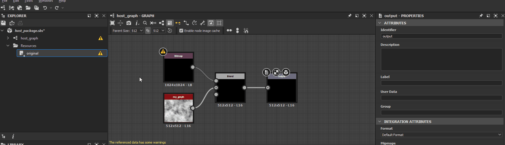
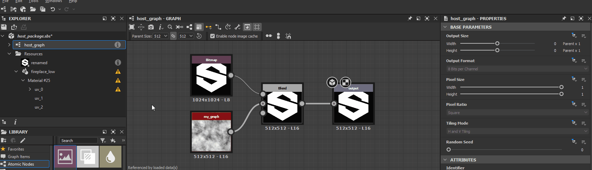

# Avvisi da dipendenze

In questa pagina sono elencati avvisi e messaggi di errore che possono essere attivati da dipendenze in Substance 3D Designer e sono disponibili procedure comuni per la risoluzione dei problemi per ciascuno di essi.

Le dipendenze sono *altri file* a cui fa riferimento un file Substance 3D (SBS). Includono [risorse](../../resources/resources.md) e altri file Substance 3D a cui fanno riferimento i nodi [dell&#39;istanza del grafico](../../compositing-graphs/creating-compositing-gra/graph-instances-sub-gra/graph-instances-sub-graphs.md).

##  Pacchetto dipendente non valido

Impossibile caricare un pacchetto di dipendenze perché mancante, danneggiato o incompatibile con la versione di Designer in uso.

<b> Soluzione</b>

Esistono due modi principali per risolvere questo problema:

1. <b>Caricamento della dipendenza completato</b>

   Verificare che il pacchetto di dipendenze esista nel percorso specificato nel messaggio di avviso. In caso contrario, individuate il file e riposizionatelo in quella posizione, oppure ricreatelo nella stessa posizione. Se il file esiste, *provare a caricarlo* in Designer e cercare eventuali avvisi o errori relativi al pacchetto. Consulta la procedura di risoluzione dei problemi per risolvere questi problemi specifici.

   Quindi, ricaricare il pacchetto host facendo clic su RMB nel pannello [Esplora risorse](https://helpx.adobe.com/it/substance-3d/unlisted/documentation/sddoc/the-explorer-129368147.html) e selezionando l&#39;opzione <b>Ricarica</b> nel menu di scelta rapida.

   
1. <b>Riposizionare la dipendenza nel pacchetto</b>

   È possibile riposizionare la dipendenza utilizzando [Gestione dipendenze](../../interface/dependency-manager/dependency-manager.md). Fai clic su RMB sul pacchetto host nel pannello [Esplora risorse](https://helpx.adobe.com/it/substance-3d/unlisted/documentation/sddoc/the-explorer-129368147.html) e seleziona l’opzione <b>Gestione dipendenze</b> nel menu di scelta rapida.

   Individuare la dipendenza mancante nell&#39;elenco di Gestione dipendenze, fare clic su RMB e selezionare l&#39;opzione <b>Ricolloca...</b>. Individuare il pacchetto di dipendenze utilizzando la finestra di dialogo del browser di file e fare clic su <b>Apri</b>.

   Quindi, ricaricare il pacchetto host facendo clic su RMB nel pannello [Esplora risorse](https://helpx.adobe.com/it/substance-3d/unlisted/documentation/sddoc/the-explorer-129368147.html) e selezionando l&#39;opzione <b>Ricarica</b> nel menu di scelta rapida.

   

##  Verificare che l&#39;alias *&#39;X&#39;* sia definito nel progetto

È in corso il caricamento di una delle dipendenze o delle risorse del pacchetto da una posizione [con alias](../../interface/preferences-window/project-settings/project-settings.md) nei dati del file Substance 3D (SBS) nell&#39;alias riportato nell&#39;avviso, sebbene tale alias non sia definito nei [file di progetto](../../interface/preferences-window/project-settings/project-settings.md) correnti.

<b> Soluzione</b>

Almeno uno dei [file di progetto](../../interface/preferences-window/project-settings/project-settings.md) deve definire l&#39;alias riportato nell&#39;avviso.

##  Nessun file corrispondente a questa risorsa

Impossibile trovare i file corrispondenti al *modello UDIM* per una [risorsa bitmap](../../resources/bitmap-resource/bitmap-resource.md).

<b> Soluzione</b>

Quando una risorsa [bitmap](../../resources/bitmap-resource/bitmap-resource.md) è collegata e Designer rileva una tassonomia di denominazione *UDIM* nel nome del file, ad esempio `0x1` in `my_texture_0x1.png`, la collega come *modello UDIM*, in modo che i nodi [Bitmap](../../compositing-graphs/nodes-reference-for-com/atomic-nodes/bitmap/bitmap.md) possano *passare automaticamente* ad altre bitmap in un set UDIM utilizzando tale tassonomia, quando si utilizza un flusso di lavoro UDIM in Designer. In tal caso, Designer collega la risorsa Bitmap in un *modo diverso* che tiene conto del modello di numerazione UDIM.

Esistono due modi principali per risolvere questo problema:

1. <b>Ripristinare i file</b>

   Accedere al percorso specificato dall&#39;attributo <b>Percorso file</b> della risorsa e verificare che i file che seguono il modello esistano. In caso contrario, ripristinarle o ricrearle.

   
1. <b>Riposizionare i file</b>

   Se i file sono stati spostati o rinominati, riposizionali facendo clic su RMB sull&#39;elemento risorsa nel pannello [Esplora risorse](https://helpx.adobe.com/it/substance-3d/unlisted/documentation/sddoc/the-explorer-129368147.html) e seleziona l&#39;opzione <b>Riposiziona</b> per collegare la risorsa al *primo file di un set* di immagini UDIM dello stesso tipo.

   

##  File collegato non trovato

Il file a cui fa riferimento una risorsa collegata non esiste nel percorso specificato dall&#39;attributo <b>Percorso file</b>.

<b> Soluzione</b>

Esistono due modi principali per risolvere questo problema:

1. <b>Ripristina il file</b>

   Accedere al percorso specificato dall&#39;attributo <b>Percorso file</b> della risorsa e verificare che il file esista. In caso contrario, ripristinarla o ricrearla.

   
1. <b>Riposizionare il file</b>

   Se il file è stato spostato o rinominato, riposizionarlo facendo clic su RMB sull&#39;elemento risorsa nel pannello [Esplora risorse](https://helpx.adobe.com/it/substance-3d/unlisted/documentation/sddoc/the-explorer-129368147.html) e selezionare l&#39;opzione <b>Riposiziona</b> per collegare la risorsa a un altro file dello stesso tipo.

   

## Spazio colore  non trovato

Una risorsa [bitmap](../../resources/bitmap-resource/bitmap-resource.md) fa riferimento a uno spazio colore che non è possibile trovare nell&#39;ambiente [gestione colore](../../color-management/color-management.md) corrente. Questo può essere un profilo ICC o uno spazio colore in una configurazione OCIO.

<b> Soluzione</b>

L&#39;elenco di opzioni per l&#39;attributo Spazio colore viene compilato automaticamente con lo spazio colore valido disponibile. Consente di modificare il valore dello spazio colore per la risorsa in qualsiasi altra voce dell&#39;elenco.

In alternativa, aggiungi tale spazio colore all&#39;ambiente [gestione colore](../../color-management/color-management.md) corrente, quindi riavvia Designer. Questo può essere un profilo ICC o uno spazio colore in una configurazione OCIO.

>[!NOTE]
>
> Questo avviso viene attivato solo quando si utilizza una modalità di gestione del colore diversa da **Legacy** (simile alla disattivazione della gestione del colore). È possibile abilitare la gestione del colore nella sezione **Gestione colore** delle [impostazioni del progetto](../../interface/preferences-window/project-settings/project-settings.md).

Soluzione 

##  Risorsa di riferimento non trovata

Impossibile trovare il grafico assegnato al riquadro UV di una risorsa trama [3D](https://helpx.adobe.com/it/substance-3d/unlisted/documentation/sddoc/3d-mesh-resource-200574577.html) nel percorso indicato nell&#39;avviso.

<b> Soluzione</b>

Esistono due modi principali per risolvere questo problema:

1. <b>Ripristinare il grafico</b>

   Controllate il contenuto del pacchetto nel pannello [Esplora risorse](https://helpx.adobe.com/it/substance-3d/unlisted/documentation/sddoc/the-explorer-129368147.html) per il grafico specificato nell&#39;elenco <b>Riquadri UV</b>. Se non esiste, ripristinarla o ricrearla.

   
1. <b>Selezionare un altro grafico</b>

   Assegna un altro grafico nel pacchetto al riquadro UV.

   

##  riquadri UV assegnati più volte

Un riquadro UV per una [risorsa trama 3D](https://helpx.adobe.com/it/substance-3d/unlisted/documentation/sddoc/3d-mesh-resource-200574577.html) è assegnato più di una volta a un [grafico a Substance](../../compositing-graphs/substance-compositing-graphs.md).

<b> Soluzione</b>

Per ogni set UV di una risorsa trama 3D, accertatevi che non sia presente alcun indice UDIM *più di una volta* nell&#39;elenco <b>Riquadri UV</b>.

##  riquadri UV non validi

Una tessera UV elencata per una [risorsa trama 3D](https://helpx.adobe.com/it/substance-3d/unlisted/documentation/sddoc/3d-mesh-resource-200574577.html) non è definita nella trama o è danneggiata.

<b> Soluzione</b>

Per ogni set UV di una risorsa con trama 3D, assicuratevi che tutti gli elementi nell&#39;elenco <b>Riquadri UV</b> facciano riferimento agli UDIM che *esistono* nella risorsa collegata.

>[!NOTE]
>
> Questo avviso non può essere attivato tramite l&#39;interfaccia utente, poiché *solo* elenca gli UDIM rilevati nella risorsa collegata. Solo la modifica dei dati nel file Substance 3D (SBS) *direttamente* può attivare questo avviso.

