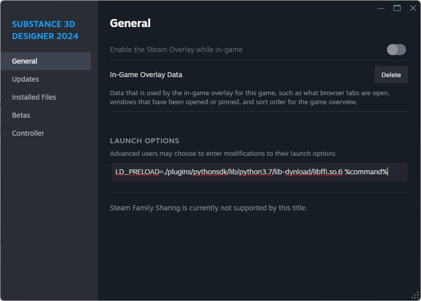

# L&#39;applicazione non viene avviata

In questa pagina sono elencate le cause più comuni di errori di avvio di Substance 3D Designer e sono disponibili i passaggi per la risoluzione dei problemi per ogni gruppo, raggruppati per sistema operativo:

[Designer 15.0 e versioni successive](#version-15-0)

[Windows 10/11](#windows-10-11)

[Windows 7/8/8.1](#windows-7-8)

[Linux](#linux)

## Designer 15.0 e versioni successive

<b> Problema</b>

Le versioni 15.0 e successive di Designer non si avviano su sistemi con una GPU integrata (iGPU) e una GPU discreta (dGPU).

<b> Passaggi consigliati</b>

Aggiornate i driver della scheda grafica di iGPU. I driver più recenti sono disponibili qui: [Intel](https://downloadcenter.intel.com/product/80939/Graphics-Drivers)  | [AMD](https://www.amd.com/en/support/download/drivers.html)

## Windows 10/11

** Problema**

Substance 3D Designer non si avvia su sistemi che utilizzano Windows 10 o Windows 11.

** Passaggi consigliati**

Le versioni precedenti di Designer potrebbero non essere avviate su Windows 10 o Windows 11 a causa di una libreria *obsoleta* `libeay32.dll` utilizzata nel processo di convalida della licenza.

Puoi provare a sostituire la libreria con una *versione aggiornata*, ad esempio quella distribuita [qui](https://support.networkoptix.com/hc/en-us/articles/115015730007-Nx-Software-crashes-due-to-libeay32-dll-on-Windows) (seleziona il file per Windows a 32 bit), effettuando le seguenti operazioni:

1. Individua il file `libeay32.dll` nella directory di installazione di Designer
1. Eseguire il backup del file in un percorso sicuro se è necessario ripristinarlo in futuro
1. Sostituisci il file con la versione aggiornata
1. Avvia Designer

>[!WARNING]
>
> Configurazione non supportata
> 
> Windows 10 non è supportato. Ulteriori informazioni sono disponibili nella pagina [Requisiti di sistema](../../getting-started/system-requirements/system-requirements.md).
> 
> Le versioni di Designer fuori dal periodo di manutenzione non sono supportate. Queste versioni potrebbero non funzionare più in modo affidabile se vengono apportate modifiche significative al sistema, ad esempio gli aggiornamenti del sistema operativo.

## Windows 7/8/8.1

** Problema**

Substance 3D Designer non si avvia su sistemi che utilizzano Windows 7, Windows 8 o Windows 8.1.

** Passaggi consigliati**

Nell&#39;ambito dell&#39;aggiornamento **11.3.0**, sono stati aggiornati più librerie, strumenti e SDK che *hanno interrotto la compatibilità* con versioni di Windows precedenti a Windows 10.

Si consiglia di *eseguire l&#39;aggiornamento a Windows 10*, poiché Microsoft stessa non supporta più le versioni precedenti di Windows per l&#39;uso mainstream (vedere [qui](https://www.microsoft.com/en-us/windows/windows-7-end-of-life-support-information) e [qui](https://docs.microsoft.com/en-us/lifecycle/faq/windows#windows-8.1)). Pertanto, l&#39;utilizzo continuato di queste versioni presenta un *problema di sicurezza*.\
Se l&#39;aggiornamento a Windows 10 non è possibile, *non aggiornare* l&#39;installazione di Designer *passata* versione **11.2.2**.

>[!WARNING]
>
> Configurazione non supportata
> 
> Nota: Windows 7, Windows 8 e Windows 8.1 sono *non supportati ufficialmente*. Ulteriori informazioni sono disponibili nella pagina [Requisiti di sistema](../../getting-started/system-requirements/system-requirements.md).

## Linux

<b> Problema</b>

Arresto anomalo quando si chiude la schermata Home e si visualizza la finestra principale.

<b> Passaggi consigliati</b>

Designer non riesce a caricare i componenti Python perché carica la libreria <b>libffi.so</b> del sistema anziché la propria.

Per assicurarsi che Designer carichi la propria libreria, utilizzare questo comando nella directory di installazione di Designer, sostituendo `%command%` con il comando per eseguire Designer:

```
LD_PRELOAD=./plugins/pythonsdk/lib/python3.11/lib-dynload/libffi.so.6 %command%
```


Il numero di versione Python dipende dalla versione di Designer in esecuzione:

* Inferiore a 14.0.0: pitone3.9
* Inferiore a 12.1.0: pitone3.7

+++Opzioni di avvio a vapore
Gli utenti Linux che avviano Designer da Steam possono impostare il comando LD\_PRELOAD nelle opzioni di avvio di Designer, come illustrato di seguito.

Al termine, Designer può essere avviato da Steam normalmente per tutte le sessioni future.




+++

** Problema**

L&#39;edizione Steam di Designer non si avvia con e non genera messaggi di errore.

** Passaggi consigliati**

È possibile acquisire messaggi di errore registrando l&#39;applicazione Steam.

Come consigliato [qui](https://github.com/ValveSoftware/steam-for-linux/issues/7114#issuecomment-629634260), chiudi completamente Steam, quindi esegui il comando seguente da un terminale (o crea una scelta rapida per questo comando):

```
steam 2>&1 | tee /path/to/logfile
```


<b> Problema</b><b>e</b>

Impossibile caricare il plug-in `<b>xcb</b>`. Nella riga di comando viene visualizzato il seguente messaggio:

```
qt.qpa.plugin: Could not load the Qt platform plugin "xcb" in "" even though it was found. 

This application failed to start because no Qt platform plugin could be initialized. Reinstalling the application may fix this problem. 

 

Available platform plugins are: minimal, offscreen, xcb. 

 

Aborted (core dumped)
```


** Passaggi consigliati**

Mancano alcuni pacchetti necessari. Esegui il comando seguente dalla directory di installazione di Designer:

```
ldd libQt5XcbQpa.so.5
```


Controlla l&#39;elenco stampato per tutti i pacchetti segnalati come `not found`, quindi esegui il comando seguente per ciascuno di questi pacchetti mancanti:

```
apt-get install <package-name>
```


E.g.

```
apt-get install libxcb-xinput0
```


<b> Problema</b>

Questo errore viene generato all’avvio di Designer:

```
error while loading shared libraries: libcrypt.so.1: cannot open shared object file: No such file or directory
```


Una libreria di sistema caricata da Designer non è compatibile con la libreria <b>libcrypto.so.1.1</b> di Designer.

<b> Passaggi consigliati</b>

Rimuovere la libreria <b>`libcrypto.so.1.1`</b> dalla directory di installazione di Designer, in modo che venga utilizzata la libreria del sistema.

>[!NOTE]
>
> Questa soluzione alternativa funziona solo quando il sistema ha la propria libreria libcrypto.so.1. Nelle distribuzioni recenti potrebbe essere necessario installare un pacchetto di compatibilità come <b>libxcrypt-compat</b>.

<b> Problema</b>

Substance 3D Designer non si avvia su sistemi che utilizzano distribuzioni di Linux *basate su Arch*.

** Passaggi consigliati *( Unstable, solo GPU AMD!)***

Prova a installare **progl** (parte dei driver [AMDGPU-PRO](https://wiki.archlinux.org/title/AMDGPU_PRO)) e avvia Designer. A tale scopo, utilizzare il prefisso `progl` nel comando di avvio dell&#39;applicazione:

```
progl <designer-application-path>
```


Tenere presente che `progl` potrebbe essere instabile. Questo tentativo deve pertanto essere effettuato come *ultima risorsa*.

>[!WARNING]
>
> Si noti che le distribuzioni basate su Arch di Linux sono *non supportate*. Ulteriori informazioni sono disponibili nella pagina [Requisiti di sistema](../../getting-started/system-requirements/system-requirements.md).
