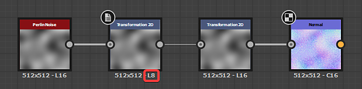
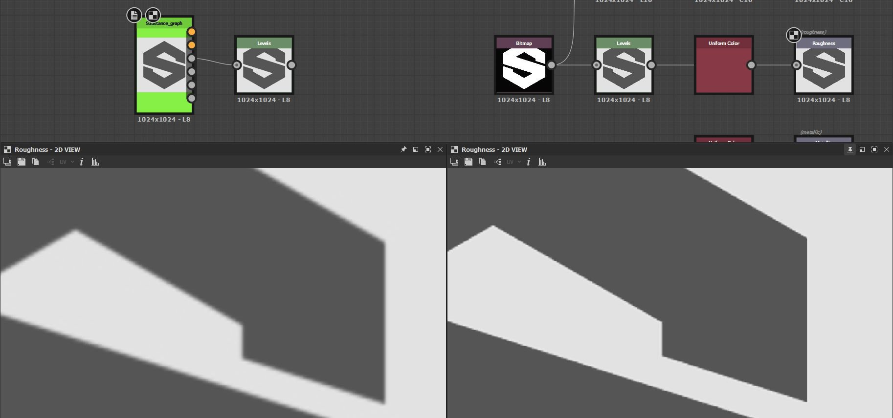

# Output immagine errato

Questa pagina elenca i problemi tecnici che si verificano in Substance 3D Designer e che danno origine a un output di immagine non corretto e, per ciascuno di essi, offre le procedure per la risoluzione dei problemi.

## Passaggio/banding visibile

<table>
<tr style="border: 0;">
<td width="58.30%" style="border: 0;" valign="top">

** Problema**

Le sfumature nell’output dell’immagine vengono sfumate e non uniformi. Il passaggio è causato dall&#39;intervallo di valori *utilizzato dall&#39;immagine troppo stretta*.\
Questo significa che non ci sono abbastanza valori per una transizione uniforme da un passaggio di una sfumatura al successivo.

I valori Luminanza/RGBA possono essere codificati utilizzando valori interi o a virgola mobile, con impatto sulla *precisione*:

* **L&#39;elemento Integer** offre una precisione a 8 bit (0-255, ovvero 256 valori possibili) e una precisione a 16 bit (0-65535, ovvero 65536 valori possibili) per memorizzare un valore nell&#39;intervallo 0-1.
* **La virgola mobile** offre precisione a 16 bit (HDR 16F) e a 32 bit (HDR 32F), con la possibilità di memorizzare valori al di fuori dell&#39;intervallo 0-1, inclusi valori negativi. Questo consente di lavorare con immagini da high dynamic range (HDR), in cui il valore di luminanza può superare di gran lunga 1,0.

Se non è necessario lavorare specificamente con le immagini HDR, è probabile che la maggior parte dei nodi produca un valore compreso nell’intervallo 0-1 codificato con numeri interi. Se il formato di output dell’immagine è a 8 bit, l’immagine può utilizzare solo valori a 256, il che spesso determina l’aggiunta di sfumature visibili. Ciò può influire in particolare sull&#39;output dei nodi Normal.

</td>
<td width="41.60%" style="border: 0;" valign="top">

{width="256px"}{width="256px"}{width="256px"}

</td>
</tr>
</table>

** Passaggi consigliati**

Controllare il **formato di output** (ovvero la profondità di bit) del nodo e di tutti i nodi a monte e assicurarsi che questi nodi utilizzino *una precisione Integer di almeno 16 bit*.

Il parametro Formato output è spesso impostato sul *Relativo all&#39;input* [metodo di ereditarietà](../../compositing-graphs/inheritance-compositing/inheritance-in-substance-compositing-graphs.md), che può propagare la precisione bassa in tutto il grafico. Idealmente, andando a monte nel grafico troverai la causa principale del problema.

È possibile identificare rapidamente la precisione dell&#39;output di un nodo esaminando le informazioni di testo visualizzate sotto il nodo:

* **L/C** si riferisce all&#39;immagine in scala di grigio (ad esempio, Luminanza) o a colori
* **8/16** indica una codifica intera
* **16F/32F** indica codifica a virgola mobile

Ad esempio:

* L8: intero a 8 bit in scala di grigi
* C16: colore intero a 16 bit
* C32F: colore a 32 bit a virgola mobile (HDR)

## Perdita di qualità nelle SBSAR pubblicate

<table>
<tr style="border: 0;">
<td width="58.30%" style="border: 0;" valign="top">

<b> Problema</b>

La qualità delle immagini generate da un archivio Substance 3D (SBSAR) è notevolmente inferiore rispetto al grafico del file Substance 3D da cui viene pubblicato, come mostrato nell&#39;immagine a destra.\
L’output appare a bassa risoluzione.

</td>
<td width="41.60%" style="border: 0;" valign="top">

{width="256px"}

</td>
</tr>
</table>

<b> Passaggi consigliati</b>

Assicuratevi che la proprietà [Dimensione output](../../compositing-graphs/output-size/output-size.md) di tutti i nodi [Bitmap](../../compositing-graphs/nodes-reference-for-com/atomic-nodes/bitmap/bitmap.md) sia impostata sul metodo *Assoluto* [di ereditarietà](../../compositing-graphs/inheritance-compositing/inheritance-in-substance-compositing-graphs.md).

In caso contrario, la [risorsa bitmap](../../resources/bitmap-resource/bitmap-resource.md) a cui viene fatto riferimento verrà salvata con la risoluzione predefinita 256\*256 nell&#39;archivio di Substance 3D pubblicato, con un impatto* sulla qualità* di uno o più output.

## L’immagine è sfocata

<table>
<tr style="border: 0;">
<td width="58.30%" style="border: 0;" valign="top">

** Problema**

Le forme risultano leggermente sfocate dopo l&#39;utilizzo di alcuni nodi, ad esempio [Trasformazione 2D](../../compositing-graphs/nodes-reference-for-com/atomic-nodes/transformation-2d/transformation-2d.md) o [Fusione](../../compositing-graphs/nodes-reference-for-com/atomic-nodes/blend/blend.md).

</td>
<td width="41.60%" style="border: 0;" valign="top">

{width="256px"}

</td>
</tr>
</table>

** Passaggi consigliati**

Quando si riordinano i pixel in un&#39;immagine, ad esempio quando si ridimensiona una forma o si modifica la risoluzione di un&#39;immagine, esistono due modi per determinare in che modo i pixel dell&#39;origine devono essere *mappati* alla destinazione:

* **Più vicino**: il pixel verrà mappato alla destinazione *così com&#39;è* in corrispondenza della coordinata corrispondente. Se la destinazione è di risoluzione inferiore, il pixel può essere completamente ignorato. Se la destinazione ha una risoluzione maggiore, verrà mappata a tutti i pixel che la coprono. L&#39;output è *più nitido* e avrà un aspetto leggermente *con alias*.
* **Filtro bilineare**: all&#39;immagine di origine viene applicato un processo di filtro in modo che i pixel vengano mappati alla risoluzione di destinazione in modo da *attenuare* le transizioni tra i pixel. L&#39;output è *più uniforme* e avrà un aspetto leggermente *sfocato*.

Il nodo [Trasformazione 2D](../../compositing-graphs/nodes-reference-for-com/atomic-nodes/transformation-2d/transformation-2d.md) fornisce un&#39;opzione **Metodo di filtro** per selezionare quale di questi due metodi di mapping deve essere utilizzato.

La maggior parte dei nodi, ad esempio [Fusione](../../compositing-graphs/nodes-reference-for-com/atomic-nodes/blend/blend.md), utilizza per impostazione predefinita *filtri bilineari* quando si campiona una texture di input con risoluzione diversa, il che può introdurre una sfocatura indesiderata.\
Poiché il nodo di Trasformazione 2D è *atomico*, quindi molto leggero, può essere utilizzato *anche se non sono necessarie trasformazioni* per modificare la risoluzione di una texture utilizzando la relativa proprietà [Dimensioni output](../../compositing-graphs/output-size/output-size.md) prima di inviare la texture a un altro nodo, in modo da poter *controllare l&#39;impatto* di questo ridimensionamento.

Nel [grafico delle funzioni](../../function-graphs/function-graphs.md) del nodo [Elaboratore pixel](../../compositing-graphs/nodes-reference-for-com/atomic-nodes/pixel-processor/pixel-processor.md), i nodi **Esempio** includono la *stessa opzione* per controllare il modo in cui la texture campionata deve essere mappata alla risoluzione del nodo.
