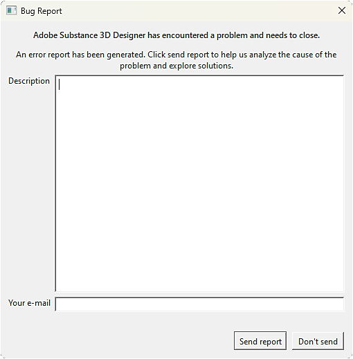

# Problemi tecnici

Questa pagina consente di trovare informazioni sui problemi tecnici comuni che gli utenti possono riscontrare durante l&#39;utilizzo di Substance 3D Designer, organizzate in categorie.\
In ognuna delle pagine elencate sono disponibili *passaggi per la risoluzione dei problemi*.

* [Avvertenze ed errori](../technical-issues/warnings-and-errors/warnings-and-errors.md)
* [Impossibile creare/caricare un progetto](../technical-issues/cannot-create-load-pro/cannot-create-load-a-project.md)
* [L&#39;applicazione non viene avviata](../technical-issues/application-does-not-sta/application-does-not-start.md)
* [Arresto anomalo durante il rendering dei grafici](../technical-issues/crash-when-rendering-gra/crash-when-rendering-graphs.md)
* [I parametri non funzionano come previsto](../technical-issues/parameters-not-working/parameters-not-working-as-expected.md)
* [Output immagine errato](../technical-issues/incorrect-image-output/incorrect-image-output.md)
* [Problemi della vista 3D](../technical-issues/3d-view-issues/3d-view-issues.md)
* [Problemi di cottura](../technical-issues/baking-issues/baking-issues.md)
* [Problemi dell&#39;interfaccia utente](../technical-issues/user-interface-issues/user-interface-issues.md)
* [Problemi con Python](../technical-issues/python-issues/python-issues.md)
* [Manca la feature di Substance grafica modello](../technical-issues/model-graph-eol/substance-model-graph-eol.md)

## Segnala un problema

Designer include metodi per segnalare direttamente arresti anomali e bug.

>[!TIP]
>
> Sii descrittivo!
> 
> *Ogni* segnalazione di arresto anomalo e bug che ci invii *verrà* esaminata da un membro del team di Designer.
> 
> Durante la segnalazione di un problema, <b>includi tutti i dettagli e il contesto possibili</b>, in modo da semplificare e velocizzare notevolmente la comprensione del problema e trovare una soluzione.
> 
> Se hai feedback o suggerimenti per migliorare Designer, ti preghiamo di farcelo sapere nel [nostro forum dedicato](https://community.adobe.com/t5/substance-3d-designer/ct-p/ct-substance-3d-designer). La comunità può dare più voti ai suggerimenti e teniamo traccia di queste informazioni.

### Report di arresto anomalo

<table>
<tr style="border: 0;">
<td style="border: 0;" valign="top">

Quando l’applicazione si blocca, nella maggior parte dei casi viene visualizzata la finestra di dialogo di Crash Reporter.

Puoi farci sapere le circostanze dell&#39;arresto anomalo nel campo Descrizione in modo da poterlo indagare e speriamo di risolverlo in una futura versione di Designer.

Condividi un <b>indirizzo di posta elettronica valido</b> in modo da poterti contattare se abbiamo bisogno di ulteriori dettagli e/o possiamo fornire una soluzione per l&#39;arresto anomalo che hai subito.

</td>
<td style="border: 0;" valign="top">

{zoomable="yes"}

*Fare clic per ingrandire*

</td>
</tr>
</table>

>[!NOTE]
>
> I report di arresto anomalo includono il file di registro di Designer, le preferenze e i file di progetto *per impostazione predefinita*. Di conseguenza, in questi file potrebbero essere visualizzati alcuni <b>percorsi di sistema e di file</b>.
> 
> L&#39;utilizzo di questi file è <b>strettamente interno e limitato</b> all&#39;ambito dell&#39;analisi del problema segnalato.

### Segnalazione bug

<table>
<tr style="border: 0;">
<td style="border: 0;" valign="top">

È possibile segnalare un bug in qualsiasi momento in Designer. Nel menu principale, vai a <b>Guida > Segnala un bug...</b> per aprire la finestra di dialogo Segnala bug.

Puoi farci sapere il problema nel campo Descrizione in modo da poterlo indagare e farci sapere i nostri risultati.

</td>
<td style="border: 0;" valign="top">

{zoomable="yes"}

*Fare clic per ingrandire*

</td>
</tr>
</table>

Condividi un <b>indirizzo di posta elettronica valido</b> in modo da poterti contattare se abbiamo bisogno di ulteriori dettagli e/o possiamo fornire una soluzione al problema.

Seleziona l&#39;opzione <b>Invia informazioni aggiuntive</b> per includere nel report i file di registro, le preferenze e i file di progetto di Designer.

>[!NOTE]
>
> Alcuni <b>percorsi di sistema e di file potrebbero essere visualizzati</b> in questi file aggiuntivi.
> 
> L&#39;utilizzo di questi file è <b>strettamente interno e limitato</b> all&#39;ambito dell&#39;analisi del problema segnalato.

Fai clic sul pulsante <b>Allegato</b> per allegare un file al report e aiutarci a valutare il problema in modo più accurato. Non esitare a includere file di progetto, schermate, registrazioni dello schermo o qualsiasi altro file che ritieni sia pertinente al problema.
