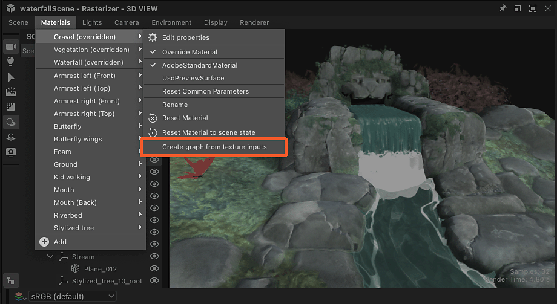
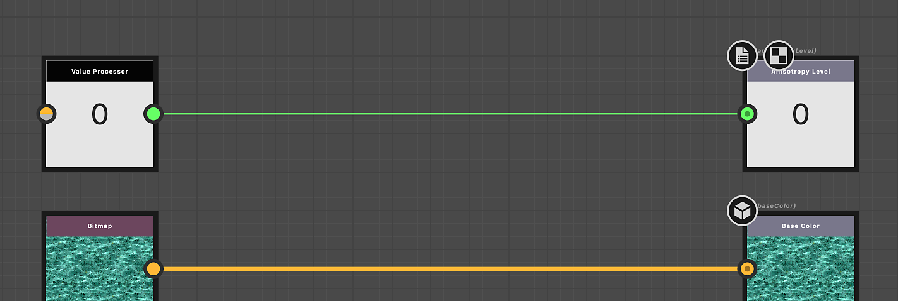

# Estrazione di valori e texture dei materiali

Le proprietà dei materiali possono essere estratte per essere utilizzate nei grafici a Substance.

<table>
<tr style="border: 0;">
<td style="border: 0;" valign="top">

## Nuovo grafico da texture

</td>
<td style="border: 0;" valign="top">

### Estrai texture

</td>
<td style="border: 0;" valign="top">

### Valore di estrazione

</td>
</tr>
</table>

## Nuovo grafico da texture

L’azione &quot;Crea grafico da input texture&quot; crea un nuovo grafico a Substance con tutte le texture utilizzate da un materiale

Quando si utilizza questa azione, si verificano alcuni problemi:

* Nella posizione selezionata viene creato un grafico a Substance con il nome del materiale.
* Per ogni texture utilizzata dal materiale viene creata una [risorsa bitmap](../../resources/bitmap-resource/bitmap-resource.md), che viene quindi inserita in una cartella denominata in base al materiale, sotto la cartella ‘Resources’.
* Nel grafico vengono creati nodi [Bitmap](../../compositing-graphs/nodes-reference-for-com/atomic-nodes/bitmap/bitmap.md) per ognuna di queste risorse bitmap e vengono automaticamente connessi ai nodi [Output](../../compositing-graphs/nodes-reference-for-com/atomic-nodes/output/output.md) configurati dopo le proprietà dei materiali utilizzando le texture.
* Se ogni canale di una stessa texture viene utilizzato per gestire proprietà di materiale diverse (la tecnica è chiamata [impacchettamento canale](../../glossary/glossary.md)), i nodi [di conversione della scala di grigi](../../compositing-graphs/nodes-reference-for-com/atomic-nodes/grayscale-conversion/grayscale-conversion.md) vengono aggiunti automaticamente per selezionare i canali appropriati.
* Il grafico viene automaticamente collegato al materiale e il suo aspetto non dovrebbe cambiare finché non apportate modifiche nel grafico.

<table>
<tr style="border: 0;">
<td style="border: 0;" valign="top">

{zoomable="yes"}

*Azione nella finestra della vista 3D*

</td>
<td style="border: 0;" valign="top">

{zoomable="yes"}

*Azione nel menu Materiali*

</td>
<td style="border: 0;" valign="top">

{zoomable="yes"}

*Azione nel Dock delle proprietà*

</td>
</tr>
</table>

{zoomable="yes"}

*Risultato della creazione del grafico dalle texture dei materiali*

+++Dimostrazione
{zoomable="yes"}

+++

>[!TIP]
>
> Puoi accedere all&#39;azione rapidamente e direttamente nella finestra della vista 3D, posizionando il cursore sull&#39;oggetto e premendo <b>Maiusc+LMB</b> per selezionarlo. quindi facendo clic su RMB per accedere a un menu di scelta rapida che contiene l’azione.

>[!NOTE]
>
> Per i formati che utilizzano *texture incorporate* (ad esempio: USDZ), le texture devono essere estratte e copiate su disco. In questo modo viene effettuato un ulteriore passaggio per selezionare la posizione in cui estrarre le texture.

## Estrai texture

L&#39;azione &quot;Estrai texture sul grafico&quot; crea un nuovo nodo bitmap in un grafico esistente per una texture utilizzata da un materiale.

Quando si utilizza questa azione, si verificano alcuni problemi:

* Viene creata una [risorsa bitmap](../../resources/bitmap-resource/bitmap-resource.md) per la texture utilizzata dal materiale e inserita in una cartella denominata in base al materiale, sotto una cartella &quot;Risorse&quot;.
* Nel grafico selezionato viene creato un nodo [Bitmap](../../compositing-graphs/nodes-reference-for-com/atomic-nodes/bitmap/bitmap.md) per la risorsa bitmap e viene automaticamente connesso a un nodo [Output](../../compositing-graphs/nodes-reference-for-com/atomic-nodes/output/output.md) configurato dopo la proprietà dei materiali utilizzando tali texture.

Se un output configurato per la proprietà del materiale *esiste già* nel grafico, *non vengono creati nodi* e viene eseguita solo la creazione della risorsa bitmap.

Ad esempio, se si estrae una texture per la proprietà &quot;Colore di base&quot; in un grafico che ospita già un nodo di output configurato per &quot;Colore di base&quot;, nel grafico non verranno creati nodi.

<table>
<tr style="border: 0;">
<td style="border: 0;" valign="top">

{zoomable="yes"}

Azione per la proprietà del materiale nel Dock Proprietà

</td>
<td style="border: 0;" valign="top">

{zoomable="yes"}

Finestra di dialogo &#39;Seleziona grafico di destinazione&#39;

</td>
<td style="border: 0;" valign="top">

</td>
</tr>
</table>

{zoomable="yes"}

Risultato dell’estrazione della texture

+++Dimostrazione
{zoomable="yes"}

+++

L’azione &quot;Estrai texture come risorsa&quot; crea solo una risorsa bitmap per la texture utilizzata dal materiale e la inserisce in una cartella denominata dopo il materiale, sotto una cartella &quot;Risorse&quot;.

>[!NOTE]
>
> Per i formati che utilizzano *texture incorporate* (ad esempio: USDZ), la texture deve essere estratta e copiata su disco. In questo modo viene effettuato un ulteriore passaggio per selezionare la posizione in cui estrarre la texture.

## Valore di estrazione

L&#39;azione &quot;Estrai valore su grafico&quot; crea un nuovo nodo [Processore valore](../../compositing-graphs/nodes-reference-for-com/atomic-nodes/value-processor/value-processor.md) in un grafico esistente per un valore di proprietà del materiale.

Quando si utilizza questa azione, si verificano alcuni problemi:

* Nel grafico selezionato viene creato un nodo [Processore valore](../../compositing-graphs/nodes-reference-for-com/atomic-nodes/value-processor/value-processor.md) per il valore della proprietà e viene automaticamente connesso a un nodo [Output](../../compositing-graphs/nodes-reference-for-com/atomic-nodes/output/output.md) configurato dopo tale proprietà materiale.
* Nel [grafico della funzione Substance](../../function-graphs/function-graphs.md) del nodo del processore di valori viene creato un [nodo costante](../../function-graphs/nodes-reference-for-fun/atomic-function-nodes/constant-nodes/constant-nodes.md) corrispondente al tipo di valore, impostato sul valore estratto come impostato nell&#39;output del grafico.

Se un output configurato per la proprietà del materiale *esiste già* nel grafico, *non vengono creati nodi*.

Ad esempio, se si estrae un valore per la proprietà &quot;Livello di anisotropia&quot; in un grafico che ospita già un nodo di output configurato per &quot;Livello di anisotropia&quot;, nel grafico non verranno creati nodi.

<table>
<tr style="border: 0;">
<td style="border: 0;" valign="top">

{zoomable="yes"}

Azione per la proprietà del materiale nel Dock Proprietà

</td>
<td style="border: 0;" valign="top">

{zoomable="yes"}

Finestra di dialogo &#39;Seleziona grafico di destinazione&#39;

</td>
<td style="border: 0;" valign="top">

{zoomable="yes"}

Nodo costante nella funzione del nodo di Processore di valori

</td>
</tr>
</table>

{zoomable="yes"}

Risultato dell’estrazione del valore

+++Dimostrazione
{zoomable="yes"}

+++
