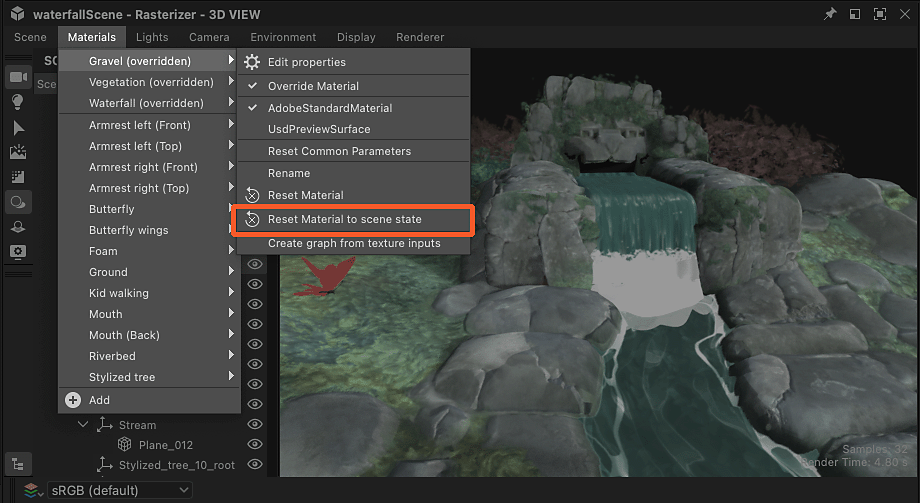

# Sostituzione dei materiali della scena

Quando si lavora con scene 3D con materiali esistenti, è necessario ignorare questi materiali per sostituirli con i propri.

Il materiale può essere creato da zero o una versione regolata del materiale di una scena che è stato [estratto in un grafico di Substance](../../working-with-3d-scenes/extracting-materials-val/extracting-materials-values-and-textures.md).

{zoomable="yes"}

<table>
<tr style="border: 0;">
<td style="border: 0;" valign="top">

## Sovrascrivi materiale scena

</td>
<td style="border: 0;" valign="top">

### Ripristina stato scena

</td>
<td style="border: 0;" valign="top">

### Materiale connesso

</td>
</tr>
</table>

## Sovrascrivi materiale scena

Qualsiasi materiale utilizzato in una scena può essere sostituito con la propria versione, ovvero un nuovo materiale o una versione modificata del materiale esistente.

L’azione &quot;Sostituisci materiale&quot; può essere trovata in due posizioni:

* Aprite il menu Materiali e selezionate il sottomenu del materiale desiderato
* Premete Maiusc+LMB su un oggetto scena per selezionarlo, quindi fate clic su RMB per aprire il relativo menu di scelta rapida

<table>
<tr style="border: 0;">
<td style="border: 0;" valign="top">

{zoomable="yes"}

*Azione nella finestra della vista 3D*

</td>
<td style="border: 0;" valign="top">

{zoomable="yes"}

*Azione nel menu Materiali*

</td>
</tr>
</table>

Nel contesto di Designer, che utilizza l&#39;USD per la descrizione interna della scena, sostituire significa *creare una copia* del materiale che corrisponde il più possibile all&#39;originale e modificare la *rilegatura del materiale* delle trame della scena dall&#39;originale alla copia.

>[!NOTE]
>
> Le copie vengono create nella scena in una cartella ‘<b>materiale</b>’ (‘Ambito’ in USD) sotto la radice e utilizzano lo stesso identificatore dell&#39;originale più un suffisso numerico (ad esempio: ‘rustedMetal\_0’)

Questo significa due cose importanti:

1. Il materiale originale non viene mai cambiato in alcun modo.
1. Qualsiasi lavoro svolto in Designer verrà applicato alla copia.

Potete attivare e disattivare la funzione di esclusione in qualsiasi momento mediante la stessa azione &quot;Sostituisci materiale&quot;, se desiderate ripristinare il materiale della scena originale o eseguire un rapido controllo prima e dopo la selezione

Considerando che la copia è stata creata in modo da corrispondere all’originale, nella maggior parte dei casi l’esclusione di un materiale non dovrebbe modificarne l’aspetto (consultate la nota seguente), fino a quando non vi collegate un grafico a Substance o non ne modificate le proprietà.

>[!NOTE]
>
> Quando viene applicata un&#39;esclusione, Designer calcola le tangenti e i binormali delle mesh interessate, operazione che potrebbe richiedere del tempo e modificare l&#39;aspetto di tali mesh, soprattutto se tali mesh non hanno una scala e un&#39;inclinazione normale definite o ne utilizzano di diverse.

>[!IMPORTANT]
>
> Il modello di ombreggiatura <b>AdobeStandardMaterial</b> è supportato nell&#39;ecosistema Substance 3D, ma non è uno standard del settore e pertanto *potrebbe non essere supportato* da applicazioni di terze parti, ad esempio Blender.
> 
> Per una migliore interoperabilità al di fuori delle applicazioni Substance 3D, attualmente si consiglia di utilizzare il modello di ombreggiatura <b>UsdPreviewSurface</b>, anche se supporta un numero molto inferiore di proprietà ed effetti del materiale.

## Ripristina stato scena

Se devi tornare allo stato iniziale di un materiale, mantenendolo sovrascritto e potendo comunque modificarlo, qualsiasi copia del materiale può essere ripristinata ai valori iniziali.

Se è stato modificato un valore di proprietà materiale o è stata applicata una texture da un grafico, la proprietà viene ripristinata al valore o alla texture iniziale.

Un materiale può essere reimpostato interamente o per proprietà.

Utilizzate l’azione &quot;Ripristina stato del materiale alla scena&quot; nel sottomenu del materiale o nel menu di scelta rapida di una trama per ripristinare completamente il materiale.

L&#39;azione può essere trovata in tre punti:

* Aprite il menu Materiali e selezionate il sottomenu del materiale desiderato
* Premete Maiusc+LMB su un oggetto scena per selezionarlo, quindi fate clic su RMB per aprire il relativo menu di scelta rapida
* Il menu hamburger nella parte superiore delle proprietà di quel materiale

<table>
<tr style="border: 0;">
<td style="border: 0;" valign="top">

{zoomable="yes"}

*Azione nella finestra della vista 3D*

</td>
<td style="border: 0;" valign="top">

{zoomable="yes"}

*Azione nel menu Materiali*

</td>
<td style="border: 0;" valign="top">

{zoomable="yes"}

*Azione nelle proprietà del materiale*

</td>
</tr>
</table>

<table>
<tr style="border: 0;">
<td style="border: 0;" valign="top">

L&#39;azione è disponibile anche *per proprietà* nelle proprietà dei materiali, nel caso in cui si desideri ripristinare solo alcuni aspetti di un materiale.

Apri il menu hamburger della proprietà del materiale per trovare l&#39;azione &quot;Ripristina lo stato predefinito della scena&quot;.

</td>
<td style="border: 0;" valign="top">

{zoomable="yes"}

</td>
</tr>
</table>

## Materiale connesso

Di nuovo: Designer non modifica direttamente il materiale di una scena, crea una copia nella scena e lega le trame a quella copia invece che all&#39;originale.

D&#39;altra parte, nel menu &quot;Materiali&quot; di Designer è disponibile un *elenco separato* dei materiali, che per impostazione predefinita corrisponde all&#39;elenco dei materiali della scena. È possibile aggiungere nuovi materiali in tale elenco in qualsiasi momento.

Set di dati *diverso* creato e gestito solo in Designer. Questi materiali sono quindi *collegati alle copie* che sostituiscono i materiali originali della scena.

{zoomable="yes"}

Potete collegare uno qualsiasi dei materiali elencati nel menu &quot;Materiali&quot; alle copie create da Designer nella scena: fate clic su RMB su una copia nel browser Scena e accedete al sottomenu &quot;Connetti materiale&quot;.

Il sottomenu elenca tutti i materiali presenti nella scena e tutti i materiali che potreste aver creato manualmente dal menu &quot;Materiali&quot;.

{zoomable="yes"}
